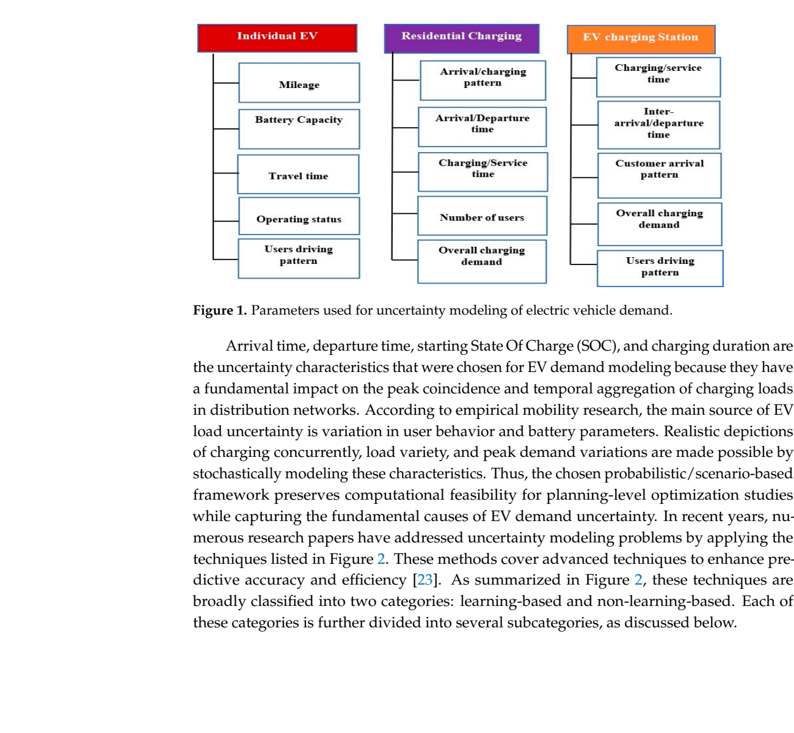

# Figure 1: Parameters Used for Uncertainty Modeling of Electric Vehicle Demand

## Source
Section 2.1, page 6. Text reference at line 310: "Figure 1. Parameters used for uncertainty modeling of electric vehicle demand."

## Figure type
diagram

## Extraction method
exact_from_labels

## Reading confidence
high

## Screenshot

## Visual description
A structured block diagram categorizing the input parameters for EV charging demand uncertainty into three groups: (1) EV User Behavior (travel time, departure time, arrival time, mileage, user behavior), (2) Battery Specification (battery capacity, starting SOC), and (3) Charging Parameters (charging time, customer arrival pattern, overall charging demand, charging duration). These three categories feed into an "EV Load" output block within a "Power Grid" boundary.

## Description
According to the text: "Arrival time, departure time, starting State Of Charge (SOC), and charging duration are the uncertainty characteristics that were chosen for EV demand modeling because they have a fundamental impact on the peak coincidence and temporal aggregation of charging loads in distribution networks."

The three input parameter categories are:
1. **EV User Behavior:** Travel time, departure time, arrival time, mileage, user behavior patterns
2. **Battery Specification:** Battery capacity, starting State of Charge (SOC)
3. **Charging Parameters:** Charging time, customer arrival pattern, overall charging demand, charging duration

## Claims Referenced
- C01: AI-based forecasting methods provide superior accuracy over statistical methods for EV charging demand under uncertainty
- C04: Forecasting uncertainty in EV charging demand propagates through planning optimization

## Related Tables
- Table 2: Quantitative metrics for forecasting evaluation
