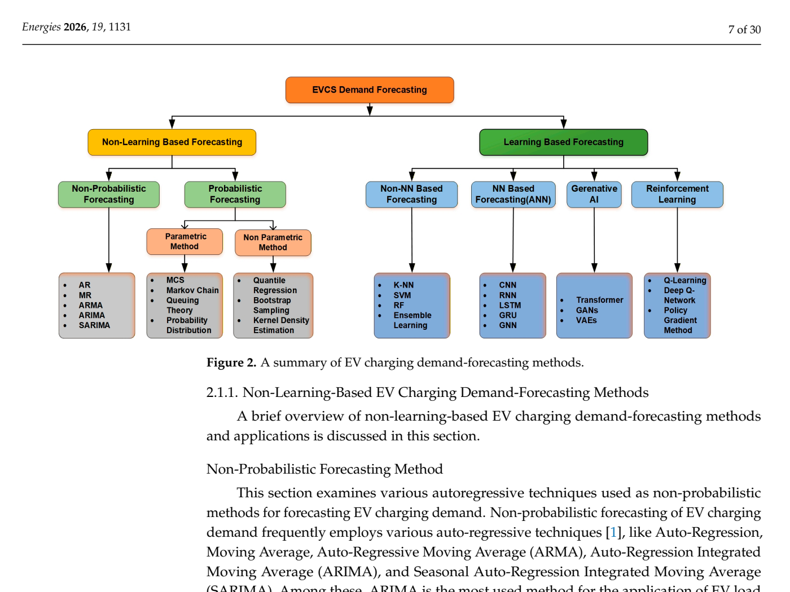

# Figure 2: A Summary of EV Charging Demand-Forecasting Methods

## Source
Section 2.1, page 7. Text reference at line 330: "Figure 2. A summary of EV charging demand-forecasting methods."

## Figure type
diagram

## Extraction method
exact_from_labels

## Reading confidence
high

## Screenshot

## Visual description
A hierarchical tree diagram bifurcating EV charging demand forecasting methods into two main branches. Left branch: Non-Learning-Based Methods, further splitting into Non-Probabilistic (AR, MA, ARMA, ARIMA, SARIMA) and Probabilistic, which splits into Parametric (MCS, Markov Chain) and Non-Parametric (QR, KDE, DKDE). Right branch: Learning-Based Methods, splitting into Machine Learning (further into Non-NN-based: RF, Gradient Tree Boosting, XGBoost, Linear Regression, K-NN, SVM, Ensemble Learning; and NN-based: ANN, CNN, RNN, LSTM, GRU, GNN, Hybrid), Generative AI (Transformer, GAN, VAE), and Reinforcement Learning.

## Description
This figure presents a comprehensive hierarchical taxonomy of EV charging demand forecasting methods. The top-level bifurcation divides methods into:

### 1. Non-Learning-Based Methods
- **Non-Probabilistic:** AR, MA, ARMA, ARIMA, SARIMA
- **Probabilistic:**
  - *Parametric:* Monte Carlo Simulation (MCS), Markov Chain
  - *Non-Parametric:* Quantile Regression (QR), Kernel Density Estimation (KDE), Diffusion-based KDE (DKDE)

### 2. Learning-Based Methods
- **Machine Learning:**
  - *Non-NN-based:* Random Forests (RF), Gradient Tree Boosting, XGBoost, Linear Regression, K-Nearest Neighbor (K-NN), Support Vector Machine (SVM), Ensemble Learning
  - *NN-based:* Artificial Neural Network (ANN), Convolutional Neural Network (CNN), Recurrent Neural Network (RNN), Long Short-Term Memory (LSTM), Gated Recurrent Unit (GRU), Graph Neural Network (GNN), Hybrid Approaches
- **Generative AI:** Transformer, Generative Adversarial Network (GAN), Variational Auto-Encoder (VAE)
- **Reinforcement Learning:** RL-based methods

## Claims Referenced
- C01: AI-based forecasting methods provide superior accuracy over statistical methods for EV charging demand under uncertainty
- C04: Forecasting uncertainty in EV charging demand propagates through planning optimization

## Related Tables
- Table 2: Quantitative metrics for forecasting methods
