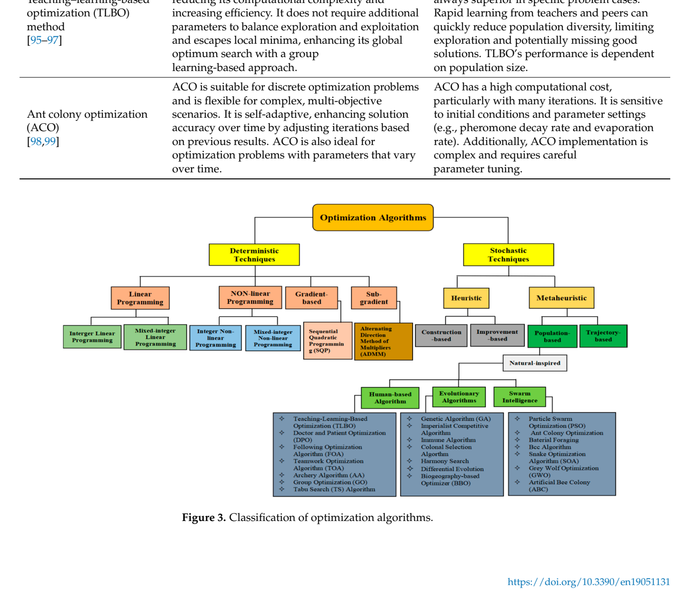

# Figure 3: Classification of Optimization Algorithms

## Source
Section 2.2.1, page 16. Text reference at line 889: "Figure 3. Classification of optimization algorithms."

## Figure type
diagram

## Extraction method
exact_from_labels

## Reading confidence
high

## Screenshot

## Visual description
A hierarchical tree diagram bifurcating optimization algorithms into two main categories. Left branch: Deterministic (Traditional/Exact) Algorithms, listing LP, NLP, MILP, ADMM, SQP, and DP. Right branch: Stochastic Algorithms (Metaheuristic), listing SOA, PSO, GA, GWO, TLBO, and ACO. The diagram shows both branches leading to "Optimal Solution."

## Description
This figure presents a hierarchical classification of optimization algorithms used in EVCS planning. The algorithms are bifurcated into two main categories:

### 1. Deterministic (Traditional/Exact) Algorithms
- Linear Programming (LP)
- Nonlinear Programming (NLP)
- Mixed-Integer Linear Programming (MILP)
- Alternating Direction Method of Multipliers (ADMM)
- Sequential Quadratic Programming (SQP)
- Dynamic Programming (DP)

### 2. Stochastic Algorithms (Metaheuristic)
- Snake Optimization Algorithm (SOA)
- Particle Swarm Optimization (PSO)
- Genetic Algorithm (GA)
- Grey Wolf Optimization (GWO)
- Teaching-Learning-Based Optimization (TLBO)
- Ant Colony Optimization (ACO)

According to the text: "Metaheuristic algorithms are the superior choice for optimization problems in power systems due to their robustness, flexibility, and ability to address system uncertainties, which are critical in achieving efficient solutions in complex, modern networks."

## Claims Referenced
- C02: Metaheuristic optimization algorithms are more effective than deterministic algorithms for EVCS-RES planning under uncertainty

## Related Tables
- Table 3: Summary of EVCS planning algorithms with advantages/disadvantages
- Table 4: Objective function classification
- Table 5: EVCS-RES integration studies
