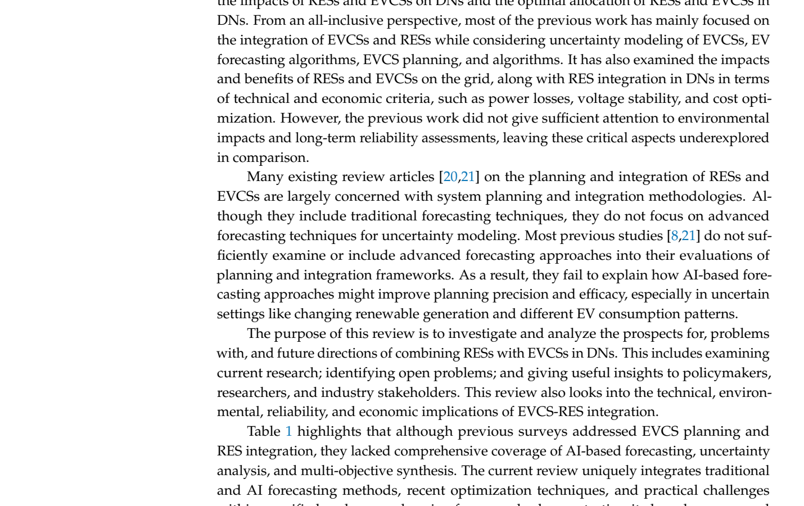

# Table 1: Comparison of Current Review with Existing Surveys

## Source
Section 1.1, page 4 (line 210).

## Screenshot

## Description
Comparison matrix across seven features for six prior surveys (Refs. [8], [17]-[21]) and the current review:

| Feature | Ref. [8] | Ref. [17] | Ref. [18] | Ref. [19] | Ref. [20] | Ref. [21] | Current Review |
|---------|:--------:|:--------:|:--------:|:--------:|:--------:|:--------:|:--------:|
| EVCS planning | Y | Y | - | Y | Y | - | Y |
| RES integration | - | - | Y | Y | Y | Y | Y |
| Traditional forecasting | - | - | - | - | Y | Y | Y |
| AI-based forecasting | - | - | - | - | - | - | Y |
| Uncertainty propagation analysis | - | - | - | - | - | - | Y |
| Multi-objective synthesis | - | - | - | - | - | - | Y |
| Recent optimization algorithms | Limited | Limited | Limited | Limited | Limited | Limited | Comprehensive |
| Challenges, policies, incentives | - | - | - | - | - | - | Y |

This table demonstrates the unique scope of the current review, which is the only one covering AI-based forecasting, uncertainty propagation, multi-objective synthesis, and comprehensive optimization algorithm coverage.

## Claims Referenced
- C05: Integrated planning frameworks combining advanced forecasting with multi-objective optimization remain underdeveloped

## Related Experiments
- E01: Taxonomy and comparative analysis of forecasting methods
- E02: Survey and categorization of planning algorithms
- E03: Comparative analysis of EVCS-RES integration studies
