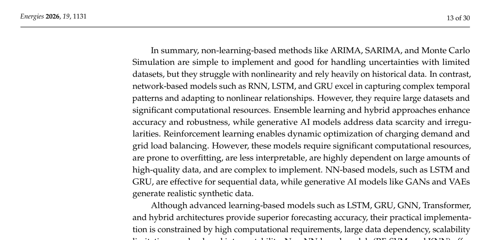

# Table 2: Summary of Quantitative Metrics for Non-Learning- and Learning-Based EV Charging Forecasting

## Source
Section 2.1.2, page 13 (line 706).

## Screenshot

## Description
Summary of the commonly used quantitative performance metrics for evaluating both non-learning-based and learning-based EV charging forecasting models. The table lists six studies with their respective evaluation metrics:

| Author/Year/Ref. | Quantitative Indices |
|------------------|---------------------|
| Rashid et al. (2024) [1] | MAE, RMSE, MAPE |
| Akshay et al. (2024) [4] | RMSE, MAPE |
| Shahriar et al. (2021) [31] | RMSE, MAE |
| Zhu et al. (2019) [35] | MAE, RMSE, MAPE |
| El-Azab et al. (2023) [36] | RMSE, MAE |
| Koohfar et al. (2023) [50] | RMSE, MAPE, MAE |

The review notes that "to objectively evaluate forecasting accuracy and resilience, however, typical assessment criteria, including Mean Absolute Error (MAE), Root Mean Square Error (RMSE), Mean Absolute Percentage Error (MAPE), and coefficient of determination (R²), must be included."

## Claims Referenced
- C01: AI-based forecasting methods provide superior accuracy over statistical methods

## Related Concepts
- Concept 1: EV Charging Demand Uncertainty
- Concept 2: Learning-Based Forecasting Methods
