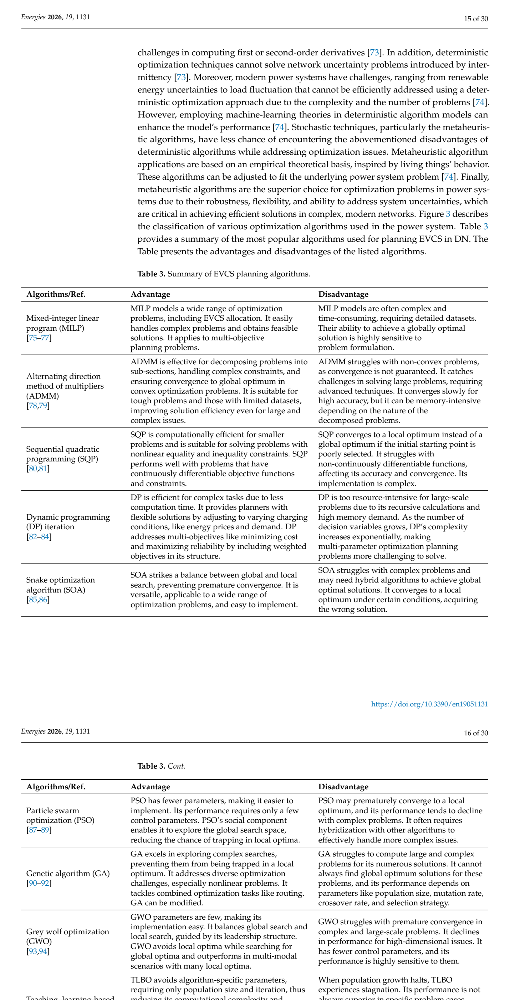

# Table 3: Summary of EVCS Planning Algorithms

## Source
Section 2.2.1, pages 15-16 (lines 806-887).

## Screenshot

## Description
Comprehensive summary of the most popular algorithms used for planning EVCS in distribution networks, with their advantages and disadvantages. This spans two parts (pages 15-16).

### Part 1: Deterministic and Metaheuristic Algorithms (1)

| Algorithm | Advantages | Disadvantages |
|-----------|------------|---------------|
| **MILP** [75-77] | Models wide range of optimization problems including EVCS allocation; handles complex problems and obtains feasible solutions; applies to multi-objective planning | Often complex and time-consuming, requiring detailed datasets; globally optimal solution highly sensitive to problem formulation |
| **ADMM** [78,79] | Effective for decomposing problems into sub-sections; handles complex constraints; ensures convergence to global optimum in convex optimization; suitable for tough problems with limited datasets | Struggles with non-convex problems (convergence not guaranteed); converges slowly for high accuracy; memory-intensive |
| **SQP** [80,81] | Computationally efficient for smaller problems; suitable for problems with nonlinear equality/inequality constraints; performs well with continuously differentiable functions | Converges to local optimum if starting point poorly selected; struggles with non-continuously differentiable functions; complex implementation |
| **DP** [82-84] | Efficient for complex tasks with less computation time; provides flexible solutions by adjusting to varying conditions; addresses multi-objectives | Too resource-intensive for large-scale problems; complexity increases exponentially with decision variables |
| **SOA** [85,86] | Balances global and local search, preventing premature convergence; versatile and easy to implement | Struggles with complex problems; may need hybrid algorithms for global optimal solutions |

### Part 2: Metaheuristic Algorithms (2)

| Algorithm | Advantages | Disadvantages |
|-----------|------------|---------------|
| **PSO** [87-89] | Fewer parameters, easier to implement; explores global search space through social component; reduces trapping in local optima | May prematurely converge to local optimum; performance declines with complex problems; often requires hybridization |
| **GA** [90-92] | Excels in exploring complex searches; prevents trapping in local optima; addresses diverse optimization challenges; can be modified | Struggles with large and complex problems; cannot always find global optimum; performance depends on parameters (population size, mutation rate, crossover rate, selection strategy) |
| **GWO** [93,94] | Few parameters, easy to implement; balances global and local search through leadership structure; avoids local optima; outperforms in multi-modal scenarios | Struggles with premature convergence in complex problems; performance declines for high-dimensional issues; highly sensitive to control parameters |
| **TLBO** [95-97] | Avoids algorithm-specific parameters, requiring only population size and iteration; reduces computational complexity; escapes local minima | Experiences stagnation when population growth halts; performance not always superior; rapid learning can reduce population diversity |
| **ACO** [98,99] | Suitable for discrete optimization; flexible for complex multi-objective scenarios; self-adaptive; ideal for time-varying parameters | High computational cost; sensitive to initial conditions and parameter settings; complex implementation requiring careful parameter tuning |

## Claims Referenced
- C02: Metaheuristic optimization algorithms are more effective than deterministic algorithms for EVCS-RES planning under uncertainty

## Related Experiments
- E02: Survey and categorization of planning algorithms
