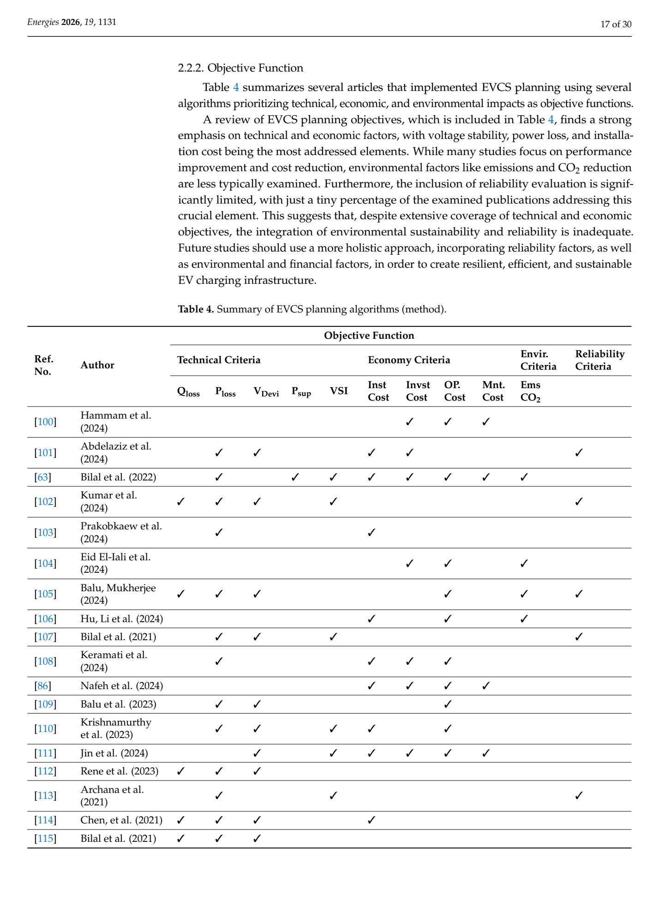

# Table 4: Summary of EVCS Planning Algorithms (Method) — Objective Functions

## Source
Section 2.2.2, page 17 (lines 911-965).

## Screenshot

## Description
Summary of EVCS planning objectives across 18 referenced studies, categorized by:

**Technical Criteria:**
- Qloss (Reactive power loss)
- Ploss (Active power loss)
- VDevi (Voltage deviation)
- Psup (Supply power)
- VSI (Voltage Stability Index)

**Economic Criteria:**
- Inst Cost (Installation cost)
- Invst Cost (Investment cost)
- OP Cost (Operational cost)
- Mnt Cost (Maintenance cost)

**Environmental Criteria:**
- Ems CO2 (CO2 emissions)

**Reliability Criteria:**
- Reliability indices

The table shows that most studies address technical criteria (power loss and voltage deviation), with economic criteria also well-represented. Environmental criteria (CO2 emissions) and reliability criteria are addressed by few studies.

The review notes: "a review of EVCS planning objectives... finds a strong emphasis on technical and economic factors, with voltage stability, power loss, and installation cost being the most addressed elements. While many studies focus on performance improvement and cost reduction, environmental factors like emissions and CO2 reduction are less typically examined."

## Claims Referenced
- C03: Existing literature disproportionately favors technical and economic objectives

## Related Experiments
- E02: Survey and categorization of planning algorithms
