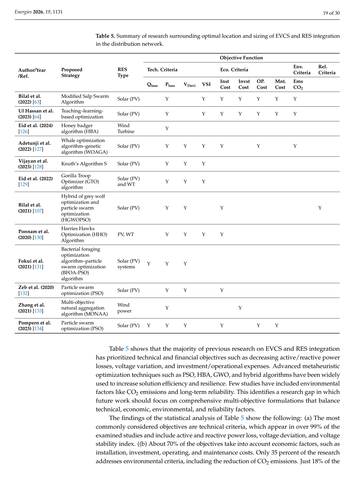

# Table 5: Summary of Research on Optimal Location and Sizing of EVCS and RES Integration

## Source
Section 3, page 19 (lines 1028-1083).

## Screenshot

## Description
Comprehensive summary of 13+ studies on optimal location and sizing of EVCS and RES integration in distribution networks. For each study, the table captures the proposed strategy/algorithm, RES type (Solar PV, Wind Turbine), and objective function coverage across four dimensions:

**Technical Criteria:** Qloss (reactive power loss), Ploss (active power loss), VDevi (voltage deviation), VSI (voltage stability index)

**Economic Criteria:** Inst Cost (installation cost), Invst Cost (investment cost), OP Cost (operational cost), Mnt Cost (maintenance cost)

**Environmental Criteria:** Ems CO2 (CO2 emissions)

**Reliability Criteria:** Reliability indices

Algorithms covered include: Modified Salp Swarm Algorithm, Teaching-Learning-Based Optimization, Honey Badger Algorithm (HBA), Whale Optimization Algorithm-Genetic Algorithm (WOAGA), Knuth's Algorithm S, Gorilla Troop Optimizer (GTO), Hybrid GWO-PSO (HGWOPSO), Harris Hawks Optimization (HHO), Bacterial Foraging Optimization Algorithm-PSO (BFOA-PSO), and standard PSO.

**Statistical analysis from the table:**
- Technical criteria: >99% of studies
- Economic criteria: ~70% of studies
- Environmental criteria (CO2): 35% of studies
- Reliability criteria: 18% of studies

## Claims Referenced
- C02: Metaheuristic algorithms are more effective for EVCS-RES planning
- C03: Disproportionate focus on technical and economic objectives
- C05: Integrated frameworks remain underdeveloped

## Related Experiments
- E03: Comparative analysis of EVCS-RES integration studies
