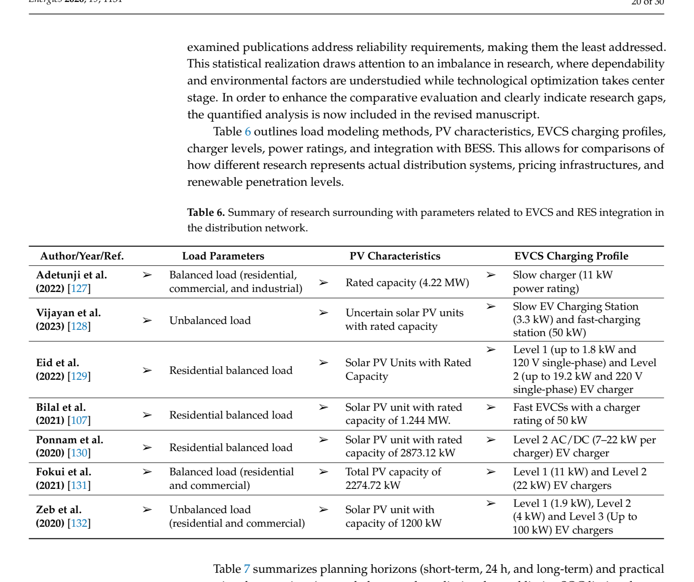

# Table 6: Summary of Research Parameters Related to EVCS and RES Integration

## Source
Section 3, page 20 (lines 1115-1147).

## Screenshot

## Description
Summary of load modeling methods, PV characteristics, and EVCS charging profiles across 7 key studies in the EVCS-RES integration literature.

| Author/Year/Ref. | Load Parameters | PV Characteristics | EVCS Charging Profile |
|------------------|----------------|-------------------|----------------------|
| Adetunji et al. (2022) [127] | Balanced load (residential, commercial, industrial) | Rated capacity (4.22 MW) | Slow charger (11 kW) |
| Vijayan et al. (2023) [128] | Unbalanced load | Uncertain solar PV units with rated capacity | Slow EVCS (3.3 kW) and fast-charging (50 kW) |
| Eid et al. (2022) [129] | Residential balanced load | Solar PV units with rated capacity | Level 1 (up to 1.8 kW, 120V) and Level 2 (up to 19.2 kW, 220V) |
| Bilal et al. (2021) [107] | Residential balanced load | Solar PV unit (1.244 MW rated) | Fast EVCSs (50 kW) |
| Ponnam et al. (2020) [130] | Residential balanced load | Solar PV (2873.12 kW rated) | Level 2 AC/DC (7-22 kW) |
| Fokui et al. (2021) [131] | Balanced load (residential, commercial) | Total PV capacity of 2274.72 kW | Level 1 (11 kW) and Level 2 (22 kW) |
| Zeb et al. (2020) [132] | Unbalanced load (residential, commercial) | Solar PV (1200 kW capacity) | Level 1 (1.9 kW), Level 2 (4 kW), Level 3 (up to 100 kW) |

This table "allows for comparisons of how different research represents actual distribution systems, pricing infrastructures, and renewable penetration levels."

## Claims Referenced
- C03: Disproportionate focus on technical and economic objectives

## Related Experiments
- E03: Comparative analysis of EVCS-RES integration studies
