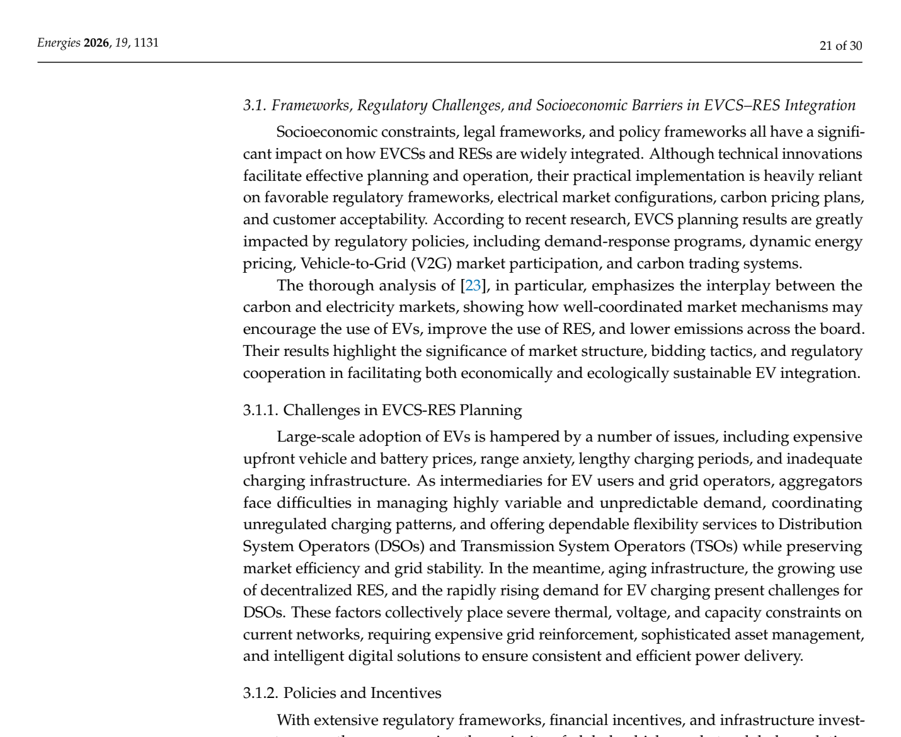

# Table 7: Summary of Research Constraints Related to EVCS and RES Integration

## Source
Section 3, pages 20-21 (lines 1153-1170).

## Screenshot

## Description
Summary of practical operational constraints considered in EVCS-RES integration studies. The table maps studies to constraint types:

| Author/Year/Ref. | Practical Constraints |
|------------------|----------------------|
| Adetunji et al. (2022) [127] | Power balance, nodal voltage, BESS operation, and EV load constraint |
| Vijayan et al. (2023) [128] | Voltage unbalance factor limits, extreme tap position limits, voltage regulation limits, power balance, nodal voltage, and line current limits |
| Eid et al. (2022) [129] | State-of-Charge limits, Size of BES Limits, PV and wind turbine limits, power balance, and nodal voltage limits |
| Bilal et al. (2021) [107] | DG limits, power balance, and nodal voltage limits |
| Ponnam et al. (2020) [130] | Number of Charging points and Charging capacity limits, power balance, active power, reactive power, and nodal voltage limits |
| Fokui et al. (2021) [131] | Charging Power of EVCS limits, power balance, and nodal voltage limits |
| Zeb et al. (2020) [132] | Thermal limits, Charging capacity of EVCS limits, charger number limits, parking slots limits, state of charge, and nodal voltage limits |
| Pompern et al. (2023) [134] | Power and capacity of BESS limits, power balance, and nodal voltage limits |

The most commonly considered constraints are power balance and nodal voltage limits, appearing in all studies. BESS-related constraints appear in a subset of studies.

## Claims Referenced
- C02: Metaheuristic optimization algorithms are more effective for EVCS-RES planning under uncertainty
- C03: Disproportionate focus on technical and economic objectives

## Related Experiments
- E03: Comparative analysis of EVCS-RES integration studies
