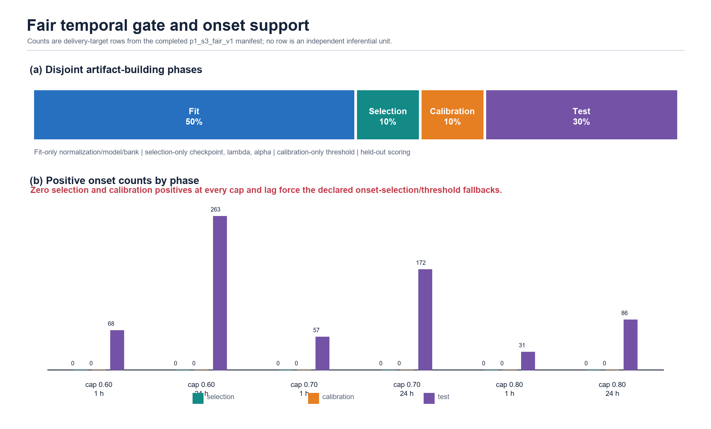
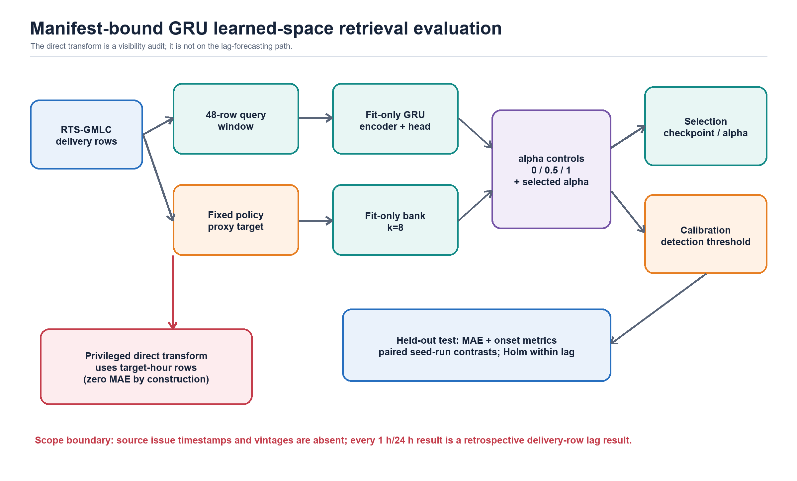
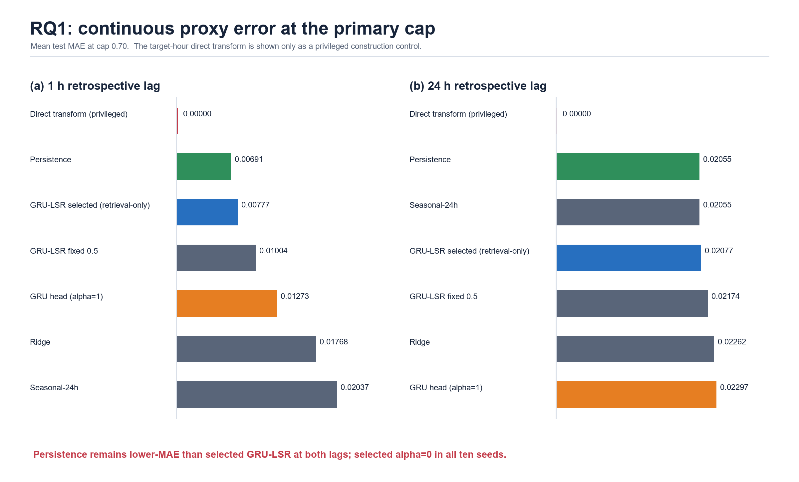
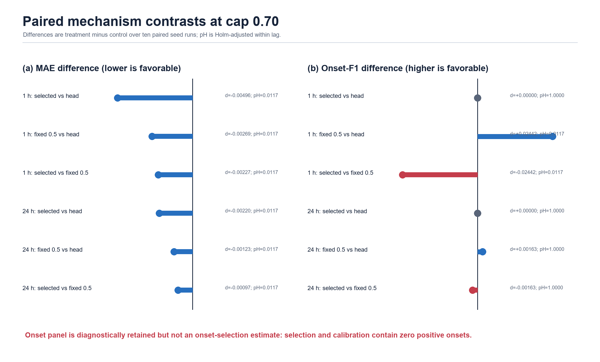
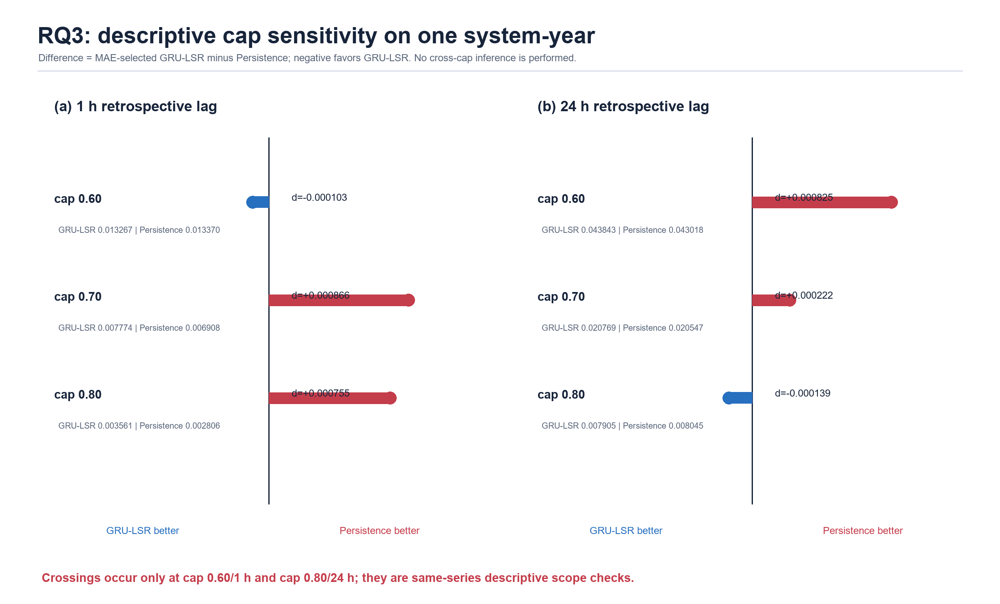

<!-- IEEE Access submission draft (Markdown master).
     Scientific results in the main text are derived from the completed
     experiments/p1_s3_fair_v1/run_manifest.json and its manifest-hashed outputs.
     Legacy v5/v6 results, implementation timing, environment/version history,
     checksums, and exhaustive audit detail are supplementary records only.
     Regenerate all figures and derived tables with manuscript/figures/make_figures.py.
     AUTHOR INPUT REQUIRED markers must be resolved before submission. -->

# A Reproducible Retrospective Curtailment-Risk Benchmark and Fair Evaluation of GRU Learned-Space Retrieval on RTS-GMLC

**Authors:** [AUTHOR INPUT REQUIRED: final author list and public ORCIDs]
**Affiliations:** [AUTHOR INPUT REQUIRED: complete institutional addresses]
**Corresponding author:** [AUTHOR INPUT REQUIRED: name and e-mail]

## Abstract

Public curtailment-forecasting evaluations remain fragmented across private data, task-specific targets, and incomparable protocols. We build a retrospective benchmark from 8760 delivery-row-indexed RTS-GMLC observations. A fixed 70% system-non-synchronous-penetration-type acceptance rule defines a method-independent proxy, and a transition slice identifies onsets. Source files lack forecast issue timestamps and data-vintage identifiers, so the 1 h and 24 h tasks are retrospective lags, not operational forecasts. The fair run separates fit, checkpoint/hyperparameter selection, threshold calibration, and test with horizon embargoes across ten common GRU seeds. At the primary cap, mean-absolute-error (MAE) selection chooses retrieval-only (head weight zero) for every seed. Against the matched GRU head, retrieval lowers MAE at 1 h (mean paired difference -0.00496069) and 24 h (-0.00220055), with Holm-adjusted exact sign-flip p = 0.01171875 at each lag. This component result does not establish overall superiority: Persistence remains lower-MAE than selected GRU-LSR at both lags (0.00690794 versus 0.00777391 at 1 h; 0.02054651 versus 0.02076857 at 24 h). Onset-targeted selection is not estimable because selection and calibration contain zero positive onsets at both lags; the selected condition consequently equals the head (p = 1). A fixed 0.5 blend raises onset F1 at 1 h under that fallback but is null at 24 h, so neither comparison validates onset-targeted retrieval. Cap-level crossings are descriptive within one system-year. The benchmark supports a paired MAE mechanism result while preserving horizon- and metric-specific negative findings and a non-operational scope.

**Index Terms** — renewable energy curtailment, benchmark, reproducibility, analogue retrieval, time-series forecasting, transition detection, RTS-GMLC, naive baselines

---

## I. Introduction

High instantaneous wind and solar shares can force curtailment when acceptance limits bind. International reviews document volumes and causes across multiple systems [1], national studies identify their drivers [2], and planning analyses show that some curtailment can be economically rational [3]. One explicit mechanism is the system non-synchronous penetration (SNSP) limit used on the all-island Irish system for frequency stability [4]. When the cap binds, curtailment follows from load and renewable trajectories, making cap-driven risk forecastable. Day-ahead SNSP forecasting has accordingly been demonstrated on Irish system data [5].

Anticipating curtailment, however, currently has no shared measurement infrastructure. Each study forecasts its own signal on its own (usually private) data with its own evaluation conventions; no public benchmark defines the task, few protocols isolate *onset* rows where curtailment emerges after quiet conditions, and statistical practice is thin. This absence is consequential because curtailment series are sparse and highly persistent: 91.8% of the hours in our benchmark have zero proxy curtailment. Forecasting-methodology research further shows that, on such series, evaluations without strong naive baselines and temporally separated tests can overstate the value of learned methods [7], [8]. A public test system suitable for a retrospective benchmark exists: RTS-GMLC provides a full year of time-synchronized day-ahead scenario series for load, wind, and solar with open licensing [6]. Its rows are indexed by delivery time, but the inspected experimental assets do not preserve forecast issue times or vintages.

A second, older gap concerns how forecasting models should use historical analogues. Retrieving similar past situations is a recurring idea in power-system forecasting and decision support. Its uses range from similar-day load forecasting in early expert systems and case-based reasoning for network operations [10] to analog ensembles in weather and renewable forecasting [9] and, more recently, metric learning on power signals. Yet every one of these lines validates retrieval at a single task and a fixed horizon on its own data. Whether the *same* retrieval mechanism helps or hurts as the lag horizon changes has not been measured under controlled conditions in the studies reviewed here.

This paper evaluates retrieval as a conditional mechanism rather than assuming that it is uniformly useful. Three research questions organize the study:

- **RQ1:** Under a symmetric temporal gate and MAE-based selection, does learned-space retrieval improve continuous proxy MAE relative to its matched GRU head at 1 h and 24 h?
- **RQ2:** Does the available pre-test support permit a valid onset-targeted retrieval estimate, and what metric-specific results remain when the declared fallback is triggered?
- **RQ3:** Do the descriptive GRU-LSR-versus-Persistence orderings remain unchanged when the acceptance cap is varied on the same system-year?

The contributions follow those questions:

1. **A method-agnostic retrospective benchmark with an explicit information boundary.** The fixed proxy target is separated from model fitting. Fit, selection, calibration, and test phases are disjoint and horizon-embargoed. A target-hour direct transform is retained as a privileged visibility audit, not a forecaster.
2. **A matched retrieval-control design.** GRU-LSR uses a shared frozen GRU encoder, a fit-only $k=8$ target bank, and selected or fixed head weights. Selected retrieval, fixed 0.5 blending, and the head share checkpoints within each objective, and inference is paired by training seed.
3. **An evidence-ranked result that keeps failures in scope.** The fair run supports lower MAE for retrieval relative to the matched head at both lags, but Persistence remains lower-MAE at the primary cap. Zero pre-test onset support makes onset-targeted selection inapplicable, and cap crossings remain descriptive within one system-year.

Section II reviews the relevant literature. Sections III--V define the benchmark, model, and fair comparison. Section VI answers the research questions in evidential order, and Sections VII--IX interpret the findings, limitations, and conclusion.

---

## II. Related Work

### A. Curtailment forecasting and renewable accommodation assessment

The empirical curtailment literature is predominantly retrospective. Bird et al. [1] review international levels, causes, and mitigation, while Luo et al. [2] analyze China's Three-North wind curtailment. Yasuda et al. [11] relate annual curtailment rate to renewable share, Frew et al. [3] study economically optimal marginal curtailment, and Newbery [12] examines Irish wind build-out against interconnection and storage. These studies quantify or explain curtailment rather than predict its short-horizon onset.

The predictive strand is thin and system-specific. O'Sullivan et al. [4] establish the frequency-stability basis of the Irish SNSP limit — the operational cap that makes curtailment a deterministic function of load and renewable trajectories once it binds. Cardo-Miota et al. [5] forecast day-ahead SNSP trajectories for the same system with a machine-learning pipeline, the closest existing work to curtailment-risk early warning; the target is a continuous penetration signal on one system's data, without a released benchmark or an event-level protocol. Hadian and Naderkhani [13] compare classical and deep models for curtailment time-series point forecasting, finding GRU best, again without reusable evaluation assets. Related net-load forecasting work [14] anticipates the accommodation problem but does not map forecasts to curtailment-risk events. Across the studies reviewed here, we found no public curtailment-risk benchmark that combines an onset-oriented evaluation slice with seeded statistics. The benchmark introduced here is designed to fill that documented gap.

### B. Retrieval, analogues, and metric learning in power system decision support

Reasoning from similar past operating states is a recurring proposal with a long pedigree. Rahman and Bhatnagar [15] encoded similar-day operator heuristics in a 1988 expert-system load forecaster; Mandal et al. [16] retrieved Euclidean similar days to drive several-hour-ahead neural load forecasting; Lora et al. [17] forecast next-day market prices purely by weighted nearest neighbors over historical price trajectories. Case-based reasoning carried the idea into operations proper: Xu et al. [10] run the full retrieve–reuse–revise–retain cycle over network operating cases for coordinated voltage control. In weather-driven forecasting, the analog ensemble of Delle Monache et al. [9] retrieves the most similar past forecasts and uses their verifying observations as a predictive distribution, with successful transfers to wind power [18] and solar power [19]. Most recently, metric learning has replaced hand-crafted similarity: Siamese networks learn embeddings for appliance identification in non-intrusive load monitoring [20] and, combined with k-NN, for power-quality disturbance classification [21].

Across the reviewed retrieval studies, validation is typically confined to one task and one horizon or narrow horizon band on study-specific data. Matched non-retrieval controls are also uncommon, leaving the contribution of retrieval itself difficult to isolate. This paper therefore compares retrieval-only, equal-blend, and head-only predictions at 1 h and 24 h under a shared temporal gate. It also reports when the data cannot support an objective-matched onset comparison.

### C. Naive baselines and benchmark design in time-series forecasting

Forecasting competitions motivate the benchmark protocol. M3 shows that sophisticated methods do not necessarily beat simple references [22]. Hyndman and Koehler demonstrate that common errors can degenerate on intermittent, near-zero series and propose scaled evaluation [23]. Later M-competitions compare entrants with naive combinations at scale [7], [24], [25].

In energy forecasting, GEFCom2014 establishes competition-grade protocol design [26], and community guidance requires verification against persistence and other standardized references [27]. Surveys identify temporal leakage, missing naive baselines, and inappropriate metrics as recurrent failures [28]. Kapoor and Narayanan document similar reproducibility failures across machine-learning science [8]. RTS-GMLC [6] supplies the public, synchronized load and renewable data needed for an auditable benchmark.

Recent IEEE Access load-forecasting studies continue to combine temporal representation learning with tensor graph convolution or TimesNet--Crossformer--LSTM stacks [29], [30]. Their prediction targets differ from curtailment onset, but they reinforce a relevant evaluation requirement: learned methods should be tested against naive and linear references. The fair experiment here answers a narrower mechanism question by holding the GRU checkpoint fixed across retrieval controls and retaining Persistence, Seasonal-24h, and Ridge as external references. Broader architecture comparisons remain in the historical supplement and are not mixed into the fair statistical family.

This literature motivates three design choices: persistence and seasonal-naive are first-class methods; onset metrics complement aggregate error on the sparse target; and learned-method comparisons use disjoint temporal phases, common seeds, and multiplicity correction. It also motivates the conservative interpretation in Section VI: a component can improve on its matched head without beating the naive reference, and an onset metric cannot rescue an objective arm that has no positive pre-test examples.

### D. Gap statement

At the intersection, two gaps emerge from the literature reviewed here. **(G1)** We found no reproducible public curtailment-risk benchmark that combines a transition protocol with seeded statistics; existing curtailment work is commonly retrospective or uses continuous proxies from private single-system data. **(G2)** Learned-space retrieval has not been evaluated at multiple lags on a common public benchmark with checkpoint-matched retrieval controls and an explicit record of pre-test event support. Contribution 1 addresses G1 within a retrospective scope, while Contributions 2–3 address G2 through the implemented fair comparison and its negative onset-support finding.

---

## III. The Curtailment-Risk Benchmark

### A. Method-independent task construction

The benchmark uses 8760 aligned RTS-GMLC delivery rows [6]. System-aggregated load, wind, and solar define a fixed curtailment-risk proxy rather than observed dispatch curtailment. For renewable availability $r_t$, load $d_t$, and acceptance cap $c$, the accepted amount and proxy rate are

$$
u_t = \min(r_t, c d_t), \qquad
y_t = \frac{\max(0,r_t-u_t)}{\max(1,r_t)}.
$$

The primary cap is $c=0.70$; $c\in\{0.60,0.80\}$ is used only for descriptive sensitivity. The cap is a benchmark policy parameter motivated by SNSP-class operating limits [4], not a universal physical limit. The target is computed once before fitting and is shared by every condition.

Each query contains 48 delivery rows of seven features: load, wind, PV, net load, load ramp, renewable share, and a static branch-rating stress proxy. A window ending at row $s$ predicts the target at delivery row $t=s+h$, where $h\in\{1,24\}$. The source rows contain calendar delivery keys but no forecast-issue timestamp, as-of mapping, release identifier, or vintage. Accordingly, $s$ is a benchmark index and $h$ is a retrospective lag. Neither task is evidence of an operational forecast issued for delivery at $t$.

### B. Disjoint temporal gate

The completed fair run divides delivery targets into fit (first 50%), selection (next 10%), calibration (next 10%), and test (final 30%) phases. Horizon embargoes exclude targets whose query would cross a preceding phase boundary. Feature normalization, model fitting, and the retrieval bank use fit rows only. Ridge penalties, GRU checkpoints, and retrieval head weights use selection rows only. Detection thresholds use calibration rows only. Test rows are scored once after all artifacts are frozen (Fig. 1).

**Fig. 1.** Manifest-derived phase design and onset support. Panel (a) shows the frozen phase budget. Panel (b) shows that selection and calibration contain zero positive onsets at every cap and lag, despite positive onset rows in the held-out test phase. Counts describe delivery targets; they are not independent inferential units.

**Table 1.** Phase and onset counts from `fair_onset_support.csv` at the primary cap.

| Lag | Fit targets | Selection targets | Calibration targets | Test targets | Selection onsets | Calibration onsets | Test onsets |
|---|---:|---:|---:|---:|---:|---:|---:|
| 1 h | 4332 | 875 | 875 | 2627 | 0 | 0 | 57 |
| 24 h | 4309 | 852 | 852 | 2604 | 0 | 0 | 172 |

### C. Onset definition and declared fallback

An onset is a transition from a quiet benchmark index to a material proxy at delivery:

$$
\operatorname{onset}_t(h) \iff y_t\geq 0.02 \ \wedge\ y_{t-h}<0.02.
$$

Onset MAE is the mean absolute error restricted to these rows. Onset F1 thresholds continuous predictions into a transition classification. The frozen procedure selects a threshold from 40 prediction quantiles on calibration rows. If calibration contains no positive onset, it returns the fixed 0.02 fallback and records `fallback_no_positive_onsets`; it does not call that value calibrated. The onset-F1 selection objective uses the same rule on selection rows. When all candidate F1 values tie at zero, the declared ordering retains the first checkpoint (epoch 5) and first head-weight candidate ($\alpha=1$). This behavior is an auditable fallback, not evidence that the selected head is optimal for onset prediction.

The target-hour `DirectPolicyTransform-Privileged` condition applies the proxy equation to target-hour load, wind, and PV. It must have zero continuous error by construction. It is retained to expose the information available in the files, not as a lag forecaster. Its onset F1 can remain below one because the inherited classifier marks all threshold exceedances, including ongoing high-curtailment rows, whereas the onset target also requires the prior quiet-state condition.

### D. Descriptive cap sensitivity

The complete fair subset is rerun at caps 0.60, 0.70, and 0.80 on the same RTS-GMLC system and weather year. These are method-level scope checks, not independent system-year replications. No cross-cap p-values are computed, and no cap is selected after comparing test performance.

---

## IV. GRU Learned-Space Retrieval and Matched Controls

Figure 2 separates the method-independent target from the fitted retrieval mechanism. Let $X_s\in\mathbb R^{48\times 7}$ be the standardized query window and $E_\theta$ the GRU encoder. The direct head and fit-only retrieval estimate are

$$
\hat y^{\mathrm{head}}_{s+h}=w_h^\top E_\theta(X_s)+b_h,
$$

$$
\hat y^{\mathrm{ret}}_{s+h}=\frac{1}{k}\sum_{q\in\mathcal N_k(s)}y_{q+h}, \qquad k=8,
$$

where $\mathcal N_k(s)$ contains the nearest fit-bank embeddings under Euclidean distance. Query and bank windows use the same forecasting-trained, frozen encoder; no contrastive or pairwise loss is used. The evaluated prediction is

$$
\hat y_{s+h}(\alpha)=\alpha\hat y^{\mathrm{head}}_{s+h}+(1-\alpha)\hat y^{\mathrm{ret}}_{s+h}.
$$

**Fig. 2.** Fair-run architecture and information flow. The target-hour direct transform is a privileged visibility audit outside the lag-forecasting path. Selection and calibration are distinct, and held-out inference is paired by training seed.

The paper-facing name is **GRU learned-space retrieval (GRU-LSR)**. The historical string `DSTAR-GRU` is retained only in legacy supplementary archives. The fair run evaluates the conditions in Table 2. For each selection objective and seed, all GRU blend controls share the selected checkpoint, so head-versus-retrieval contrasts do not confound checkpoint choice. Fixed $\alpha=0$, 0.5, and 1 isolate retrieval-only, equal blending, and head-only prediction. The selected condition searches the same grid declared before execution. Persistence, Seasonal-24h, and Ridge are comparison baselines. The privileged direct transform is not ranked as a forecaster.

**Table 2.** Fair-run conditions from `config.json` and `run_results.csv`.

| Condition | Role | Frozen information use |
|---|---|---|
| GRU-LSR selected | Proposed condition | Selection-chosen checkpoint and $\alpha$; fit-only learned-space bank |
| GRU-LSR Fixed0 | Mechanism control | Retrieval only ($\alpha=0$), same selected checkpoint |
| GRU-LSR Fixed0.5 | Mechanism control | Equal head/retrieval blend, same selected checkpoint |
| GRU-LSR Fixed1 | Mechanism control | GRU head only ($\alpha=1$), same selected checkpoint |
| Ridge | Baseline | Fit-only coefficients; penalty selected on selection rows |
| Persistence | Baseline | Proxy at benchmark index $s$ |
| Seasonal-24h | Baseline | Proxy at delivery row $t-24$; equals Persistence when $h=24$ |
| Direct policy transform | Privileged control | Target-hour rows; zero continuous error by construction |

The fair subset does not rerun the complete legacy v6 roster. It therefore cannot identify a new overall winner among the historical 14 methods or renew the old ablation claims. Those earlier results remain supplementary historical evidence and are not mixed into the fair-run statistical family.

---

## V. Experimental Setup

### A. Comparison budget and fairness

The GRU has one layer, hidden size 48, a linear head, a 20-epoch ceiling, and checkpoints at epochs 5, 10, 15, and 20. Ten common seeds are used. Training minimizes MSE with the frozen Adam equations, learning rate $10^{-3}$, batch size 256, and predictions clipped to $[0,1]$. The retrieval bank is fit-only and uses $k=8$. The head-weight grid is $\{1,0.8,0.6,0.5,0.4,0.2,0\}$. Ridge searches seven frozen penalties from $10^{-6}$ to 10. Both objective arms receive the same data phases and candidate budgets.

**Table 3.** Frozen fair-run hyperparameters and statistical contract.

| Item | Value |
|---|---|
| Series / input | 8760 delivery rows; 48-row windows; seven features |
| Retrospective lags | 1 h and 24 h |
| Caps | 0.70 primary; 0.60 and 0.80 descriptive sensitivity |
| Temporal phases | 50% fit / 10% selection / 10% calibration / 30% test, with horizon embargoes |
| GRU | one layer; hidden 48; epochs 20; checkpoints 5/10/15/20 |
| Training | MSE; Adam; learning rate $10^{-3}$; batch 256; ten common seeds |
| Retrieval | fit-only bank; Euclidean $k=8$; selected and fixed $\alpha\in\{0,0.5,1\}$ controls |
| Selection objectives | MAE and onset F1 |
| Primary analysis | six paired GRU contrasts per lag at cap 0.70 |
| Test / multiplicity | two-sided exact sign-flip; Holm within each lag |

### B. Estimand and analysis unit

The primary estimand is the mean paired within-seed treatment-minus-control difference, conditional on the fixed system-year, cap, data phases, feature/metric definitions, checkpoint budget, retrieval bank, and lag. The analysis unit is one paired method-seed run. The 2627 and 2604 test targets at 1 h and 24 h are reused across seeds and are not treated as independent replicates. The exact sign-flip test enumerates sign assignments over the ten paired differences. Holm adjustment covers the frozen six-contrast family separately within each lag. Lower differences favor treatment for MAE; higher differences favor treatment for onset F1.

Persistence, Seasonal-24h, the target-selected Ridge conditions, and the direct transform have one deterministic row per cap and lag. Their comparisons are descriptive and receive no seed-based p-value. Cross-cap comparisons are also descriptive. Seed uncertainty covers training randomness only; it does not cover hours, onset events, years, systems, vintages, or deployments.

### C. Reproducibility boundary

The completed manifest records 510 result rows and hashes the frozen inputs, script, configuration, and output tables. A separate execution rerun with the same script, configuration, source hashes, and seeds reproduced all non-timing fields in the 510 rows and produced byte-identical leaderboard, paired-inference, cap-sensitivity, and policy-audit tables. This supports computational reproduction of the scientific outputs; it is not an external investigator replication and does not broaden the data or operational scope. Environment versions, implementation timing, hashes, incident logs, and legacy v5/v6 history are confined to the supplementary audit.

---

## VI. Results

### A. RQ1: Does learned-space retrieval improve continuous proxy MAE relative to the matched head?

The privileged direct transform has zero MAE at both lags because it consumes the target-hour rows used by the proxy equation. That result verifies the construction path and simultaneously shows why it is not a lag forecaster. Among non-privileged conditions, Persistence has the lowest primary-cap MAE at both lags (Table 4 and Fig. 3).

MAE-based selection chooses $\alpha=0$ in all ten seeds at both lags. The selected condition is therefore retrieval-only, not a successful head/retrieval mixture. Its mean MAE is 0.00777391 at 1 h and 0.02076857 at 24 h. Persistence remains lower at 0.00690794 and 0.02054651, respectively. The 24 h gap is small but adverse; no inferential claim attaches to the deterministic comparison.

**Table 4.** Primary-cap continuous-error readouts from `fair_primary_cap_summary.csv`. Standard deviations are across ten training seeds where applicable.

| Lag | Condition | Seeds | Head weight | MAE | SD |
|---|---|---:|---:|---:|---:|
| 1 h | Direct transform (privileged) | 1 | -- | 0.00000000 | -- |
| 1 h | Persistence | 1 | -- | 0.00690794 | -- |
| 1 h | **GRU-LSR selected** | 10 | **0.0** | **0.00777391** | 0.00016515 |
| 1 h | GRU-LSR fixed 0.5 | 10 | 0.5 | 0.01004413 | 0.00074902 |
| 1 h | GRU head | 10 | 1.0 | 0.01273460 | 0.00152028 |
| 1 h | Ridge (MAE-selected) | 1 | -- | 0.01768352 | -- |
| 1 h | Seasonal-24h | 1 | -- | 0.02036662 | -- |
| 24 h | Direct transform (privileged) | 1 | -- | 0.00000000 | -- |
| 24 h | Persistence / Seasonal-24h | 1 each | -- | 0.02054651 | -- |
| 24 h | **GRU-LSR selected** | 10 | **0.0** | **0.02076857** | 0.00023138 |
| 24 h | GRU-LSR fixed 0.5 | 10 | 0.5 | 0.02174292 | 0.00058973 |
| 24 h | Ridge (MAE-selected) | 1 | -- | 0.02261682 | -- |
| 24 h | GRU head | 10 | 1.0 | 0.02296912 | 0.00117318 |

**Fig. 3.** Mean test MAE at cap 0.70. The selected GRU-LSR condition is retrieval-only in every seed. The direct transform is displayed as a privileged construction control and is not included in the forecasting comparison.

The paired mechanism contrast nevertheless favors retrieval relative to the matched head in all ten seeds at both lags (Fig. 4). The mean selected-minus-head difference is -0.00496069 at 1 h and -0.00220055 at 24 h; both have exact $p=0.001953125$ and Holm-adjusted $p=0.01171875$. Fixed 0.5 blending also improves on the head in all pairs (-0.00269047 and -0.00122621), while retrieval-only improves on fixed 0.5 in all pairs (-0.00227022 and -0.00097435); the same adjusted p-value applies to each MAE contrast. RQ1 is therefore answered conditionally: retrieval improves the matched GRU head under MAE selection at both retrospective lags, but it does not beat Persistence at the primary cap and does not demonstrate blend synergy.

**Fig. 4.** Mean paired treatment-minus-control differences over ten common seeds. All MAE contrasts favor the condition containing more retrieval. The onset panel is retained to show the metric-specific negative and null results, but it is not an onset-selection estimate because pre-test onset support is absent.

### B. RQ2: Can the fair run estimate onset-targeted retrieval utility?

No. Both selection and calibration contain zero positive onsets at 1 h and 24 h; the same is true at caps 0.60 and 0.80 (Fig. 1). The onset-F1 objective therefore ties across all checkpoint and blend candidates, retains epoch 5 and $\alpha=1$ by frozen ordering, and uses the 0.02 threshold fallback. The selected onset condition is exactly the GRU head in every cap-0.70 pair. Its selected-minus-head onset-F1 difference is 0 at both lags (ten ties, Holm-adjusted $p=1$). This is inapplicability evidence, not proof that retrieval has no onset effect.

The fixed controls remain useful diagnostics but do not repair the selection failure. At 1 h, fixed 0.5 blending raises test onset F1 over the head by 0.02441871 in all ten pairs (adjusted $p=0.01171875$); because selected GRU-LSR equals the head, selected-minus-fixed-0.5 is -0.02441871 with the same adjusted p-value. At 24 h, fixed 0.5 minus head is +0.00163439 with five wins and five losses (adjusted $p=1$), and the reverse selected-minus-fixed comparison is likewise null. Thus the horizon-specific result is positive only for a fixed 1 h diagnostic blend and null at 24 h, under an onset arm that had no positive selection or calibration examples.

**Table 5.** Onset-F1 paired diagnostics at cap 0.70. Positive differences favor treatment, but the entire table is qualified by zero selection/calibration onset support.

| Lag | Treatment minus control | Mean difference | Treatment wins / ties / control wins | Holm p | Interpretation |
|---|---|---:|---:|---:|---|
| 1 h | Selected minus head | 0.00000000 | 0 / 10 / 0 | 1.00000000 | fallback identity |
| 1 h | Fixed 0.5 minus head | +0.02441871 | 10 / 0 / 0 | 0.01171875 | diagnostic improvement only |
| 1 h | Selected minus fixed 0.5 | -0.02441871 | 0 / 0 / 10 | 0.01171875 | selected fallback is worse |
| 24 h | Selected minus head | 0.00000000 | 0 / 10 / 0 | 1.00000000 | fallback identity |
| 24 h | Fixed 0.5 minus head | +0.00163439 | 5 / 0 / 5 | 1.00000000 | null |
| 24 h | Selected minus fixed 0.5 | -0.00163439 | 5 / 0 / 5 | 1.00000000 | null |

The metric definition supplies a second negative result. The direct transform has exact continuous predictions yet onset F1 is 0.3333 at 1 h and 0.7527 at 24 h. The classifier flags ongoing above-threshold rows as positives, whereas the onset target additionally requires a quiet row at $t-h$. Consequently, onset F1 below one for this privileged condition is a metric-definition limitation, not direct-transform prediction error.

### C. RQ3: Do GRU-LSR-versus-Persistence orderings persist across caps?

No stable ordering appears across the six cap-by-lag cells (Table 6 and Fig. 5). MAE-selected GRU-LSR is slightly lower-MAE than Persistence only at cap 0.60/1 h (-0.00010283) and cap 0.80/24 h (-0.00013934). Persistence is lower in the remaining four cells, including both primary-cap lags. These same-series crossings show cap sensitivity; they do not establish transport to another policy, year, or system.

**Table 6.** Descriptive method-level cap sensitivity from `fair_cap_selected_vs_persistence.csv`.

| Cap | Lag | Selected GRU-LSR MAE | Persistence MAE | GRU-LSR minus Persistence | Descriptive lower-MAE condition |
|---:|---:|---:|---:|---:|---|
| 0.60 | 1 h | 0.01326705 | 0.01336988 | -0.00010283 | GRU-LSR |
| 0.60 | 24 h | 0.04384275 | 0.04301798 | +0.00082476 | Persistence |
| 0.70 | 1 h | 0.00777391 | 0.00690794 | +0.00086597 | Persistence |
| 0.70 | 24 h | 0.02076857 | 0.02054651 | +0.00022206 | Persistence |
| 0.80 | 1 h | 0.00356056 | 0.00280581 | +0.00075475 | Persistence |
| 0.80 | 24 h | 0.00790535 | 0.00804469 | -0.00013934 | GRU-LSR |

**Fig. 5.** Selected GRU-LSR minus Persistence MAE at each cap and retrospective lag. Negative values favor GRU-LSR. The values are descriptive scope checks on one system-year; no cross-cap inferential claim is made.

The evidence hierarchy is therefore unambiguous. The strongest result is the paired within-seed MAE improvement over the matched GRU head. Persistence remains the lower-MAE primary-cap reference. Onset-targeted selection is unsupported, with a 1 h diagnostic fixed-blend improvement and a 24 h null result retained under that qualification. Cap crossings are descriptive only.

---

## VII. Discussion

### A. What the paired MAE result supports

Retrieval-only prediction improves on the matched GRU head in every seed at both retrospective lags. Because each comparison shares a selected checkpoint, the result isolates the prediction path more cleanly than a comparison between independently tuned models. It supports the proposition that averaging fit-bank targets from forecasting-trained embeddings can reduce the head's continuous proxy error on this fixed system-year.

The selected head weight of zero narrows the interpretation. The evidence favors the retrieval estimator, not a synergistic mixture of retrieval and the parametric head. Fixed 0.5 blending is better than the head but worse than retrieval-only in all MAE pairs. Claims that the blend combines complementary strengths would therefore exceed the executed result.

### B. Why the onset question remains unanswered

Zero positive onset rows in both selection and calibration prevent objective-matched checkpoint selection, blend selection, and threshold calibration. The resulting head selection and 0.02 threshold are deterministic fallbacks. Test-set differences under those fallbacks describe what the frozen candidates did, but they cannot answer whether an onset-targeted retrieval procedure would choose or benefit from retrieval when positive pre-test examples exist.

This distinction matters for the horizon-specific findings. Fixed 0.5 blending improves onset F1 at 1 h under the fallback, whereas the 24 h comparison is null. Reporting only the first result would hide both the failed selection premise and the 24 h null. Conversely, treating the selected-versus-head ties as evidence of no effect would confuse inapplicability with a supported null. Additional years or a prospectively frozen temporal design with positive selection and calibration onsets are required before RQ2 can be estimated.

### C. Naive-reference and cap dependence

Persistence remains lower-MAE than MAE-selected GRU-LSR at both primary-cap lags. The paired component result therefore does not imply overall forecasting superiority. The descriptive cap scan further shows that the ordering crosses twice and otherwise favors Persistence. This instability is scientifically relevant because the cap changes the proxy's event density and scale on the same underlying series. It also precludes a general statement that retrieval dominates or is dominated across policy settings.

### D. Information and application boundary

The analysis unit is a paired seed run, and all results condition on one RTS-GMLC system and one weather year. Repeated hourly targets provide the evaluation surface but not independent replication. The direct transform demonstrates that target-hour scenario rows can reconstruct the proxy exactly, while the missing issuance and vintage fields prevent an operational information gate from being audited. The benchmark supports retrospective mechanism comparison only. It supplies no evidence about day-ahead deployment, operator decisions, economic value, dispatch feasibility, or performance under revised forecast vintages.

---

## VIII. Limitations

1. **Retrospective information only.** Source issue timestamps, as-of mappings, and data vintages are absent. The 1 h and 24 h tasks are delivery-row lag evaluations, not operational forecasts.
2. **Policy-derived proxy.** The target is defined by a fixed SNSP-type acceptance rule. It is not observed curtailment, an operator action, an AC-OPF solution, or a unit-commitment outcome.
3. **Zero pre-test onset support.** Every selection and calibration phase has zero positive onsets at both lags and all caps. Onset-targeted selection and threshold calibration use fallbacks and do not identify an onset effect.
4. **Single system and weather year.** No cross-year or cross-system accuracy result is available. Cap sensitivity reuses the same system-year and is descriptive.
5. **Training-seed analysis unit.** The ten pairs measure training randomness only. They do not quantify uncertainty across hours, onset blocks, years, systems, policies, or deployments.
6. **Fair subset rather than full legacy roster.** The fair run does not rerun MLP, LSTM, DLinear, TCN, raw-feature kNN, SmallBank, encoder, or topology ablations. It cannot renew a full 14-method leaderboard or identify an overall fair-run winner.
7. **Point-prediction metrics.** Probabilistic calibration, utility-weighted errors, and event-block resampling are outside the executed protocol. The inherited onset classifier also does not encode the quiet-state prerequisite in its predicted-positive rule.
8. **No physical or user validation.** Nothing in the evidence establishes network feasibility, operator usefulness, deployment safety, or economic outcomes.

---

## IX. Conclusion

This study provides a manifest-bound retrospective curtailment-risk benchmark and a fair matched evaluation of GRU learned-space retrieval on one RTS-GMLC system-year. The target is method-independent, and the fair run separates fit, selection, calibration, test, and privileged visibility-control roles.

For continuous proxy error, MAE selection chooses retrieval only in all ten seeds. Relative to the matched GRU head, retrieval lowers MAE at both 1 h and 24 h retrospective lags (Holm-adjusted exact sign-flip $p=0.01171875$ at each lag). The claim remains component-specific: Persistence is lower-MAE than selected GRU-LSR at the primary cap at both lags, and fixed 0.5 blending is worse than retrieval-only.

For onset detection, the fair data do not support target-matched selection because selection and calibration contain zero positive onsets at both lags. Selected GRU-LSR consequently equals the head ($p=1$). A fixed 0.5 blend improves onset F1 at 1 h under the fallback, while the 24 h comparison is null; neither result validates onset-targeted retrieval. The direct transform's subunit onset F1 despite zero continuous error further exposes a metric-definition limitation. Across caps, GRU-LSR-versus-Persistence crossings are descriptive within the same system-year.

The evidence therefore supports a paired MAE retrieval effect, not general forecasting superiority, an onset benefit, or operational readiness. Stronger conclusions require issue-time/vintage-aware inputs, positive pre-test onset support, additional system-year units, and physical or user-centered validation.

---

## Acknowledgment and Generative-AI Disclosure

[AUTHOR INPUT REQUIRED: confirm the final acknowledgment and venue-compliant generative-AI disclosure. The preparation record indicates AI-assisted drafting and code support, but the submitting authors must verify the tools, purposes, and responsibility statement.]

## Funding

[AUTHOR INPUT REQUIRED: insert the funder and grant number, or explicitly state that the work received no external funding.]

## Data Availability and Reproducibility

RTS-GMLC is available from the GridMod repository (https://github.com/GridMod/RTS-GMLC) [6]. The completed fair-run package is stored under `experiments/p1_s3_fair_v1/` and contains the frozen configuration, executable script, manifest, 510-row result table, derived result tables, and policy-transform audit. `manuscript/figures/make_figures.py` validates the manifest-listed hashes before regenerating every paper figure and derived table. A separate rerun record documents reproduction of all scientific outputs. `SUPPLEMENTARY_METHODS_AND_AUDIT.md` retains environment, implementation-timing, version-history, checksum, and incident detail. No public release URL or archival DOI is claimed until the authors provide one.

## Ethics Declaration

The executed study uses public synthetic power-system data and does not involve human participants, animals, or personal data. [AUTHOR INPUT REQUIRED: confirm the venue-specific ethics wording.]

## Author Contributions

[AUTHOR INPUT REQUIRED: provide a CRediT contribution statement. Contributions cannot be inferred from repository history.]

## Conflicts of Interest

[AUTHOR INPUT REQUIRED: confirm the conflicts-of-interest statement.]

---

## References

[1] L. Bird et al., "Wind and solar energy curtailment: A review of international experience," *Renewable and Sustainable Energy Reviews*, vol. 65, pp. 577–586, 2016, doi: 10.1016/j.rser.2016.06.082.

[2] G. Luo, Y. Li, W. Tang, and X. Wei, "Wind curtailment of China's wind power operation: Evolution, causes and solutions," *Renewable and Sustainable Energy Reviews*, vol. 53, pp. 1190–1201, 2016, doi: 10.1016/j.rser.2015.09.075.

[3] B. Frew et al., "The curtailment paradox in the transition to high solar power systems," *Joule*, vol. 5, no. 5, pp. 1143–1167, 2021, doi: 10.1016/j.joule.2021.03.021.

[4] J. O'Sullivan, A. Rogers, D. Flynn, P. Smith, A. Mullane, and M. O'Malley, "Studying the maximum instantaneous non-synchronous generation in an island system—Frequency stability challenges in Ireland," *IEEE Transactions on Power Systems*, vol. 29, no. 6, pp. 2943–2951, 2014, doi: 10.1109/TPWRS.2014.2316974.

[5] J. Cardo-Miota, R. Trivedi, S. Patra, S. Khadem, and M. Bahloul, "Data-driven approach for day-ahead System Non-Synchronous Penetration forecasting: A comprehensive framework, model development and analysis," *Applied Energy*, vol. 362, Art. no. 123006, 2024, doi: 10.1016/j.apenergy.2024.123006.

[6] C. Barrows et al., "The IEEE Reliability Test System: A proposed 2019 update," *IEEE Transactions on Power Systems*, vol. 35, no. 1, pp. 119–127, 2020, doi: 10.1109/TPWRS.2019.2925557.

[7] S. Makridakis, E. Spiliotis, and V. Assimakopoulos, "Statistical and machine learning forecasting methods: Concerns and ways forward," *PLOS ONE*, vol. 13, no. 3, Art. no. e0194889, 2018, doi: 10.1371/journal.pone.0194889.

[8] S. Kapoor and A. Narayanan, "Leakage and the reproducibility crisis in machine-learning-based science," *Patterns*, vol. 4, no. 9, Art. no. 100804, 2023, doi: 10.1016/j.patter.2023.100804.

[9] L. Delle Monache, F. A. Eckel, D. L. Rife, B. Nagarajan, and K. Searight, "Probabilistic weather prediction with an analog ensemble," *Monthly Weather Review*, vol. 141, no. 10, pp. 3498–3516, 2013, doi: 10.1175/MWR-D-12-00281.1.

[10] T. Xu, N. S. Wade, E. M. Davidson, P. C. Taylor, S. D. J. McArthur, and W. G. Garlick, "Case-based reasoning for coordinated voltage control on distribution networks," *Electric Power Systems Research*, vol. 81, no. 12, pp. 2088–2098, 2011, doi: 10.1016/j.epsr.2011.08.005.

[11] Y. Yasuda et al., "C-E (curtailment – Energy share) map: An objective and quantitative measure to evaluate wind and solar curtailment," *Renewable and Sustainable Energy Reviews*, vol. 160, Art. no. 112212, 2022, doi: 10.1016/j.rser.2022.112212.

[12] D. Newbery, "National Energy and Climate Plans for the island of Ireland: wind curtailment, interconnectors and storage," *Energy Policy*, vol. 158, Art. no. 112513, 2021, doi: 10.1016/j.enpol.2021.112513.

[13] H. Hadian and F. Naderkhani, "Deep learning-based models for wind and solar curtailment forecasting," in *Proc. 7th Int. Conf. Energy Harvesting, Storage, and Transfer (EHST)*, 2023, paper 120, doi: 10.11159/ehst23.120.

[14] A. Kaur, L. Nonnenmacher, and C. F. M. Coimbra, "Net load forecasting for high renewable energy penetration grids," *Energy*, vol. 114, pp. 1073–1084, 2016, doi: 10.1016/j.energy.2016.08.067.

[15] S. Rahman and R. Bhatnagar, "An expert system based algorithm for short term load forecast," *IEEE Transactions on Power Systems*, vol. 3, no. 2, pp. 392–399, 1988, doi: 10.1109/59.192889.

[16] P. Mandal, T. Senjyu, N. Urasaki, and T. Funabashi, "A neural network based several-hour-ahead electric load forecasting using similar days approach," *International Journal of Electrical Power & Energy Systems*, vol. 28, no. 6, pp. 367–373, 2006, doi: 10.1016/j.ijepes.2005.12.007.

[17] A. T. Lora, J. M. R. Santos, A. G. Exposito, J. L. M. Ramos, and J. C. R. Santos, "Electricity market price forecasting based on weighted nearest neighbors techniques," *IEEE Transactions on Power Systems*, vol. 22, no. 3, pp. 1294–1301, 2007, doi: 10.1109/TPWRS.2007.901670.

[18] S. Alessandrini, L. Delle Monache, S. Sperati, and J. N. Nissen, "A novel application of an analog ensemble for short-term wind power forecasting," *Renewable Energy*, vol. 76, pp. 768–781, 2015, doi: 10.1016/j.renene.2014.11.061.

[19] S. Alessandrini, L. Delle Monache, S. Sperati, and G. Cervone, "An analog ensemble for short-term probabilistic solar power forecast," *Applied Energy*, vol. 157, pp. 95–110, 2015, doi: 10.1016/j.apenergy.2015.08.011.

[20] L. De Baets, C. Develder, T. Dhaene, and D. Deschrijver, "Detection of unidentified appliances in non-intrusive load monitoring using siamese neural networks," *International Journal of Electrical Power & Energy Systems*, vol. 104, pp. 645–653, 2019, doi: 10.1016/j.ijepes.2018.07.026.

[21] R. Zhu, X. Gong, S. Hu, and Y. Wang, "Power quality disturbances classification via fully-convolutional Siamese network and k-nearest neighbor," *Energies*, vol. 12, no. 24, Art. no. 4732, 2019, doi: 10.3390/en12244732.

[22] S. Makridakis and M. Hibon, "The M3-Competition: results, conclusions and implications," *International Journal of Forecasting*, vol. 16, no. 4, pp. 451–476, 2000, doi: 10.1016/S0169-2070(00)00057-1.

[23] R. J. Hyndman and A. B. Koehler, "Another look at measures of forecast accuracy," *International Journal of Forecasting*, vol. 22, no. 4, pp. 679–688, 2006, doi: 10.1016/j.ijforecast.2006.03.001.

[24] S. Makridakis, E. Spiliotis, and V. Assimakopoulos, "The M4 Competition: 100,000 time series and 61 forecasting methods," *International Journal of Forecasting*, vol. 36, no. 1, pp. 54–74, 2020, doi: 10.1016/j.ijforecast.2019.04.014.

[25] S. Makridakis, E. Spiliotis, and V. Assimakopoulos, "M5 accuracy competition: Results, findings, and conclusions," *International Journal of Forecasting*, vol. 38, no. 4, pp. 1346–1364, 2022, doi: 10.1016/j.ijforecast.2021.11.013.

[26] T. Hong, P. Pinson, S. Fan, H. Zareipour, A. Troccoli, and R. J. Hyndman, "Probabilistic energy forecasting: Global Energy Forecasting Competition 2014 and beyond," *International Journal of Forecasting*, vol. 32, no. 3, pp. 896–913, 2016, doi: 10.1016/j.ijforecast.2016.02.001.

[27] D. Yang et al., "Verification of deterministic solar forecasts," *Solar Energy*, vol. 210, pp. 20–37, 2020, doi: 10.1016/j.solener.2020.04.019.

[28] H. Hewamalage, K. Ackermann, and C. Bergmeir, "Forecast evaluation for data scientists: common pitfalls and best practices," *Data Mining and Knowledge Discovery*, vol. 37, no. 2, pp. 788–832, 2023, doi: 10.1007/s10618-022-00894-5.

[29] J. Zhang, B. Yu, H. Lai, L. Liu, J. Zhou, F. Lou, Y. Ni, Y. Peng, and Z. Yu, "LoadSeer: Exploiting Tensor Graph Convolutional Network for Power Load Forecasting With Spatio-Temporal Characteristics," *IEEE Access*, vol. 12, pp. 190337–190346, 2024, doi: 10.1109/ACCESS.2024.3514174.

[30] J. He, K. Yuan, Z. Zhong, and Y. Sun, "Enhancing Short-Term Power Load Forecasting With a TimesNet-Crossformer-LSTM Approach," *IEEE Access*, vol. 12, pp. 56774–56788, 2024, doi: 10.1109/ACCESS.2024.3383912.

## Author Biographies

[AUTHOR INPUT REQUIRED: add an IEEE Access short biography and photograph for every author after the references.]
