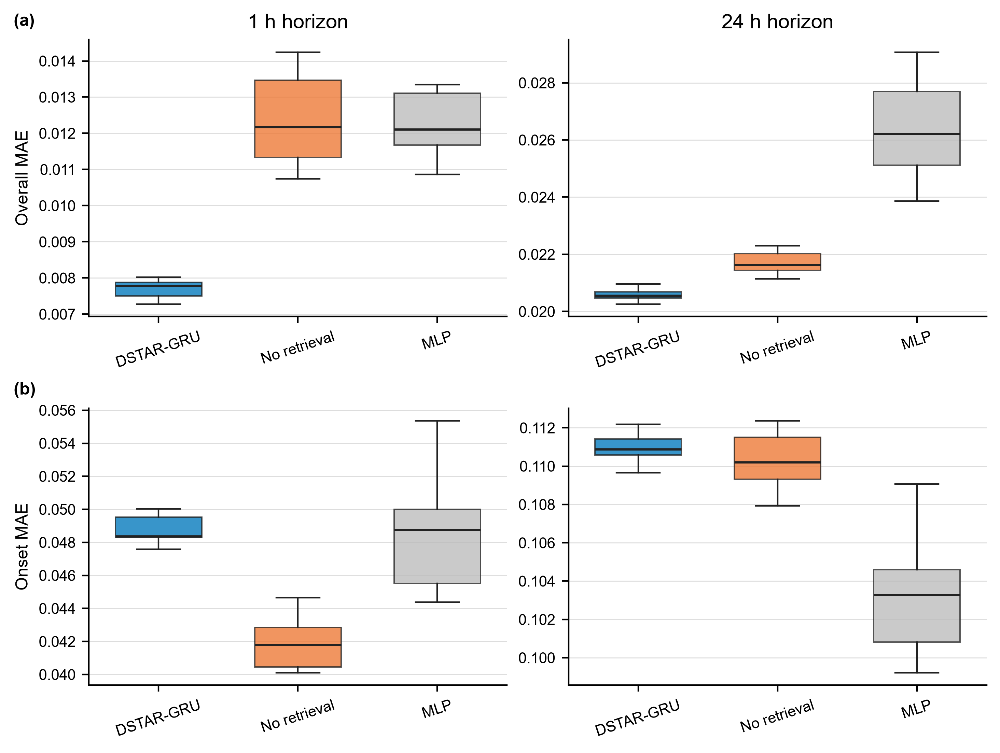
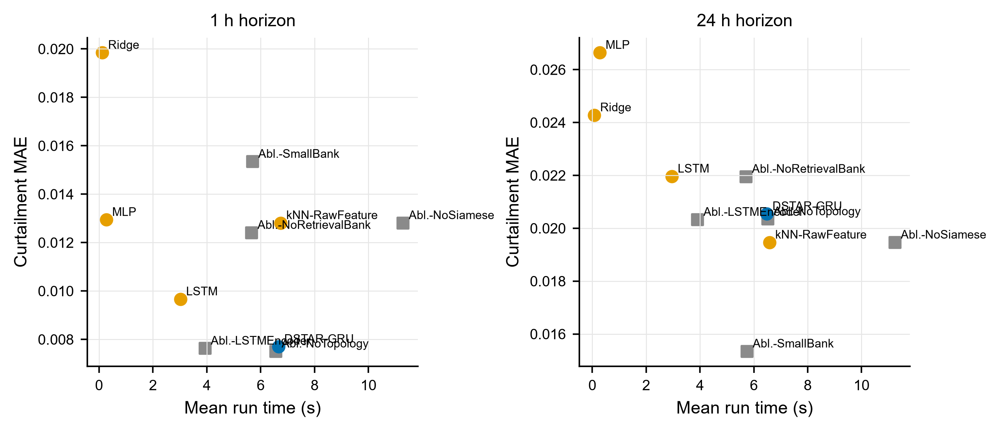

<!-- IEEE Access submission draft (Markdown master).
     Paper: mintou_p1 / DSTAR-GRU (framework pivot, route A).
     All numbers verified against:
       papers/mintou/mintou_p1_dstar_gru_dispatch/evidence/tables/real_curtailment_leaderboard.csv
       papers/mintou/mintou_p1_dstar_gru_dispatch/evidence/tables/real_curtailment_significance.csv
       papers/mintou/mintou_p1_dstar_gru_dispatch/evidence/runs/real_curtailment_results.csv
       src/powergrid_benchmark/mintou_real_curtailment.py (public_rts_curtailment_v6_modern_temporal_controls)
       papers/mintou/mintou_p1_dstar_gru_dispatch/evidence/tables/nrel118_transportability_summary.csv
       manuscript/figures/series_stats.json and cap_sensitivity.json (recomputed from build_series inputs)
     Figures live in ./figures/ (print-resolution PNG plus PDF/SVG evidence figures;
     regenerate Figures 1--4 with figures/make_figures.py and Figure 5 with
     scripts/mintou/generate_evidence_gap_figures.py).
     NOTE: the evidence config descriptor is synchronized with the executed
     REFERENCE_BIAS = 0.70 setting and states the 70% SNSP-type acceptance cap.
     AUTHOR INPUT REQUIRED markers must be resolved before submission. -->

# An Operating-State Retrieval Framework and Reproducible Curtailment-Risk Benchmark for Power System Decision Support

**Authors:** [AUTHOR INPUT REQUIRED: final author list and public ORCIDs]
**Affiliations:** [AUTHOR INPUT REQUIRED: complete institutional addresses]
**Corresponding author:** [AUTHOR INPUT REQUIRED: name and e-mail]

## Abstract

Public evaluation assets for renewable-curtailment forecasting remain limited because studies commonly use private single-system data, task-specific targets, and incomparable protocols. We construct a reproducible curtailment-risk benchmark from the open Reliability Test System Grid Modernization Lab Consortium data. A fixed reference operating policy with a 70% system non-synchronous-penetration-type cap converts 8760 hours of day-ahead load and renewable generation into a method-independent risk proxy, while an onset slice evaluates transitions from quiet to material-curtailment conditions. Under one leakage-free temporal split, training-window-calibrated warning thresholds, and ten seeded runs for stochastic methods, we compare DSTAR-GRU--a gated-recurrent operating-state retrieval framework--with eight baselines and five mechanism controls. Retrieval improves 1-hour mean absolute error relative to the prespecified retrieval-removal and retrieval-degradation controls, but reduces 24-hour onset-warning performance relative to no-retrieval and raw-feature-retrieval variants. Persistence achieves the lowest overall mean absolute error at both horizons, whereas ridge regression leads 24-hour onset detection. A fixed-cap transport check on NREL-118 produces no positive target hours, indicating that the policy-derived task requires system-specific calibration. The benchmark therefore reveals a horizon-dependent role for retrieval and separates overall accuracy from operationally relevant onset warning without implying general forecasting superiority.

**Index Terms** — renewable energy curtailment, benchmark, reproducibility, case-based retrieval, metric learning, time-series forecasting, early warning, RTS-GMLC, naive baselines

---

## I. Introduction

High instantaneous wind and solar shares can force curtailment when acceptance limits bind. International reviews document volumes and causes across multiple systems [1], national studies identify their drivers [2], and planning analyses show that some curtailment can be economically rational [3]. One explicit mechanism is the system non-synchronous penetration (SNSP) limit used on the all-island Irish system for frequency stability [4]. When the cap binds, curtailment follows from load and renewable trajectories, making cap-driven risk forecastable. Day-ahead SNSP forecasting has accordingly been demonstrated on Irish system data [5].

Anticipating curtailment, however, currently has no shared measurement infrastructure. Each study forecasts its own signal on its own (usually private) data with its own evaluation conventions; no public benchmark defines the task, no evaluation protocol isolates the operationally critical *onset* hours where curtailment emerges after quiet conditions, and statistical practice is thin. This absence is consequential because curtailment series are sparse and highly persistent: 91.8% of the hours in our benchmark have zero curtailment. Forecasting-methodology research further shows that, on such series, evaluations without strong naive baselines and leak-free protocols can overstate the value of learned methods [7], [8]. A public test system suitable for building such a benchmark exists: RTS-GMLC provides a full year of time-synchronized day-ahead load, wind, and solar series with open licensing [6].

A second, older gap concerns *how* decision support should use historical operating experience. Retrieving similar past situations is a recurring idea in power-system decision support. Its uses range from similar-day load forecasting in early expert systems and case-based reasoning for network operations [10] to analog ensembles in weather and renewable forecasting [9] and, more recently, Siamese metric learning on power signals. Yet every one of these lines validates retrieval at a single task and a fixed horizon on its own data. Whether the *same* retrieval mechanism helps or hurts as the forecast horizon changes has not been measured under controlled conditions in the studies reviewed here; practitioners considering retrieval-based tools therefore lack comparative evidence.

This paper addresses both gaps through a framework-and-benchmark study in which retrieval is evaluated as a conditional mechanism rather than assumed to be uniformly beneficial. The contributions are:

1. **A reproducible, method-agnostic public curtailment-risk benchmark.** A fixed reference operating policy (70% SNSP-type acceptance cap) converts the full-year RTS-GMLC day-ahead series into a reference-policy curtailment-risk proxy target that no method can influence. It is not an observed dispatch-curtailment record. An onset-slice protocol scores early warning at emergence hours (proxy rate ≥ 0.02 at the target hour and < 0.02 at observation time); detection thresholds are calibrated on the training window identically for every method; and seeded comparisons use Mann–Whitney U tests with Holm correction over ten seeds. The complete construction is executable code (Section III).
2. **An operating-state retrieval framework with matched controls.** DSTAR-GRU couples a GRU encoder to shared-encoder (Siamese-style) k-NN retrieval in the learned embedding space, with a validation-selected blend of model head and retrieved analogs. Its evaluation suite contains eight baselines spanning naive, linear, instance-based, recurrent, decomposition-linear, and temporal-convolutional families, plus five single-switch ablations that isolate the embedding, the retrieval bank, its size, the encoder cell, and one input feature (Section IV).
3. **A statistically resolved map of retrieval's horizon-dependent utility.** At 1 h, DSTAR-GRU significantly improves curtailment MAE over the prespecified retrieval-removal and retrieval-degradation controls NoSiamese, NoRetrievalBank, and SmallBank, as well as the non-retrieval LSTM and MLP baselines (Holm-adjusted p ≤ 0.0041); the TCN contrast is unresolved by the prespecified unpaired test. At 24 h, removing retrieval or using raw-feature retrieval significantly improves onset F1 (Holm-adjusted p ≤ 0.0040). Persistence leading overall MAE and ridge regression leading day-ahead onset detection further show why benchmark conclusions must be metric- and horizon-specific (Section VI).

Together, these contributions turn a sparse proxy series into a benchmark that distinguishes continuation accuracy from onset warning and exposes when operating-state retrieval is helpful, neutral, or harmful.

Section II reviews the relevant literature, and Section III specifies the benchmark. Sections IV–V define the framework, controls, and experimental protocol. Sections VI–VII report and interpret the results, followed by limitations and conclusions in Sections VIII–IX.

---

## II. Related Work

### A. Curtailment forecasting and renewable accommodation assessment

The empirical curtailment literature is predominantly retrospective. Bird et al. [1] review international levels, causes, and mitigation, while Luo et al. [2] analyze China's Three-North wind curtailment. Yasuda et al. [11] relate annual curtailment rate to renewable share, Frew et al. [3] study economically optimal marginal curtailment, and Newbery [12] examines Irish wind build-out against interconnection and storage. These studies quantify or explain curtailment rather than predict its short-horizon onset.

The predictive strand is thin and system-specific. O'Sullivan et al. [4] establish the frequency-stability basis of the Irish SNSP limit — the operational cap that makes curtailment a deterministic function of load and renewable trajectories once it binds. Cardo-Miota et al. [5] forecast day-ahead SNSP trajectories for the same system with a machine-learning pipeline, the closest existing work to curtailment-risk early warning; the target is a continuous penetration signal on one system's data, without a released benchmark or an event-level protocol. Hadian and Naderkhani [13] compare classical and deep models for curtailment time-series point forecasting, finding GRU best, again without reusable evaluation assets. Related net-load forecasting work [14] anticipates the accommodation problem but does not map forecasts to curtailment-risk events. Across the studies reviewed here, we found no public curtailment-risk benchmark that combines an onset-oriented evaluation slice with seeded statistics. The benchmark introduced here is designed to fill that documented gap.

### B. Retrieval, analogues, and metric learning in power system decision support

Reasoning from similar past operating states is a recurring proposal with a long pedigree. Rahman and Bhatnagar [15] encoded similar-day operator heuristics in a 1988 expert-system load forecaster; Mandal et al. [16] retrieved Euclidean similar days to drive several-hour-ahead neural load forecasting; Lora et al. [17] forecast next-day market prices purely by weighted nearest neighbors over historical price trajectories. Case-based reasoning carried the idea into operations proper: Xu et al. [10] run the full retrieve–reuse–revise–retain cycle over network operating cases for coordinated voltage control. In weather-driven forecasting, the analog ensemble of Delle Monache et al. [9] retrieves the most similar past forecasts and uses their verifying observations as a predictive distribution, with successful transfers to wind power [18] and solar power [19]. Most recently, metric learning has replaced hand-crafted similarity: Siamese networks learn embeddings for appliance identification in non-intrusive load monitoring [20] and, combined with k-NN, for power-quality disturbance classification [21].

Across the reviewed retrieval studies, validation is typically confined to one task and one horizon or narrow horizon band on study-specific data. Matched non-retrieval controls are also uncommon, leaving the contribution of retrieval itself difficult to isolate. This paper therefore asks whether the same retrieval mechanism helps or hurts as the horizon grows. The observed sign reversal between 1 h and 24 h shows why the distinction matters on the present benchmark.

### C. Naive baselines and benchmark design in time-series forecasting

Forecasting competitions motivate the benchmark protocol. M3 shows that sophisticated methods do not necessarily beat simple references [22]. Hyndman and Koehler demonstrate that common errors can degenerate on intermittent, near-zero series and propose scaled evaluation [23]. Later M-competitions compare entrants with naive combinations at scale [7], [24], [25].

In energy forecasting, GEFCom2014 establishes competition-grade protocol design [26], and community guidance requires verification against persistence and other standardized references [27]. Surveys identify temporal leakage, missing naive baselines, and inappropriate metrics as recurrent failures [28]. Kapoor and Narayanan document similar reproducibility failures across machine-learning science [8]. RTS-GMLC [6] supplies the public, synchronized load and renewable data needed for an auditable benchmark.

Recent IEEE Access load-forecasting studies continue to combine temporal representation learning with tensor graph convolution or TimesNet--Crossformer--LSTM stacks [29], [30]. Their prediction targets differ from curtailment onset, but they reinforce a relevant evaluation requirement: a retrieval benchmark should include competent deep temporal controls as well as naive and linear references. We therefore use the same recurrent training protocol for DSTAR-GRU and its matched no-retrieval LSTM control, while treating broader architecture searches as outside the benchmark's mechanism-isolation purpose.

This literature motivates three design choices: persistence and seasonal-naive are included as first-class methods; event and onset metrics complement aggregate error on the sparse target; and learned-method comparisons use temporal splits, multiple seeds, and multiplicity correction. It also shapes interpretation. Persistence leading overall MAE is consistent with the M-competition record and therefore provides a useful validity check on the protocol.

### D. Gap statement

At the intersection, two gaps emerge from the literature reviewed here. **(G1)** We found no reproducible public curtailment-risk early-warning benchmark that combines an onset protocol with seeded statistics; existing curtailment work is commonly retrospective or uses continuous proxies from private single-system data. **(G2)** Retrieval-based decision support has not been characterized across horizons on a common public benchmark with matched controls, leaving its horizon dependence insufficiently documented. Contribution 1 addresses G1, while Contributions 2–3 address G2 through an implemented framework and a cross-horizon mechanism analysis.

---

## III. The Curtailment-Risk Benchmark

The benchmark is defined by five design decisions, each stated with its rationale. The construction is fully implemented in `src/powergrid_benchmark/mintou_real_curtailment.py` (run version `public_rts_curtailment_v5_onset_eval`); every rule below is inspectable code.

### A. Method-independent task construction

The substrate is the RTS-GMLC day-ahead hourly series [6]: system-aggregated load, wind, and solar for a full year (8760 hours). A **fixed reference operating policy** converts these inputs into a curtailment-risk proxy target. It does not reconstruct observed dispatch. At every hour, accepted renewable generation under the reference rule is capped at 70% of load,

$$
u_t = \min(r_t, \; 0.70 \cdot d_t), \qquad
y_t = \frac{\max(0, \; r_t - u_t)}{\max(1, \; r_t)},
$$

where $r_t$ is available renewable power (wind + PV), $d_t$ is load, and $y_t \in [0,1]$ is the reference-policy curtailment-risk proxy. The cap represents an SNSP-class instantaneous non-synchronous penetration rule [4]. The proxy is method-independent because it is computed once from public inputs before model fitting. It is also sparse and bursty: 8.2% of hours have nonzero proxy curtailment, 7.6% exceed the 0.02 onset threshold, the maximum rate is 0.383, and the implied curtailed-energy share is 2.68% (Fig. 1a–b).

Each forecasting method sees the same seven hourly features: load, wind, PV, net load, load ramp, renewable share, and a topology-stress proxy computed from RTS-GMLC branch ratings. The features form 48-hour windows and are z-normalized with training-split statistics. Models predict $y_{t+h}$ for $h \in \{1, 24\}$, representing intra-hour operational adjustment and day-ahead scheduling, respectively.

**Fig. 1.** Reference-policy curtailment-risk proxy target. (a) Full-year proxy-rate series under the fixed 70% SNSP-type policy, with temporal fit, validation, and test boundaries. (b) Monthly sparsity of nonzero and threshold-significant (≥0.02) proxy hours. (c) Test-split excerpt illustrating a proxy onset.

### B. Temporal protocol

The split is strictly temporal. The first 70% of target hours form the training window, whose final 15% (hours 5212–6131) is reserved for model selection and calibration. The last 30% (2628 hours) is the test split. There is no shuffling or random split; every learned method is trained, selected, and calibrated using only information available before the test period, following standard leak-avoidance guidance [28].

### C. Onset-slice evaluation

Overall MAE on a series that is 91.8% zeros mostly measures whether a method predicts "no curtailment" smoothly — a job persistence does almost optimally. The operational value of a curtailment-risk tool, by contrast, concentrates at the **onset hours**: the moments where significant curtailment emerges after quiet conditions, which are precisely the hours where persistence-type reasoning structurally cannot warn (its forecast is the quiet past). The benchmark therefore defines, for horizon $h$:

$$
\text{onset}_t \iff y_t \geq 0.02 \;\wedge\; y_{t-h} < 0.02 ,
$$

i.e., significant curtailment at the target hour that was absent at observation time (Fig. 1c). The test split contains 57 onset hours at $h{=}1$ and 172 at $h{=}24$. Let $\mathcal{I}_h$ denote the corresponding onset index set. The restricted regression error is

$$
\operatorname{MAE}_{\mathrm{onset}}(h)=\frac{1}{|\mathcal{I}_h|}\sum_{t\in\mathcal{I}_h}|y_t-\hat y_t|.
$$

For onset detection, each continuous prediction is thresholded into a warning. The threshold is calibrated separately for each method on the *training-window* onsets by maximizing F1 over a 40-point quantile grid, and is then applied unchanged to the test split. With precision $P=TP/(TP+FP)$ and recall $R=TP/(TP+FN)$, the score is

$$
F_1=\frac{2PR}{P+R}.
$$

A complementary event metric evaluates exceedance of a high-curtailment threshold. That threshold is the median positive training rate, floored at 0.02. A stress-subset MAE over test hours in the top training quartile of renewable share completes the metric set.

### D. Statistical protocol

Every stochastic method runs with ten fixed seeds; deterministic methods (persistence, seasonal, ridge, raw-feature k-NN) contribute single rows and are compared descriptively by their means. Pairwise comparisons between the framework and each seeded opponent use the two-sided Mann–Whitney U test, with Holm correction within each horizon across 27 tests (three metrics × nine seeded opponents). The complete primary table reports rank-biserial effects and pointwise, multiplicity-unadjusted 5000-resample intervals for mean differences (`real_curtailment_primary_inference_v2.csv`); Holm p-values determine significance. Because stochastic methods share seed indices, exact paired sign-flip tests provide a supplementary sensitivity analysis. Neither seed-based interval covers year-to-year or event-block uncertainty.

### E. Reference-cap choice and sensitivity of the task

The 70% cap lies within the documented SNSP operating range; the Irish limit increased from 50% toward 75% [4]. It is a benchmark parameter rather than a truth claim. Table 1 recomputes the target at caps 0.60, 0.70, and 0.80. Tightening the cap to 0.60 raises the event share to 13.3% and produces 263 day-ahead test onsets, while relaxing it to 0.80 lowers the share to 3.5% and produces 86 onsets.

All model comparisons use cap 0.70. Whether the naive-baseline ordering and retrieval sign reversal persist at the other caps remains untested. The series-level sensitivity characterizes that future experiment without implying a method-level result.

**Table 1.** Series-level sensitivity of the benchmark target to the acceptance cap (from `figures/cap_sensitivity.json`; onset threshold 0.02, test split = final 30%).

| Acceptance cap | Nonzero hours | Hours ≥ 0.02 | Mean rate | Curtailed energy | Test onsets (1 h) | Test onsets (24 h) |
|---|---|---|---|---|---|---|
| 0.60 | 14.16% | 13.31% | 0.0251 | 5.85% | 68 | 263 |
| **0.70 (benchmark)** | **8.24%** | **7.56%** | **0.0107** | **2.68%** | **57** | **172** |
| 0.80 | 3.94% | 3.52% | 0.0036 | 0.95% | 31 | 86 |

### F. Construct validity and method-independent target construction

Construct validity depends on separating the forecasting target from the algorithms evaluated against it. The fixed reference policy therefore computes the proxy target once, before any model is fitted, and the resulting series is shared unchanged by every baseline, framework configuration, and ablation. Each compared learning method is trained from data, and each ablation changes one implemented mechanism rather than a hand-assigned performance constant. This construction prevents method-specific terms from entering the label definition and makes adverse results--including the lack of an overall DSTAR-GRU advantage--interpretable as properties of the tested methods rather than of the target generator. Detailed development history and superseded artifacts are retained with the reproducibility materials but are not part of the empirical claim.

---

## IV. The Operating-State Retrieval Framework

Figure 2 locates the trainable and retrieval stages inside the method-independent benchmark and evaluation pipeline. The target and temporal/onset protocol are fixed before model fitting; the fit-split retrieval bank and prediction head meet only at the validation-selected blend; and held-out evaluation applies the same horizon-specific metrics and multiplicity correction to every method.

**Fig. 2.** End-to-end benchmark and operating-state retrieval architecture. Solid arrows denote the prediction path. The lower strip lists evaluation outputs rather than trainable inputs and therefore cannot feed information back into the model.

**Formal definitions.** Let \(X_t=[x_{t-47},\ldots,x_t]\in\mathbb{R}^{48\times 7}\) be a standardized observation window and \(E_\theta\) the shared recurrent encoder. Its final state and direct regression output are

$$
h_t=E_\theta(X_t), \qquad \hat y^{\mathrm{head}}_{t+h}=w_h^\top h_t+b_h .
$$

The encoder parameters are fitted only on the fit split by the horizon-specific squared-error objective

$$
\theta^\star=\arg\min_\theta \frac{1}{|\mathcal T_{\mathrm{fit}}|}\sum_{t\in\mathcal T_{\mathrm{fit}}}\left(y_{t+h}-\hat y^{\mathrm{head}}_{t+h}\right)^2 .
$$

The bank \(\mathcal B_h=\{(E_{\theta^\star}(X_q),y_{q+h}):q\in\mathcal T_{\mathrm{fit}}\}\) uses the same frozen encoder as the query branch. For a query \(t\), distance and the \(k\)-neighbor index set are

$$
d_{tq}=\left\|E_{\theta^\star}(X_t)-E_{\theta^\star}(X_q)\right\|_2,\qquad
\mathcal N_k(t)=\operatorname*{arg\,min}_{\substack{\mathcal I\subset\mathcal T_{\mathrm{fit}}\\|\mathcal I|=k}}\sum_{q\in\mathcal I}d_{tq}.
$$

The retrieval estimate and convex blend are

$$
\hat y^{\mathrm{ret}}_{t+h}=\frac{1}{k}\sum_{q\in\mathcal N_k(t)}y_{q+h},
$$

$$
\hat y_{t+h}(\alpha)=\alpha\hat y^{\mathrm{head}}_{t+h}+(1-\alpha)\hat y^{\mathrm{ret}}_{t+h},\qquad 0\leq\alpha\leq1.
$$

The blend coefficient is chosen once on the validation slice, never on test outcomes:

$$
\alpha_h^\star=\operatorname*{arg\,min}_{\alpha\in\mathcal A}
\frac{1}{|\mathcal T_{\mathrm{val}}|}\sum_{t\in\mathcal T_{\mathrm{val}}}
\left|y_{t+h}-\hat y_{t+h}(\alpha)\right|,
\quad \mathcal A=\{0,.2,.4,.5,.6,.8,1\}.
$$

The query and bank branches share \(E_{\theta^\star}\), so we use *Siamese-style* only to describe weight sharing. There is no separately optimized contrastive loss. The learned geometry is induced by the forecasting objective and tested through the NoSiamese/raw-space control.

### A. Design

DSTAR-GRU ("Digital-twin Siamese Temporal Alignment and Retrieval GRU") has three stages:

1. **Encoder.** A single-layer GRU (hidden size 48) reads the 48 h × 7-feature window; the final hidden state is both the regression representation (a linear head predicts $\hat{y}^{\text{head}}$) and the embedding for retrieval. Training minimizes MSE with Adam, with the best-validation-loss checkpoint retained.
2. **Shared-encoder retrieval.** The training (fit-split) windows form a retrieval bank in the learned embedding space. For each query window, the k = 8 nearest bank entries (Euclidean distance between embeddings) are retrieved, and their known targets averaged into $\hat{y}^{\text{ret}}$. Query and bank use the same trained encoder.
3. **Validated blend.** The final prediction is $\alpha \hat{y}^{\text{head}} + (1-\alpha) \hat{y}^{\text{ret}}$, with $\alpha$ selected from {0, 0.2, 0.4, 0.5, 0.6, 0.8, 1.0} by validation-slice MAE.

The framework view is that stage 2 is a pluggable decision-support mechanism — "what happened after the most similar past operating states?" — whose value must be measured, not assumed. Everything in Sections IV-B/C exists to measure it.

### B. Baselines

Eight baselines span the method families the benchmark should discriminate (Table 2). **Persistence** uses the last observed curtailment rate and provides the required naive reference. **Seasonal-24h** uses the same hour on the previous day; at $h{=}24$, it is identical to persistence by construction. The learned non-retrieval baselines are **Ridge** regression on the flattened window ($\lambda=10^{-3}$), a 96/48-unit ReLU **MLP**, an **LSTM** in the same capacity class as the framework encoder, **DLinear** with a fixed moving-average trend/season decomposition, and a causal **TCN** with dilations 1--8. Finally, **kNN-RawFeature** performs $k=8$ retrieval in the raw flattened-feature space without representation learning. DLinear and TCN use the same optimizer, validation checkpointing, epoch ceiling, features, clipping rule, and ten seeds as the other learned models; they were added before their test results were inspected.

### C. Mechanism ablations

Five single-switch ablations isolate the design choices. **NoSiamese** retrieves in raw feature space but retains the GRU head and blend, distinguishing it from kNN-RawFeature. **NoRetrievalBank** uses only the GRU head; **SmallBank** restricts the bank to the most recent 168 h; **LSTMEncoder** replaces the GRU while preserving retrieval; and **NoTopology** removes the topology-stress feature. Each flips exactly one switch against the full framework, so any significant difference can be attributed to that switch within the stated design.

**Table 2.** Methods (from the run configuration; descriptions abbreviated).

| Method | Role | Mechanism |
|---|---|---|
| DSTAR-GRU | framework | GRU encoder + Siamese retrieval in learned embedding + validated blend |
| Persistence | baseline | last observed curtailment rate |
| Seasonal-24h | baseline | previous-day same-hour rate |
| Ridge | baseline | linear, flattened window, λ = 10⁻³ |
| MLP | baseline | 96/48 ReLU, flattened window |
| LSTM | baseline | recurrent head, no retrieval |
| DLinear | baseline | fixed trend/season decomposition with linear heads |
| TCN | baseline | causal dilated temporal convolutions |
| kNN-RawFeature | baseline | k-NN in raw feature space, no learning |
| Ablation-NoSiamese | ablation | retrieval in raw space (keeps GRU head + blend) |
| Ablation-NoRetrievalBank | ablation | GRU head only |
| Ablation-SmallBank | ablation | bank = most recent 168 h |
| Ablation-LSTMEncoder | ablation | LSTM encoder, same retrieval |
| Ablation-NoTopology | ablation | topology-stress feature removed |

---

## V. Experimental Setup

### A. Fairness statement

All learned methods share the feature set, 48 h windows, normalization statistics, temporal splits, MSE loss, Adam optimizer (10⁻³), 20-epoch ceiling with best-validation checkpointing, batch size 256, and ten seeds. Recurrent models also share hidden size 48. The framework therefore has no capacity advantage over the LSTM baseline (GRU encoder ≈ 8.3k parameters, LSTM ≈ 11.0k, and MLP ≈ 37.1k). The onset detection threshold is calibrated by one identical procedure for every method, including baselines. Deterministic methods are exactly reproducible and run once. No method receives task-specific tuning beyond the shared grid stated in Table 3. Predictions are clipped to [0, 1] for all methods.

### B. Hyperparameter disclosure

**Table 3.** Complete hyperparameter disclosure (source: pipeline constants in `mintou_real_curtailment.py`).

| Item | Value |
|---|---|
| Series length / horizons | 8760 h / 1 h, 24 h |
| Input window / features | 48 h / 7 (load, wind, PV, net load, load ramp, renewable share, topology stress) |
| Normalization | z-score, training-split statistics |
| Split | first 70% train (last 15% of it = validation), final 30% test; temporal |
| GRU / LSTM | 1 layer, hidden 48, linear head |
| DLinear / TCN | moving average 7; causal Conv1d channels 32, dilations 1--8 |
| MLP | 336–96–48–1, ReLU |
| Optimizer / loss / epochs / batch | Adam 10⁻³ / MSE / 20 (best-val checkpoint) / 256 |
| Retrieval | k = 8, Euclidean, bank = fit split (SmallBank: last 168 h) |
| Blend grid | $\alpha\in\{0,0.2,0.4,0.5,0.6,0.8,1.0\}$, selected on validation MAE |
| Ridge | λ = 10⁻³, fit on train+validation |
| Event threshold | median positive training rate, floored at 0.02 |
| Onset threshold / detection calibration | 0.02 / per-method F1-max over 40 quantiles (0.5–0.999) of training predictions |
| Seeds / statistics | 10 fixed seeds for stochastic methods / two-sided Mann–Whitney U + Holm (27 tests per horizon); exact paired sensitivity |

### C. Computational footprint

The full protocol contains 14 methods over two horizons and archives 208 method--seed results (ten seeds for stochastic methods; one exact run for deterministic methods). A single framework train-and-evaluate pass takes roughly 7 s at the 1 h horizon, and the complete benchmark reruns in well under an hour on a desktop CPU. The released command rebuilds the target, trains the compared methods, and regenerates the result tables.

---

## VI. Results

### A. Overall accuracy and naive-reference performance

Table 4 and Fig. 3 report the per-horizon leaderboards. At the 1 h horizon, **Persistence has the lowest curtailment MAE (0.00691)**, 10.3% below the framework (0.00770, rank 4/14, std 0.00026 over ten seeds). At 24 h, raw-feature kNN is the strongest non-degenerate baseline (0.01946, 5.3% below the framework's 0.02054, rank 8/14), with Persistence/Seasonal-24h 0.9% below the framework. The modern TCN is fifth at 1 h (0.00834) and eleventh at 24 h (0.02220); the prespecified unpaired test does not separate it from DSTAR-GRU at either horizon, while the supplementary paired sensitivity resolves only the small 1 h difference. DLinear is substantially weaker (0.02202 and 0.02823). Thus the modern controls narrow the architectural comparison without overturning the benchmark's naive-baseline result.

The event-level metric sharpens the same point at the day-ahead scale. At 24 h, the framework's high-curtailment event F1 is 0.034 versus 0.340 for persistence. The MSE-trained regressors tend toward near-zero predictions on a mostly-zero series and miss events, whereas persistence repeats the preceding day's events. The SmallBank ablation is the extreme case: its 24 h MAE is the *best* of all fourteen methods (0.01534) while its event F1 is 0.000. The benchmark retains both metric families so that this near-constant-predictor pathology remains visible.

**Table 4.** Leaderboards (mean over seeds; from `real_curtailment_leaderboard.csv`). PS = Persistence, S24 = Seasonal-24h. Bold = framework.

*Horizon 1 h:*

| Rank | Method | Role | MAE | Onset F1 | Onset MAE | Event F1 |
|---|---|---|---|---|---|---|
| 1 | Persistence | baseline | 0.00691 | 0.042 | 0.0675 | 0.770 |
| 2 | Ablation-NoTopology | ablation | 0.00751 | 0.185 | 0.0474 | 0.659 |
| 3 | Ablation-LSTMEncoder | ablation | 0.00763 | 0.185 | 0.0468 | 0.681 |
| 4 | **DSTAR-GRU** | framework | **0.00770** | **0.176** | **0.0488** | **0.674** |
| 5 | TCN | baseline | 0.00834 | 0.165 | 0.0487 | 0.701 |
| 6 | LSTM | baseline | 0.00966 | 0.174 | 0.0438 | 0.724 |
| 7 | Ablation-NoRetrievalBank | ablation | 0.01241 | 0.163 | 0.0419 | 0.696 |
| 8 | Ablation-NoSiamese | ablation | 0.01281 | 0.089 | 0.0488 | 0.542 |
| 9 | kNN-RawFeature | baseline | 0.01281 | 0.089 | 0.0488 | 0.542 |
| 10 | MLP | baseline | 0.01294 | 0.162 | 0.0487 | 0.631 |
| 11 | Ablation-SmallBank | ablation | 0.01534 | 0.042 | 0.0694 | 0.000 |
| 12 | Ridge | baseline | 0.01984 | 0.143 | 0.0446 | 0.435 |
| 13 | Seasonal-24h | baseline | 0.02036 | 0.076 | 0.0704 | 0.342 |
| 14 | DLinear | baseline | 0.02202 | 0.122 | 0.0404 | 0.266 |

*Horizon 24 h:*

| Rank | Method | Role | MAE | Onset F1 | Onset MAE | Event F1 |
|---|---|---|---|---|---|---|
| 1 | Ablation-SmallBank | ablation | 0.01534 | 0.123 | 0.1324 | 0.000 |
| 2 | Ablation-NoSiamese | ablation | 0.01946 | 0.225 | 0.1068 | 0.132 |
| 3 | kNN-RawFeature | baseline | 0.01946 | 0.226 | 0.1068 | 0.132 |
| 4 | Ablation-LSTMEncoder | ablation | 0.02032 | 0.169 | 0.1111 | 0.068 |
| 5 | Ablation-NoTopology | ablation | 0.02035 | 0.175 | 0.1109 | 0.062 |
| 6 | Persistence | baseline | 0.02036 | 0.123 | 0.1323 | 0.340 |
| 7 | Seasonal-24h | baseline | 0.02036 | 0.123 | 0.1323 | 0.340 |
| 8 | **DSTAR-GRU** | framework | **0.02054** | **0.177** | **0.1108** | **0.034** |
| 9 | Ablation-NoRetrievalBank | ablation | 0.02195 | 0.207 | 0.1098 | 0.000 |
| 10 | LSTM | baseline | 0.02196 | 0.211 | 0.1090 | 0.019 |
| 11 | TCN | baseline | 0.02220 | 0.183 | 0.1112 | 0.022 |
| 12 | Ridge | baseline | 0.02428 | 0.236 | 0.1065 | 0.025 |
| 13 | MLP | baseline | 0.02664 | 0.206 | 0.1023 | 0.168 |
| 14 | DLinear | baseline | 0.02823 | 0.165 | 0.1013 | 0.044 |

**Fig. 3.** Leaderboards at both horizons for curtailment-rate MAE (left; error bars = std over 10 seeds where applicable) and onset F1 (right). The framework is not the leader in the displayed cells; the identity of the leading method changes with horizon and metric.

### B. Onset warning: the operationally relevant slice reorders the field

The onset slice changes the overall-MAE ordering. At 1 h, Persistence falls to an onset F1 of 0.042 because repeating the last value cannot anticipate hours defined by change. LSTMEncoder and NoTopology reach 0.185, the framework 0.176, and LSTM 0.174. The framework's two encoder-variant ablations nominally edge it, but the contrasts against those variants remain unresolved after Holm correction; the framework therefore does not lead the 1 h onset ranking. On onset MAE at 1 h, the framework (0.0488) is significantly worse than LSTM (0.0438, Holm p = 0.0239), NoRetrievalBank (0.0419, p = 0.00402), and LSTMEncoder (0.0468, p = 0.00874). Accurate warning classification therefore does not imply the most accurate onset-hour magnitudes.

At 24 h, the day-ahead warning task relevant to scheduling, the leaders are **Ridge (onset F1 0.236) and raw-feature k-NN (0.226)**, followed by the framework's own NoSiamese ablation (0.225). The framework ranks seventh (0.177). Day-ahead onset warning on this benchmark is a simple-methods regime: linear regression over the raw feature window, or nearest neighbors in raw feature space, beat every deep and retrieval-augmented configuration tested. Improving rare-onset detection without sacrificing overall calibration is therefore the benchmark's principal open problem.

### C. The scale-dependent utility of retrieval: significant in both directions

Fig. 4 presents the paper's central component result, drawn from the Holm-corrected comparisons in `real_curtailment_significance.csv`.

**At 1 h, learned-embedding retrieval is supported by its matched controls.** On curtailment MAE, the framework is significantly better than NoSiamese (raw-space retrieval; Holm p = 0.00172), NoRetrievalBank (no retrieval; p = 0.00402), SmallBank (p = 0.00172), LSTM (p = 0.00402), and MLP (p = 0.00402). The retrieval-preserving LSTMEncoder and NoTopology variants are unresolved against the full framework. In the paired sensitivity analysis, the DSTAR-minus-opponent MAE differences are -0.00511 for NoSiamese (pointwise 95% bootstrap CI [-0.00528, -0.00496]) and -0.00471 for NoRetrievalBank ([-0.00540, -0.00401]); both paired Holm p = 0.0176. TCN is unresolved under the prespecified Mann–Whitney family (p = 0.312), although the supplementary paired sensitivity detects a smaller difference of -0.00064 ([-0.00135, -0.00016], paired Holm p = 0.0469). The matched ablations therefore support learned-space retrieval over its removal and degradation controls, while the TCN comparison remains test-dependent.

**At 24 h onset warning, the same mechanism is significantly harmful on this benchmark.** The framework's onset F1 (0.177) is below NoSiamese (0.225, Holm p = 0.00172), NoRetrievalBank (0.207, p = 0.00394), and LSTM (0.211, p = 0.00384). MLP (0.206) does not survive Holm correction (adjusted p = 0.0947) and is treated as unresolved. Paired DSTAR-minus-opponent onset-F1 differences are -0.0481 for NoSiamese (pointwise 95% CI [-0.0573, -0.0391]), -0.0302 for NoRetrievalBank ([-0.0431, -0.0170]), and -0.0340 for LSTM ([-0.0453, -0.0231]); paired Holm p values are 0.0176, 0.0234, and 0.0176. The same adverse pattern appears in 24 h overall MAE against NoSiamese (Holm p = 0.00172).

Both directions carry corrected significance. The controlled comparison therefore provides evidence of a horizon-dependent sign reversal for this retrieval mechanism on the stated benchmark. Section VII examines explanations consistent with the observed ordering.

**Fig. 4.** Component comparisons under Holm-adjusted Mann–Whitney tests (10 seeds). (a) At 1 h, DSTAR-GRU has significantly lower curtailment MAE than NoSiamese, NoRetrievalBank, SmallBank, LSTM, and MLP among the controls shown. The retrieval-preserving ablations and TCN are unresolved under the prespecified test. (b) At 24 h, DSTAR-GRU has lower onset F1 than NoRetrievalBank, NoSiamese, and LSTM.

Figure 5 exposes the seed-level distributions behind the principal point estimates. At 1 h, DSTAR-GRU has lower overall MAE than NoRetrievalBank and MLP, whereas NoRetrievalBank has lower onset MAE. At 24 h, DSTAR-GRU remains below those learned comparators in overall MAE, but MLP has lower onset MAE. Thus the overall and onset slices can favor different mechanisms even within the same horizon; the boxplots make that trade-off visible without replacing the corrected pairwise tests.

**Fig. 5.** Seed-level uncertainty for DSTAR-GRU and two learned non-retrieval comparators. Boxes show the interquartile range and median over 10 seeds; whiskers extend to 1.5 times the interquartile range. Panels report overall and onset MAE at 1 h and 24 h. Statistical decisions in the text use the prespecified Holm-adjusted Mann–Whitney comparisons rather than visual overlap of the boxes.

### D. Stress subset

On the high-renewable-share test subset (top training quartile of renewable share), the ordering mirrors the overall MAE tables (framework 0.0222 at 1 h vs. Persistence 0.0199; 0.0463 at 24 h vs. NoSiamese/kNN 0.0435): the framework degrades gracefully under stress but exhibits no relative advantage there, and we make no stress-scenario claim.

### E. Multi-Metric Rank Profile and Computational Cost

A single leaderboard obscures the extent to which the metric determines the preferred method. Figure 6 ranks the nine best aggregate profiles at each horizon over five readouts: overall MAE, onset MAE, stress-subset MAE, event F1, and onset F1. The ranks are computed from the same frozen rows used in Table 4; no metric weights are introduced. At 1 h, DSTAR-GRU ranks fourth on overall and stress MAE, seventh on onset MAE, fifth on event F1, and third on onset F1. At 24 h it occupies ranks 7--8 on all five readouts. The heat map therefore makes the negative day-ahead result harder to miss than a single selected metric would. It also shows why we do not form a composite score: any weighting of error and event-detection columns would encode an operational preference that is absent from the public data.

**Fig. 6.** Within-task method ranks computed from `real_curtailment_results.csv`. Rank 1 denotes the best mean for the indicated metric; lower is better for error columns and higher is better for F1 columns. Only the nine methods with the best mean rank at each horizon are displayed. The panel is descriptive and does not replace the prespecified pairwise tests.

Figure 7 adds the corresponding compute--error view. The framework averages 6.66 s per seeded run at 1 h and 6.48 s at 24 h. The LSTM averages about 3.02 s and 2.96 s, while the MLP requires only 0.27--0.28 s. Raw-space retrieval is slower than DSTAR-GRU because distance calculations use the full flattened window. These desktop-CPU timings are implementation measurements, not asymptotic benchmarks; they nevertheless rule out a hidden efficiency advantage as an explanation for the accuracy comparisons.

**Fig. 7.** Mean wall-clock time and curtailment MAE for learned methods and retrieval ablations at both horizons. Circles denote the framework or external learned baselines; squares denote ablations. Values are means of the archived seeded runs on the same CPU environment.

**Table 5.** Selected compute--error readouts from the frozen run archive. Times are mean seconds per train-and-evaluate run; deterministic baselines are omitted because their timings are not comparable to model fitting.

| Method | 1 h time (s) | 1 h MAE | 24 h time (s) | 24 h MAE |
|---|---:|---:|---:|---:|
| DSTAR-GRU | 6.66 | 0.00770 | 6.48 | 0.02054 |
| LSTM | 3.02 | 0.00966 | 2.96 | 0.02196 |
| MLP | 0.27 | 0.01294 | 0.28 | 0.02664 |
| Ablation-NoRetrievalBank | 5.67 | 0.01241 | 5.71 | 0.02195 |
| Ablation-NoSiamese | 11.28 | 0.01281 | 11.24 | 0.01946 |

The combined evidence gives a three-part decision rule. DSTAR-GRU is defensible when short-horizon learned-model accuracy and analogue retrieval are required; LSTM is the leaner learned alternative; and simple raw-feature or linear methods remain the correct day-ahead onset references. The framework is neither the universal accuracy winner nor the cheapest model.

### F. Modern Temporal Controls and Fixed-Cap Transportability

Figure 8 joins two predeclared stress tests of scope. One adds DLinear and a causal TCN under the same data, optimizer, validation checkpointing, epoch ceiling, clipping, and ten seeds as the existing learned models. TCN approaches DSTAR-GRU at 1 h (MAE 0.00834 versus 0.00770) and 24 h (0.02220 versus 0.02054). Neither difference is significant in the prespecified unpaired analysis; the paired sensitivity resolves the 1 h contrast only (mean difference -0.00064, pointwise 95% CI [-0.00135, -0.00016], adjusted p = 0.0469). DLinear is worse on both horizons. These results reduce the concern that the retrieval finding depends on omitting temporal-convolutional and decomposition-linear controls, but they do not make the framework the overall winner because Persistence and raw kNN remain stronger on their respective headline cells.

The second test applies the fixed 70% reference-cap construction, unchanged, to the public NREL-118 load, wind, and solar time series. Across 8784 aligned hours, renewable share has mean 0.103, 95th percentile 0.262, and maximum 0.369. It never reaches the 0.70 cap, so the derived target contains zero positive hours. A cross-system accuracy ranking is therefore not identifiable under this task definition. The cap is a policy parameter rather than a universal physical constant; transferring the benchmark requires a policy-calibrated acceptance rule specified before model comparison. Lowering the cap after observing NREL-118 would instead make the external task definition result-dependent.

**Fig. 8.** (a) Curtailment-rate MAE for DSTAR-GRU, TCN, and DLinear under the shared ten-seed protocol. (b) NREL-118 renewable-share statistics relative to the fixed 0.70 reference cap. No NREL-118 hour reaches the cap; consequently, no external model ranking is reported.

---

## VII. Discussion

### A. Why retrieval helps at 1 h

At the short horizon the target is dominated by continuation: most hours continue a quiet or an active regime, and the retrieval average over eight similar operating states acts as a smoother anchored in realized outcomes, correcting the GRU head's residual noise. The ablation geometry supports this interpretation. Raw-space retrieval (NoSiamese, MAE 0.01281) is worse than learned-embedding retrieval (0.00770). Thus, the curtailment-trained encoder learns a similarity representation that predicts near-term curtailment more accurately than raw Euclidean proximity on this benchmark. This is the controlled counterpart of what the analog-ensemble literature observes in weather-driven forecasting [9], [18], [19]: analogs work when the mapping from state to short-term outcome is locally smooth.

### B. Why the same mechanism harms 24 h onset warning

Onset hours are, by definition, hours where the future does not resemble the recent past. A query window observed at an onset-minus-24 h moment describes quiet conditions; its nearest neighbors in any space are overwhelmingly other quiet windows, whose subsequent targets are mostly zeros. Averaging them drags the blended prediction toward zero exactly where warning requires signal — retrieval acts as a persistence prior, and persistence is the one behavior that cannot warn (Persistence onset F1: 0.042 at 1 h, 0.123 at 24 h). The learned embedding aggravates rather than mitigates this failure. MSE training on a 92%-zero series favors distinctions associated with typical outcomes and may suppress rare pre-onset cues retained by raw features. Consistent with this explanation, raw-space retrieval (NoSiamese, onset F1 0.225) significantly outperforms learned-space retrieval (0.177) at 24 h. The validation-selected blend weight cannot rescue this, because it is selected on overall validation MAE, an objective persistence-like behavior flatters. We offer these as mechanism hypotheses consistent with all observed orderings, not as proven causal claims; targeted probes (onset-oriented blend selection, class-balanced embedding objectives) are natural next experiments the benchmark makes cheap.

### C. What the benchmark discriminates

Across Table 4 and Figures 3–5, the leader changes with horizon and metric. Persistence leads 1 h MAE, learned retrieval methods are competitive on 1 h onset F1, and simple regressors lead 24 h onset F1. A degenerate near-climatology configuration also performs strongly on 24 h plain MAE while its event F1 is zero. The benchmark therefore separates capabilities instead of reducing them to one favorable score.

The practical guidance follows directly. Retrieval-augmented models are defensible for short-horizon curtailment estimation. For day-ahead onset warning, however, current evidence favors simple regression on raw features. Any retrieval-based day-ahead product should demonstrate that it has overcome the persistence-prior failure mode documented here.

### D. Implications for benchmarked decision support

The framework does not lead the aggregate leaderboard, but the matched controls reveal a more useful design result: retrieval has opposite consequences for short-horizon estimation and day-ahead onset warning. This distinction would be hidden by a single overall error score. For decision support, the benchmark therefore supplies two concrete requirements. A proposed short-horizon method should improve on persistence without sacrificing event behavior, and a day-ahead warning method should exceed the ridge baseline while avoiding the retrieval-induced persistence prior identified here. The contribution is the reproducible task, the controlled characterization of retrieval, and the metric structure needed to evaluate subsequent methods against those requirements.

---

## VIII. Limitations

1. **Policy-derived labels.** This benchmark evaluates curtailment-risk forecasting, not dispatch feasibility. Curtailment is defined by one fixed SNSP-type reference policy — an acceptance-rule proxy — not by AC-OPF, unit commitment, or historical operator records. Labels are internally consistent and reproducible, but they proxy operational curtailment; no AC-OPF, unit-commitment, or AC-feasibility claim attaches to anything in this paper.
2. **Single identified test system, single weather year.** All model rankings are on RTS-GMLC and one supplied meteorological year. The fixed-cap NREL-118 check produces no positive target hours, so it identifies a task-transport boundary rather than an external accuracy result. A second-system comparison requires a policy-calibrated acceptance rule fixed independently of the test outcomes; multi-year re-instantiations are also needed.
3. **Single cap value for model results.** Model comparisons are at cap 0.70 only; Table 1 characterizes the task at 0.60/0.80, but method rankings at those caps are unverified and are future work.
4. **Onset sample sizes.** The test split contains 57 (1 h) and 172 (24 h) onset hours; F1 estimates at these counts carry meaningful variance, which is why all comparative statements rest on the seeded, Holm-corrected protocol rather than point differences.
5. **No probabilistic evaluation.** The benchmark scores point predictions and thresholded warnings; probabilistic scoring (e.g., pinball loss, reliability of predicted onset probabilities) is a protocol extension we have not implemented.
6. **Topology feature, not topology capability.** The topology-stress input is a static branch-rating proxy; the NoTopology ablation shows it is not load-bearing (no significant difference in any direction). No topology-uncertainty handling capability is claimed.

---

## IX. Conclusion

This paper develops a reproducible public benchmark for curtailment-risk decision support on RTS-GMLC. A method-independent proxy target follows a fixed 70% SNSP-type reference policy, and an onset slice complements aggregate error with the transition behavior most relevant to early warning.

On this benchmark, learned-embedding retrieval significantly improves 1 h MAE relative to the prespecified retrieval-removal and retrieval-degradation controls (Holm $p\leq0.0041$). The same mechanism reduces 24 h onset-warning performance, where no-retrieval and raw-feature-retrieval variants perform better (Holm $p\leq0.0040$). Persistence leads aggregate MAE, ridge regression leads day-ahead onset detection, and a near-climatology ablation shows that low MAE can coexist with zero event F1. The central result is therefore a cross-horizon reversal in retrieval utility, not a universal ranking of forecasting architectures.

The fixed-cap NREL-118 check produces no positive target hours, so cross-system use requires policy recalibration before predictive comparison. Within its tested scope, the benchmark provides a public, statistically controlled basis for developing models that must balance continuation accuracy, event detection, and onset warning.

---

## Acknowledgment

During the preparation of this work, the authors used Claude (Anthropic) for drafting and language-editing assistance. All experimental design, code, data processing, results, and analysis were produced and verified by the authors. The authors reviewed and revised all assisted content and take full responsibility for the publication.

## Funding

[AUTHOR INPUT REQUIRED: insert the funder and grant number in the IEEE first-page funding footnote, or state that the work received no external funding.]

## Data Availability and Reproducibility

All inputs are public: RTS-GMLC is available from the GridMod repository (https://github.com/GridMod/RTS-GMLC) [6], and the NREL-118 time-series files are distributed with the NREL synthetic test-system assets. The benchmark construction, 14 methods, ablations, and statistical protocol are implemented in `src/powergrid_benchmark/mintou_real_curtailment.py` (run version `public_rts_curtailment_v6_modern_temporal_controls`); the frozen-cap applicability audit is implemented in `mintou_p1_nrel_validation.py`. Fixed seeds regenerate the 208 per-run records, leaderboard, primary effect/interval table, exact paired-sensitivity table, configuration, and transportability summary. Deprecated proxy artifacts remain marked as historical and are excluded from every reported result. The complete code, configurations, evidence tables, and vector figure sources are included in the supplementary review package and are available from the corresponding author.

## Conflicts of Interest

The authors declare no conflicts of interest.

---

## References

[1] L. Bird et al., "Wind and solar energy curtailment: A review of international experience," *Renewable and Sustainable Energy Reviews*, vol. 65, pp. 577–586, 2016, doi: 10.1016/j.rser.2016.06.082.

[2] G. Luo, Y. Li, W. Tang, and X. Wei, "Wind curtailment of China's wind power operation: Evolution, causes and solutions," *Renewable and Sustainable Energy Reviews*, vol. 53, pp. 1190–1201, 2016, doi: 10.1016/j.rser.2015.09.075.

[3] B. Frew et al., "The curtailment paradox in the transition to high solar power systems," *Joule*, vol. 5, no. 5, pp. 1143–1167, 2021, doi: 10.1016/j.joule.2021.03.021.

[4] J. O'Sullivan, A. Rogers, D. Flynn, P. Smith, A. Mullane, and M. O'Malley, "Studying the maximum instantaneous non-synchronous generation in an island system—Frequency stability challenges in Ireland," *IEEE Transactions on Power Systems*, vol. 29, no. 6, pp. 2943–2951, 2014, doi: 10.1109/TPWRS.2014.2316974.

[5] J. Cardo-Miota, R. Trivedi, S. Patra, S. Khadem, and M. Bahloul, "Data-driven approach for day-ahead System Non-Synchronous Penetration forecasting: A comprehensive framework, model development and analysis," *Applied Energy*, vol. 362, Art. no. 123006, 2024, doi: 10.1016/j.apenergy.2024.123006.

[6] C. Barrows et al., "The IEEE Reliability Test System: A proposed 2019 update," *IEEE Transactions on Power Systems*, vol. 35, no. 1, pp. 119–127, 2020, doi: 10.1109/TPWRS.2019.2925557.

[7] S. Makridakis, E. Spiliotis, and V. Assimakopoulos, "Statistical and machine learning forecasting methods: Concerns and ways forward," *PLOS ONE*, vol. 13, no. 3, Art. no. e0194889, 2018, doi: 10.1371/journal.pone.0194889.

[8] S. Kapoor and A. Narayanan, "Leakage and the reproducibility crisis in machine-learning-based science," *Patterns*, vol. 4, no. 9, Art. no. 100804, 2023, doi: 10.1016/j.patter.2023.100804.

[9] L. Delle Monache, F. A. Eckel, D. L. Rife, B. Nagarajan, and K. Searight, "Probabilistic weather prediction with an analog ensemble," *Monthly Weather Review*, vol. 141, no. 10, pp. 3498–3516, 2013, doi: 10.1175/MWR-D-12-00281.1.

[10] T. Xu, N. S. Wade, E. M. Davidson, P. C. Taylor, S. D. J. McArthur, and W. G. Garlick, "Case-based reasoning for coordinated voltage control on distribution networks," *Electric Power Systems Research*, vol. 81, no. 12, pp. 2088–2098, 2011, doi: 10.1016/j.epsr.2011.08.005.

[11] Y. Yasuda et al., "C-E (curtailment – Energy share) map: An objective and quantitative measure to evaluate wind and solar curtailment," *Renewable and Sustainable Energy Reviews*, vol. 160, Art. no. 112212, 2022, doi: 10.1016/j.rser.2022.112212.

[12] D. Newbery, "National Energy and Climate Plans for the island of Ireland: wind curtailment, interconnectors and storage," *Energy Policy*, vol. 158, Art. no. 112513, 2021, doi: 10.1016/j.enpol.2021.112513.

[13] H. Hadian and F. Naderkhani, "Deep learning-based models for wind and solar curtailment forecasting," in *Proc. 7th Int. Conf. Energy Harvesting, Storage, and Transfer (EHST)*, 2023, paper 120, doi: 10.11159/ehst23.120.

[14] A. Kaur, L. Nonnenmacher, and C. F. M. Coimbra, "Net load forecasting for high renewable energy penetration grids," *Energy*, vol. 114, pp. 1073–1084, 2016, doi: 10.1016/j.energy.2016.08.067.

[15] S. Rahman and R. Bhatnagar, "An expert system based algorithm for short term load forecast," *IEEE Transactions on Power Systems*, vol. 3, no. 2, pp. 392–399, 1988, doi: 10.1109/59.192889.

[16] P. Mandal, T. Senjyu, N. Urasaki, and T. Funabashi, "A neural network based several-hour-ahead electric load forecasting using similar days approach," *International Journal of Electrical Power & Energy Systems*, vol. 28, no. 6, pp. 367–373, 2006, doi: 10.1016/j.ijepes.2005.12.007.

[17] A. T. Lora, J. M. R. Santos, A. G. Exposito, J. L. M. Ramos, and J. C. R. Santos, "Electricity market price forecasting based on weighted nearest neighbors techniques," *IEEE Transactions on Power Systems*, vol. 22, no. 3, pp. 1294–1301, 2007, doi: 10.1109/TPWRS.2007.901670.

[18] S. Alessandrini, L. Delle Monache, S. Sperati, and J. N. Nissen, "A novel application of an analog ensemble for short-term wind power forecasting," *Renewable Energy*, vol. 76, pp. 768–781, 2015, doi: 10.1016/j.renene.2014.11.061.

[19] S. Alessandrini, L. Delle Monache, S. Sperati, and G. Cervone, "An analog ensemble for short-term probabilistic solar power forecast," *Applied Energy*, vol. 157, pp. 95–110, 2015, doi: 10.1016/j.apenergy.2015.08.011.

[20] L. De Baets, C. Develder, T. Dhaene, and D. Deschrijver, "Detection of unidentified appliances in non-intrusive load monitoring using siamese neural networks," *International Journal of Electrical Power & Energy Systems*, vol. 104, pp. 645–653, 2019, doi: 10.1016/j.ijepes.2018.07.026.

[21] R. Zhu, X. Gong, S. Hu, and Y. Wang, "Power quality disturbances classification via fully-convolutional Siamese network and k-nearest neighbor," *Energies*, vol. 12, no. 24, Art. no. 4732, 2019, doi: 10.3390/en12244732.

[22] S. Makridakis and M. Hibon, "The M3-Competition: results, conclusions and implications," *International Journal of Forecasting*, vol. 16, no. 4, pp. 451–476, 2000, doi: 10.1016/S0169-2070(00)00057-1.

[23] R. J. Hyndman and A. B. Koehler, "Another look at measures of forecast accuracy," *International Journal of Forecasting*, vol. 22, no. 4, pp. 679–688, 2006, doi: 10.1016/j.ijforecast.2006.03.001.

[24] S. Makridakis, E. Spiliotis, and V. Assimakopoulos, "The M4 Competition: 100,000 time series and 61 forecasting methods," *International Journal of Forecasting*, vol. 36, no. 1, pp. 54–74, 2020, doi: 10.1016/j.ijforecast.2019.04.014.

[25] S. Makridakis, E. Spiliotis, and V. Assimakopoulos, "M5 accuracy competition: Results, findings, and conclusions," *International Journal of Forecasting*, vol. 38, no. 4, pp. 1346–1364, 2022, doi: 10.1016/j.ijforecast.2021.11.013.

[26] T. Hong, P. Pinson, S. Fan, H. Zareipour, A. Troccoli, and R. J. Hyndman, "Probabilistic energy forecasting: Global Energy Forecasting Competition 2014 and beyond," *International Journal of Forecasting*, vol. 32, no. 3, pp. 896–913, 2016, doi: 10.1016/j.ijforecast.2016.02.001.

[27] D. Yang et al., "Verification of deterministic solar forecasts," *Solar Energy*, vol. 210, pp. 20–37, 2020, doi: 10.1016/j.solener.2020.04.019.

[28] H. Hewamalage, K. Ackermann, and C. Bergmeir, "Forecast evaluation for data scientists: common pitfalls and best practices," *Data Mining and Knowledge Discovery*, vol. 37, no. 2, pp. 788–832, 2023, doi: 10.1007/s10618-022-00894-5.

[29] J. Zhang, B. Yu, H. Lai, L. Liu, J. Zhou, F. Lou, Y. Ni, Y. Peng, and Z. Yu, "LoadSeer: Exploiting Tensor Graph Convolutional Network for Power Load Forecasting With Spatio-Temporal Characteristics," *IEEE Access*, vol. 12, pp. 190337–190346, 2024, doi: 10.1109/ACCESS.2024.3514174.

[30] J. He, K. Yuan, Z. Zhong, and Y. Sun, "Enhancing Short-Term Power Load Forecasting With a TimesNet-Crossformer-LSTM Approach," *IEEE Access*, vol. 12, pp. 56774–56788, 2024, doi: 10.1109/ACCESS.2024.3383912.

## Author Biographies

[AUTHOR INPUT REQUIRED: add an IEEE Access short biography and photograph for every author after the references.]
