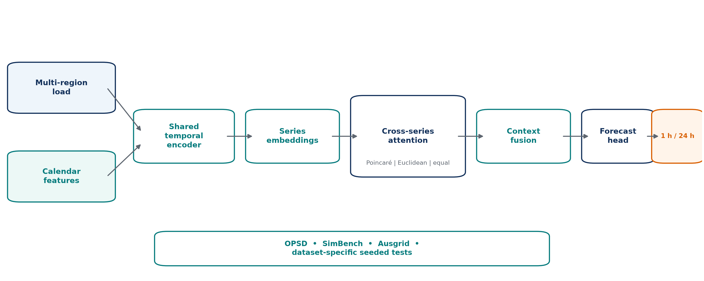
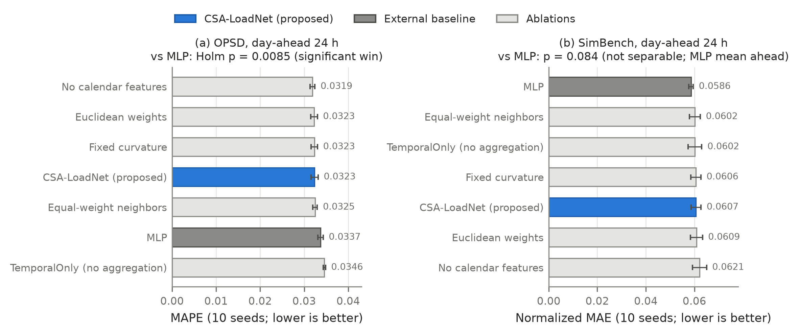
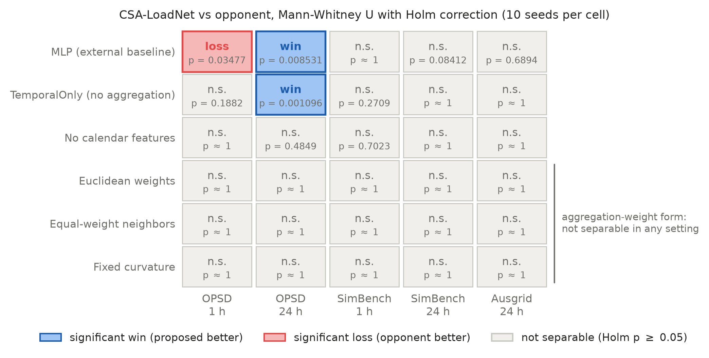
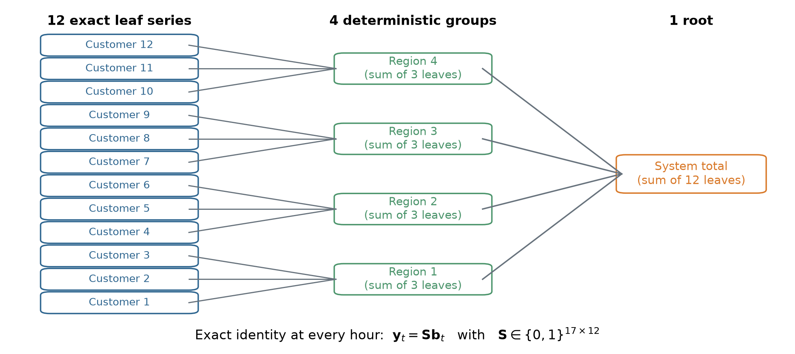
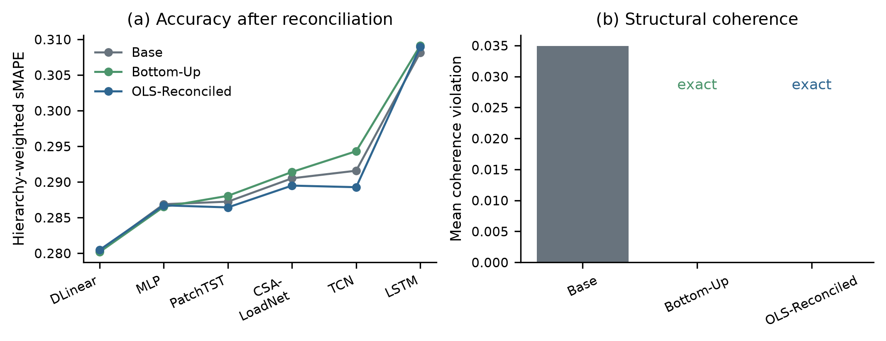
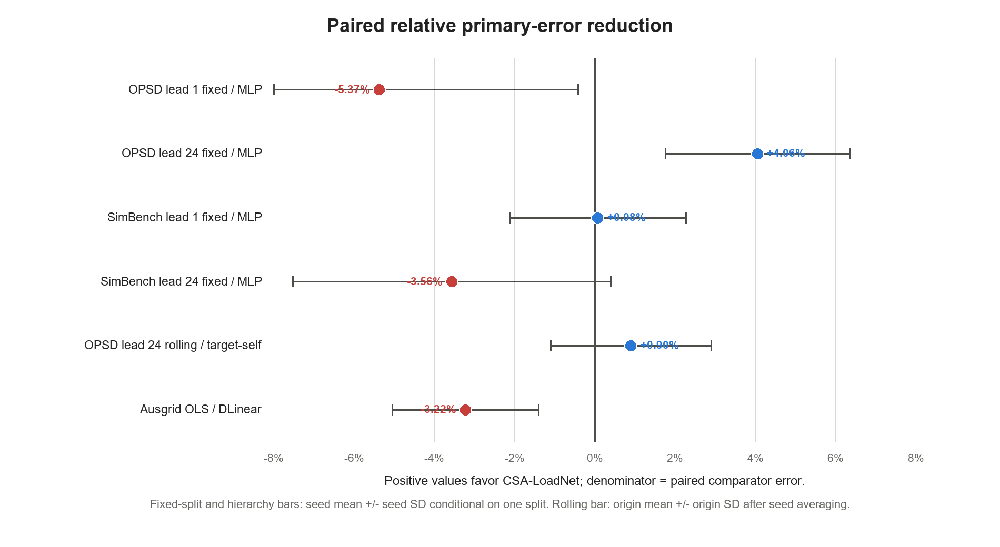
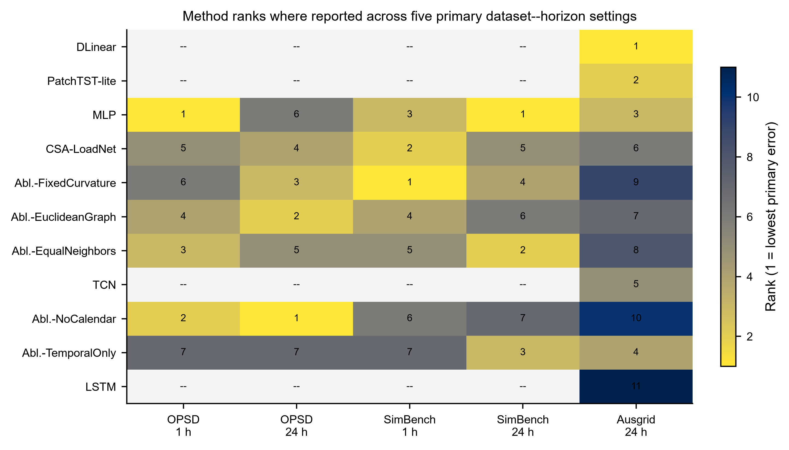
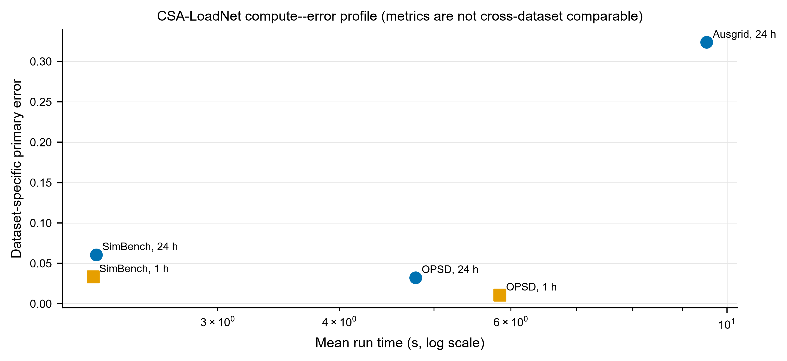

<!-- MDPI Electronics submission draft (Markdown master).
     Paper: mintou_p2 / CSA-LoadNet (route A claim downgrade, v7 evidence).
     Section suggestion: Artificial Intelligence / Computational Intelligence in Electronics.
     All numbers verified against:
       papers/mintou/mintou_p2_hygraph_load_forecasting/evidence/tables/real_opsd_v7_leaderboard.csv
       papers/mintou/mintou_p2_hygraph_load_forecasting/evidence/tables/real_simbench_v7_leaderboard.csv
       papers/mintou/mintou_p2_hygraph_load_forecasting/evidence/tables/real_ausgrid_v7_leaderboard.csv
       papers/mintou/mintou_p2_hygraph_load_forecasting/evidence/tables/real_p2_v7_significance.csv
       papers/mintou/mintou_p2_hygraph_load_forecasting/src/configs/real_hyg_neural_config.json
       papers/mintou/mintou_p2_hygraph_load_forecasting/src/configs/real_p2_v7_config.json
       papers/mintou/mintou_p2_hygraph_load_forecasting/evidence/source/real_{opsd,simbench}_source_profile.csv
     Binding claim boundary: logic/claims.md (Route A). Prohibited: any hyperbolic-geometry
     advantage claim, any 1h-horizon advantage claim, any hierarchical-scenario advantage
     claim, or any downstream dispatch-performance claim.
     Figures live in ./figures/ (print-resolution PNG plus PDF/SVG evidence figures;
     regenerate the core figures with figures/make_figures.py and the exact-
     hierarchy enhancement figures with scripts/mintou/make_above_mean_enhancement_figures.py).
     AUTHOR INPUT REQUIRED markers must be resolved before submission. -->

# Cross-Series Aggregation for 24-Hour-Ahead Point Forecasting of Multi-Region Power Load: A Component-Level Evaluation

**Authors:** Jieyun Zheng (郑洁云), Linyao Zhang (张林垚), Zhanghuang Zhang (张章煌), Zhuolin Chen (陈卓琳), Ying Shi (施莹)
**Affiliations:** Economic and Technological Research Institute of State Grid Fujian Electric Power Co., Ltd., Fuzhou 350000, Fujian, China
**Correspondence:** zjy_0701@163.com (J. Zheng)

## Abstract

Cross-correlated regional load series motivate graph and attention mechanisms, but single-run accuracy tables rarely isolate whether cross-series aggregation itself contributes. CSA-LoadNet combines a shared temporal encoder, cross-series attention, and a compact prediction head for 24-hour-ahead multi-region load point forecasting. Each sample produces one scalar target per series, \(y_{i,t+24}\), rather than a 24-point next-day trajectory. Ten seeded runs under a fixed chronological protocol show that, on the six-country Open Power System Data benchmark, the full model improves mean absolute percentage error over a multilayer perceptron (0.0323 versus 0.0337; Holm-adjusted p = 0.0085) and over the no-aggregation ablation (0.0323 versus 0.0346; p = 0.0011). No difference among Poincaré, Euclidean, and equal-weight parameterizations is resolved at the available precision. We additionally rebuild Ausgrid as an exact 12-leaf, four-region, one-root hierarchy and evaluate unreconciled, bottom-up, top-down, and OLS forecasts with ten seeds for every method. DLinear with bottom-up reconciliation is best (hierarchy-weighted sMAPE 0.2802); CSA-LoadNet with OLS reaches 0.2895, and all three reconciled regimes have zero structural violation. The results locate the resolved OPSD 24-hour-ahead point-forecast gain in cross-series aggregation rather than in a particular weighting geometry, while distinguishing forecast accuracy from hierarchical coherence.

**Keywords:** 24-hour-ahead point forecasting; multi-region load; cross-series attention; ablation study; statistical significance testing; negative results; open power system data

---

## 1. Introduction

Load forecasts made 24 hours in advance can inform operational planning. The experiment reported here addresses the narrower task of predicting one load value at lead 24 for each hourly forecast origin; it does not produce the 24 hourly values of a next-day schedule. In multi-region forecasting, such as countries in an interconnection or profile classes in a distribution network, the individual series share weather regimes, calendar structure, and economic rhythms. This raises a practical question: does cross-series information improve on forecasts constructed independently for each series?

Recent applied studies address this question with increasingly elaborate architectures. Graph convolutions, learned adjacency matrices, spatio-temporal attention stacks, and tensor decompositions have been combined with recurrent or transformer backbones, commonly with the complete architecture leading the reported accuracy table [1–4].

A parallel line of evidence cautions against equating architectural complexity with forecast accuracy. Linear models outperform several transformer variants on standard long-horizon benchmarks [5], statistical methods remain competitive in the M-competitions [6,7], and methodological audits show that some reported gains shrink under stricter protocols [8].

These findings leave a component-level question unresolved. Cross-series models are often evaluated as complete architectures, making it difficult to determine whether aggregation itself helps, whether a particular weighting geometry matters, and whether any gain persists across horizons and aggregation structures.

CSA-LoadNet is a compact neural forecaster in which a shared encoder processes each region's load history and cross-series attention aggregates the other encodings. Attention weights can use Poincaré distance with a fixed or learned inverse-temperature, Euclidean distance with the same scale convention, or equal averaging. The implementation does not make the metric curvature depend on this scale. Each mechanism is an independent switch.

The primary component comparison contains the full model and five single-switch ablations. A targeted ten-seed comparison with MLP is conducted on OPSD and SimBench after a preliminary three-seed architecture screen; the screen is reported separately and is not treated as equal-strength confirmatory evidence. Ausgrid solar-home data provide an exact hierarchical test against ten models under common reconciliation. Pairwise comparisons use two-sided Mann–Whitney U tests with Holm correction within each dataset–horizon block and its primary metric.

The paper makes three contributions:

1. **A component-identifiable cross-series forecaster.** CSA-LoadNet separates the shared temporal encoder, cross-series aggregation, distance weighting, and inverse-temperature choice into independently testable switches. This design distinguishes the value of pooling other series from the value of a particular weighting parameterization.
2. **A multi-setting evaluation of aggregation, horizon, and hierarchy.** Strict temporal splits are used on OPSD and SimBench at 1 h and 24 h horizons. An exact 12-leaf, four-region, one-root Ausgrid hierarchy then compares independent forecasts with bottom-up, top-down, and OLS reconciliation under a common summing structure.
3. **An empirical map of where aggregation helps.** On the OPSD 24-hour-ahead point task, CSA-LoadNet improves over the targeted MLP comparator and the no-aggregation ablation. The tested weight forms remain unresolved, and the method does not lead at OPSD 1 h or on the exact Ausgrid hierarchy. The result identifies a setting-specific aggregation effect while separating forecast accuracy from structural coherence.

The paper is organized as follows. Section 2 reviews the three research threads the study draws on. Section 3 describes the datasets, tasks, and split protocol. Section 4 specifies CSA-LoadNet and its ablation switches. Section 5 details baselines, training, and statistics. Section 6 reports results, Section 7 interprets the setting-dependent component evidence, Section 8 states limitations, and Section 9 concludes.

---

## 2. Related Work

Three threads frame this study: the deep-architecture lineage of short-term load forecasting, cross-series and graph-structured forecasting, and rigorous evaluations that compare complex forecasters with simple baselines. An extended review with full citation context accompanies the released evidence package.

### 2.1. Deep Architectures for Short-Term and 24-Hour-Ahead Load Forecasting

Recurrent networks were among the first deep models to displace classical load forecasters. Building on the LSTM cell [9], Kong et al. demonstrate short-term forecasting at the residential scale [10]. DeepAR extends shared training to large panels of related series [11], an idea reflected in CSA-LoadNet's shared encoder. Temporal convolutional networks offer a lower-cost alternative [12], while the Temporal Fusion Transformer [13] and Informer [14] extend attention-based forecasting.

Applied load forecasting increasingly uses hybrid models, including LSTM–CNN fusion [15], BiLSTM–Transformer combinations [16], decomposition pipelines [17], and LSTM–XGBoost ensembles [18]. Evidence for the added component, however, is commonly limited to one accuracy table. Multi-seed distributions and component-level tests remain uncommon.

### 2.2. Cross-Series and Graph-Structured Load Forecasting

A second thread exploits correlation among regional or nodal series. LSTNet models dependence through joint convolutional–recurrent channels [19]. Graph formulations emerged in traffic forecasting [20], and MTGNN learns adjacency end to end [21]. Power-load examples include LoadSeer [4], GCN–BiLSTM–Adaboost [1], spatio-temporal graph transformers [2], and GCN–Transformer integration [3]. A parallel literature treats multiple series as a hierarchy requiring reconciliation [22,23], with Ausgrid as a common testbed [24].

These graph-based studies propose increasingly elaborate weighting mechanisms. Their comparisons rarely test the selected weighting against equal averaging under an identical seeded protocol. Consequently, the contribution of aggregation can be conflated with that of its parameterization.

### 2.3. Simple Baselines and Honest Evaluation

The third thread concerns evaluation discipline. Sound out-of-sample practice was codified early [25], and temporal leakage from naive cross-validation is well documented [26]. Common metrics also have known failure modes; MAPE becomes unstable near zero loads [27], directly motivating the SimBench and Ausgrid choices. Diebold–Mariano testing [28] made statistical comparison a standard forecasting question. The M competitions [6,7], DLinear [5], and later best-practice guides [8] further emphasize strong simple baselines.

This evaluation literature mainly operates at whole-model granularity. The present study extends it to individual forecaster components, using multiplicity-corrected tests to determine which component claims survive. Section 6.3 applies that logic to the aggregation weight forms.

---

## 3. Datasets, Tasks, and Split Protocol

### 3.1. Datasets and Forecast Tasks

We evaluate on three public datasets chosen to span three distinct multi-series regimes: country-level national loads, distribution-system load profiles, and a customer/region/system hierarchy (Table 1).

**Table 1.** Datasets, series pools, and temporal splits (from `evidence/source/real_opsd_source_profile.csv`, `evidence/source/real_simbench_source_profile.csv`, and `src/configs/real_ausgrid_exact_hierarchy_v8_config.json`).

| Property | OPSD | SimBench | Ausgrid |
|---|---|---|---|
| Source | Open Power System Data, 60 min single-index time series [29] | SimBench complete mixed dataset, `LoadProfile.csv` [30] | Ausgrid solar-home half-hourly data [24] |
| Series pool | 6 country loads: DE, FR, IT, ES, NL, PL | 8 profiles: BL-H, G0-A, G0-M, G1-A, G1-B, G1-C, G2-A, G3-A | Exact 17-node hierarchy: 12 named customer leaves, four sums of postcode-sorted three-leaf groups, and their exact system sum |
| Processed period | 2015-01-01T01:00:00Z to 2018-12-31T01:00:00Z; first 35,000 retained hourly rows | 01.01.2016 00:45 to 30.12.2016 23:45; first 8760 constructed hourly rows | 2010-07 to 2013-06; 26,304 constructed hourly rows |
| Forecast-origin boundary | index 24,500 = 2017-10-19T03:00:00Z | index 6132 = 12.09.2016 13:45 | index 18,412 (70% of 26,304) |
| Point leads | 1 h and 24 h | 1 h and 24 h | 24 h |
| Primary metric | MAPE | normalized MAE | sMAPE |

For every dataset and lead \(h\), a sample is \((X_{t-167:t},y_{i,t+h})\): the model sees the inclusive 168-position history ending at origin index \(t\) and predicts one scalar for target series \(i\). Origins advance by one processed row. Thus the \(h=24\) experiment is **24-hour-ahead point forecasting**, not direct or recursive prediction of a 24-value next-day trajectory. The forecast-origin boundary is \(b=\lfloor0.7n\rfloor\): training origins satisfy \(168\leq t<b\), test origins satisfy \(b\leq t<n-h\), training labels end at \(b+h-1\), and test labels start at \(b+h\). Evaluation targets therefore do not overlap, although the history at the first test origins necessarily contains observations from the pre-target period.

**OPSD cleaning and time contract.** The parser reads `utc_timestamp` and the six named `*_load_actual_entsoe_transparency` columns. It retains a row only when all six cells are nonempty and parse as floating-point values, drops the entire row otherwise, and stops after 35,000 retained rows; it performs no interpolation or imputation. The retained-row count is recorded, but the number and location of discarded source rows are not, and hourly continuity is not revalidated after filtering. Timestamps carry `Z` and remain in UTC, so no duplicated or missing local daylight-saving hour is introduced and no country-local conversion is applied.

**SimBench cleaning, aggregation, and time contract.** The parser selects the first eight header fields ending in `_pload`, skips a 15-minute source row if any selected value fails numeric parsing, and takes the unweighted arithmetic mean of each successive four retained rows. The constructed hour is labeled by the fourth source row (for example, the first label is `00:45`); values are means, not energy sums. No interpolation is applied, and a discarded quarter-hour can cause a four-valid-row block to span a source-time gap. The source labels have no timezone field in the inspected profile or parser. They are kept as naive labels, with no daylight-saving conversion, and processing stops after 8760 constructed hours.

**Ausgrid cleaning, aggregation, and time contract.** Only `GC` rows from the three annual files are used. Each pair of adjacent half-hour cells is summed to one hourly value; an empty half-hour cell is replaced by zero, whereas a malformed or short daily row is skipped. Dates are parsed in one of three declared day-month-year formats and checked for one-day contiguity. The processor creates the naive label `YYYY-MM-DDTHH:00` for slot pair \((2H,2H+1)\); it records no timezone and forces 24 constructed hourly slots per date, so no daylight-saving repeated or skipped hour is represented. Customers 134, 104, 255, 141, 228, 147, 55, 131, 21, 82, 58, and 109 are the leaves. `region1` sums {82, 147, 255}, `region2` sums {228, 109, 131}, `region3` sums {134, 141, 55}, `region4` sums {21, 58, 104}, and `system_total` sums all 12 leaves. These are deterministic postcode-sorted groups, not claims that every leaf in a group has the same postcode.

The Ausgrid structural filter is not train-only: the code first keeps the 299 customers having the maximum observed day count over the full three-year record and then selects the 12 highest total-energy customers using that full record. This uses future-period availability and energy for leaf selection. It does not expose test targets to model fitting or reconciliation, but it can favor continuously observed, high-consumption leaves and is retained as a data-visibility limitation. No result here is presented as evidence from a train-only leaf-selection design.

### 3.2. Primary Metrics and Why They Differ per Dataset

The primary metric is chosen per dataset to avoid known metric pathologies [27]. For a fixed dataset–horizon test set of $N$ targets, the implementation computes

$$
\operatorname{MAPE}=\frac{1}{N}\sum_{j=1}^{N}\frac{|y_j-\hat y_j|}{\max(\epsilon,|y_j|)},
$$

$$
\operatorname{nMAE}=\frac{N^{-1}\sum_{j=1}^{N}|y_j-\hat y_j|}
{\max\!\left(\epsilon,\max_j y_j-\min_j y_j\right)},
$$

and

$$
\operatorname{sMAPE}=\frac{1}{N}\sum_{j=1}^{N}
\frac{2|y_j-\hat y_j|}{\max(\epsilon,|y_j|+|\hat y_j|)},
$$

with $\epsilon=10^{-6}$. The normalization range in nMAE is computed once from the common test targets; it is an evaluation scale and is identical for all methods, not a training input. Country-level OPSD loads are strictly positive and far from zero, so MAPE is interpretable there. SimBench profile values approach zero at many timestamps, where MAPE denominators become unstable; SimBench methods are therefore ranked by nMAE and MAPE is retained descriptively.

For the exact Ausgrid hierarchy, let $\bar s_L$, $\bar s_R$, and $s_T$ be the mean node sMAPE over the 12 leaves, the four regions, and the root. The predeclared primary metric gives each level equal weight rather than letting 12 leaves dominate:

$$
\operatorname{HWSMAPE}=\frac{\bar s_L+\bar s_R+s_T}{3}.
$$

With bottom-level forecast matrix $\hat{B}$ and summing matrix $S\in\{0,1\}^{17\times12}$, structural coherence requires $\hat{Y}=S\hat{B}$. We report the scale-normalized violation

$$
C(\hat Y)=\frac{1}{5T}\sum_{i=13}^{17}\sum_{t=1}^{T}
\frac{|\hat y_{it}-(S\hat B)_{it}|}{\max(\epsilon,T^{-1}\sum_t|y_{it}|)}.
$$

Bottom-up, top-down, and OLS projection reconciliation are evaluated separately from forecasting accuracy. All significance tests in Section 6 use the primary metric of the respective dataset; secondary metrics, including MAE, RMSE, level-specific sMAPE, peak-load error, and coherence violation, are preserved in the evidence tables.

### 3.3. Temporal Protocol and Train-Only Operations

Forecasting comparisons are sensitive to temporal leakage [8,26]. The sample origins are not shuffled across the train/test boundary. Per-series z-normalization means and sample standard deviations (`torch.std` with correction 1, clamped below at $10^{-6}$) are computed from raw values at indices \([0,b)\); this pre-test segment includes the later validation portion and is therefore a **training-segment**, not fit-subset, transformation. The final 15% of strided training origins by time is used to choose the lowest-validation-loss checkpoint. All test origins are evaluated without stride.

The cyclic covariates are derived from array position rather than parsed civil time: `hour = (t+h) mod 24` and `day-of-week = floor((t+h)/24) mod 7`, each encoded by sine and cosine. They should therefore be read as sequence-phase features. The implementation neither localizes timestamps nor supplies holidays or daylight-saving indicators. For reconciliation, only the top-down leaf proportions are fitted, using leaf energy at indices \([0,b)\); bottom-up uses no fitted proportions and OLS depends only on the fixed summing matrix. Dataset row-validity filtering occurs before the split, and the full-record Ausgrid structural selection is the exception disclosed above. These distinctions replace a blanket leakage-free claim.

---

## 4. CSA-LoadNet

Figure 1 gives the complete forecasting path. Load histories enter the shared temporal encoder; target and context series are related only inside the cross-series attention block; and the target encoding, context vector, and sequence-phase features enter the prediction head. The three weight forms shown under the attention block are controlled alternatives evaluated with the same downstream network.

**Figure 1.** CSA-LoadNet data and model flow. The lower strip identifies independent evaluation datasets; it is not an input path. Poincare, Euclidean, and equal-weight attention share the same encoder, fusion, head, and training protocol.

CSA-LoadNet (Cross-Series Attention Load Forecasting Network) is intentionally small: a shared temporal encoder, one cross-series attention block, and a compact prediction head. The design goal is not architectural novelty for its own sake but a testbed in which every mechanism is an independent switch, so that the component analysis of Section 6.2–6.3 attributes effects cleanly.

**Formal definitions.** For series \(i\), the 168-position history is standardized with statistics from the pre-test training segment \([0,b)\), including the validation portion,

$$
\tilde x_{i,t-\ell}=\frac{x_{i,t-\ell}-\mu_i^{\mathrm{train}}}{\max(\sigma_i^{\mathrm{train}},10^{-6})},
\qquad \ell=0,\ldots,167.
$$

The shared two-layer encoder is

$$
h_i=W_2\,\phi(W_1\tilde X_{i,t}+b_1)+b_2,\qquad
W_1\in\mathbb R^{96\times168},\; W_2\in\mathbb R^{48\times96},
$$

where \(\phi\) is ReLU. When Poincaré weighting is enabled, raw embeddings are projected inside a radius-0.95 unit ball and their fixed-curvature unit-ball distance is

$$
\bar e_i=0.95\,\frac{\tanh(\|e_i\|_2)}{\max(\|e_i\|_2,\epsilon)}e_i,\qquad
d_{\mathbb B}(\bar e_i,\bar e_j)=
\operatorname{arcosh}\!\left(1+
2\frac{\|\bar e_i-\bar e_j\|_2^2}
{(1-\|\bar e_i\|_2^2)(1-\|\bar e_j\|_2^2)}\right).
$$

The Euclidean control replaces \(d_{\mathbb B}\) by \(\|\bar e_i-\bar e_j\|_2\), and the equal-neighbor control fixes \(\alpha_{ij}=1/(m-1)\). For either learned-distance control, the per-target score scale is \(\tau_i=\operatorname{softplus}(\kappa_i)+0.1\) and \(\alpha_{ij}=\operatorname{softmax}_{j\ne i}[-\tau_i d(\bar e_i,\bar e_j)]\). Because \(\tau_i\) multiplies a metric whose curvature is otherwise fixed, it is an inverse-temperature or distance-scale parameter, not curvature. For any weight form, context fusion is

$$
g_i=\sum_{j\ne i}\alpha_{ij}W_vh_j,\qquad
u_i=[h_i\|g_i\|\operatorname{cal}(t+h)] .
$$

The prediction head and empirical training risk are

$$
\hat y_{i,t+h}=w_o^\top\phi(W_ou_i+b_o)+b_y,
$$

$$
\mathcal L_h(\Theta)=\frac{1}{|\mathcal T_{\mathrm{fit}}|m}
\sum_{t\in\mathcal T_{\mathrm{fit}}}\sum_{i=1}^{m}
\left(\tilde y_{i,t+h}-\hat y_{i,t+h}\right)^2 .
$$

With \(m\) series, embedding width \(d_e\), and temporal width \(d_h\), the cross-series block costs \(O(m^2d_e+m^2d_h)\) per batch item; the TemporalOnly ablation removes the quadratic terms. This complexity statement concerns the implemented dense pool, not sparse graph attention.

### 4.1. Shared Temporal Encoder

For each series $i$ in the pool, the past 168 processed positions of per-series z-normalized load are passed through a shared multilayer perceptron $168 \to 96 \to 48$, yielding a temporal encoding $h_i \in \mathbb{R}^{48}$. Sharing one encoder across all series follows the cross-learning principle established by panel forecasters such as DeepAR [11]: every series' history contributes gradient signal to the same temporal features. The evaluated pool sizes are 6, 8, and 17 series.

### 4.2. Cross-Series Attention Aggregation

Each series additionally owns a learned embedding $e_i \in \mathbb{R}^{8}$. To forecast target series $i$, the module computes attention weights over the other series in the pool,

$$
\alpha_{ij} = \frac{\exp\!\big(-\tau_i \, d(\bar e_i, \bar e_j)\big)}{\sum_{k \neq i} \exp\!\big(-\tau_i \, d(\bar e_i, \bar e_k)\big)},
$$

and aggregates their value-mapped temporal encodings into a context vector $g_i = \sum_{j \neq i} \alpha_{ij} \, W_v h_j$. In the default configuration, $d(\cdot,\cdot)$ is the fixed unit-ball Poincaré distance and $\tau_i = \mathrm{softplus}(\kappa_i) + 0.1$ is a per-target learnable inverse-temperature. The code variable and archived ablation label use `kappa` and `FixedCurvature`, respectively, but no curvature-dependent metric is implemented. The Poincaré parameterization is one interchangeable option for producing $\alpha_{ij}$. Section 6.3 shows that it is statistically inseparable from Euclidean-distance and equal weights; accordingly, no geometric property is claimed as a contribution. The component under test is the aggregation step itself: whether $g_i$ should exist at all.

### 4.3. Prediction Head and Sequence-Phase Features

The prediction head concatenates the target encoding, aggregated context, and the four sequence-phase covariates defined in Section 3.3. A hidden layer of width 64 maps this vector to the scalar h-step-ahead prediction: $\hat{y}_{i,t+h} = \mathrm{MLP}_{64}\big([\,h_i \,\|\, g_i \,\|\, \mathrm{phase}(t+h)\,]\big)$. The exact instantiated parameter counts are reported in Section 5.1; the proposed configuration is close to, but not equal to, the MLP baseline's capacity.

### 4.4. Ablation Switches

Five single-switch variants isolate each mechanism (configuration keys from `src/configs/real_hyg_neural_config.json`):

- **TemporalOnly** (`no_graph`): removes the aggregation module entirely; the head sees only $h_i$ and the four sequence-phase features. This is the switch that tests whether cross-series aggregation contributes at all.
- **Euclidean weights** (`euclidean`): replaces the Poincaré distance with Euclidean distance in the same weight formula.
- **Equal-weight neighbors** (`equal_neighbors`): replaces learned attention with uniform averaging over the pool.
- **Fixed distance scale** (`fixed_curvature`, historical key): sets $\tau_i=1$ instead of learning it; it does not change metric curvature.
- **No sequence-phase features** (`no_calendar`, historical key): removes the four cyclic index features from the head.

The middle three switches jointly probe the *form* of the aggregation weights; TemporalOnly probes the *existence* of aggregation; the historical NoCalendar switch probes the orthogonal sequence-phase channel.

### 4.5. Weighting Variants and Artifact Labels

The implementation exposes Poincaré, Euclidean, equal-weight, fixed-scale, and learnable-scale weighting variants through the ablation switches defined above. The empirical question is whether cross-series aggregation contributes and, separately, whether any tested weighting form is distinguishable. Archived files retain two historical labels: `HyG-LoadFormer (neural)` maps one-to-one to CSA-LoadNet, and `Ablation-FixedCurvature (neural)` maps to the fixed-distance-scale control $\tau_i=1$. These labels document provenance and are not descriptions of a curvature-dependent metric.

---

## 5. Experimental Setup

### 5.1. Methods Compared

Table 2 lists the implemented capacities. Counts are exact source-level arithmetic over instantiated tensors, including the embedding, scale, and value-map tensors that remain instantiated in TemporalOnly even though its forward pass does not use aggregation. The five external baselines span MLP, LSTM [9,10], TCN [12], DLinear [5], and a lightweight two-layer patch transformer. All models consume the same 168-position normalized histories, split boundaries, and full test origins; they do not have identical parameter counts or epoch budgets.

**Table 2.** Methods and roles.

| Method | Role and implemented capacity | Instantiated parameters for pools $m=6/8/17$ | Max epochs (OPSD--SimBench / Ausgrid) |
|---|---|---|---|
| CSA-LoadNet | shared 168--96--48 encoder; $m\times8$ embeddings; $m$ scales; 48--48 value map; 100--64--1 head | 29,815 / 29,833 / 29,914 | 15 / 10 |
| Euclidean weights; Equal-weight neighbors; Fixed distance scale | same modules as CSA-LoadNet; one weight-form switch | 29,815 / 29,833 / 29,914 | 15 / 10 |
| TemporalOnly | aggregation omitted from forward pass; 52--64--1 head; unused aggregation tensors remain instantiated | 26,743 / 26,761 / 26,842 | 15 / 10 |
| No sequence-phase features | aggregation retained; 96--64--1 head | 29,559 / 29,577 / 29,658 | 15 / 10 |
| MLP | 172--128--64--1; targeted after the preliminary screen | 30,465 | 20 / 20 |
| LSTM | one layer, scalar input, hidden width 48; 52--1 head | 9,845 | 6 / 6 |
| TCN | seven width-32 causal blocks, kernel 3, dilations 1--64; 36--1 head | 18,853 | 10 / 10 |
| DLinear | moving-average kernel 25; separate 168--1 trend and seasonal maps | 338 | 20 / 20 |
| PatchTST-lite | patch 16, stride 8, 20 patches; width 64, four heads, feed-forward width 128, two encoder layers | 70,597 | 8 / 8 |

### 5.2. Training Protocol and Hyperparameter Disclosure

Table 3 discloses the recorded training settings. Architectures are fixed across datasets in the inspected source. The targeted ten-seed MLP comparison was selected after a preliminary three-seed architecture screen on the same fixed test trajectory, so it is not represented as comparator selection made without test visibility.

**Table 3.** Full hyperparameter disclosure (from `src/configs/real_hyg_neural_config.json` and `src/configs/real_p2_v7_config.json`).

| Setting | Value |
|---|---|
| Lookback window | 168 h |
| Temporal encoder | shared MLP 168 → 96 → 48 |
| Series embedding dimension | 8 |
| Inverse-temperature / distance scale | $\tau_i=\mathrm{softplus}(\kappa_i) + 0.1$, learnable per target; the historical FixedCurvature control sets $\tau_i=1$ |
| Head | concat[target encoding, aggregated context, four sequence-phase values] → 64 → 1 |
| Optimizer / loss | Adam, lr $10^{-3}$ / MSE on per-series z-normalized targets |
| Batch size | 512 |
| Epochs | model-specific maxima in Table 2; every epoch is run and the lowest-validation-loss checkpoint is restored |
| Training-sample stride | OPSD/SimBench: 3 for every model. Ausgrid: 6 for CSA variants, 3 for external baselines. Test origins are never strided |
| Checkpoint selection | validation = final 15% of strided training origins by time; best-validation state restored after the fixed epoch budget |
| Seeds (decision set) | 10: {11, 23, 47, 59, 71, 83, 97, 109, 127, 139} |
| Seeds (exact Ausgrid hierarchy) | same 10 seeds for every proposed, ablation, and baseline model |
| Reconciliation | independent base forecasts, Bottom-Up, training-proportion Top-Down, and unweighted OLS projection; fully defined in Section 6.4 |
| Hardware / framework | CPU for OPSD/SimBench; RTX 3090 with PyTorch 2.13.0+cu130 for the v8 Ausgrid rerun |

**Comparability statement.** Every model shares the origin split, training-segment normalization, four sequence-phase inputs where the architecture uses them, Adam learning rate, MSE objective, batch size, seed list for the decision comparisons, and complete test origins. Capacity and epoch budgets differ as disclosed in Table 2. On OPSD and SimBench every trained model uses stride 3. On Ausgrid all eleven models use the same GPU execution path and ten seeds, but CSA variants use stride 6 while external baselines use stride 3. The v8 CSV `train_samples` field writes the stride-6 count for every method even though the baseline routine internally retains stride 3; it must not be used to claim equal training exposure. Runtime values are interpreted only within datasets. This asymmetry weakens causal attribution of the Ausgrid model ranking but does not reverse the reported adverse point estimates.

### 5.3. Statistical Methodology

The primary model set, CSA-LoadNet, its five ablations, and MLP, was run for ten seeds per dataset/horizon on OPSD and SimBench. Each block contains six proposed-versus-opponent comparisons. On the corrected Ausgrid hierarchy, all eleven models use the same ten seeds under four reconciliation regimes. Primary OLS model tests use two declared five-comparison role families. A paired sensitivity analysis contains all ten opponents. The prespecified primary analysis uses two-sided Mann--Whitney U tests with Holm correction. The complete table reports rank-biserial effects and pointwise, multiplicity-unadjusted 5000-resample mean-difference intervals (`real_p2_primary_inference_v2.csv`). Exact paired sign-flip tests use the common seeds as a sensitivity analysis; Holm-adjusted p-values determine significance in each declared family.

For reproducibility, let $e_{a,s}$ be the primary error of method $a$ at seed $s$. The reported mean and dispersion are

$$
\bar e_a=\frac{1}{n_a}\sum_{s=1}^{n_a}e_{a,s},\qquad
s_a=\sqrt{\frac{1}{n_a-1}\sum_{s=1}^{n_a}(e_{a,s}-\bar e_a)^2}.
$$

For a proposed--baseline comparison with rank sum $R_1$, the Mann--Whitney statistic is

$$
U_1=n_1n_2+\frac{n_1(n_1+1)}{2}-R_1,\qquad
U=\min(U_1,n_1n_2-U_1).
$$

If $p_{(1)}\leq\cdots\leq p_{(m)}$ are the ordered raw p-values within one dataset--horizon family, the monotone Holm-adjusted values used in Figure 3 are

$$
p^{\mathrm{Holm}}_{(i)}=
\max_{1\leq j\leq i}\min\!\left(1,(m-j+1)p_{(j)}\right).
$$

The seed-paired descriptive effect in Figure 6 is computed only when the same seeds exist for both methods,

$$
\Delta_s=100\,\frac{e_{b,s}-e_{a,s}}{e_{b,s}},
$$

so positive values favor CSA-LoadNet. This percentage is an effect display, not the test statistic. No pair with unequal seed support is promoted to a paired inferential comparison.

---

## 6. Results

### 6.1. Main 24-Hour-Ahead Point Result on OPSD

Figure 2a and Table 4 present the OPSD 24 h leaderboard over ten seeds. CSA-LoadNet attains mean MAPE 0.032345 (std 0.000817), compared with 0.033715 (std 0.000587) for MLP, a 4.1% relative improvement that is Holm-significant (p = 0.0085). MLP was the strongest observed external model in the preliminary three-seed OPSD screen; the exact-hierarchy Ausgrid study yields a different ordering led by DLinear. The no-aggregation TemporalOnly ablation reaches 0.034591, 6.5% above the full model (p = 0.0011, U = 0). In the paired sensitivity analysis, CSA-minus-MLP MAPE is -0.001371 (pointwise 95% bootstrap CI [-0.001826, -0.000927]) and CSA-minus-TemporalOnly is -0.002246 ([-0.002813, -0.001741]); both paired Holm p = 0.0117.

**Table 4.** OPSD 24-hour-ahead point-forecast leaderboard: mean ± std MAPE over 10 seeds, with the Holm-adjusted p of the comparison against CSA-LoadNet (from `real_opsd_v7_leaderboard.csv` and `real_p2_v7_significance.csv`).

| Method | Mean MAPE | Std | Holm p vs. proposed | Verdict |
|---|---|---|---|---|
| No sequence-phase features | 0.031873 | 0.000563 | 0.485 | not separable |
| Euclidean weights | 0.032257 | 0.000738 | 1 | not separable |
| Fixed distance scale | 0.032302 | 0.000717 | 1 | not separable |
| **CSA-LoadNet (proposed)** | **0.032345** | **0.000817** | — | — |
| Equal-weight neighbors | 0.032469 | 0.000506 | 1 | not separable |
| MLP | 0.033715 | 0.000587 | 0.0085 | **significant win** |
| TemporalOnly (no aggregation) | 0.034591 | 0.000251 | 0.0011 | **significant win** |

**Figure 2.** The 24-hour-ahead point-forecast leaderboards on (**a**) OPSD (MAPE) and (**b**) SimBench (normalized MAE), mean ± std over 10 seeds. On OPSD the proposed model separates significantly from the MLP baseline and the no-aggregation ablation; on SimBench no separation from the MLP is established and the MLP mean is ahead.

Two features of Table 4 constrain interpretation. The no-sequence-phase variant (historical label NoCalendar) has the best nominal mean at this horizon (0.031873), but its difference from the full model is not significant ($p=0.485$) and does not recur significantly elsewhere. The result leaves the sequence-phase contribution unresolved. The three weight-form ablations also remain within ±0.4% of the full model, foreshadowing Section 6.3.

For context, in the preliminary 3-seed v6 screen on the same OPSD 24 h split, TCN, PatchTST-lite, DLinear, and LSTM trail MLP (MAPE 0.0361, 0.0378, 0.0408, and 0.0527, respectively, versus 0.0339). This screen motivated selecting MLP for the ten-seed decision set, but its four-method ordering is supporting evidence rather than equal-strength confirmatory inference.

### 6.2. Component Significance Across All Settings

Figure 3 condenses the complete decision analysis: every proposed-versus-opponent comparison in all five dataset/horizon settings, with its Holm-adjusted p-value and verdict.

**Figure 3.** Component-level significance summary (Mann–Whitney U, Holm-corrected, 10 seeds per cell). Exactly two non-hierarchical comparisons are significant wins--OPSD 24 h against MLP and against the no-aggregation ablation--and OPSD 1 h contains a significant loss to MLP. The corrected hierarchy and its DLinear loss are reported separately in Figures 4--5. The entire weight-form block remains inseparable in every setting.

The matrix summarizes the paper's central result. At OPSD 24 h, both the external comparison and the aggregation-existence comparison separate significantly. At the 1 h settings, TemporalOnly is nominally worse than the full model but the differences are not significant (OPSD, p = 0.188; SimBench, p = 0.271). The aggregation signal is also absent at SimBench 24 h and Ausgrid (p = 1 in both), with TemporalOnly nominally ahead at SimBench 24 h. No weight-form comparison approaches significance; every Holm-adjusted p in that comparison family equals 1.

### 6.3. Aggregation Helps, but the Tested Weight Forms Do Not Separate

Cross-series aggregation and aggregation-weight form produce different empirical conclusions. The no-aggregation comparison separates on OPSD at 24 h, whereas the ten-seed comparisons among Poincaré, Euclidean, equal-weight, and distance-scale variants do not resolve a difference:

- **Poincaré vs. Euclidean distance weights:** not separable in any of the five settings (Holm p = 1 in all five; largest observed mean gap below 0.5% relative).
- **Poincaré vs. equal-weight averaging:** not separable in any setting (Holm p = 1 in all five). Learned attention coefficients, whatever their geometry, do not demonstrably beat uniform pooling of the neighbor encodings at these pool sizes.
- **Learnable vs. fixed inverse-temperature:** not separable in any setting (Holm p = 1 in all five). The learned distance scale has no measurable effect under the reported comparisons; this is not a curvature comparison.

Together with the TemporalOnly separation in Section 6.1, the evidence supports a narrower attribution: cross-series aggregation is useful in the OPSD 24-hour-ahead point setting, whereas no difference among the tested weighting schemes is resolved at the available statistical precision. Equal-weight neighbor averaging is therefore a simpler empirically competitive option, not a demonstrated equivalent of the learned weight forms. For graph-based load forecasting, the result shows why single-run point estimates are insufficient for component attribution. For this paper, it determines the claim structure: the Poincaré embedding is treated as an implementation option, and the contribution centers on the aggregation-existence comparison that survived testing.

The weight-form result is specific to the tested pools, horizons, and training budget. Larger pools, sparser cross-correlations, or genuinely tree-structured populations might separate the variants (Section 8). The protocol detected the observed 4.1% OPSD MAPE difference, but no weighting-form difference was resolved after multiplicity correction. Because an equivalence margin was not specified, the simpler variants are empirically competitive rather than proven equivalent.

### 6.4. The Hierarchical Setting: Where the Method Loses

The Ausgrid experiment uses an exact hierarchy built from the 12 selected complete customers: four deterministic postcode-sorted groups each sum three leaves, and the root sums all 12. Figure 4 makes the 17-by-12 summing structure explicit; the identity $Y=SB$ holds at every hour. Earlier non-exact aggregates are excluded from every result reported here.

**Figure 4.** Corrected Ausgrid hierarchy. The four intermediate series and the system total are deterministic sums of the same 12 leaves used by every forecasting method; no outside customer enters an aggregate.

Each trained model first produces an unreconciled matrix $\hat Y^{\mathrm{base}}\in\mathbb R^{17\times T}$ in the node order 12 leaves, `region1`--`region4`, and `system_total`. Let $S\in\{0,1\}^{17\times12}$ be the fixed summing matrix shown in Figure 4. Bottom-up discards the five aggregate-node base forecasts and returns $\hat Y^{\mathrm{BU}}=S\hat Y^{\mathrm{base}}_{1:12,:}$. Top-down computes leaf proportions $q_\ell=\sum_{t<b}y_{\ell t}/\sum_{r=1}^{12}\sum_{t<b}y_{rt}$ from the pre-test training segment, allocates the base root forecast as $q\hat y^{\mathrm{base}}_{17,:}$, and returns $\hat Y^{\mathrm{TD}}=S(q\hat y^{\mathrm{base}}_{17,:})$. OLS applies the unweighted, covariance-free projection $P=S(S^{\mathsf T}S)^{-1}S^{\mathsf T}$ independently at every forecasted timestamp: $\hat Y^{\mathrm{OLS}}=P\hat Y^{\mathrm{base}}$. No post-reconciliation clipping or refitting is implemented. Bottom-up, top-down, and OLS are all exactly coherent by construction; only top-down estimates proportions, and it uses no test targets.

The mean base-forecast coherence violation across the displayed methods is 0.035. Accuracy and coherence are not interchangeable. DLinear with bottom-up reconciliation is best at hierarchy-weighted sMAPE 0.28017, followed by DLinear with OLS at 0.28047. CSA-LoadNet with OLS reaches 0.28949. Under the same OLS transformation, CSA-LoadNet significantly loses to DLinear (Holm $p=0.000985$), significantly beats LSTM ($p=0.000913$), and is unresolved against MLP, TCN, and PatchTST-lite. The paired CSA-minus-DLinear difference is 0.00902 (pointwise 95% bootstrap CI [0.00606, 0.01215], paired Holm p = 0.0195). The Ausgrid capacity, epoch, and stride asymmetries in Section 5.2 qualify this model-ranking comparison.

**Figure 5.** (a) Hierarchy-weighted sMAPE under independent, bottom-up, and OLS-reconciled forecasts (ten seeds per model). (b) Mean structural violation. Bottom-up and OLS enforce exact coherence, but DLinear remains more accurate than CSA-LoadNet; reconciliation does not rescue the architectural ranking.

The corrected result strengthens the boundary claim rather than the method claim. Cross-series aggregation helps on the six-country OPSD pool at 24 h, where national loads supply mutually informative context. On the exact customer hierarchy, a strong linear decomposition with deterministic aggregation is better. The experiment therefore supports using coherence constraints where accounting identities matter and reserving CSA-LoadNet for settings in which cross-series context, rather than hierarchy alone, carries predictive information.

### 6.5. Short-Horizon and SimBench Boundaries

The remaining cells of Figure 3 complete the boundary map. On OPSD 1 h, the MLP significantly beats CSA-LoadNet (0.010155 versus 0.010689 mean MAPE; primary Holm $p=0.0348$). The supplementary paired sensitivity agrees: CSA-minus-MLP MAPE is 0.000534 (pointwise 95% CI [0.000248, 0.000826], paired Holm $p=0.0469$). At this lead time, recent target history may dominate the aggregation context. On SimBench, neither horizon separates from the MLP. The proposed mean is only trivially lower at 1 h (0.033349 versus 0.033385 nMAE; $p=1$), whereas the MLP mean is lower at 24 h (0.058591 versus 0.060662; $p=0.084$). We therefore make no SimBench superiority or parity claim.

Figure 6 expresses the five primary comparisons as seed-paired relative error changes. Positive values favor CSA-LoadNet. Only OPSD 24 h combines a positive mean effect with corrected significance. OPSD 1 h and the corrected Ausgrid hierarchy favor their strongest named comparators; SimBench 1 h is effectively zero, and SimBench 24 h trends against the proposed model. This cross-dataset view prevents the single favorable cell from being mistaken for general superiority.

**Figure 6.** Seed-paired relative reduction in each dataset's primary error for CSA-LoadNet against the named comparator. Bars show the mean and error bars show the standard deviation across matched seeds; positive values favor CSA-LoadNet. The historical evidence label `HyG-LoadFormer (neural)` maps one-to-one to CSA-LoadNet. Inferential decisions use the Holm-adjusted tests and the corrected hierarchy table, not visual overlap.

### 6.6. Cross-Setting Rank and Compute Profiles

Figure 7 replaces selective pairwise reading with a complete current rank profile. Every available model is ranked by the prespecified primary metric in each of the five dataset--horizon settings; the Ausgrid column uses the exact hierarchy under common OLS reconciliation. CSA-LoadNet ranks in the middle of the OPSD 1 h field, first on OPSD 24 h, near the front but unresolved against several methods on SimBench, and below DLinear on Ausgrid. Missing cells indicate methods not run in a setting and are not imputed. We do not form a cross-dataset average rank because MAPE, normalized MAE, and hierarchy-weighted sMAPE answer different scale questions.

**Figure 7.** Ranks by dataset-specific primary error. Rank 1 is the lowest mean error within a column. Dashes mark methods absent from an experiment. Non-hierarchical cells use the ten-seed OPSD and SimBench leaderboards; the Ausgrid column uses the exact hierarchy with OLS reconciliation.

The run-time profile in Figure 8 supplies the computational counterpart. The same compact architecture is inexpensive on OPSD and SimBench and slower on the 17-series Ausgrid hierarchy. The y-axis intentionally retains each dataset's primary metric, so vertical locations must not be compared across datasets; the panel asks whether a reported accuracy cell is accompanied by an exceptional computational burden, not whether the error scales are interchangeable.

**Figure 8.** Mean wall-clock time and dataset-specific primary error for CSA-LoadNet at each evaluated horizon. The x-axis is logarithmic. Timings are interpreted within dataset and execution environment, not across CPU and GPU blocks.

**Table 5.** Stability summary across the complete primary-metric comparisons. "Supported" requires Holm-adjusted (p<0.05); a nominal mean ordering without corrected separation is not counted.

| Setting | Proposed mean position | Corrected decision against strongest named baseline | Interpretation |
|---|---|---|---|
| OPSD, 1 h | Behind MLP | Significant loss | Short-horizon boundary |
| OPSD, 24 h | Ahead of MLP | Significant win | Supported 24-hour-ahead point result |
| SimBench, 1 h | Approximately tied | Not separable | No superiority claim |
| SimBench, 24 h | Behind MLP | Not separable | Adverse nominal trend |
| Ausgrid, 24 h | Behind DLinear under OLS | Significant loss | Coherence achieved; no accuracy-superiority claim |

The table and rank profile locate the observed effect. Cross-series aggregation is supported in the OPSD 24-hour-ahead point setting, accompanied by two adverse settings and two unresolved settings. The tested attention parameterizations do not extend this result to the other settings.

---

## 7. Discussion

### 7.1. Aggregation, Weighting, and Hierarchical Coherence

The ten-seed component comparison supports cross-series aggregation over the no-aggregation control on OPSD at 24 h. The targeted MLP comparison separates in the same setting. By contrast, the analysis does not distinguish Poincaré, Euclidean, equal-weight, or inverse-temperature variants, so the observed benefit concerns aggregation rather than the parameterization used to weight neighbors. The preliminary three-seed architecture screen explains the choice of MLP for confirmation but does not carry the same evidential weight and creates comparator-selection visibility that a future preregistered study should avoid.

The exact Ausgrid experiment answers a different question. It constructs all four regional aggregates and the root from the same 12 leaves and applies common reconciliation transformations to every method. Bottom-up and OLS reconciliation remove structural violations, yet DLinear remains more accurate than CSA-LoadNet. Coherence is therefore a constraint that can be enforced after forecasting; it is not evidence that the underlying forecaster is accurate.

Taken together, the experiments locate rather than generalize the benefit. Pool context is useful in the OPSD 24-hour-ahead point setting, whereas additional weighting complexity is unsupported at the evaluated pool sizes. Multiple split positions and independently repeated weather years would test whether this pattern persists beyond the selected split.

### 7.2. Why Aggregation Helps at 24 h and Not at 1 h

The horizon asymmetry in Figure 3 admits a simple reading. At one-hour lead, each country's own most recent observations may carry most recoverable information, and capacity spent on pool context can compete with capacity spent on the target's own dynamics. At a 24-hour lead, the terminal observation is 24 positions behind the scalar target; synchronized daily and weekly shapes are plausible information sources for a pooled context vector. The TemporalOnly deficit is decisive at OPSD 24 h ($p=0.0011$), directionally present but non-significant at the 1 h settings, and absent on Ausgrid. Because no weather variables or mechanism interventions are observed, this is an interpretation consistent with the evidence, not a tested mechanism.

### 7.3. Implications for the Cross-Series Forecasting Literature

Our results neither reject cross-series modeling nor support additional weighting complexity. In the OPSD multi-region 24-hour-ahead point setting, aggregation improves MAPE by 6.5% and survives both the declared primary test and paired sensitivity analysis. By contrast, no difference among the tested weight forms is resolved in any setting; equivalence within a prespecified tolerance was not tested. This contrast shows why mechanism claims require repeated component-level evaluation. In this study, the OPSD and SimBench decision sets were feasible on CPU, while the larger exact-hierarchy rerun used a single RTX 3090.

---

## 8. Limitations

1. **Claims are confined to one scalar 24-hour-ahead point task.** The single significance-backed superiority result is OPSD at lead 24 (vs. MLP and vs. the no-aggregation ablation). The experiment does not produce or score a 24-point next-day trajectory. We make no claim at the 1 h lead—on OPSD 1 h the method significantly loses to MLP (Holm $p=0.0348$)—and no claim on SimBench, where both leads are inseparable from MLP (24 h: $p=0.084$ with the MLP mean ahead; 1 h: $p=1$ with means nearly identical).
2. **The method does not transfer to the exact customer/region/system hierarchy as implemented.** Under common OLS reconciliation, CSA-LoadNet significantly loses to DLinear (Holm $p<0.001$), while its contrasts against MLP, TCN, and PatchTST-lite remain unresolved under the primary family. Bottom-up, top-down, and OLS reconciliation satisfy the accounting identities, but coherence does not establish forecaster accuracy. MinT with covariance shrinkage and end-to-end coherence-constrained training remain untested.
3. **The weight-form inseparability is a bounded negative.** It holds for pools of 6, 8, and 17 series on these three public benchmarks under the reported budgets. Larger pools, sparser correlation structure, or other populations could separate the parameterizations. No equivalence margin was specified.
4. **Capacity and training exposure are not matched.** Parameter counts range from 338 (DLinear) to 70,597 (PatchTST-lite), and maximum epochs differ by architecture. On Ausgrid, CSA variants use training-origin stride 6 while external baselines use stride 3; the run CSV records the stride-6 sample count for all methods despite that source-code difference. The significant CSA--DLinear loss is therefore a result under unequal exposure, not a capacity-controlled causal comparison. Absolute errors and rankings could change under matched or architecture-specific tuning.
5. **Ausgrid structural selection sees the full record.** The completeness filter and top-energy leaf ranking use all three years before the chronological split. This does not train model parameters on test targets, but it is not a train-only selection design and may favor continuous, high-consumption customers. Only one deterministic grouping is tested.
6. **Timestamp and missingness handling are limited.** OPSD is kept in UTC, whereas SimBench and constructed Ausgrid labels have no represented timezone and receive no daylight-saving adjustment. Sequence-phase covariates come from row indices rather than parsed timestamps. OPSD and SimBench invalid rows are dropped, Ausgrid blank half-hours are set to zero, and discarded-row counts are not preserved. Sensitivity to these choices is untested.
7. **Comparator choice and temporal generalization are limited.** MLP was targeted after a preliminary screen on the same fixed test trajectory. The conclusions rest on one chronological split; alternative split positions and independently repeated weather years were not evaluated. The OPSD test targets cover late 2017 through 2018, so no weather-year robustness claim is made.
8. **No exogenous weather or operational covariates are used.** All models forecast from load history and four row-index phase features. Weather-aware extensions, holidays, localized civil time, dispatch consequences, and deployment remain untested.

---

## 9. Conclusions

This study determines which components of a cross-series attention forecaster earn empirical support. On the public six-country OPSD benchmark, CSA-LoadNet significantly outperforms the ten-seed MLP comparator for a scalar target 24 hours after each origin (mean MAPE 0.0323 versus 0.0337; Holm $p=0.0085$). It also outperforms its no-aggregation ablation (Holm $p=0.0011$) over ten seeded runs on one fixed chronological split. The remaining four compact neural families were screened with three seeds and do not carry the same confirmatory weight. Cross-series aggregation is therefore supported only for the stated OPSD 24-hour-ahead point setting.

The form of the aggregation weights is not supported as a differentiator. No difference among Poincaré-distance, Euclidean-distance, equal-weight, and fixed-distance-scale variants is resolved in the tested settings; equivalence was not tested. Outside the favorable OPSD cell, the method loses at 1 h on OPSD, does not separate from MLP on SimBench, and loses to DLinear on the exact Ausgrid hierarchy under unequal Ausgrid training-origin strides. Bottom-up, top-down, and OLS reconciliation make forecasts coherent but do not establish accuracy superiority. The resulting contribution is a setting-specific aggregation effect, a separation between accuracy and coherence, and an empirical limit on additional weighting complexity.

---

## Author Contributions

[AUTHOR INPUT REQUIRED: assign the CRediT roles to Jieyun Zheng, Linyao Zhang, Zhanghuang Zhang, Zhuolin Chen, and Ying Shi, and obtain approval from every author.] All authors have read and agreed to the published version of the manuscript.

## Funding

[AUTHOR INPUT REQUIRED: insert the verified funder, grant number, and APC funder, or state "This research received no external funding."]

## Institutional Review Board Statement

Not applicable.

## Informed Consent Statement

Not applicable.

## Data Availability Statement

All datasets used in this study are public: the Open Power System Data 60 min package (https://open-power-system-data.org) [29], SimBench load profiles (https://simbench.de) [30], and Ausgrid solar-home electricity data (https://www.ausgrid.com.au) [24]. The CSA-LoadNet implementation, configurations, 280 non-hierarchical decision-set records, 440 exact-hierarchy model--reconciliation records, effect and interval tables, paired-sensitivity results, split/source profiles, and figure scripts are included in the supplementary package and are available from the corresponding author. A persistent public archive can be supplied before publication, subject to source-data terms. Archived CSV files use the historical full-configuration label `HyG-LoadFormer (neural)`, whose one-to-one mapping to CSA-LoadNet is documented in the evidence README.

## Acknowledgments

During the preparation of this manuscript, the authors used Claude (Anthropic) for language drafting and editing and for assistance in preparing analysis and figure-generation code. All experimental designs, data processing steps, numerical results, statistical analyses, and conclusions were specified, executed, and verified by the authors. The authors reviewed and revised all assisted content and take full responsibility for the publication.

## Conflicts of Interest

The authors declare no conflicts of interest.

---

## References

<!-- MDPI numbered style, ordered by first appearance in the text.
     All DOIs verified against the Crossref API on 2026-07-16. -->

1. Li, J.; Li, J.; Li, J.; Zhang, G. Bayesian-Optimized GCN-BiLSTM-Adaboost Model for Power-Load Forecasting. *Electronics* **2025**, *14*(16), 3332. https://doi.org/10.3390/electronics14163332
2. Zhou, H.; Ai, Q.; Li, R. Short-Term Multi-Energy Load Forecasting Method Based on Transformer Spatio-Temporal Graph Neural Network. *Energies* **2025**, *18*(17), 4466. https://doi.org/10.3390/en18174466
3. Wu, M.; Feng, W.; Li, X.; Liu, Y.; Cao, C. Short-Term Power Load Forecasting Using an Improved Model Integrating GCN and Transformer. *Applied Sciences* **2025**, *15*(13), 7003. https://doi.org/10.3390/app15137003
4. Zhang, J.; Yu, B.; Lai, H.; Liu, L.; Zhou, J.; Lou, F.; Ni, Y.; Peng, Y.; Yu, Z. LoadSeer: Exploiting Tensor Graph Convolutional Network for Power Load Forecasting With Spatio-Temporal Characteristics. *IEEE Access* **2024**, *12*, 190337–190346. https://doi.org/10.1109/ACCESS.2024.3514174
5. Zeng, A.; Chen, M.; Zhang, L.; Xu, Q. Are Transformers Effective for Time Series Forecasting? *Proceedings of the AAAI Conference on Artificial Intelligence* **2023**, *37*(9), 11121–11128. https://doi.org/10.1609/aaai.v37i9.26317
6. Makridakis, S.; Spiliotis, E.; Assimakopoulos, V. Statistical and Machine Learning forecasting methods: Concerns and ways forward. *PLOS ONE* **2018**, *13*(3), e0194889. https://doi.org/10.1371/journal.pone.0194889
7. Makridakis, S.; Spiliotis, E.; Assimakopoulos, V. The M4 Competition: 100,000 time series and 61 forecasting methods. *International Journal of Forecasting* **2020**, *36*(1), 54–74. https://doi.org/10.1016/j.ijforecast.2019.04.014
8. Hewamalage, H.; Ackermann, K.; Bergmeir, C. Forecast evaluation for data scientists: common pitfalls and best practices. *Data Mining and Knowledge Discovery* **2023**, *37*(2), 788–832. https://doi.org/10.1007/s10618-022-00894-5
9. Hochreiter, S.; Schmidhuber, J. Long Short-Term Memory. *Neural Computation* **1997**, *9*(8), 1735–1780. https://doi.org/10.1162/neco.1997.9.8.1735
10. Kong, W.; Dong, Z.Y.; Jia, Y.; Hill, D.J.; Xu, Y.; Zhang, Y. Short-Term Residential Load Forecasting Based on LSTM Recurrent Neural Network. *IEEE Transactions on Smart Grid* **2019**, *10*(1), 841–851. https://doi.org/10.1109/TSG.2017.2753802
11. Salinas, D.; Flunkert, V.; Gasthaus, J.; Januschowski, T. DeepAR: Probabilistic forecasting with autoregressive recurrent networks. *International Journal of Forecasting* **2020**, *36*(3), 1181–1191. https://doi.org/10.1016/j.ijforecast.2019.07.001
12. Lara-Benítez, P.; Carranza-García, M.; Luna-Romera, J.M.; Riquelme, J.C. Temporal Convolutional Networks Applied to Energy-Related Time Series Forecasting. *Applied Sciences* **2020**, *10*(7), 2322. https://doi.org/10.3390/app10072322
13. Lim, B.; Arık, S.Ö.; Loeff, N.; Pfister, T. Temporal Fusion Transformers for interpretable multi-horizon time series forecasting. *International Journal of Forecasting* **2021**, *37*(4), 1748–1764. https://doi.org/10.1016/j.ijforecast.2021.03.012
14. Zhou, H.; Zhang, S.; Peng, J.; Zhang, S.; Li, J.; Xiong, H.; Zhang, W. Informer: Beyond Efficient Transformer for Long Sequence Time-Series Forecasting. *Proceedings of the AAAI Conference on Artificial Intelligence* **2021**, *35*(12), 11106–11115. https://doi.org/10.1609/aaai.v35i12.17325
15. Zhao, X.; Peng, H.; Zhang, L.; Ma, H. Research on a Short-Term Power Load Forecasting Method Based on a Three-Channel LSTM-CNN. *Electronics* **2025**, *14*(11), 2262. https://doi.org/10.3390/electronics14112262
16. Xu, J.; Zhang, L.; Zhang, Z. Research on BiLSTM–Transformer Power Load Forecasting Method Based on Dynamic Adaptive Fusion. *Energies* **2026**, *19*(6), 1473. https://doi.org/10.3390/en19061473
17. Yang, M.; Chen, Y.; Fang, G.; Ma, C.; Liu, Y.; Wang, J. A Short-Term Power Load Forecasting Method Based on SBOA–SVMD-TCN–BiLSTM. *Electronics* **2024**, *13*(17), 3441. https://doi.org/10.3390/electronics13173441
18. Dakheel, F.; Çevik, M. Optimizing Smart Grid Load Forecasting via a Hybrid Long Short-Term Memory-XGBoost Framework: Enhancing Accuracy, Robustness, and Energy Management. *Energies* **2025**, *18*(11), 2842. https://doi.org/10.3390/en18112842
19. Lai, G.; Chang, W.-C.; Yang, Y.; Liu, H. Modeling Long- and Short-Term Temporal Patterns with Deep Neural Networks. In Proceedings of the 41st International ACM SIGIR Conference on Research & Development in Information Retrieval, 2018; pp. 95–104. https://doi.org/10.1145/3209978.3210006
20. Yu, B.; Yin, H.; Zhu, Z. Spatio-Temporal Graph Convolutional Networks: A Deep Learning Framework for Traffic Forecasting. In Proceedings of the Twenty-Seventh International Joint Conference on Artificial Intelligence (IJCAI-18), 2018; pp. 3634–3640. https://doi.org/10.24963/ijcai.2018/505
21. Wu, Z.; Pan, S.; Long, G.; Jiang, J.; Chang, X.; Zhang, C. Connecting the Dots: Multivariate Time Series Forecasting with Graph Neural Networks. In Proceedings of the 26th ACM SIGKDD International Conference on Knowledge Discovery & Data Mining, 2020; pp. 753–763. https://doi.org/10.1145/3394486.3403118
22. Hyndman, R.J.; Ahmed, R.A.; Athanasopoulos, G.; Shang, H.L. Optimal combination forecasts for hierarchical time series. *Computational Statistics & Data Analysis* **2011**, *55*(9), 2579–2589. https://doi.org/10.1016/j.csda.2011.03.006
23. Wickramasuriya, S.L.; Athanasopoulos, G.; Hyndman, R.J. Optimal Forecast Reconciliation for Hierarchical and Grouped Time Series Through Trace Minimization. *Journal of the American Statistical Association* **2019**, *114*(526), 804–819. https://doi.org/10.1080/01621459.2018.1448825
24. Ratnam, E.L.; Weller, S.R.; Kellett, C.M.; Murray, A.T. Residential load and rooftop PV generation: an Australian distribution network dataset. *International Journal of Sustainable Energy* **2017**, *36*(8), 787–806. https://doi.org/10.1080/14786451.2015.1100196
25. Tashman, L.J. Out-of-sample tests of forecasting accuracy: an analysis and review. *International Journal of Forecasting* **2000**, *16*(4), 437–450. https://doi.org/10.1016/S0169-2070(00)00065-0
26. Bergmeir, C.; Benítez, J.M. On the use of cross-validation for time series predictor evaluation. *Information Sciences* **2012**, *191*, 192–213. https://doi.org/10.1016/j.ins.2011.12.028
27. Hyndman, R.J.; Koehler, A.B. Another look at measures of forecast accuracy. *International Journal of Forecasting* **2006**, *22*(4), 679–688. https://doi.org/10.1016/j.ijforecast.2006.03.001
28. Diebold, F.X.; Mariano, R.S. Comparing Predictive Accuracy. *Journal of Business & Economic Statistics* **1995**, *13*(3), 253–263. https://doi.org/10.1080/07350015.1995.10524599
29. Wiese, F.; Schlecht, I.; Bunke, W.-D.; Gerbaulet, C.; Hirth, L.; Jahn, M.; Kunz, F.; Lorenz, C.; Mühlenpfordt, J.; Reimann, J.; Schill, W.-P. Open Power System Data — Frictionless data for electricity system modelling. *Applied Energy* **2019**, *236*, 401–409. https://doi.org/10.1016/j.apenergy.2018.11.097
30. Meinecke, S.; Sarajlić, D.; Drauz, S.R.; Klettke, A.; Lauven, L.-P.; Rehtanz, C.; Moser, A.; Braun, M. SimBench—A Benchmark Dataset of Electric Power Systems to Compare Innovative Solutions Based on Power Flow Analysis. *Energies* **2020**, *13*(12), 3290. https://doi.org/10.3390/en13123290
