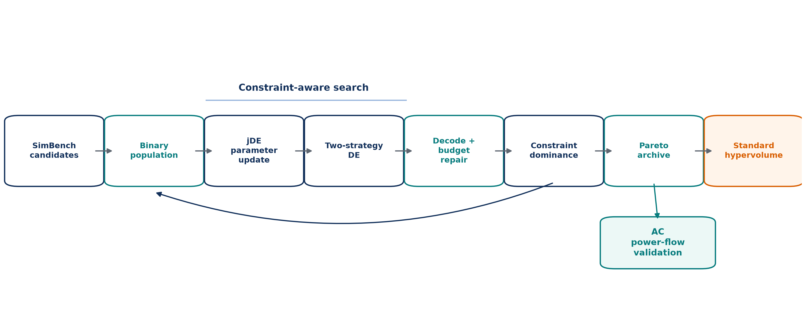
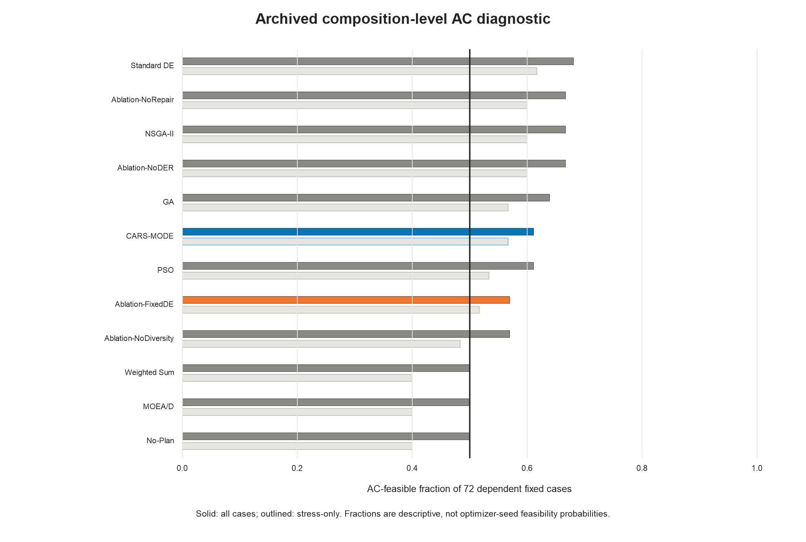
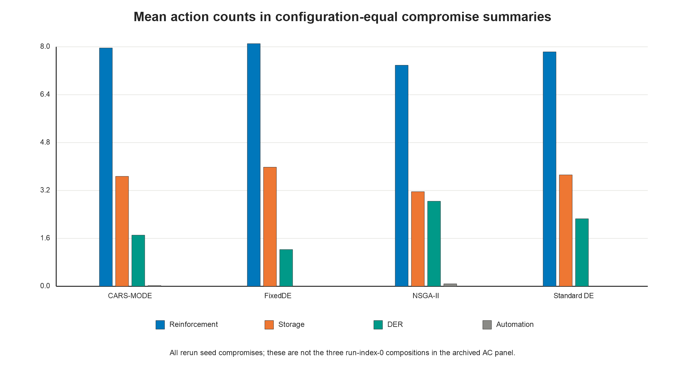
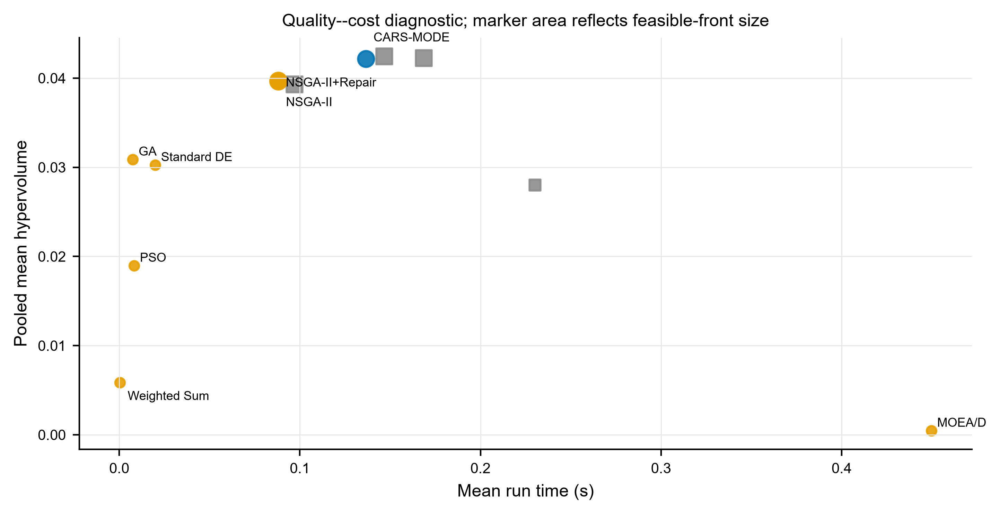
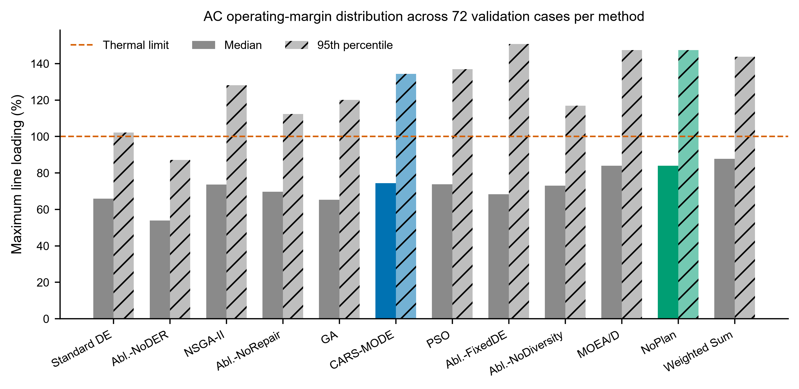
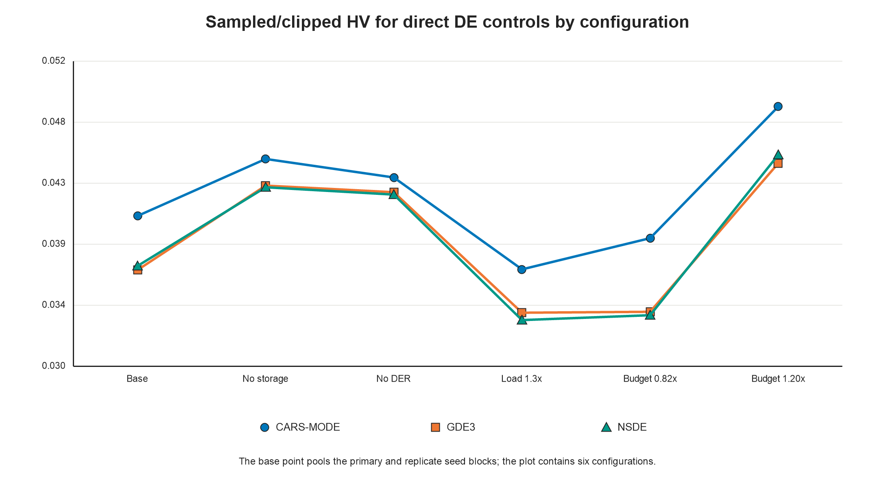

<!-- MDPI Energies submission draft.
     Paper: mintou_p3 / CARS-MODE.
     All numbers verified against evidence files in:
       papers/mintou/mintou_p3_samode_distribution_planning/evidence/
     Figures: ./figures/ (300 dpi PNG). -->

# CARS-MODE: Constraint-Aware Repair and Strategy-Pool Multi-Objective Differential Evolution on a SimBench-Derived Mixed-Voltage Portfolio Proxy

**Authors:** Linyao Zhang (张林垚), Jieyun Zheng (郑洁云), Zhanghuang Zhang (张章煌), Shiyuan Ni (倪识远), Guilian Wu (吴桂联)
**Affiliations:** Economic and Technological Research Institute of State Grid Fujian Electric Power Co., Ltd., Fuzhou 350000, Fujian, China
**Correspondence:** zjy_0701@163.com (J. Zheng)

---

## Abstract

Distribution utilities allocate limited budgets among feeder reinforcement, distributed-energy-resource installations, storage, and automation upgrades. This optimizer study represents those choices with a SimBench-derived mixed-voltage portfolio proxy; it does not evaluate action-aligned expansion decisions. CARS-MODE is a binary multi-objective differential evolution algorithm combining self-adaptive control parameters, a success-driven two-strategy mutation pool, constraint-aware budget repair, and crowding-based diversity preservation. On the reproducible proxy benchmark with 18 subnetworks, 72 candidate actions, five objectives, and seven scenarios, CARS-MODE attains pooled mean hypervolume 0.04218, 6.22% above NSGA-II with matched budget repair. After removing deterministic-output pseudo-replication, it has a higher mean in all 56 stochastic-baseline comparisons and 55 remain significant after within-scenario Holm correction; seven Weighted Sum point comparisons are reported descriptively. Direct DE controls are also separated: CARS-MODE exceeds GDE3 and NSDE by 8.57% and 8.52%, respectively, with significant wins in all 14 scenario-level comparisons. A combined fixed-parameter, single-strategy control is nominally 0.60% higher and remains unresolved in all seven scenarios, so the proxy evidence does not attribute the gain to the parameter-and-strategy adaptation bundle. A composition-level alternating-current check on four SimBench medium-voltage networks shows that proxy ranking is not electrical ranking: CARS-MODE reaches a feasible rate of 0.611, compared with 0.500 without planning and 0.667 for NSGA-II. The study therefore supports the constrained multi-objective framework on the tested proxy while treating adaptation and physical transfer as bounded findings.

**Keywords:** distribution-planning portfolio proxy; distributed energy resources; energy storage; multi-objective optimization; differential evolution; self-adaptive parameter control; constraint handling; SimBench

---

## 1. Introduction

The distribution grid turns the energy transition into an investment problem. Photovoltaic connections, storage, and electrified loads are arriving faster than many medium- and low-voltage feeders were designed to accommodate. Distribution system operators must decide which feeders to reinforce, where to accept DER, where storage is justified, and which automation upgrades to fund under a limited budget. Each action changes cost, losses, voltage exposure, hosting capacity, and reliability. Because those quantities conflict, DER and storage planning is a recurring constrained multi-objective problem.

Evolutionary multi-objective algorithms are widely used in this literature, but two practical frictions persist. The first is algorithmic: differential evolution (DE) is sensitive to its control parameters and mutation strategy [1], and the planning problem is binary, budget-constrained, and rugged. A single fixed DE configuration can therefore stall. Self-adaptive DE variants (jDE [2], SaDE [3]) addressed this limitation on continuous benchmarks two decades ago, whereas many energy-planning studies still use either fixed-parameter DE or an off-the-shelf NSGA-II. The second friction is evidential: studies based on private networks or unchecked objective proxies are difficult to reproduce and easy to over-interpret. Comparative optimizer research emphasizes consistent evaluation protocols [4]. In this study, repeated-run statistical comparisons are therefore paired with an explicit power-flow check of the surrogate planning objectives.

CARS-MODE is a binary multi-objective DE with four switchable mechanisms. It self-adapts each individual's scale factor $F$ and crossover rate $CR$ in the jDE manner. A success-driven pool selects between rand/1 and best/1 mutation, deterministic repair removes low-benefit actions until the budget is met, and crowding truncation preserves front diversity.

The evidence uses public data and reproducible implementations. SimBench deterministically supplies the benchmark [5], while nine baselines and four ablations use real algorithm implementations, including pymoo references where available [6]. Standard hypervolume is computed under fixed method-independent normalization. Every stochastic method uses 30 seeded runs and Holm-corrected Mann–Whitney tests; the deterministic Weighted Sum rule is compared descriptively.

The study uses a two-level evaluation. The planning objectives are engineering indices computed from SimBench subnet statistics — fast enough to support a rigorous statistical protocol, but proxies nonetheless. At the second level, the compromise plan composition of every method is mapped onto four real SimBench MV networks and checked with pandapower AC load flow [7] across six stress scenarios (peak load, load growth, extreme growth, high DER infeed, and an N-1 contingency). The resulting disagreement between proxy ranking and electrical feasibility is treated as an empirical finding.

Accordingly, this is an optimizer study on a SimBench-derived mixed-voltage portfolio proxy, not an action-aligned distribution expansion study. The candidate attributes are generated from subnet statistics, and the AC stage maps portfolio compositions onto separate networks rather than evaluating the optimizer's selected actions at their original nodes.

The contributions of this paper are:

1. **A constraint-aware multi-objective DE framework with testable mechanism groups on a portfolio proxy.** CARS-MODE integrates jDE parameter control, a success-driven two-strategy pool, deterministic budget repair, and crowding diversity. Repair and diversity are removed individually; a combined control replaces adaptive parameters and the strategy pool with fixed $F/CR$ and rand/1. The design therefore separates the framework-level proxy result from repair and diversity effects while testing parameter-and-strategy adaptation as a bundle (Section 4).
2. **A reproducible public mixed-voltage portfolio-proxy benchmark with a method-independent evaluation protocol.** Seven proxy scenarios (candidate-pool, load-growth, and budget variants) over 72 candidate actions derived from SimBench subnet statistics; standard hypervolume under fixed seeded normalization bounds; 30 seeds per method and scenario (Sections 2 and 5). The benchmark does not provide nodal, monetarily calibrated expansion actions.
3. **A statistically grounded proxy-front result against direct controls.** CARS-MODE attains pooled mean hypervolume 0.04218, 6.22% above NSGA-II with matched repair (0.03971), and records 55 significant wins among 56 stochastic-baseline comparisons. Seven comparisons with the deterministic Weighted Sum rule are descriptive and favor CARS-MODE in mean HV. Its margins over GDE3 and NSDE are 8.57% and 8.52%, with significant separation in every scenario; these are hypervolume results on the proxy, not evidence of superior expansion actions (Sections 6.1 and 6.6).
4. **A two-level component and validity analysis.** Budget repair (−6.84% when removed) and diversity preservation (−33.56%) carry the proxy gain, whereas the combined parameter-and-strategy adaptation bundle is unresolved (FixedDE +0.60% in pooled mean). The pandapower composition check identifies a proxy--physics disagreement and a descriptive full-versus-FixedDE difference (0.611 versus 0.569 overall AC feasibility), but it does not overturn the unresolved proxy contrast or identify either adaptive subcomponent as the causal source (Sections 6.2–6.3).

Section 2 reviews related work, and Sections 3--5 define the problem, method, and experimental protocol. Section 6 reports the optimization, ablation, AC-validation, and sensitivity results. Sections 7--9 discuss the findings, state the limitations, and conclude the paper.

---

## 2. Related Work

Three threads frame this work: distribution network expansion planning with DER and storage, evolutionary and swarm metaheuristics in power system planning, and self-adaptive differential evolution with constraint handling.

### 2.1. Distribution Network Expansion Planning with DER and Storage

Active distribution network planning has moved from single-objective conductor sizing to portfolio decisions that co-optimize reinforcement, DER siting, storage, and flexibility. Recent surveys map this shift: Prenc [8] catalogues the optimization principles applied in planning and operation of active distribution networks, and Saldaña-González et al. [9] organize the elements of modern planning models, including the entry of generative-AI scenario tools. On the modeling side, robustness to uncertainty dominates: Liu et al. [10] plan expansions under distributional uncertainty via Wasserstein-distance ambiguity sets and dual relaxation, and Wang et al. [11] coordinate source--network--storage expansion against WGAN-GP-generated scenarios. Reliability-driven formulations add restoration and islanding to reinforcement choices [12], while Ferreira et al. [13] extend the planning boundary upward to the transmission--distribution interface, and Chen et al. [14] specialize it to hybrid AC/DC campus networks for data centers. Closest to our task, He et al. [15] co-optimize distribution networks with storage and electric vehicles using an improved NSGA-II, and Alrashidi et al. [16] integrate DG, capacitor banks, and EV charging stations in radial feeders through a classification-based global optimization scheme.

Across this thread the algorithmic engine is almost always a Pareto-based genetic algorithm or a mathematical-programming reformulation; DE appears rarely, and when the engine is improved, the improvement is seldom isolated by ablation. Equally relevant to us is what these papers evaluate on: private or single test systems are the norm, and the mapping from optimization objective to AC feasibility is usually asserted rather than measured. Our study is designed to make this mapping explicit and measurable.

### 2.2. Evolutionary and Swarm Metaheuristics in Power System Planning

The broader planning literature in energy venues provides many metaheuristic variants. Qi et al. [17] apply enhanced beluga whale optimization to vulnerability-driven storage planning; Demirbas et al. [18] develop an enhanced coati algorithm for static and dynamic transmission expansion; and Cadena-Albuja et al. [19] compare DE with other optimizers for energy-limited economic dispatch. Two recurring limitations motivate our protocol. First, hybrid or "improved" algorithms are not always accompanied by mechanism controls, making the source of added value difficult to identify. We therefore isolate repair and diversity and test the parameter-and-strategy controller against a combined fixed control. Second, independent runs, rank-based tests, and standard indicators such as hypervolume [20] are applied unevenly in some application studies, and benchmarking audits document the associated reproducibility risks [4,21,22]. We use a standard indicator, 30 seeded runs, and Holm-corrected non-parametric tests so that single-digit percentage differences can be distinguished from seed variation.

### 2.3. Self-Adaptive Differential Evolution and Constraint Handling

DE [1] owes much of its practical success to parameter adaptation and constraint handling. jDE [2] encodes $F$ and $CR$ in each individual and resamples them with a small probability per generation. SaDE [3] additionally learns mutation-strategy probabilities from recent successes; Das and Suganthan [23] review this lineage. Success-history adaptation (SHADE) [24] and composite strategy--parameter schemes [25] extend the same principle, while Ahmad et al. [26] survey recent developments. Multi-objective DE variants place these mechanisms under Pareto selection, commonly using non-dominated sorting and crowding [27] or decomposition [28]. Constraint-handling alternatives include penalties, feasibility-first domination, and repair [29,30]. Repair is especially attractive for knapsack-like budgets because it returns evaluations to the fundable region.

The reviewed studies provide limited evidence on combining jDE/SaDE-style adaptation and greedy budget repair inside a binary multi-objective DE for distribution-planning portfolios and then inspecting the resulting plans with AC power flow. Our controls isolate repair and diversity and compare the full controller with a fixed-parameter, single-strategy alternative. Because the latter changes two adaptive subcomponents together, it tests their joint contribution rather than identifying either one separately. The AC check is important because adaptation is commonly justified by indicator gains alone; here the joint proxy-level contrast is unresolved, while the selected compromise plans show a favorable but exploratory electrical pattern (Section 6.3).

### 2.4. Gap Statement

In summary, distribution-planning studies supply the task context but do not consistently isolate algorithmic components or validate proxy objectives electrically. Metaheuristic studies supply algorithmic variants, while the DE literature supplies adaptation mechanisms, but their combination in budget-constrained binary planning with power-flow validation remains limited. Table 1 compares these features in representative recent works. This paper studies that intersection through a reproducible self-adaptive multi-objective DE, component-level ablations, repeated statistical tests, and a separate AC inspection that explicitly reports disagreement with the proxy ranking.

**Table 1.** Feature comparison with representative related work. "yes" = present; -- = absent by design; n.r. = not reported in the cited work; n/a = not applicable to the study's scope.

| Work | Task | Engine | Pareto front returned | Self-adaptive $F$/$CR$ / strategy | Constraint repair | Per-component ablation | Objective proxy checked by AC power flow |
|---|---|---|---|---|---|---|---|
| jDE [2] | continuous benchmarks | DE | -- | yes / -- | -- | -- | n/a |
| SaDE [3] | continuous benchmarks | DE | -- | yes / yes | -- | -- | n/a |
| SHADE [24] | continuous benchmarks | DE | -- | yes / -- | -- | -- | n/a |
| He et al. [15] | distribution planning (storage, EV) | improved NSGA-II | yes | n.r. | feasibility constraints | n.r. | n.r. |
| Alrashidi et al. [16] | DG/CB/EVCS planning | classification-based global optimization | -- (aggregated objective) | n.r. | n.r. | n.r. | n.r. |
| Qi et al. [17] | resilience-driven storage planning | enhanced beluga whale optimization | yes | n.r. | n.r. | n.r. | n.r. |
| Demirbas et al. [18] | transmission expansion | enhanced coati optimization | n.r. | n.r. | n.r. | n.r. | n.r. |
| Cadena-Albuja et al. [19] | economic dispatch | DE (comparative study) | -- | n.r. | n.r. | n.r. | n/a |
| CARS-MODE (this work) | distribution planning portfolios | binary multi-objective DE | yes | yes / yes | yes (greedy budget repair) | yes (one switch per run) | yes (pandapower, four MV networks) |

### 2.5. Companion Project, Shared Generators, and Independent Question

The companion project `mintou_p4_shield_resilience_planning` belongs to the same research program. It and this study share the generators used to derive SimBench-based benchmark inputs. That generator layer is common infrastructure, not an independent dataset or a replication of either paper's results. The CARS-MODE question is independent: under a fixed proxy benchmark, comparison budget, and evaluation protocol, does the complete constrained-search framework improve proxy-front quality relative to the implemented controls, and which mechanism groups survive ablation? The companion project instead concerns resilience-oriented stress-scenario screening in the evaluation layer. Results and conclusions in this paper are restricted to the CARS-MODE optimizer question.

---

## 3. Problem Formulation and Public Benchmark

### 3.1. Planning Portfolios as Multi-Objective Binary Selection

Let $\mathcal{A} = \{a_1, \dots, a_n\}$ be a pool of candidate planning actions. Each action belongs to one of four kinds — feeder **reinforcement**, **storage** installation, **DER** installation, and **automation** — and carries an investment cost $k_i$ plus five benefit attributes: loss reduction, voltage-risk reduction, hosting-capacity gain, reliability gain, and DER-support share. A plan is a binary vector $x \in \{0,1\}^n$. The planner minimizes five objectives simultaneously:

$$
\min_{x \in \{0,1\}^n} F(x) = \big( C(x),\; L(x),\; U(x),\; -H(x),\; -R(x) \big),
$$

where $C$ is total investment cost, $L$ a network loss index, $U$ a voltage-risk index, $H$ the DER hosting-capacity index, and $R$ a reliability index; all five are analytic functions of the selected actions' attributes and the scenario's load multiplier (Section 3.2 gives their provenance). The single hard constraint is the budget:

$$
\textstyle\sum_i k_i x_i \le B, \qquad v(x) = \max\big(0, (\textstyle\sum_i k_i x_i - B)/B\big),
$$

with $B = 980$ cost units at the nominal level, scaled per scenario. The budget is the only hard constraint. Voltage risk and hosting capacity remain objectives because their target levels are not jointly satisfiable within this proxy budget; treating them as constraints would incorrectly label every method infeasible. Any residual target shortfall is therefore reported as a property of the compromise portfolio rather than hidden inside the feasibility definition.

A plan $x$ dominates $x'$ when it is no worse in all five objectives and better in at least one. The feasible non-dominated front contains mutually non-dominating plans that respect the budget. Hypervolume measures the normalized objective-space volume dominated by that front relative to a fixed reference point, rewarding both convergence and spread [20].

### 3.2. Benchmark Construction from SimBench

All problem data derive from the public SimBench complete mixed dataset (`1-complete_data-mixed-all-0-sw`) [5]. Active and reactive load, renewable capacity, line length, line count, and average maximum loading are aggregated from `Load.csv`, `Line.csv`, and `RES.csv`. The 18 subnetworks with the highest combined load and line-length stress are retained (Table 2).

Each subnet contributes one action of each kind, yielding $n=72$ candidates. Reinforcement cost scales with line length and load. Storage and DER gains scale with the shortfall from a renewable target of 55% of load, while automation reliability gain scales with line count. All rules are implemented in code; no attribute is assigned manually per candidate.

The candidate pool spans EHV to LV subnets, whereas Section 5.4 validates compositions on four separate MV networks. Thus the proxy provides portfolio statistics and the AC stage evaluates action mixes on concrete lower-voltage grids. The mapping is compositional rather than nodal, and both tiers belong to the same SimBench family.

**Table 2.** Benchmark source profile.

| Property | Value |
|---|---|
| SimBench network | `1-complete_data-mixed-all-0-sw` (EHV--LV complete mixed) |
| Subnetworks used | 18 (EHV1, HV1, HV2, LV3.101--LV3.107, LV3.201--LV3.208) |
| Candidate actions | 72 (18 subnets x 4 kinds) |
| Total load | 71,348.9 MW |
| Total installed RES | 12,234.9 MW |
| Total line length | 34,296.2 km |
| Nominal budget $B$ | 980 cost units (synthetic, not monetarily calibrated) |

We state plainly what this construction is: a *reproducible public proxy* for portfolio-level distribution planning. The objective indices are engineering-plausible functions of real network statistics, not AC power-flow results — which is exactly why Section 6.3 validates the outcome plans with pandapower load flow, and why Section 8 lists the remaining distance to an engineering-grade planning claim.

### 3.3. Planning Scenarios

Seven experiments exercise the pool along three axes — candidate-pool composition, load growth, and budget tightness — with an identical evaluation protocol throughout (Table 3). The planning stage itself is deterministic (a single nominal operating scenario per experiment); stochastic stress enters at the AC validation stage (Section 5.4).

**Table 3.** The seven planning scenarios.

| Experiment | Budget factor | Load factor | Pool restriction |
|---|---|---|---|
| base_distribution_planning | 1.00 | 1.0 | none |
| der_siting_sizing | 1.00 | 1.0 | storage candidates excluded |
| storage_allocation | 1.00 | 1.0 | DER candidates excluded |
| load_growth_expansion | 1.00 | 1.3 | none |
| pareto_quality | 1.00 | 1.0 | none (independent replicate) |
| constraint_repair | 0.82 | 1.0 | none (tight budget) |
| runtime_scalability | 1.20 | 1.0 | none (loose budget) |

Two design notes. First, `pareto_quality` intentionally replicates the base configuration under an independent per-method seed stream (seeds are derived by hashing the experiment and method identifiers), so it functions as an internal replication check; its results track the base experiment closely (Section 6.1). Second, the two budget variants (0.82x, 1.20x) probe the repair mechanism and the loose-budget regime respectively; the "runtime scalability" name is retained from an earlier benchmark version but used only for its budget role, and we do not make runtime-scaling claims from it.

---

## 4. CARS-MODE

Figure 1 summarizes one generation and separates adaptive search from feasibility and evaluation. Parameter and strategy updates act on the continuous population; decoding and deterministic budget repair produce binary plans; constraint-dominated environmental selection updates the population and archive; and AC validation is applied only to archived compromise plans after optimization.



**Figure 1.** CARS-MODE architecture. The feedback arrow denotes the next generation. Standard hypervolume and AC power-flow validation are readouts of the archived solutions and do not affect strategy-success updates.

CARS-MODE is a binary multi-objective DE organized so that each named mechanism is one switch in the code, which makes the ablation study of Section 6.2 a clean attribution. A continuous genome $g \in [0,1]^n$ is thresholded at 0.5 into a plan vector; initial genomes are sparse (about 8% of genes above threshold) so that the search starts among affordable plans.

**Formal definitions.** A real genome \(g_i\in[0,1]^n\) is decoded into a binary plan and assigned budget violation

$$
x_{ij}=\mathbb I[g_{ij}\geq0.5],\qquad
v(x_i)=\max\!\left(0,\sum_{j=1}^{n}c_jx_{ij}-B\right).
$$

The per-individual jDE controls are resampled by

$$
F_i'=\begin{cases}0.1+0.8U_1,&U_2<\tau,\\F_i,&\text{otherwise},\end{cases}
\qquad
CR_i'=\begin{cases}U_3,&U_4<\tau,\\CR_i,&\text{otherwise},\end{cases}
$$

with independent \(U_k\sim U(0,1)\). The two mutation candidates are

$$
m_i^{\mathrm{rand}}=g_{r_1}+F_i'(g_{r_2}-g_{r_3}),
$$

$$
m_i^{\mathrm{best}}=g_b+F_i'(g_{r_1}-g_{r_2}),\qquad g_b\in\mathcal F_1^{\mathrm{feas}},
$$

followed by clipped binomial crossover,

$$
u_{ij}=\begin{cases}\operatorname{clip}(m_{ij},0,1),&
U_{ij}<CR_i'\ \text{or}\ j=j_{\mathrm{rand}},\\
g_{ij},&\text{otherwise}.
\end{cases}
$$

If \(s_k^{(t)}\) is the decayed success mass of strategy \(k\), its sampling probability is

$$
p_k^{(t)}=\frac{\max(s_k^{(t)},0.2)}
{\sum_{\ell\in\{\mathrm{rand},\mathrm{best}\}}\max(s_\ell^{(t)},0.2)},
\qquad
s_k^{(t+1)}=0.95s_k^{(t)}+\mathbb I[\text{accepted success by }k].
$$

For an over-budget decoded plan, repair repeatedly removes

$$
j^-=\operatorname*{arg\,min}_{j:x_j=1}
\frac{\sum_{q=1}^{Q}\omega_q b_{jq}}{c_j}
$$

until \(v(x)=0\). Constraint dominance is defined by

$$
x\prec_c y\iff
[v(x)=0<v(y)]\ \lor\
[v(x)=v(y)=0\land x\prec_P y]\ \lor\
[v(x),v(y)>0\land v(x)<v(y)].
$$

Finally, with fixed normalization and reference point \(r\), reported hypervolume is

$$
HV(\mathcal P;r)=\lambda_Q\!\left(\bigcup_{x\in\mathcal P}
[f_1(x),r_1]\times\cdots\times[f_Q(x),r_Q]\right).
$$

### 4.1. jDE Self-Adaptive Control Parameters

Each individual carries its own $(F_i, CR_i)$, initialized at $(0.5, 0.9)$. In every generation, an individual redraws $F_i \sim U(0.1, 0.9)$ and $CR_i \sim U(0, 1)$ with probability $\tau = 0.1$ [2]. Per-individual parameter carrying allows settings associated with surviving trials to persist, while stochastic resampling continues to explore the ranges. The sensitivity study in Section 6.4 sweeps $\tau$ and finds a flat response.

### 4.2. Success-Driven Two-Strategy Pool

Mutation chooses between DE/rand/1 (a uniformly drawn base vector) and DE/best/1 (a base vector drawn from the current feasible-first non-dominated front), with probabilities proportional to recent success masses [3]. A trial is successful if it constraint-dominates its parent through lower violation or, at equal violation, Pareto improvement. Success masses decay by 0.95 per generation and have a floor of 0.2, preventing either strategy from being excluded. The pool combines exploratory rand/1 with the more intensive best/1 and lets observed successes determine their sampling probabilities.

### 4.3. Constraint-Aware Budget Repair

Every decoded plan that exceeds the budget is repaired deterministically. The selected action with the lowest aggregate benefit-to-cost ratio is removed repeatedly until the plan is affordable. This avoids spending evaluations and selection slots on penalty-carrying plans and concentrates search near the budget boundary. The 0.82x scenario directly stresses this mechanism.

### 4.4. Crowding-Based Diversity Preservation

Environmental selection is elitist ($\mu + \lambda$): parents and trials are pooled, sorted by constraint-domination fronts, and truncated to the population size with crowding distance [27] breaking ties in the last admitted front. The corresponding ablation replaces crowding with a random tie-break. *Motivation:* with only 40 individuals covering a five-objective front, losing spread control collapses the front to a few clusters — the ablation quantifies exactly how much (−33.56%, Section 6.2).

### 4.5. Algorithm Summary

```
CARS-MODE(pool, budget, seed):
  initialize 40 sparse genomes in [0,1]^72; per-individual F=0.5, CR=0.9
  decode (threshold 0.5) and repair each plan to budget            # 4.3
  for gen = 1 .. 40:
    for each individual i:
      with prob 0.1 resample F_i ~ U(0.1,0.9), CR_i ~ U(0,1)       # 4.1
      pick strategy rand/1 or best/1 by success mass               # 4.2
      mutate + binomial crossover -> trial genome; decode + repair # 4.3
    update strategy success masses (constraint-domination test)    # 4.2
    (mu+lambda) selection: constraint-domination NDS + crowding    # 4.4
  return feasible non-dominated front of the final population
```

---

## 5. Experimental Setup

### 5.1. Methods Compared

Table 4 lists the fourteen methods: CARS-MODE, nine baselines, and four ablations. NSGA-II, NSGA-II with matched repair, MOEA/D, GDE3, and NSDE are pymoo implementations [6] on the identical constrained problem; the two direct DE controls operate in $[0,1]$ and use the same fixed 0.5 binary decoder. GA, binary PSO [31], and standard DE optimize a normalized weighted-sum scalarization with a violation penalty; Weighted Sum is a greedy benefit fill under budget. Every reported comparison therefore uses executed algorithms on the same method-independent objective definition.

**Table 4.** Methods.

| Method | Role | Description |
|---|---|---|
| CARS-MODE | proposed | binary MODE: jDE self-adaptive F/CR + two-strategy pool + budget repair + crowding |
| NSGA-II | baseline | pymoo NSGA-II, binary encoding, constrained |
| NSGA-II+Repair | baseline | NSGA-II followed by the same deterministic budget-repair rule used by CARS-MODE |
| MOEA/D | baseline | pymoo MOEA/D, budget as penalty |
| GDE3 | baseline | generalized differential evolution with constraint domination and fixed binary decoding |
| NSDE | baseline | nondominated-sorting differential evolution with fixed binary decoding and sampled $F$ |
| Standard DE | baseline | binary DE/rand/1/bin, fixed F = 0.5, CR = 0.9, scalarized |
| PSO | baseline | binary PSO (sigmoid velocity), scalarized |
| GA | baseline | single-objective GA, tournament + uniform crossover, scalarized |
| Weighted Sum | baseline | weighted-benefit greedy fill under budget |
| Ablation-FixedDE | ablation | F = 0.5, CR = 0.9 fixed; single rand/1 strategy (adaptation off) |
| Ablation-NoRepair | ablation | budget repair disabled (violation-penalized search) |
| Ablation-NoDiversity | ablation | crowding replaced by random tie-break |
| Ablation-NoDER | ablation | DER and storage candidates removed from the search pool |

Ablation-NoDER is a *problem-variant* probe rather than an operator switch: excluded candidates receive prohibitive cost in the search problem only, while evaluation stays in the full objective space, so its hypervolumes remain comparable. We flag this asymmetry wherever it matters (Section 6.2).

### 5.2. Protocol

Each stochastic method runs **30 independent seeds** per experiment. Weighted Sum is deterministic: the uniform 2940-row implementation archive retains its repeated invocations, but its effective inferential sample size is one per experiment. Thus, seed-level tests cover twelve stochastic opponents; the seven Weighted Sum gaps are descriptive. All population-based methods share population 40 and 40 generations. Stochastic seeds are derived by hashing the (paper, experiment, method) triple with the run index, so method cells do not share a random stream.

### 5.3. Evaluation Metric and Statistics

The primary metric is the **standard hypervolume** of the feasible non-dominated front, computed with pymoo's exact indicator. Objectives use fixed per-experiment normalization bounds obtained from a seeded reference sample: the empty plan, all 72 single-action plans, and 2048 random feasible plans, followed by a 5% margin. The reference point is 1.1 in every normalized dimension. The metric contains no method-aware term, and an empty feasible front scores zero. We compare CARS-MODE with each stochastic opponent using two-sided **Mann--Whitney U tests** per experiment ($n = 30$ per group) and apply **Holm correction** over the twelve eligible opponents within each experiment [32] at $\alpha = 0.05$. Rank-biserial correlation and 5000-resample bootstrap intervals quantify effect size and mean-difference uncertainty. Weighted Sum is reported as an $n=1$ point comparison without a seed-level p-value.

### 5.4. AC Load-Flow Validation Protocol

Because the planning objectives are proxies, a separate stage validates outcomes electrically. For the base, DER-siting, and storage-allocation experiments, the seed-0 compromise plan is reduced to counts of reinforcement, storage, DER, and automation actions. Fixed rules map each composition onto four SimBench MV networks: rural, semi-urban, urban, and commercial. Reinforcement parallels the most-loaded lines; storage attaches to the weakest-voltage load buses and injects or absorbs 3% of net load; DER adds PV equal to 4% of net load at the highest-load buses; automation has no steady-state effect.

Pandapower AC power flow [7] is solved under base, 1.3x peak, 1.5x growth, 1.8x extreme growth, 2.5x high DER, and growth-plus-$N-1$ scenarios. The design yields $4\times6\times3=72$ cases per method. A case is AC-feasible when power flow converges, all bus voltages remain within $[0.95,1.05]$ pu, and line loading does not exceed 100%. The No-Plan reference uses the same cases without any action. Because fixed rules choose buses, this stage validates plan compositions rather than nodal siting (Sections 7–8).

The fixed normalization used by the hypervolume implementation can be written as

$$
\tilde f_q(x)=\frac{f_q(x)-\ell_q}{u_q-\ell_q+\epsilon},
\qquad r_q=1.1,
$$

where $(\ell_q,u_q)$ are fixed before any method output is inspected. The evaluated front is therefore

$$
\mathcal P_a^{\mathrm{feas}}=
\operatorname{ND}\{F(x):x\in\mathcal X_a,\ v(x)=0\},
\qquad n_a^{\mathrm{front}}=|\mathcal P_a^{\mathrm{feas}}|.
$$

For two seeded methods with rank sum $R_1$, the two-sided Mann--Whitney statistic is

$$
U=\min\!\left(n_1n_2+\frac{n_1(n_1+1)}{2}-R_1,
n_1n_2-\left[n_1n_2+\frac{n_1(n_1+1)}{2}-R_1\right]\right).
$$

Within an experiment, ordered p-values are adjusted by the step-down rule

$$
p^{\mathrm{Holm}}_{(i)}=
\max_{j\leq i}\min\!\left(1,(m-j+1)p_{(j)}\right).
$$

The descriptive relative margin reported in the result tables is

$$
\Delta_{a,b}=100\,\frac{\bar{HV}_a-\bar{HV}_b}{\bar{HV}_b},
$$

and never substitutes for the corrected test. Finally, an AC case $z$ is counted as feasible only when all three engineering checks pass simultaneously,

$$
I_{\mathrm{AC}}(z)=
I_{\mathrm{conv}}(z)\,
\mathbb I[0.95\leq V_b(z)\leq1.05\ \forall b]\,
\mathbb I[L_\ell(z)\leq100\%\ \forall\ell],
$$

with $\widehat p_{\mathrm{AC}}=N_z^{-1}\sum_z I_{\mathrm{AC}}(z)$. These definitions distinguish optimization-front quality from physical feasibility; neither metric is used as a surrogate for the other.

---

## 6. Results

### 6.1. Main Comparison

Table 5 reports pooled results over all 7 experiments x 30 seeds; Figure 2 shows per-experiment distributions for the original seven-method comparison set, while Section 6.6 isolates the added direct controls.

**Table 5.** Pooled leaderboard (210 runs per stochastic method). Weighted Sum is deterministic; its repeated archive rows provide rectangular provenance and do not constitute seeded inference.

| Method | Role | Mean HV | Std | Mean feasible front size | Mean runtime (s) |
|---|---|---|---|---|---|
| Ablation-FixedDE | ablation | 0.04243 | 0.00381 | 38.7 | 0.115 |
| Ablation-NoDER | ablation | 0.04223 | 0.00381 | 37.6 | 0.138 |
| **CARS-MODE** | **proposed** | **0.04218** | **0.00381** | **38.6** | **0.119** |
| NSGA-II | baseline | 0.03966 | 0.00405 | 40.0 | 0.077 |
| NSGA-II+Repair | baseline | 0.03971 | 0.00390 | 40.0 | 0.069 |
| Ablation-NoRepair | ablation | 0.03929 | 0.00444 | 39.1 | 0.079 |
| NSDE | baseline | 0.03887 | 0.00489 | 39.0 | 0.052 |
| GDE3 | baseline | 0.03885 | 0.00479 | 38.9 | 0.052 |
| GA | baseline | 0.03089 | 0.00069 | 1.0 | 0.005 |
| Standard DE | baseline | 0.03027 | 0.00129 | 1.0 | 0.012 |
| Ablation-NoDiversity | ablation | 0.02802 | 0.00977 | 8.1 | 0.189 |
| PSO | baseline | 0.01898 | 0.00763 | 1.0 | 0.005 |
| Weighted Sum | baseline | 0.00584 | 0.00261 | 1.0 | 0.0003 |
| MOEA/D | baseline | 0.00047 | 0.00000 | 1.0 | 0.350 |

CARS-MODE attains a pooled mean hypervolume of 0.04218 (std 0.00381), 6.22% above the strongest like-for-like baseline NSGA-II+Repair (0.03971, NSGA-II augmented with the same budget repair) and 6.34% above plain NSGA-II (0.03966). Repair alone changes NSGA-II by 0.11% on this benchmark. Across eight stochastic baselines and seven scenarios, CARS-MODE has a higher mean in all 56 cells; 55 differences remain significant after within-scenario Holm correction. The only unresolved stochastic-baseline comparison is NSGA-II+Repair in storage_allocation. The deterministic Weighted Sum rule is lower in all seven descriptive comparisons and receives no seed-level p-value. This pattern supports the complete search framework against the implemented controls but does not isolate adaptation: Ablation-FixedDE remains nominally ahead of the full method. MOEA/D's penalty-based configuration collapses to the empty plan on this problem; we report that implementation-specific failure without generalizing it to decomposition methods.


**Figure 2.** Hypervolume distributions (30 seeds per box) across the seven planning scenarios for CARS-MODE and the original six baselines. The matched-repair and direct DE controls are reported numerically in Table 5 and Figure 9.

Table 6 breaks out the only competitive baseline, NSGA-II.

**Table 6.** CARS-MODE vs. NSGA-II per experiment. The interval is a 5000-resample bootstrap CI for the mean HV difference; $r_{rb}$ is rank-biserial correlation. Holm correction covers twelve stochastic opponents per experiment.

| Experiment | CARS-MODE | NSGA-II | $\Delta HV$ (95% CI) | $r_{rb}$ | Holm p |
|---|---:|---:|---:|---:|---:|
| base_distribution_planning | 0.04108 | 0.03813 | 0.00295 [0.00205, 0.00385] | 0.789 | 6.39e-7 |
| constraint_repair (0.82x budget) | 0.03925 | 0.03573 | 0.00352 [0.00272, 0.00437] | 0.920 | 3.90e-9 |
| der_siting_sizing | 0.04496 | 0.04308 | 0.00188 [0.00109, 0.00265] | 0.600 | 3.38e-4 |
| load_growth_expansion | 0.03700 | 0.03495 | 0.00204 [0.00120, 0.00300] | 0.691 | 1.33e-5 |
| pareto_quality (same benchmark family) | 0.04062 | 0.03812 | 0.00250 [0.00183, 0.00318] | 0.802 | 4.92e-7 |
| runtime_scalability (1.20x budget) | 0.04873 | 0.04481 | 0.00392 [0.00321, 0.00463] | 0.962 | 8.07e-10 |
| storage_allocation | 0.04362 | 0.04282 | 0.00080 [0.00024, 0.00136] | 0.398 | 0.0416 |

The margin is significant in all seven scenarios, largest under the 0.82x budget (+9.84%) and smallest on the storage-only pool (+1.87%). The pareto_quality seeded repeat within the same benchmark family reproduces a positive margin (+6.55% versus +7.75% in the base setting); it is not an independent-dataset replication. CARS-MODE uses about 1.5x NSGA-II's runtime (0.119 s versus 0.077 s per run) and returns slightly smaller feasible fronts (38.6 versus 40.0 plans on average).

### 6.2. Ablation Study

Figure 3 compares the full method with the four ablations (pooled over 7 experiments x 30 seeds).


**Figure 3.** Mean hypervolume (+/- std) of CARS-MODE and the four ablations, pooled over all experiments and seeds. FixedDE is nominally higher and unresolved at the proxy level; under the fixed composition mapping, its descriptive AC-feasible rate is lower (Figure 4).

Two components carry the proxy-level result. Removing budget repair costs 6.84% of pooled hypervolume. It is significant in 6/7 experiments under the primary within-experiment opponent families and in 7/7 under the supplementary repair-specific Holm family across scenarios. Removing crowding diversity costs 33.56% and is significant in 7/7 under both families, while front sizes fall from 38.6 to 8.1 and run-to-run variation increases. The FixedDE contrast is unresolved in 7/7 experiments under both families. The two family definitions and the complete effect table are retained in `real_simbench_planning_inference_v2.csv` and the cross-scenario audit.

**The combined adaptation bundle does not improve the proxy indicator.** Ablation-FixedDE fixes $F = 0.5$ and $CR = 0.9$ and replaces the two-strategy pool with rand/1. It attains a pooled mean of 0.04243, **0.60% above the full method**. The difference is not Holm-significant in any of the seven experiments (adjusted p = 0.22--0.76, all nominally favoring FixedDE). Because this control changes parameter adaptation and strategy selection together, it does not identify their individual effects. Ablation-NoDER is similarly close (+0.12% pooled): the full method loses significantly in the tight-budget and DER-siting scenarios and wins significantly in the loose-budget scenario. NoDER changes the candidate pool rather than an algorithmic component and is not used for component attribution. The FixedDE result does not support retaining the adaptive bundle for proxy accuracy; Section 6.3 treats the AC observations only as exploratory evidence for a possible secondary role.

### 6.3. AC Load-Flow Validation and the HV--AC Trade-Off

Table 7 and Figure 4 report the pandapower validation of every method's compromise plan compositions over 72 AC cases.

**Table 7.** AC validation summary. Stress-only excludes the base scenario (60 cases).

| Method | Role | AC-feasible rate | Stress-only rate | Mean min voltage (pu) | Mean max line loading (%) |
|---|---|---|---|---|---|
| No-Plan | reference | 0.500 | 0.400 | 0.9619 | 90.8 |
| Standard DE | baseline | 0.681 | 0.617 | 0.9731 | 63.5 |
| NSGA-II | baseline | 0.667 | 0.600 | 0.9739 | 75.6 |
| Ablation-NoRepair | ablation | 0.667 | 0.600 | 0.9735 | 70.5 |
| Ablation-NoDER | ablation | 0.667 | 0.600 | 0.9697 | 56.8 |
| GA | baseline | 0.639 | 0.567 | 0.9720 | 66.7 |
| **CARS-MODE** | **proposed** | **0.611** | **0.567** | **0.9729** | **76.6** |
| PSO | baseline | 0.611 | 0.533 | 0.9716 | 75.7 |
| Ablation-FixedDE | ablation | 0.569 | 0.517 | 0.9720 | 73.7 |
| Ablation-NoDiversity | ablation | 0.569 | 0.483 | 0.9681 | 69.9 |
| MOEA/D | baseline | 0.500 | 0.400 | 0.9619 | 90.8 |
| Weighted Sum | baseline | 0.500 | 0.400 | 0.9636 | 88.4 |



**Figure 4.** AC-feasible rate (all scenarios, upper bar; stress-only, lower bar) per method over 72 pandapower cases on four SimBench MV networks. The dashed line is the No-Plan reference (0.50).

Three readings, in decreasing order of comfort for the proposed method.

First, most non-empty compromise plans improve the displayed AC diagnostics relative to the No-Plan reference. For CARS-MODE, the feasible rate is 0.611 versus 0.500 overall and 0.567 versus 0.400 under stress; the worst-bus voltage rises from 0.9619 to 0.9729 pu, and peak line loading falls from 90.8% to 76.6%. MOEA/D returns the empty plan and is therefore identical to No-Plan, while the automation-dominated Weighted Sum plan remains at the reference feasible rate of 0.500.

Second, **the proxy-hypervolume ranking does not transfer to the AC ranking.** CARS-MODE is mid-pack in the composition-level check: Standard DE reaches 0.681 AC feasibility, NSGA-II 0.667, GA 0.639, and CARS-MODE 0.611. The seed-0 CARS-MODE compromise contains 6 reinforcement, 7 storage, 1 DER, and 0 automation actions, whereas NSGA-II contains 5/4/6/0 and Standard DE 7/4/2/0. Under the common deterministic mapping, storage-rich compositions coincide with rural over-voltage and less reinforcement in urban growth cases. This is a descriptive composition pattern, not nodal causality or a randomized component effect. In storage_allocation, CARS-MODE and NSGA-II have the same 8-reinforcement/5-storage composition, so 24 of their 72 AC cases coincide by construction. The 6.34% proxy-HV margin over plain NSGA-II (6.22% over NSGA-II+Repair) therefore provides no guarantee of AC-rank transfer.

Third, the AC inspection changes the interpretation of the adaptation ablation. **Ablation-FixedDE, the nominal proxy winner (+0.60%, n.s.), has an overall AC-feasible rate of 0.569 versus 0.611 for the full method** (stress-only 0.517 versus 0.567). Under stress-only scenarios, Ablation-NoDiversity is lower still (0.483). In the base experiment, FixedDE selects eight storage actions compared with seven for CARS-MODE, and the additional mapped injection coincides with greater rural-network over-voltage. Conversely, NoRepair loses 6.84% proxy hypervolume yet matches NSGA-II's AC rate of 0.667. These observations show that proxy and AC assessments capture different properties. Because the AC stage contains one compromise plan per method and experiment (72 binary outcomes per method), it supports a qualitative hypothesis about adaptation rather than a statistically powered component claim (Section 8).

In the high-DER stress scenario, the No-Plan reference has an AC-feasible rate of 0.25, exceeding NSGA-II, PSO, and Ablation-NoRepair (all 0). This pattern is a **mapping-rule artifact**, not evidence that no planning is preferable. The AC validation sets DER injection proportional to the number of DER actions and applies a 2.5x penetration factor. Plans with more DER actions therefore inject more PV and incur more voltage violations. CARS-MODE contains one DER action, whereas NSGA-II contains six and produces severe over-voltage under this mapping. This regularity is a limitation of the composition-level validation (Section 8).

### 6.4. Parameter Sensitivity Analysis

Parameter sensitivity is evaluated on the base experiment with 10 seeds per point. Population size is varied as $N_p\in\{20,40,60\}$, with NSGA-II re-run at each matched size. The jDE resampling probability is varied as $\tau\in\{0.05,0.1,0.2\}$ against the default-population NSGA-II reference. The remaining mechanisms are binary switches covered by the ablation study. Table 8 and Figure 5 summarize the sweep.

**Table 8.** Exploratory parameter sensitivity on the base experiment (10 seeds per point; nominal, multiplicity-unadjusted two-sided Mann--Whitney p-values versus the matched NSGA-II reference). The "$N_p$ = 40" and "$\tau$ = 0.1" rows are independent reruns of the same default configuration on different seed streams.

| Parameter | Value | CARS-MODE HV (mean +/- std) | NSGA-II reference | p (MWU) |
|---|---|---|---|---|
| population size $N_p$ | 20 | 0.0382 +/- 0.0018 | 0.0329 | 0.0010 |
| population size $N_p$ | 40 (default) | 0.0409 +/- 0.0016 | 0.0385 | 0.0058 |
| population size $N_p$ | 60 | 0.0425 +/- 0.0007 | 0.0399 | 0.0002 |
| resampling prob. $\tau$ | 0.05 | 0.0407 +/- 0.0008 | 0.0385 | 0.0006 |
| resampling prob. $\tau$ | 0.1 (default) | 0.0410 +/- 0.0016 | 0.0385 | 0.0036 |
| resampling prob. $\tau$ | 0.2 | 0.0416 +/- 0.0011 | 0.0385 | 0.0002 |


**Figure 5.** Mean hypervolume (+/- std over 10 seeds) of CARS-MODE across the population-size axis (**a**, NSGA-II re-run at matched sizes) and the jDE resampling-probability axis (**b**, NSGA-II reference at the default population).

At every swept point CARS-MODE's mean hypervolume is above the corresponding NSGA-II reference (smallest absolute margin 0.0022), so no mean-rank reversal appears in the tested range. The nominal p-values are shown for transparency but do not define a confirmatory family. The $\tau$ axis has a 2.3% spread and the $N_p$ axis a 10.5% spread. The defaults ($N_p=40$, $\tau=0.1$) are not the best observed points, reducing concern that the displayed configuration was selected at a visible peak.

The proxy indicator and AC-feasibility results differ partly because the algorithms return different compromise compositions. Figure 6 summarizes those compositions across the seven planning scenarios. CARS-MODE allocates more actions to storage than the three comparison methods shown, whereas Standard DE allocates more to reinforcement. This visualization supports the composition-based explanation in Section 6.3, but it does not establish nodal electrical causality: placement is imposed later by a common deterministic mapping.



**Figure 6.** Mean number of reinforcement, storage, DER, and automation actions in the selected compromise plans across seven scenarios. Bars are descriptive aggregates from the archived composition table. They identify portfolio differences before the common composition-to-network mapping and should not be interpreted as nodal siting decisions or independent AC-feasibility tests.

### 6.5. Quality--Cost and AC-Margin Diagnostics

The pooled runtime data add an efficiency dimension to the accuracy results. CARS-MODE attains mean HV 0.04218 at 0.122 s per run, whereas NSGA-II attains 0.03966 at 0.080 s. The full method is therefore about 53% slower in this compact implementation. FixedDE has the highest nominal pooled HV (0.04243) and takes 0.118 s, reinforcing the conclusion that the combined adaptive controller is not the source of the proxy-level margin. Figure 7 plots every method and ablation without filtering unfavorable configurations.



**Figure 7.** Quality--cost diagnostic over the archived 2940-run records. Coordinates are pooled means across seven experiments; marker area represents mean feasible-front size. Pooled points are descriptive because the formal comparisons remain experiment-specific and Holm adjusted.

The AC summary in Figure 4 reports feasibility rates, but a pass/fail proportion does not show proximity to the thermal boundary. Figure 8 therefore displays the median and 95th percentile of maximum line loading over the same 72 AC cases per method. CARS-MODE has a median maximum loading of 74.44% and a 95th percentile of 134.36%; NSGA-II is similar at 73.69% and 128.09%. Ablation-NoDER has the best displayed margin (53.88% median and 87.14% at the 95th percentile), which is consistent with its different action mix rather than proof that removing DER is generally preferable. Several methods cross 100% in their upper tail even when their aggregate feasibility rate is above the no-plan reference.



**Figure 8.** Median and 95th-percentile maximum line loading over the 72 pandapower validation cases per method. The dashed line marks the 100% thermal criterion used in the AC-feasibility definition. Colors identify CARS-MODE, the no-plan reference, and the remaining methods; the plotted aggregates are available in `derived_tables/p3_ac_margin_diagnostics.csv`.

Together, Figures 7 and 8 delimit the two levels of evidence. The combined adaptive controller does not provide a demonstrated proxy-HV advantage over FixedDE, and a favorable mean front does not guarantee comfortable AC margins. The supported contribution is the reproducible constrained-search framework and its composition-level validation chain.

### 6.6. Direct Multi-Objective DE Controls

GDE3 and NSDE close the most consequential gap in the original baseline set because both retain differential-evolution variation and Pareto-based environmental selection. Their pooled hypervolumes are 0.03885 and 0.03887, respectively, compared with 0.04218 for CARS-MODE. The corresponding relative margins are 8.57% over GDE3 and 8.52% over NSDE. CARS-MODE has a higher mean and a Holm-significant difference against both direct controls in every one of the seven scenarios (14 of 14 comparisons). Figure 9 reports the scenario-level means without collapsing the heterogeneous scenario effects into a single rank.



**Figure 9.** Mean hypervolume over 30 seeds for CARS-MODE, GDE3, and NSDE in each scenario. All fourteen CARS-MODE-versus-control tests are significant after Holm correction within scenario. These comparisons strengthen the framework-level result but do not rescue a component-level adaptation claim, because the fixed-parameter ablation remains statistically inseparable from the full method.

---

## 7. Discussion

**What the two-level evaluation supports.** CARS-MODE attains higher proxy hypervolume than every external baseline tested, including matched-repair NSGA-II, GDE3, and NSDE. The FixedDE ablation is nominally higher and statistically unresolved, so the evidence does not attribute the gain to adaptation. The AC layer shows that selected plans can improve several network diagnostics while also demonstrating that proxy rank does not determine electrical rank. The 6.22% proxy advantage over the strongest matched baseline followed by a mid-pack AC rank is the discrepancy that a proxy-only study would miss.

**Why the adaptive controller remains exploratory.** FixedDE is nominally 0.60% higher at the proxy level, and the contrast remains unresolved in all seven scenarios, so the primary evidence does not show a gain from jointly adapting parameters and strategies. The current control cannot determine whether one adaptive subcomponent helps while the other hurts. The AC inspection suggests a possible secondary role: FixedDE selects one additional storage action in the base experiment (8 versus 7), and the mapped plan coincides with greater over-voltage in the rural network and less reinforcement in urban growth cases. This pattern is insufficient for a causal claim but motivates future electrically integrated search. More generally, proxy and external validation can assign different apparent value to a mechanism group; the corresponding contrast for budget repair (−6.84% proxy, AC-neutral in aggregate) reinforces the need to report both levels.

**Why the complete framework can outperform controls without an adaptation effect.** Removing diversity or repair reduces the effective set of feasible trade-off solutions, whereas fixing the DE parameters leaves that set almost unchanged. The direct GDE3 and NSDE comparisons show that the complete constrained-search pipeline is competitive relative to other multi-objective DE implementations, but the FixedDE result prevents attribution of that margin to adaptation. The framework-level and component-level conclusions are therefore distinct: the implemented combination performs well on the proxy benchmark, while repair and diversity--not adaptive control--are the mechanisms resolved by the ablations.

**Practical reading for planners.** All runtimes are sub-second at the tested scale. Front-returning methods provide a trade-off set and dominate the scalarized controls on proxy hypervolume, but the AC composition check does not preserve that ordering; Standard DE has the highest mapped AC-feasible rate. CARS-MODE has its largest proxy margin under the tight budget (9.84%), yet its portfolios are not electrically dominant. The proxy front should therefore serve as a candidate-generation stage whose survivors undergo power-flow checks.

---

## 8. Limitations

We state the boundaries of this study explicitly.

1. **Composition-level, not nodal, planning.** The optimizer selects subnet-level actions, and the AC validation maps plan *compositions* onto concrete networks with fixed rules that choose buses by stress heuristics. Node-level siting and sizing — where method differentiation at the electrical layer would have to be demonstrated — is not performed, and the AC stage's per-method sample (72 binary cases from one compromise plan per experiment) supports qualitative patterns, not significance tests. Consequently, the high-DER scenario's No-Plan advantage is a mapping-rule artifact (Section 6.3) rather than a genuine electrical finding.
2. **Proxy objectives.** The five planning objectives are analytic indices of SimBench subnet statistics, not power-flow quantities; Section 6.3 measures, rather than assumes, their relation to AC feasibility, and finds it imperfect. Claims about "planning quality" in this paper mean proxy hypervolume unless explicitly stated otherwise.
3. **Costs are not monetarily calibrated.** Candidate costs are synthetic cost units derived from network statistics. No engineering-economic conclusion (payback, deferral value) can be drawn before calibration against published utility investment figures.
4. **Single benchmark family.** All seven scenarios derive from one SimBench network family. Standard distribution test systems (IEEE 33/69-bus) with nodal candidates are the natural second family and remain future work.
5. **Deterministic planning stage.** The planning-stage evaluation uses a single nominal operating point per scenario; stochastic load/DER/outage variation enters only at the AC validation stage. A scenario-stochastic planning stage would strengthen the robustness reading.
6. **Baseline configuration caveats.** MOEA/D's failure here is a failure of the specific penalty-based pymoo configuration on this problem; a tuned decomposition method might be competitive, and the comparison should not be quoted against MOEA/D generally.
7. **The direct DE comparison is still bounded.** GDE3 and NSDE now provide Pareto-based multi-objective DE controls under the same population and generation budget, but JADE-, SHADE-, and L-SHADE-derived multi-objective implementations remain absent. The evidence supports CARS-MODE against the nine implemented baselines, not the entire adaptive-DE family.

---

## 9. Conclusions

This study evaluates a constraint-aware, strategy-pool multi-objective DE on a SimBench-derived mixed-voltage portfolio proxy for distribution planning. It does not evaluate action-aligned, nodal expansion decisions. On this proxy benchmark, CARS-MODE exceeds NSGA-II with matched repair by 6.22% pooled hypervolume across seven scenarios and 30 seeds per stochastic method. It has a higher mean in all 56 stochastic-baseline comparisons; 55 are Holm-significant. Seven additional deterministic Weighted Sum comparisons are descriptive and favor CARS-MODE. Direct comparisons with GDE3 and NSDE yield margins of 8.57% and 8.52%, with significant wins in all fourteen scenario-level tests.

The component and electrical results impose a narrower interpretation. Budget repair and crowding diversity carry the proxy gain, decreasing hypervolume by 6.84% and 33.56% when removed. The combined parameter-and-strategy adaptation bundle is unresolved: its fixed-parameter, single-strategy control is 0.60% higher in pooled mean. In the descriptive pandapower composition check, the corresponding seed-0 plan maps to 0.569 overall AC feasibility versus 0.611 for the full method; this observation does not identify either adaptive subcomponent as the cause. The proxy winner is itself mid-pack electrically.

CARS-MODE is therefore supported as a consistently higher-HV optimizer on the seven tested proxy scenarios, not as a superior action-aligned expansion planner. Its parameter-and-strategy controller is an implemented but empirically unresolved bundle, whereas repair and diversity carry the measured proxy gains. Separate parameter-only and strategy-only controls remain necessary for finer attribution. The disagreement between a 6.22% matched-baseline proxy advantage and the mid-pack AC rank is the central validity finding: proxy fronts should generate candidates for electrical checking rather than substitute for it. Nodal siting, multi-seed AC mapping, monetary calibration, a second benchmark family, and further multi-objective DE controls remain necessary extensions.

---

## Author Contributions

[AUTHOR INPUT REQUIRED: assign the CRediT roles to Linyao Zhang, Jieyun Zheng, Zhanghuang Zhang, Shiyuan Ni, and Guilian Wu, and obtain approval from every author.] All authors have read and agreed to the published version of the manuscript.

## Funding

[AUTHOR INPUT REQUIRED: insert the verified funder, grant number, and APC funder, or state "This research received no external funding."]

## Institutional Review Board Statement

Not applicable.

## Informed Consent Statement

Not applicable.

## Data Availability Statement

All data used in this study are public. The planning benchmark derives from the SimBench complete mixed dataset (`1-complete_data-mixed-all-0-sw`, https://simbench.de), and the AC validation uses SimBench MV rural, semi-urban, urban, and commercial networks through pandapower. The benchmark code, CARS-MODE implementation, configurations, 2940 main per-run records, corrected effect and interval tables, cross-scenario ablations, sensitivity outputs, AC results, and figure scripts are included in the supplementary package and are available from the corresponding author. A persistent public archive can be supplied before publication, subject to source-data terms.

## Acknowledgments

During the preparation of this manuscript and study, the authors used Claude (Anthropic) for code-generation assistance, experiment orchestration, and manuscript drafting under human supervision. All experimental designs, results, and conclusions were verified by the authors. The authors reviewed and revised all assisted content and take full responsibility for the publication.

## Conflicts of Interest

The authors declare no conflicts of interest.

---

## References

<!-- MDPI uses numbered references in order of appearance. Convert this
     numbered list with a reference manager during template conversion.
     All author lists were verified against the Crossref DOI records on
     2026-07-17 (pre-submission review, wave 1). Note: the DOI record for
     ref. 8 (10.3390/en17215432) lists R. Prenc as the sole author; an
     earlier draft misattributed this work to F. Gonzalez-Longatt. -->

1. Storn, R.; Price, K. Differential Evolution -- A Simple and Efficient Heuristic for Global Optimization over Continuous Spaces. *Journal of Global Optimization* **1997**, *11*(4), 341--359. https://doi.org/10.1023/A:1008202821328
2. Brest, J.; Greiner, S.; Bošković, B.; Mernik, M.; Žumer, V. Self-Adapting Control Parameters in Differential Evolution: A Comparative Study on Numerical Benchmark Problems. *IEEE Transactions on Evolutionary Computation* **2006**, *10*(6), 646--657. https://doi.org/10.1109/TEVC.2006.872133
3. Qin, A.K.; Huang, V.L.; Suganthan, P.N. Differential Evolution Algorithm with Strategy Adaptation for Global Numerical Optimization. *IEEE Transactions on Evolutionary Computation* **2009**, *13*(2), 398--417. https://doi.org/10.1109/TEVC.2008.927706
4. LaTorre, A.; Muelas, S.; Peña, J.-M. A comprehensive comparison of large scale global optimizers. *Information Sciences* **2015**, *316*, 517--549. https://doi.org/10.1016/j.ins.2014.09.031
5. Meinecke, S.; Sarajlić, D.; Drauz, S.R.; Klettke, A.; Lauven, L.-P.; Rehtanz, C.; Moser, A.; Braun, M. SimBench -- A Benchmark Dataset of Electric Power Systems to Compare Innovative Solutions Based on Power Flow Analysis. *Energies* **2020**, *13*(12), 3290. https://doi.org/10.3390/en13123290
6. Blank, J.; Deb, K. pymoo: Multi-Objective Optimization in Python. *IEEE Access* **2020**, *8*, 89497--89509. https://doi.org/10.1109/ACCESS.2020.2990567
7. Thurner, L.; Scheidler, A.; Schäfer, F.; Menke, J.-H.; Dollichon, J.; Meier, F.; Meinecke, S.; Braun, M. pandapower -- An Open-Source Python Tool for Convenient Modeling, Analysis, and Optimization of Electric Power Systems. *IEEE Transactions on Power Systems* **2018**, *33*(6), 6510--6521. https://doi.org/10.1109/TPWRS.2018.2829021
8. Prenc, R. Optimization Principles Applied in Planning and Operation of Active Distribution Networks. *Energies* **2024**, *17*(21), 5432. https://doi.org/10.3390/en17215432
9. Saldaña-González, A.E.; Aragüés-Peñalba, M.; Gadelha, V.; Sumper, A. Review of Active Distribution Network Planning: Elements in Optimization Models and Generative AI Applications. *Energies* **2026**, *19*(1), 116. https://doi.org/10.3390/en19010116
10. Liu, J.; Weng, X.; Bao, M.; Lu, S.; He, C. Active Distribution Network Expansion Planning Based on Wasserstein Distance and Dual Relaxation. *Energies* **2024**, *17*(12), 3005. https://doi.org/10.3390/en17123005
11. Wang, D.; Wang, X.; Duan, M.; Wang, Z.; Su, Y.; Liu, X.; Wu, X.; Nie, H.; Luo, F.; Wang, S. Coordinated Source--Network--Storage Expansion Planning of Active Distribution Networks Based on WGAN-GP Scenario Generation. *Energies* **2026**, *19*(1), 228. https://doi.org/10.3390/en19010228
12. Alotaibi, M.A. Reliability-Oriented Distribution System Reinforcement Planning with Renewable Resources Considering Network Restoration and Intentional Islanding. *Energies* **2026**, *19*(6), 1581. https://doi.org/10.3390/en19061581
13. Ferreira, F.A.L.; Unsihuay-Vila, C.; Núñez-Rodríguez, R.A. Transmission and Generation Expansion Planning Considering Virtual Power Lines/Plants, Distributed Energy Injection and Demand Response Flexibility from TSO-DSO Interface. *Energies* **2025**, *18*(7), 1602. https://doi.org/10.3390/en18071602
14. Chen, B.; Zhang, Y.; Liang, H. Multi-Level Network Topology and Time Series Multi-Scenario Optimization Planning Method for Hybrid AC/DC Distribution Systems in Data Centers. *Electronics* **2025**, *14*(2), 264. https://doi.org/10.3390/electronics14020264
15. He, R.; Hao, J.; Zhou, H.; Chen, F. Multi-Objective Collaborative Optimization of Distribution Networks with Energy Storage and Electric Vehicles Using an Improved NSGA-II Algorithm. *Energies* **2025**, *18*(19), 5232. https://doi.org/10.3390/en18195232
16. Alrashidi, A.; Fahmy, A.A.; Saif, O.; Kassem, M.; Elsamahy, A.; Salem, A. A Classification-Based Global Optimization Approach for Integrated Planning of Distributed Generation, Capacitor Banks, and Electric Vehicle Charging Stations in Radial Distribution Networks. *Energies* **2026**, *19*(14), 3262. https://doi.org/10.3390/en19143262
17. Qi, H.; Zhao, C.; Yan, X.; Zhang, W.; Guo, F.; Zhang, L.; Yang, B.; Lu, H. Vulnerability-Driven Multi-Objective Energy Storage Planning Using Enhanced Beluga Whale Optimization for Resilient Distribution Networks. *Energies* **2026**, *19*(1), 210. https://doi.org/10.3390/en19010210
18. Demirbas, M.; Kenan Dosoglu, M.; Duman, S. Enhanced Coati Optimization Algorithm for Static and Dynamic Transmission Network Expansion Planning Problems. *IEEE Access* **2025**, *13*, 35068--35100. https://doi.org/10.1109/ACCESS.2025.3544523
19. Cadena-Albuja, J.; Barrera-Singaña, C.; Arcos, H.; Muñoz, J. Economic Dispatch in Electrical Systems with Hybrid Generation Using the Differential Evolution Algorithm: A Comparative Analysis with Other Optimization Techniques Under Energy Limitation Scenarios. *Energies* **2025**, *18*(13), 3414. https://doi.org/10.3390/en18133414
20. Zitzler, E.; Thiele, L. Multiobjective Evolutionary Algorithms: A Comparative Case Study and the Strength Pareto Approach. *IEEE Transactions on Evolutionary Computation* **1999**, *3*(4), 257--271. https://doi.org/10.1109/4235.797969
21. Tian, Y.; Cheng, R.; Zhang, X.; Jin, Y. PlatEMO: A MATLAB Platform for Evolutionary Multi-Objective Optimization. *IEEE Computational Intelligence Magazine* **2017**, *12*(4), 73--87. https://doi.org/10.1109/MCI.2017.2742868
22. Kudela, J. A Critical Problem in Benchmarking and Analysis of Evolutionary Computation Methods. *Nature Machine Intelligence* **2022**, *4*(12), 1238--1245. https://doi.org/10.1038/s42256-022-00579-0
23. Das, S.; Suganthan, P.N. Differential Evolution: A Survey of the State-of-the-Art. *IEEE Transactions on Evolutionary Computation* **2011**, *15*(1), 4--31. https://doi.org/10.1109/TEVC.2010.2059031
24. Tanabe, R.; Fukunaga, A. Success-History Based Parameter Adaptation for Differential Evolution. In *Proceedings of the 2013 IEEE Congress on Evolutionary Computation*, Cancun, Mexico, 20--23 June 2013; pp. 71--78. https://doi.org/10.1109/CEC.2013.6557555
25. Wang, Y.; Cai, Z.; Zhang, Q. Differential Evolution with Composite Trial Vector Generation Strategies and Control Parameters. *IEEE Transactions on Evolutionary Computation* **2011**, *15*(1), 55--66. https://doi.org/10.1109/TEVC.2010.2087271
26. Ahmad, M.F.; Isa, N.A.M.; Lim, W.H.; Ang, K.M. Differential Evolution: A Recent Review Based on State-of-the-Art Works. *Alexandria Engineering Journal* **2022**, *61*(5), 3831--3872. https://doi.org/10.1016/j.aej.2021.09.013
27. Deb, K.; Pratap, A.; Agarwal, S.; Meyarivan, T. A Fast and Elitist Multiobjective Genetic Algorithm: NSGA-II. *IEEE Transactions on Evolutionary Computation* **2002**, *6*(2), 182--197. https://doi.org/10.1109/4235.996017
28. Zhang, Q.; Li, H. MOEA/D: A Multiobjective Evolutionary Algorithm Based on Decomposition. *IEEE Transactions on Evolutionary Computation* **2007**, *11*(6), 712--731. https://doi.org/10.1109/TEVC.2007.892759
29. Coello Coello, C.A. Theoretical and Numerical Constraint-Handling Techniques Used with Evolutionary Algorithms: A Survey of the State of the Art. *Computer Methods in Applied Mechanics and Engineering* **2002**, *191*(11--12), 1245--1287. https://doi.org/10.1016/S0045-7825(01)00323-1
30. Deb, K. An Efficient Constraint Handling Method for Genetic Algorithms. *Computer Methods in Applied Mechanics and Engineering* **2000**, *186*(2--4), 311--338. https://doi.org/10.1016/S0045-7825(99)00389-8
31. Kennedy, J.; Eberhart, R.C. A Discrete Binary Version of the Particle Swarm Algorithm. In *Proceedings of the 1997 IEEE International Conference on Systems, Man, and Cybernetics*, Orlando, FL, USA, 12--15 October 1997; Vol. 5, pp. 4104--4108. https://doi.org/10.1109/ICSMC.1997.637339
32. Holm, S. A Simple Sequentially Rejective Multiple Test Procedure. *Scandinavian Journal of Statistics* **1979**, *6*(2), 65--70.
