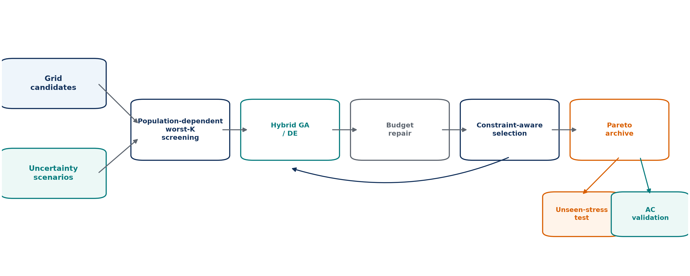
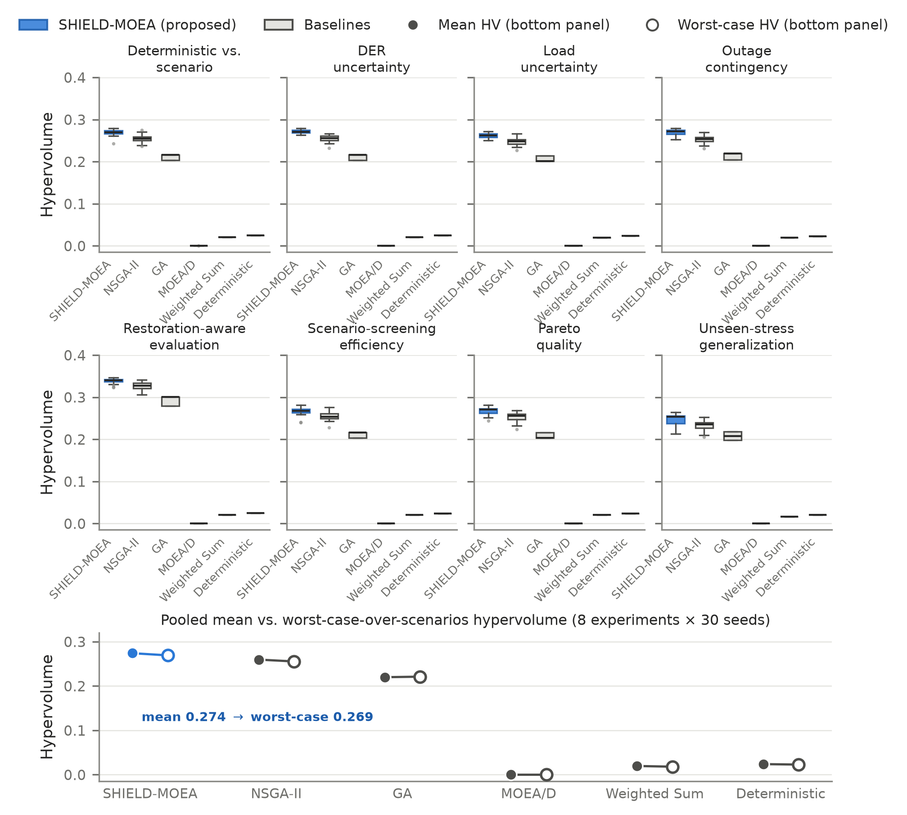
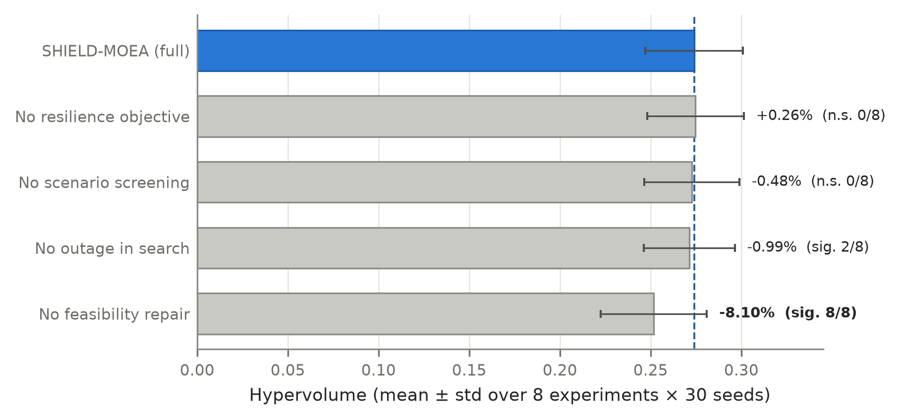
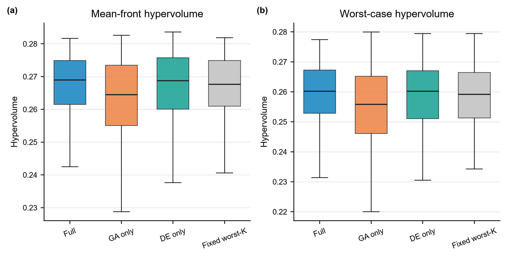
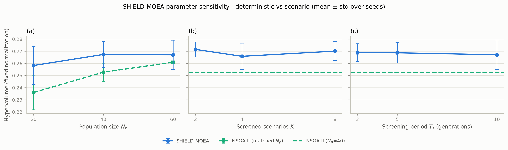
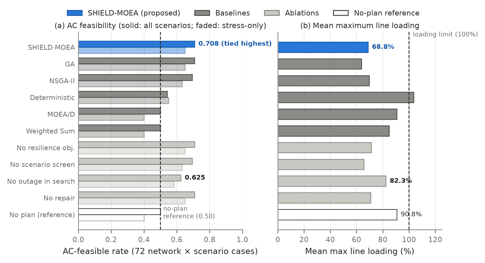
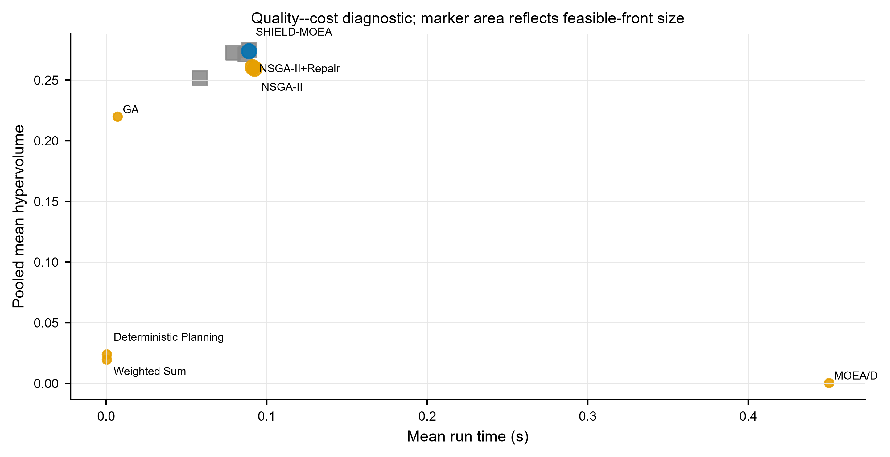
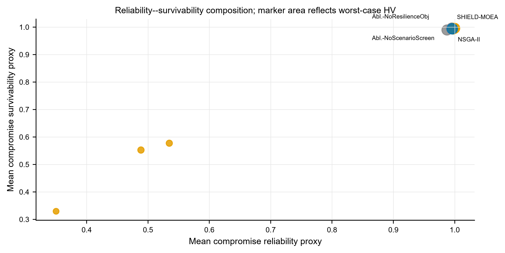
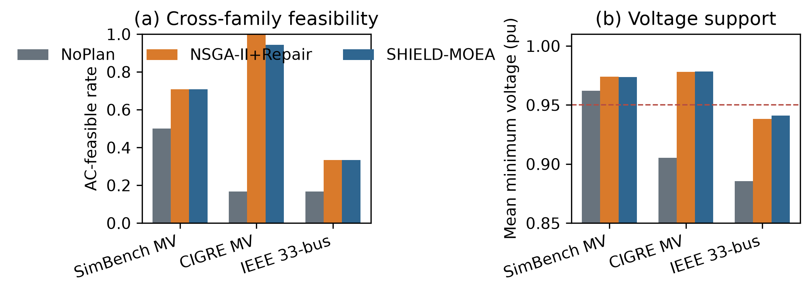

<!-- MDPI Energies submission manuscript.
     Paper: mintou_p4 / SHIELD-MOEA.
     Target section: Smart Grids and Microgrids (alt: Electrical Power and Energy Systems).
     All numerical claims verified against:
       papers/mintou/mintou_p4_shield_resilience_planning/evidence/runs/real_simbench_planning_results.csv
       papers/mintou/mintou_p4_shield_resilience_planning/evidence/tables/real_simbench_planning_leaderboard.csv
       papers/mintou/mintou_p4_shield_resilience_planning/evidence/tables/real_simbench_planning_significance.csv
       papers/mintou/mintou_p4_shield_resilience_planning/evidence/tables/real_ac_validation_summary.csv
       papers/mintou/mintou_p4_shield_resilience_planning/evidence/tables/real_sensitivity_sweep.csv
     Figures in ./figures/ (300 dpi PNG; regenerate with figures/make_figures.py).
-->

# SHIELD-MOEA: Scenario Screening with Disjoint Evaluation for Distribution-Network Resilience Planning

**Authors:** [AUTHOR INPUT REQUIRED: final author list and ORCIDs]
**Affiliations:** [AUTHOR INPUT REQUIRED: complete institutional addresses]
**Correspondence:** [AUTHOR INPUT REQUIRED: corresponding author name and e-mail]

## Abstract

Distribution network planning under load, distributed-energy-resource, and outage uncertainty requires portfolios that remain useful as binding stresses change. SHIELD-MOEA extends non-dominated sorting with selective worst-scenario screening and disjoint scenario draws for search and final evaluation. On a reproducible SimBench-derived benchmark with 72 candidate actions, five objectives, and eight uncertainty experiments, the method reaches pooled mean hypervolume 0.2740 over 30 seeded runs per stochastic method. This is 5.09% above the strongest repair-matched baseline and 5.56% above plain NSGA-II. All 32 comparisons with four stochastic baselines are Holm-significant wins; sixteen gaps to two deterministic rules are descriptive and favor SHIELD-MOEA. The margin persists for sampled worst-envelope hypervolume (+5.36%) and under evaluation stresses outside the search ranges (+6.04%). Feasibility repair carries the main measured gain. Screening reduces recorded search-phase plan--scenario evaluations by 65%, although no front-quality difference is detected against no screening; hybrid variation and periodic re-screening are also unresolved against simpler controls. A 1296-case composition-level AC check across six networks yields aggregate feasibility 0.685, compared with 0.389 without planning and 0.694 for matched-repair NSGA-II. The evidence supports a disjoint-evaluation planning workflow and selective scenario exposure, while identifying repair--rather than every named operator--as the resolved performance mechanism.

**Keywords:** distribution network planning; power system resilience; scenario screening; multi-objective evolutionary optimization; DER uncertainty; NSGA-II; SimBench; AC power flow validation

---

## 1. Introduction

Resilience has moved from the margins of distribution planning to its center. Storm-driven outages, heat-wave load peaks, rooftop photovoltaics, and other distributed energy resources (DERs) create stress combinations not represented by historical load-duration curves. Reliability-report archives document the resulting operational and economic consequences [1,2]. At the same time, feeder reinforcement, storage, DER integration, and automation interact through a shared budget, and their value depends on the realized stress scenario. The planning decision is therefore inherently multi-objective: investment cost against losses, voltage exposure, reliability, and survivability under outages, all under scenario uncertainty.

Current methods leave a gap at the interface between the optimizer and the uncertainty model. Robust planning formulations can focus on a single worst case and scalarize the objective space, limiting visibility of the cost-resilience trade surface [3,4]. Evolutionary multi-objective methods expose that surface, but commonly evaluate candidates on a scenario set fixed before search [5,6]. The scenarios binding for mature plans, however, may differ from those affecting the initial population. When the same scenario sample steers and grades the search, sample-specific adaptation is also difficult to distinguish from robustness. Distribution utility planning departments instead require investment fronts that remain defensible under stress scenarios not used to tune the plans.

This paper proposes SHIELD-MOEA, a scenario-selective extension of non-dominated sorting for distribution resilience planning. The algorithm retains a standard multi-objective backbone--crowding-based selection, hybrid GA/DE variation, and greedy feasibility repair--and places its contribution at the optimizer--uncertainty interface. Every few generations, it identifies the $K$ scenarios on which the current population performs worst and uses them for search-phase fitness. The final front is evaluated on a complete scenario set generated with disjoint random seeds, preventing direct reuse of search realizations in the reported score. We report mean and sampled worst-envelope hypervolume and supplement the proxy evaluation with pandapower AC power flow.

Real resilience-investment records are utility-internal, so evaluation uses a reproducible SimBench-derived benchmark [7]. Statistics from the 18 highest-stress subnets generate 72 candidate actions. Eight experiments vary load, DER, and outage uncertainty, including an unseen-stress setting whose evaluation scenarios are harsher than the search scenarios. Candidate generation is shared with CARS-MODE (Section 2.4), as declared in the Data Availability Statement.

The contributions of this paper are:

1. **A disjoint-evaluation protocol for scenario-aware evolutionary planning.** SHIELD-MOEA scores final fronts on scenario draws not used during search, preventing direct reuse of the realizations that guided optimization. An unseen-range experiment provides an additional test of search-range specialization (Sections 4.3 and 4.6).
2. **A selective worst-$K$ screening mechanism with quantified evaluation economy.** At the default configuration, screening reduces recorded search-phase plan--scenario evaluations by 65% (51,200 to 17,920). No front-quality difference is detected against no screening, and periodic re-screening remains unresolved against a fixed generation-1 subset; screening is therefore an exposure-and-economy mechanism rather than a demonstrated quality mechanism (Section 6.3).
3. **A statistically grounded framework result with component attribution.** Over eight experiments and 30 seeds per stochastic method, SHIELD-MOEA reaches pooled mean hypervolume 0.2740, +5.09% over matched-repair NSGA-II and +5.56% over plain NSGA-II, with 32/32 Holm-significant stochastic-baseline wins. Repair is the dominant resolved component (-8.10% when removed), whereas hybrid variation, dynamic re-screening, and the explicit resilience objective remain unresolved against their direct controls (Sections 6.1 and 6.3).
4. **Sampled-envelope, sensitivity, and cross-family AC diagnostics.** The method retains +5.36% sampled worst-envelope HV and +6.04% in the unseen-range experiment. A 1296-case pandapower check across six networks yields aggregate feasibility 0.685 versus 0.389 without planning, while matched-repair NSGA-II reaches 0.694. A one-at-a-time parameter sweep reports the setting at which separation from NSGA-II is lost ($N_p=60$, $p=0.104$) rather than presenting only favorable points (Sections 6.2, 6.4, and 6.5).

Screening concentrates search-phase effort on difficult scenarios. At the default setting, it removes 65% of plan--scenario evaluations without a detected change in mean front quality; the screening-off ablation differs by -0.48%, and periodic re-screening does not outperform a generation-1 fixed worst-$K$ set. Because the present objectives are closed-form, the call reduction does not translate into lower wall-clock time at this scale. Screening therefore supplies selective exposure and evaluation economy, while repair carries the resolved component gain.

The paper proceeds as follows. Section 2 reviews related work. Section 3 defines the planning problem and the public benchmark. Section 4 describes SHIELD-MOEA. Section 5 gives the experimental protocol. Section 6 reports results, Section 7 discusses them, Section 8 states limitations, and Section 9 concludes.

---

## 2. Related Work

SHIELD-MOEA draws on three bodies of literature that have so far evolved largely in parallel: resilience-oriented distribution planning under N-k and extreme-weather uncertainty, scenario generation and reduction for stochastic power system optimization, and hybrid multi-objective evolutionary algorithms with robustness-aware objectives. Below we discuss each thread and identify the gap that motivates this paper.

### 2.1. Resilience-Oriented Distribution Planning and Hardening Decisions

Panteli and Mancarella [8] distinguish high-impact, low-probability events from ordinary reliability and hardening from operational adaptation. Bhusal et al. [9] document the rapid growth of planning-stage resilience research. The dominant paradigm is robust optimization over an $N-k$ or weather-driven uncertainty set. Yuan et al. [3] formulate a two-stage robust problem with adversarial component outages. Ma et al. [5] extend this logic to joint hardening and distributed-generation placement with wind-dependent fragility, while Lin and Bie [6] add reconfiguration and DG islanding. Panteli et al. [10] connect weather intensity to component failure through fragility curves.

Practice-oriented studies consider resilient storage siting [11], zone-wise planning under decision-dependent uncertainty [12], and genetic-algorithm-driven feeder hardening [13]. Related work addresses resilient renewable microgrids [14] and islanding with fault recovery [15]. A parallel strand grounds planning claims in full AC physics. Mahmoudi and Alizadeh quantify errors caused by linearized expansion-planning models [16], while Trivic and Savic combine NSGA-II storage planning with power-flow analysis [17]. This evidence motivates the AC validation layer in Section 6.5.

A consistent pattern emerges across these studies. The trilevel robust models protect against a single worst case and collapse the objective space to one scalar, so the planner never sees the cost-resilience trade surface. The metaheuristic studies expose multiple objectives, but they evaluate candidate plans on a scenario set fixed before the search starts, and the same scenarios serve both to steer the search and to grade its output. None of them guards against a plan that has quietly overfitted the scenario sample it was optimized on.

### 2.2. Scenario Generation, Reduction, and Screening in Stochastic Power System Optimization

The second thread represents uncertainty through scenarios. Classical reduction selects a subset while minimizing probability distance; reference approaches include the Fortet–Mourier formulation [18] and forward/backward reduction [19]. Power-system applications adopted these methods early [20], and importance sampling made stochastic unit commitment tractable [21]. Generative models later reproduced spatiotemporal renewable behavior without parametric assumptions [22]. Applications include stochastic microgrid dispatch [23], distribution reconfiguration [24], and joint siting and sizing [25].

Recent work moves scenario machinery inside optimization. Li et al. learn an ambiguity set for distributionally robust DG planning [26], while Zhou et al. use extreme-event scenarios in integrated energy planning [27]. Decision-dependent uncertainty [28] is the closest mathematical-programming analogue to a scenario set that changes with candidate decisions. Wu et al. preserve extreme wind, PV, and load combinations during generation [29], paralleling the worst-$K$ focus used here.

Most reductions are executed once, judged by distributional fidelity, and reused for every evaluation. The scenarios guiding search are therefore also used to grade the result. This distinction may be less important in a single monolithic solve. In population search, however, thousands of plans are compared while the binding scenarios can change with the population. SHIELD-MOEA separates search guidance from final scoring and tests whether updating the guidance subset adds value.

### 2.3. Hybrid Multi-Objective Evolutionary Algorithms and Robustness-Aware Objectives

The third thread concerns the optimizer. NSGA-II [30] and MOEA/D [31] remain common frameworks, with hypervolume [32] measuring front quality. Differential evolution [33] supplies mutation behavior complementary to GA crossover, and Das and Suganthan [34] review blended DE strategies. Jin and Branke [35] survey optimization under uncertain fitness, while Deb and Gupta [36] treat robustness as an objective over perturbation neighborhoods.

Recent work evaluates candidate solutions across fixed scenario sets [37] or combines decision preferences with variable-level uncertainty [38]. In both cases, the uncertainty set remains fixed during the run. SHIELD-MOEA tests periodic scenario-subset updates and, through a fixed worst-$K$ control, whether those updates matter.

Recent power-planning studies hybridize evolutionary variation. Examples include an improved NSGA-II for storage-and-EV co-optimization [39], a three-stage TER-NSGA-II for resilient backbone-grid planning [40], and an enhanced beluga whale optimizer for storage planning [41]. Under uncertainty, such methods commonly average fitness over a fixed scenario sample or solve a robust reformulation before evolutionary search. The former incurs repeated evaluation cost, whereas the latter leaves the scenario set outside the evolving search state.

SHIELD-MOEA instead treats the evaluated scenario subset as a search-time quantity. The subset is periodically updated toward scenarios that are difficult for the current population. Evaluation on a disjoint scoring set then reports both mean and sampled worst-case hypervolume. The targeted controls in Section 6.3 test whether periodic updating adds value beyond a fixed generation-1 worst-$K$ set.

### 2.4. Relation to CARS-MODE and Gap Statement

CARS-MODE [42] also studies evolutionary distribution planning on public benchmark-derived portfolios. It adapts DE control parameters and repairs budget violations in an economic DER-and-storage setting. SHIELD-MOEA instead studies the optimizer–uncertainty interface. Its NSGA-II kernel combines GA/DE variation and repair, while screening supplies search scenarios that remain disjoint from the final scoring draws. Load, DER, and outage perturbations define the resilience setting. Only candidate generation is shared; the methods and claims are independent.

The gap lies at the interface of search and uncertainty. Resilience studies often grade a robust solution or Pareto front on the same scenarios that guide optimization. Offline reduction is blind to the evolving population, while hybrid MOEAs usually adapt operators rather than exposure. SHIELD-MOEA combines worst-scenario screening, disjoint-draw final scoring, and sampled worst-case hypervolume reporting. The fixed worst-$K$ control determines whether the adaptive update, rather than screening alone, is necessary.

---

## 3. Problem Formulation and Public Benchmark

### 3.1. Resilience-Oriented Planning as Scenario-Aware Multi-Objective Selection

Let $\mathcal{A}=\{a_1,\ldots,a_n\}$ be the candidate-action pool. Action $a_i$ has cost $k_i$ and effect coefficients $(l_i,u_i,h_i,r_i,g_i)$ for loss reduction, voltage-risk reduction, hosting-capacity gain, reliability gain, and resilience gain. These coefficients are derived from public network statistics as described in Section 3.2. A plan is a binary vector $x\in\{0,1\}^n$. Uncertainty is represented by $s=(\lambda,\delta,\sigma)$, where $\lambda$ is a load multiplier, $\delta$ is a DER-output multiplier, and $\sigma\in[0,1]$ is outage severity.

For plan $x$ under scenario $s$, the benchmark defines

$$
\begin{aligned}
L(x,s)&=\max\!\left(0.015,L_0\lambda-\frac{1}{120}\sum_{i=1}^{n}l_i x_i\right),\\
U(x,s)&=\max\!\left(0.005,U_0\lambda-\frac{1}{10}\sum_{i=1}^{n}u_i x_i\right),\\
R(x)&=\min\!\left(1,0.35+\frac{1}{28}\sum_{i=1}^{n}r_i x_i\right),\\
S(x,s)&=\min\!\left(1,0.42(1-\sigma)+\frac{1}{24}\sum_{i=1}^{n}g_i x_i\right).
\end{aligned}
$$

Here, $L_0$ and $U_0$ are network-level coefficients computed once from aggregate SimBench statistics. $L$ is a loss index, $U$ is a voltage-risk index, $R$ is a reliability proxy, and $S$ is a survivability proxy. The restoration-aware experiment replaces $L$ with

$$
L^{e}(x,s)=L(x,s)\left[1+0.30\sigma\bigl(1-S(x,s)\bigr)\right],
$$

which couples loss exposure to plan survivability. With investment cost $C(x)=\sum_{i=1}^{n}k_i x_i$ and scenario set $\mathcal{S}$, the five-objective problem is

$$
\begin{aligned}
\min_{x\in\{0,1\}^{n}}\quad
F(x)=\Big(&C(x),\ \mathbb{E}_{s\in\mathcal{S}}[L(x,s)],\
\mathbb{E}_{s\in\mathcal{S}}[U(x,s)],\\
&-R(x),\ -\mathbb{E}_{s\in\mathcal{S}}[S(x,s)]\Big)\\
\text{subject to}\quad &C(x)\leq B.
\end{aligned}
$$

The budget $B$ is the only hard constraint, and violation is measured as relative budget overrun. $L$, $U$, $R$, and $S$ are transparent engineering proxies rather than power-flow solutions. Electrical claims are therefore delegated to the separate AC validation in Section 6.5.

### 3.2. Candidate Pool Derived from SimBench

Candidate attributes derive deterministically from the SimBench complete mixed dataset [7]. The 18 subnets with the highest combined load and line-length stress are extracted from the load, line, and RES tables. Each supplies reinforcement, storage, DER-integration, and automation actions. Cost and effect coefficients are analytic functions of load, reactive load, line length, line count, renewable capacity, and loading.

The resulting pool contains $n=72$ candidates under nominal budget $B=920$, which makes roughly one sixth of the pool affordable. Every attribute traces to public data through published rules. The pool is a reproducible proxy rather than a costed engineering catalog, and its cost unit is synthetic (Section 8).

### 3.3. Scenario Model and the Eight Experiments

Each experiment fixes ranges for the three scenario coordinates and draws |S| = 16 scenarios uniformly with a fixed seed. Two independent scenario sets exist per experiment: a search set (seed A) that methods may use during optimization, and an evaluation set (seed B, disjoint) on which every reported metric is computed. Table 1 lists the eight experiments.

**Table 1.** The eight experiments. Ranges are uniform sampling intervals for (load multiplier lambda, DER multiplier delta, outage severity sigma).

| Experiment | lambda range | delta range | sigma range | Distinguishing feature |
|---|---|---|---|---|
| deterministic_vs_scenario | 0.95-1.25 | 0.7-1.3 | 0.00-0.25 | reference uncertainty setting |
| der_uncertainty | 0.95-1.25 | 0.4-1.7 | 0.00-0.25 | widened DER volatility |
| load_uncertainty | 0.85-1.45 | 0.7-1.3 | 0.00-0.25 | widened load band |
| outage_contingency | 0.95-1.25 | 0.7-1.3 | 0.10-0.55 | elevated outage severity |
| restoration_aware_evaluation | 0.95-1.25 | 0.7-1.3 | 0.10-0.55 | expected-loss objective L^e |
| scenario_screening_efficiency | 0.95-1.25 | 0.7-1.3 | 0.00-0.25 | screening-workload accounting |
| pareto_quality | 0.95-1.25 | 0.7-1.3 | 0.00-0.25 | front-quality replicate |
| unseen_stress_generalization | 0.95-1.25 (search) | 0.7-1.3 (search) | 0.00-0.25 (search) | evaluation from non-overlapping ranges: lambda in [1.3,1.6], delta in [1.4,1.9], sigma in [0.4,0.7] |

The last experiment is the strictest test of the disjoint-evaluation design: its evaluation scenarios are drawn from ranges that never intersect the search ranges, so any method that has specialized to its training scenarios is penalized at scoring time.

### 3.4. Shared Public Benchmark Statement

The SimBench-derived candidate-generation code is one versioned public artifact shared between this paper and the companion CARS-MODE study [42], so that the two methodologically independent algorithms remain comparable on a common footing. Everything downstream -- the scenario model, the uncertainty experiments, the screening mechanism under test, the evaluation protocol, and all analyses -- is specific to this paper.

---

## 4. SHIELD-MOEA

Figure 1 closes the method's scenario-search loop. Each population induces a worst-K screened scenario subset, the hybrid variation operators generate candidate plans, budget repair restores feasibility, and robust environmental selection returns survivors. Unseen-stress and AC evaluations branch from the final archive and remain outside the optimization loop.



**Figure 1.** SHIELD-MOEA architecture. Scenario screening is population dependent; the feedback arrow denotes generational updating. The two validation branches use held-out stress scenarios or AC power flow and do not feed into selection.

SHIELD-MOEA exposes screening, repair, outage information, and the resilience objective as individual switches in the main ablation study. Additional matched controls compare hybrid variation with GA-only and DE-only search and periodic re-screening with a fixed generation-1 worst-$K$ subset. This separation permits direct attribution for the main switches and targeted tests of the two multi-option mechanisms. The method is a resilience-oriented extension of NSGA-II [30]: it retains constraint-dominated non-dominated sorting and crowding-distance selection, and adds hybrid variation, scenario screening, and feasibility repair.

**Formal definitions.** For binary plan \(x\), cost feasibility is

$$
C(x)=\sum_{j=1}^{n}c_jx_j,\qquad v_B(x)=\max(0,C(x)-B).
$$

Let \(f_q(x;s)\) be minimized objective \(q\) under search scenario \(s\). At a screening generation, population-level scenario severity is

$$
\rho_t(s)=\frac{1}{|P_t|}\sum_{x\in P_t}
\sum_{q=1}^{Q}\omega_q\,\tilde f_q(x;s),
$$

and the active subset is the worst \(K\) scenarios,

$$
\mathcal S_t^{K}=\operatorname*{arg\,max}_{\substack{\mathcal A\subseteq\mathcal S_{\mathrm{search}}\\|\mathcal A|=K}}
\sum_{s\in\mathcal A}\rho_t(s).
$$

Between screening generations the active set is held fixed. Search fitness averages over that set,

$$
\bar f_q^{\,K}(x;t)=\frac{1}{K}\sum_{s\in\mathcal S_t^K}f_q(x;s).
$$

The GA channel applies uniform crossover followed by independent bit mutation,

$$
o_j^{GA}=\begin{cases}x_j^{(a)},&U_j<0.5,\\x_j^{(b)},&\text{otherwise},\end{cases}
\qquad
o_j^{GA}\leftarrow1-o_j^{GA}\ \text{with probability }1/n .
$$

For the DE channel, a relaxed donor is formed and mapped to a stochastic bit,

$$
z=g_{r_1}+F(g_{r_2}-g_{r_3}),\qquad
o_j^{DE}\sim\operatorname{Bernoulli}\!\left(0.08+0.82\,\mathbb I[z_j\geq0.5]\right).
$$

Repair removes the least aggregate benefit per cost,

$$
j^-=\operatorname*{arg\,min}_{j:x_j=1}
\frac{\sum_q\omega_q b_{jq}}{c_j},\qquad x_{j^-}\leftarrow0,
$$

repeating until \(v_B(x)=0\). Held-out evaluation forms both mean and componentwise-worst objective vectors,

$$
f_q^{\mathrm{mean}}(x)=\frac{1}{|\mathcal S_{\mathrm{eval}}|}
\sum_{s\in\mathcal S_{\mathrm{eval}}}f_q(x;s),\qquad
f_q^{\mathrm{worst}}(x)=\max_{s\in\mathcal S_{\mathrm{eval}}}f_q(x;s).
$$

Their hypervolumes use separately prespecified normalization bounds and the standard dominated-volume definition,

$$
HV_z(\mathcal P;r_z)=\lambda_Q\!\left(
\bigcup_{x\in\mathcal P}\prod_{q=1}^{Q}
[\tilde f_{q,z}(x),r_{q,z}]\right),\qquad
z\in\{\mathrm{mean},\mathrm{worst}\}.
$$

Under the implemented schedule, the objective-call count is

$$
C_{\mathrm{screened}}=GN_uK+N_rN_p|\mathcal S|=12{,}800+5{,}120=17{,}920,
$$

where union evaluation and ranking-round evaluation are disjoint terms. This is an implementation objective-call count, not a wall-clock claim.

### 4.1. Non-Dominated Sorting Kernel (NSGA-II Framework)

The kernel maintains a population of 40 binary plans over 40 generations. Environmental selection is constraint-dominated non-dominated sorting (feasible plans dominate infeasible ones; infeasible plans compare by budget violation) with crowding-distance truncation, following the standard NSGA-II procedure [30]. Initial plans are sparse random selections (3-18% density) repaired to the budget. Rationale: a standard, well-understood kernel ensures that whatever advantage appears is attributable to the scenario interface, not to bespoke selection machinery.

### 4.2. Hybrid GA/DE Variation

Each generation produces 40 offspring. Half use uniform crossover followed by bit-flip mutation at rate $1/n$. The other half use binary rand/1 differential evolution in relaxed space, followed by stochastic bit sampling with probabilities 0.9 and 0.08 for high and low activation. GA recombination preserves co-selected action blocks, while DE introduces direction-informed variation. Section 6.3 tests whether this hybrid improves on DE-only and GA-only controls.

### 4.3. Worst-K Scenario Screening (The Adaptive Interface)

At generation 1 and every $T_s = 5$ generations thereafter, the algorithm evaluates the current population on each of 16 search scenarios, ranks scenarios by the population's mean normalized scalarized objective (worst first), and retains the top $K = 4$. Until the next screening event, parent--offspring selection uses only the active set. Let $N_p=40$, $N_u=2N_p=80$, $G=40$, $|\mathcal S|=16$, and $N_r=8$ screening rounds (generations 1, 6, ..., 36). The unscreened code path records $C_{\rm full}=G N_u|\mathcal S|=51{,}200$ plan--scenario evaluations. The screened path records the disjoint terms $C_{\rm active}=G N_uK=12{,}800$ for union selection and $C_{\rm rank}=N_rN_p|\mathcal S|=5{,}120$ for ranking the current population, totaling $17{,}920$. Thus screening reduces this implementation counter by 65%; wall-clock savings are evaluated separately.

### 4.4. Feasibility Repair

Every initial and offspring plan exceeding the budget is repaired greedily: the selected action with the worst aggregate benefit-to-cost ratio is dropped repeatedly until the plan is affordable. Rationale: under a hard budget, penalty-carrying infeasible plans waste population slots and blur dominance comparisons; repair keeps the entire population in the fundable region. The ablation study shows this operator carries the largest share of the method's advantage (Section 6.3).

### 4.5. Resilience Objective and Outage Awareness in Search

The survivability objective -S(x,s) is part of the search-phase objective vector by default; the corresponding ablation hides this column from selection while leaving the final five-objective evaluation untouched. A second, sharper ablation zeroes the outage severity sigma during search only, making the search outage-blind while the evaluation still stresses the plans. These two switches let us ask separately whether seeing the survivability trade-off and experiencing outage stress during search matter -- and the answers turn out to differ (Sections 6.3 and 6.5).

### 4.6. Direct-Reuse-Leakage-Controlled Evaluation and Worst-Envelope Rationale

No method -- proposed, baseline, or ablation -- is ever scored on scenarios it searched on. The evaluation scenario set is drawn with a disjoint random seed (and, in the unseen-stress experiment, from disjoint ranges); hypervolume is computed on the feasible non-dominated front of each method's final population against this set alone. Screening therefore influences which plans are found, but has no channel into how they are graded.

We report two hypervolume variants. The standard mean hypervolume averages each objective over the 16 evaluation scenarios, then computes the dominated volume. The worst-case hypervolume takes the per-objective worst value over the 16 evaluation scenarios before computing the dominated volume. This is a deliberate design choice, not a standard metric: in a resilience context, a plan whose mean performance is high but whose tail scenario is poor (e.g., a plan that collapses under the single worst stress combination) is an unacceptable plan. The worst-case readout is, however, more conservative and its bounds depend on the scenario sample; we present it as a complementary diagnostic to the mean metric, not as a replacement. The two metrics are computed under separate fixed normalization bounds (Section 5.3) and are comparable within their respective columns only.

### 4.7. Algorithm Summary

```
SHIELD-MOEA(candidates, budget, search_scenarios, seed):
  initialize 40 sparse random plans; repair each to budget            # 4.4
  active <- search_scenarios
  for gen = 1 .. 40:
    if screening enabled and gen = 1 (mod 5):                         # 4.3
      score each search scenario by population-mean scalarized fitness
      active <- worst 4 scenarios
    offspring <- 20 by uniform crossover + bit-flip (1/n)             # 4.2
                 + 20 by binary DE (rand/1, stochastic thresholding)
    repair offspring to budget                                        # 4.4
    F <- five-objective values of parents+offspring on active         # 4.5
    population <- constraint-dominated NDS + crowding (top 40)        # 4.1
  return feasible non-dominated front, evaluated on the DISJOINT
         evaluation scenario set only                                 # 4.6
```

---

## 5. Experimental Setup

### 5.1. Methods Compared

Table 2 lists eleven methods: SHIELD-MOEA, six baselines, and four single-switch ablations. Evolutionary baselines use reference implementations from pymoo [43], run on the identical binary problem with the same population size and generation count and with access to all 16 search scenarios.

**Table 2.** Methods compared.

| Method | Role | Description |
|---|---|---|
| SHIELD-MOEA | proposed | NSGA-II-style kernel + GA/DE hybrid variation + worst-K scenario screening + repair |
| NSGA-II | baseline | pymoo NSGA-II, binary encoding, budget as constraint, full scenario set |
| NSGA-II+Repair | baseline | NSGA-II followed by the same deterministic budget-repair rule as SHIELD-MOEA |
| MOEA/D | baseline | pymoo MOEA/D, budget as penalty |
| GA | baseline | single-objective GA on the normalized scalarized objective |
| Weighted Sum | baseline | weighted-benefit greedy fill under budget |
| Deterministic Planning | baseline | cost-first greedy fill under budget |
| Ablation-NoScenarioScreen | ablation | search on all 16 scenarios (screening off) |
| Ablation-NoRepair | ablation | feasibility repair disabled |
| Ablation-NoResilienceObj | ablation | survivability column hidden from search selection |
| Ablation-NoOutage | ablation | outage severity zeroed during search; evaluation unchanged |

### 5.2. Protocol

Each stochastic method runs 30 independent seeds per experiment. Weighted Sum and Deterministic Planning are deterministic: the uniform 2640-row implementation archive retains repeated invocations, but each rule has one effective observation per experiment. The seed-level inferential family therefore contains eight stochastic opponents, including four stochastic baselines and four ablations; sixteen deterministic baseline gaps are descriptive. Seeds are derived from a hash of (experiment, method, seed index), and all population-based methods use population 40 and 40 generations.

### 5.3. Metrics and Statistics

The headline metric is the standard hypervolume of the feasible non-dominated front on the evaluation scenario set, computed with pymoo's exact indicator at reference point 1.1 per normalized dimension. Objective normalization uses fixed, method-independent bounds computed once per experiment from a seeded reference sample (the empty plan, all 72 single-action plans, and 2048 random budget-feasible plans, with a 5% margin), so no method's own output can stretch or shrink the scale. The worst-case hypervolume applies the same construction to the per-objective worst value over the 16 evaluation scenarios, under its own fixed bounds; it is comparable across methods within the worst-case column (not against the mean column, whose normalization differs). An empty feasible front scores zero.

Statistical comparisons are two-sided Mann--Whitney U tests between SHIELD-MOEA and each of eight stochastic opponents per experiment ($n=30$ per group), with Holm correction [44] within each experiment. Rank-biserial correlation and 5000-resample bootstrap intervals report effect size and mean-difference uncertainty. The deterministic rules receive point comparisons without seed-level p-values. All reported conclusions use the method-independent standard hypervolume defined below.

For reproducibility, the transformations between raw objectives, fronts, statistics, and the AC check are specified explicitly. For objective $j$, the fixed reference sample supplies lower and upper bounds $l_j$ and $u_j$; every feasible objective vector is mapped by

$$
\tilde f_j(x)=\min\!\left\{1,\max\!\left[0,\frac{f_j(x)-l_j}{u_j-l_j}\right]\right\}.
$$

The feasible non-dominated set returned by method $m$ in experiment $e$ and seed $r$ is

$$
\mathcal{P}_{mer}=\left\{x\in\mathcal{X}_{mer}:C(x)\leq B,\ \nexists y\in\mathcal{X}_{mer}\text{ with }\tilde F(y)\prec\tilde F(x)\right\}.
$$

With reference point $z^{\mathrm{ref}}=(1.1,\ldots,1.1)$, the primary score is the dominated union volume

$$
HV(\mathcal{P}_{mer})=\lambda_d\!\left(\bigcup_{x\in\mathcal{P}_{mer}}[\tilde F(x),z^{\mathrm{ref}}]\right),
$$

where $\lambda_d$ denotes $d$-dimensional Lebesgue measure. The tail-oriented readout replaces each scenario-dependent objective by its observed maximum on the frozen evaluation scenarios,

$$
f_j^{\mathrm{wc}}(x)=\max_{s\in\mathcal{S}_{\mathrm{eval}}}f_j(x,s),
$$

before applying the same fixed-bound hypervolume construction. For two seed samples of size $n_1$ and $n_2$, the reported rank statistic is

$$
U_1=n_1n_2+\frac{n_1(n_1+1)}{2}-\sum_{i=1}^{n_1}R_i,
$$

and the monotone Holm adjustment over the $M$ within-experiment comparisons is

$$
p^{\mathrm{Holm}}_{(i)}=\max_{k\leq i}\min\!\left\{1,(M-k+1)p_{(k)}\right\}.
$$

Finally, screening workload is reported independently of wall-clock time. Including both active-set union evaluation and the full-set ranking rounds, the recorded reduction relative to full-scenario union evaluation is

$$
\eta_{\mathrm{screen}}=1-\frac{GN_uK+N_rN_p|\mathcal S|}{GN_u|\mathcal S|}=1-\frac{17{,}920}{51{,}200}=0.65.
$$

The separate AC layer declares a mapped case feasible only when all three engineering conditions hold:

$$
I_{\mathrm{AC}}=I(\mathrm{converged})\,I\!\left(0.95\leq V_b\leq1.05\ \forall b\right)I\!\left(L_\ell\leq100\%\ \forall \ell\right).
$$

---

## 6. Results

### 6.1. Main Comparison

Table 3 pools all 8 experiments x 30 seeds; Figure 2 shows the per-experiment distributions for the six main methods and the pooled mean-versus-worst-case panel.

**Table 3.** Pooled leaderboard across eight experiments. Stochastic methods have 240 runs; deterministic rules summarize eight unique outputs retained as 240 repeated provenance rows.

| Method | Role | Mean HV | Std | Worst-case HV | Mean front size | Mean runtime (s) |
|---|---|---|---|---|---|---|
| Ablation-NoResilienceObj | ablation | 0.27467 | 0.02667 | 0.26976 | 38.9 | 0.089 |
| **SHIELD-MOEA** | **proposed** | **0.27396** | **0.02700** | **0.26911** | **38.9** | **0.089** |
| Ablation-NoScenarioScreen | ablation | 0.27266 | 0.02627 | 0.26804 | 38.9 | 0.079 |
| Ablation-NoOutage | ablation | 0.27125 | 0.02511 | 0.26610 | 38.4 | 0.087 |
| NSGA-II | baseline | 0.25953 | 0.02816 | 0.25541 | 40.0 | 0.092 |
| NSGA-II+Repair | baseline | 0.26070 | 0.02696 | 0.25654 | 40.0 | 0.091 |
| Ablation-NoRepair | ablation | 0.25176 | 0.02919 | 0.24649 | 39.7 | 0.058 |
| GA | baseline | 0.21987 | 0.02811 | 0.22107 | 1.0 | 0.007 |
| Deterministic Planning | baseline | 0.02387 | 0.00124 | 0.02282 | 1.0 | 0.0004 |
| Weighted Sum | baseline | 0.01963 | 0.00146 | 0.01805 | 1.0 | 0.0004 |
| MOEA/D | baseline | 0.00047 | 0.00002 | 0.00047 | 1.0 | 0.450 |

SHIELD-MOEA attains pooled mean hypervolume 0.27396 (std 0.02700), 5.09% above NSGA-II+Repair (0.26070) and 5.56% above plain NSGA-II. Repair explains part of the advantage, but targeted controls do not assign the remainder uniquely to screening or hybrid variation. All 32 comparisons with four stochastic baselines are Holm-significant wins, with no significant loss to any stochastic opponent. Weighted Sum and Deterministic Planning are lower in all sixteen descriptive experiment-level gaps and receive no seed-level tests.

**Table 4.** SHIELD-MOEA vs. NSGA-II. Intervals are pointwise, multiplicity-unadjusted 5000-resample bootstrap CIs for the mean HV difference; $r_{rb}$ is rank-biserial correlation. Holm correction covers eight stochastic opponents per experiment and determines the significance statements.

| Experiment | SHIELD | NSGA-II | $\Delta HV$ (95% CI) | $r_{rb}$ | Holm p |
|---|---:|---:|---:|---:|---:|
| deterministic_vs_scenario | 0.26959 | 0.25444 | 0.01515 [0.01096, 0.01945] | 0.791 | 5.89e-7 |
| der_uncertainty | 0.27137 | 0.25471 | 0.01665 [0.01340, 0.01988] | 0.971 | 6.56e-10 |
| load_uncertainty | 0.26211 | 0.24772 | 0.01439 [0.01080, 0.01802] | 0.842 | 1.10e-7 |
| outage_contingency | 0.26982 | 0.25224 | 0.01757 [0.01335, 0.02176] | 0.862 | 5.05e-8 |
| restoration_aware_evaluation | 0.33878 | 0.32708 | 0.01170 [0.00793, 0.01577] | 0.736 | 5.14e-6 |
| scenario_screening_efficiency | 0.26703 | 0.25481 | 0.01221 [0.00738, 0.01675] | 0.700 | 1.33e-5 |
| pareto_quality | 0.26652 | 0.25276 | 0.01375 [0.00882, 0.01868] | 0.676 | 2.89e-5 |
| unseen_stress_generalization | 0.24650 | 0.23247 | 0.01403 [0.00761, 0.02033] | 0.571 | 7.47e-4 |

The margin is largest in outage_contingency (+6.97%) and der_uncertainty (+6.54%) and remains positive in unseen_stress_generalization (+6.04%). The latter tests resistance to the frozen search ranges; it does not certify absence of scenario-distribution specialization.

Three baseline behaviors deserve honest annotation rather than silence. First, MOEA/D collapses on this problem (pooled HV 0.00047): with the budget handled as a penalty, its decomposition weights drive it to near-empty portfolios (mean selected actions 0.004). We report it as configured and note that a constraint-domination variant might fare better; the competitive comparison is carried by NSGA-II. Second, the single-solution methods (GA, Weighted Sum, Deterministic Planning) return one plan by construction, so their hypervolume measures the quality of a point, not a front. Third, runtimes are of the same order for the population methods (SHIELD-MOEA 0.089 s vs. NSGA-II 0.092 s per run at this instance size); no efficiency claim is made from wall-clock at this scale.



**Figure 2.** Hypervolume distributions across eight experiments (30 seeds per box for stochastic methods); deterministic rules are point estimates. The bottom panel pairs each method's pooled mean HV (filled) with its sampled worst-envelope HV (open).

### 6.2. Sampled Worst-Envelope Readout

SHIELD-MOEA's pooled sampled worst-envelope HV is 0.26911, +5.36% above NSGA-II's 0.25541 and close to its mean-HV margin. Within the evaluation sample, no mean--envelope reversal is observed against this baseline. This diagnostic describes the 16 sampled scenarios; it is not a bound on unobserved tail behavior.

### 6.3. Ablation Study: Where the Gain Actually Comes From

Figure 3 compares the full method against the four single-switch ablations, pooled over all experiments and seeds.



**Figure 3.** Mean hypervolume (+/- std over 8 experiments x 30 seeds) of SHIELD-MOEA and the four ablations. Callouts give the relative difference to the full method and the number of experiments (out of 8) in which the difference is Holm-significant.

The attribution, stated without embellishment:

- **Feasibility repair is the main contributor.** Disabling it costs 8.10% of pooled hypervolume (0.25176 vs. 0.27396) and is Holm-significant in all 8 experiments. Without repair, offspring that overshoot the budget survive as infeasible passengers, and the feasible front the evaluator extracts is built from a thinner effective population.

- **Outage exposure is associated with a larger AC composition difference in outage-heavy settings.** Under the primary within-experiment opponent families, zeroing outage severity is significant in outage_contingency ($p=0.032$) and restoration_aware_evaluation ($p=0.009$). Under the supplementary outage-ablation family across eight experiments, only restoration_aware_evaluation remains significant ($p=0.024$; outage_contingency $p=0.075$). The fixed-mapping AC layer shows a descriptive composition difference (Section 6.5), not a seeded causal effect.

- **Scenario screening reduces recorded evaluations without a resolved front-quality difference.** The screening-off ablation is nominally 0.48% higher and is unresolved in every experiment. Screening removes 65% of the implementation's plan--scenario objective calls (Section 4.3), but equivalence was not tested. At this instance size, bookkeeping offsets the call reduction in wall-clock time (0.089 s versus 0.079 s per run); a deployment-time saving remains a hypothesis for simulators with expensive scenario evaluation.

- **The explicit resilience objective does not raise mean hypervolume -- a negative result we retain in the headline.** Hiding the survivability column from search selection yields a pooled mean of 0.27467, nominally +0.26% above the full method, not Holm-significant in any experiment (0/8; the per-experiment mean difference ranges from -0.0035 to +0.0039 in absolute HV, i.e., the sign itself is unstable). The mechanistic reading is that survivability, as constructed, is correlated with the reliability objective through shared resilience-bearing actions (storage, automation), so four-objective search selects nearly the same plans. We keep the objective because it exposes the cost-survivability trade-off explicitly on the returned front -- a decision-support property the planner loses otherwise -- but we do not claim it improves search quality.

**Targeted variation and screening controls.** Three additional controls use the identical eight experiments, 30 seeds, population, generations, search/evaluation split, normalization, and evaluation budget (720 runs). Pooled mean HV is 0.27425 for DE-only, 0.27408 for a worst-$K$ set fixed after generation 1, 0.27396 for SHIELD-MOEA, and 0.27014 for GA-only. After Holm correction within each experiment, the full hybrid significantly exceeds GA-only in 3/8 experiments and is inseparable in the other five; it is inseparable from DE-only and fixed worst-$K$ in all eight. Thus the data support neither a hybrid-variation gain nor a dynamic-re-screening gain. The narrower interpretation is that the full stack is strong relative to the external baselines, repair is load-bearing, and screening reduces objective-call count; DE-only and one-shot worst-$K$ are credible engineering simplifications on this benchmark.

Figure 4 shows the seed-level distributions for those controls. The pooled view is descriptive because scenario-specific scales differ; the formal verdict remains the per-experiment Holm analysis. It nevertheless makes both null results visible: the full method overlaps DE-only and fixed worst-K, while GA-only is lower in only part of the experiment set.



**Figure 4.** Seed-level mechanism controls across eight experiments (240 runs per method). (a) Mean-front hypervolume; (b) worst-case hypervolume. Boxes pool experiments and seeds and are therefore descriptive. Per-experiment Holm tests show no separation between the full method and DE-only or fixed worst-K in 8/8 experiments; the full method exceeds GA-only in 3/8.

### 6.4. Parameter Sensitivity Analysis

We performed a one-at-a-time sensitivity analysis on the reference experiment (deterministic_vs_scenario). The sweep covers population size $N_p\in\{20,40,60\}$ (default 40, with NSGA-II rerun at each matched size), screening width $K\in\{2,4,8\}$ (default 4), and screening period $T_s\in\{3,5,10\}$ (default 5). Each point uses 10 independent seeds. Figure 5 and Table 5 summarize the results.

**Table 5.** Exploratory parameter sweep (10 seeds per point). Reported Mann--Whitney p-values are nominal and multiplicity-unadjusted.

| Parameter | Value | SHIELD-MOEA HV (mean +/- std) | NSGA-II reference | p (MWU) |
|---|---|---|---|---|
| population size N_p | 20 | 0.2583 +/- 0.0155 | 0.2360 | 0.011 |
| population size N_p | 40 (default) | 0.2674 +/- 0.0108 | 0.2527 | 0.007 |
| population size N_p | 60 | 0.2671 +/- 0.0120 | 0.2610 | 0.104 |
| screening width K | 2 | 0.2715 +/- 0.0062 | 0.2527 | 0.0003 |
| screening width K | 4 (default) | 0.2658 +/- 0.0108 | 0.2527 | 0.014 |
| screening width K | 8 | 0.2701 +/- 0.0079 | 0.2527 | 0.001 |
| screening period T_s | 3 | 0.2688 +/- 0.0074 | 0.2527 | 0.0008 |
| screening period T_s | 5 (default) | 0.2687 +/- 0.0085 | 0.2527 | 0.002 |
| screening period T_s | 10 | 0.2671 +/- 0.0121 | 0.2527 | 0.017 |

Note: the default configuration (population 40, K=4, T_s=5) appears once per sweep axis, so the table contains three default rows; they show slightly different SHIELD-MOEA means (0.2674, 0.2658, 0.2687) because each axis is drawn from an independent 10-seed stream -- a normal consequence of sampling variance, not an inconsistency. For the same reason the NSGA-II reference is identical (0.2527) across the K and T_s rows, which reuse the matched population-40 reference, while the population-size rows re-run NSGA-II at each matched size (0.2360, 0.2527, 0.2610).



**Figure 5.** Parameter sensitivity over population size, screening width $K$, and screening period $T_s$ (10 seeds per point; NSGA-II re-run at matched population sizes).

SHIELD-MOEA has a higher mean than NSGA-II at all nine parameter points, with a smallest absolute margin of 0.0061. Its mean varies by 5.0% of the default value across the sweep; the $K$ and $T_s$ axes vary by 2.1% and 0.6%, respectively. At $N_p=60$, the raw comparison is unresolved ($p=0.104$). Because the sweep has no confirmatory multiplicity family, the section supports only descriptive sensitivity patterns.

### 6.5. AC Power-Flow Validation on Six Distribution Networks

Hypervolume on proxy objectives cannot certify electrical feasibility. The seed-0 compromise composition from each method and experiment is therefore mapped onto four SimBench MV networks (rural, semi-urban, urban, and commercial), the CIGRE MV benchmark, and the IEEE 33-bus feeder. Fixed rules parallel the most-loaded lines, attach storage to the weakest-voltage load buses at ±3% of net load, and add PV equal to 4% of net load at the highest-load buses. Automation has no steady-state effect. The identical mapping logic is used across network families; no per-network optimizer tuning is performed.

Pandapower [45] solves AC power flow under base, 1.3x peak, 1.5x growth, 1.8x extreme growth, high-DER backfeed, and 1.5x growth with an $N-1$ outage. The AC layer covers deterministic_vs_scenario, der_uncertainty, and outage_contingency, which expose the reference, widened DER, and elevated outage axes. A case is feasible when power flow converges, voltages remain within $[0.95,1.05]$ pu, and line loading does not exceed 100%.

Each of the twelve planning/reference configurations faces $3\times6\times6=108$ cases, for 1296 AC solves in total. The readout is a qualitative composition-level consistency check, not a seeded replication of the proxy comparison. Table 6 reports the aggregate results; Section 6.7 separates the network families.

**Table 6.** AC validation summary over six networks (108 cases per method).

| Method | Role | AC-feasible rate | Stress-only feasible | Mean min Vm (pu) | Mean max loading (%) | Mean losses (MW) |
|---|---|---|---|---|---|---|
| NoPlan | reference | 0.389 | 0.333 | 0.940 | 78.6 | 0.569 |
| NSGA-II+Repair | baseline | 0.694 | 0.633 | 0.969 | 52.7 | 0.373 |
| Ablation-NoRepair | ablation | 0.694 | 0.633 | 0.969 | 54.3 | 0.384 |
| SHIELD-MOEA | proposed | 0.685 | 0.622 | 0.969 | 52.7 | 0.377 |
| Ablation-NoResilienceObj | ablation | 0.685 | 0.622 | 0.970 | 56.0 | 0.384 |
| NSGA-II | baseline | 0.667 | 0.611 | 0.967 | 52.8 | 0.376 |
| GA | baseline | 0.667 | 0.600 | 0.969 | 48.1 | 0.362 |
| Ablation-NoScenarioScreen | ablation | 0.630 | 0.567 | 0.965 | 51.5 | 0.390 |
| Ablation-NoOutage | ablation | 0.574 | 0.533 | 0.969 | 67.0 | 0.463 |
| Weighted Sum | baseline | 0.417 | 0.333 | 0.945 | 73.7 | 0.537 |
| Deterministic Planning | baseline | 0.417 | 0.400 | 0.971 | 132.0 | 1.194 |
| MOEA/D | baseline | 0.389 | 0.333 | 0.940 | 78.6 | 0.569 |



**Figure 6.** Original SimBench-family AC slice. (a) AC-feasible rate over 72 network-by-scenario cases and over stress scenarios only; the dashed line is the no-plan reference. (b) Mean maximum line loading. The cross-family extension is reported in Table 6 and Figure 9.

Three findings, in decreasing order of importance:

1. **The plans improve aggregate feasibility but do not lead the field.** SHIELD-MOEA's compositions are AC-feasible in 68.5% of cases (62.2% under stress-only), against a no-plan reference of 38.9% (33.3% stress-only). Mean minimum voltage improves from 0.940 to 0.969 pu and mean maximum loading falls from 78.6% to 52.7%. Matched-repair NSGA-II is slightly higher in feasibility (69.4%), so no AC-superiority claim is made.

2. **Outage-aware search is the component the physics layer differentiates.** The NoOutage ablation--identical except that search never experiences outage severity--drops to an AC-feasible rate of 0.574 (0.533 stress-only), while mean maximum loading rises to 67.0%. This is composition-level differential evidence, not a seeded causal estimate; it shows that the proxy-level ablation understates a physically relevant change.

3. **A cautionary baseline result.** Cost-first Deterministic Planning attains only a 0.417 AC-feasible rate and mean maximum loading 132.0%, because cheap actions add load-side assets without relieving binding corridors. Its loss value is also the largest in Table 6.

### 6.6. Quality--Cost and Resilience-Composition Diagnostics

The pooled leaderboard alone cannot distinguish a method that is accurate but computationally wasteful from one that obtains a comparable front with less scenario exposure. Figure 7 therefore places each principal method in the mean-hypervolume/runtime plane using all archived experiment-seed records. The chart is descriptive: runtimes are sub-second and proxy evaluation is vectorized, so the horizontal coordinate is not a deployment benchmark. It nevertheless shows that SHIELD-MOEA occupies the high-hypervolume region with a runtime comparable to NSGA-II, whereas the penalty-based MOEA/D configuration is both slower and ineffective on the constrained binary problem. The strongest nominal result belongs to the NoResilienceObjective ablation, not to the full method; its difference from SHIELD-MOEA is only 0.26%, and the contrast remains unresolved in all eight experiments.



**Figure 7.** Mean hypervolume versus mean runtime over the eight experiments and 30 seeds. Marker area represents mean feasible-front size. The proposed method is highlighted for identification, not to imply statistical dominance over the neighboring ablations.

**Table 7.** Selected pooled quality--cost readouts from the archived run records.

| Method | Mean HV | Mean runtime (s) | Relative HV vs. SHIELD | Interpretation |
|---|---:|---:|---:|---|
| SHIELD-MOEA | 0.27396 | 0.0889 | 0.00% | full pipeline |
| NoScenarioScreen | 0.27266 | 0.0792 | -0.48% | no detectable quality loss from screening removal |
| NSGA-II | 0.25953 | 0.0924 | -5.27% | strongest standard evolutionary reference |
| NoRepair | 0.25176 | 0.0583 | -8.10% | repair is load-bearing |

Tables 3 and 7 use the same archived run records, with Table 7 retaining more decimals for selected methods. With $K=4$ of 16 scenarios, active-set union evaluation is 75% smaller than full-scenario union evaluation. Eight full-set ranking rounds add 5120 calls, yielding 17,920 calls versus 51,200 (65% lower). These are objective-call counts, not measured energy or time savings.

Figure 8 separates the mean robustness score from its reliability and survivability components. SHIELD-MOEA has pooled reliability 0.9958, survivability 0.9940, and worst-case HV 0.2691. NSGA-II has slightly higher reliability (0.9972) but lower worst-case HV (0.2554); NoScenarioScreen has slightly higher survivability (0.9954) and a similar worst-case HV (0.2680). These crossed rankings are exactly why the paper does not describe the explicit resilience objective or dynamic screening as independently accuracy-improving mechanisms.



**Figure 8.** Pooled reliability and survivability of compromise portfolios derived from the frozen evaluation records; marker area represents worst-case hypervolume. The three readouts remain separately encoded rather than being collapsed into a synthetic index.

**Table 8.** Mechanism-level decision record.

| Question | Evaluated comparison | Statistical result | Supported conclusion |
|---|---|---|---|
| Is repair necessary? | SHIELD vs. NoRepair | significant in 8/8 experiments | yes, for front quality |
| Is a front-quality difference detected for screening? | SHIELD vs. NoScenarioScreen | no significant difference in 8/8 | no difference detected; equivalence not tested |
| Is periodic re-screening better than a fixed worst-$K$ set? | SHIELD vs. fixed generation-1 worst-$K$ | no significant difference in 8/8 | not established |
| Does hybrid variation beat DE-only? | SHIELD vs. DE-only | no significant difference in 8/8 | not established |
| Does outage exposure matter electrically? | SHIELD vs. NoOutage in AC layer | feasible rate 0.685 vs. 0.574 | supported as a composition-level check |

Taken together, the diagnostics define the supported mechanism claims. The full pipeline is competitive in proxy quality and has higher sampled worst-case HV than the tested stochastic baselines, but the current instance is too cheap for a wall-clock speed claim. Its supported elements are deterministic repair, measured scenario-call reduction, disjoint-draw scoring, and a descriptive outage-aware composition check. Hybridization and periodic re-screening remain unresolved design choices awaiting a harder simulator-backed benchmark.

### 6.7. Cross-Family AC Transportability

Figure 9 separates the expanded AC evidence by network family. On the four SimBench networks, SHIELD-MOEA retains the original 0.708 feasible rate. On CIGRE MV it reaches 0.944, compared with 0.167 for no planning, but matched-repair NSGA-II reaches 1.000. On IEEE 33-bus, both SHIELD-MOEA and matched-repair NSGA-II reach only 0.333, compared with 0.167 for no planning. The low absolute IEEE rate shows that a composition rule calibrated on SimBench does not automatically transfer to a radial feeder, even when it improves on doing nothing.



**Figure 9.** AC-feasible rates and mean minimum bus voltage by network family for the no-plan reference, SHIELD-MOEA, and NSGA-II with matched repair. The dashed voltage line marks the 0.95 pu criterion. Each family uses the same three planning experiments and six operating scenarios. SHIELD-MOEA improves over no planning in every family but does not outperform the matched-repair comparator.

---

## 7. Discussion

**What the evidence supports, component by component.** The framework-level result is a 5.56% pooled margin over plain NSGA-II, 32/32 significant stochastic-baseline comparisons, and positive margins in the sampled worst-case and unseen-range diagnostics. Repair contributes most. Screening reduces recorded calls by 65%, while no quality difference is detected against no screening; periodic re-screening does not beat a fixed generation-1 worst-$K$ set. Hybrid GA/DE does not beat DE-only. The AC composition check shows a lower feasibility rate when outage exposure is removed (0.574 versus 0.685), but this fixed-mapping difference is descriptive rather than a seeded causal estimate. The method should therefore be read as an evaluated pipeline with repair and direct-reuse leakage control, not as evidence that every named operator is necessary.

**Scenario selection as a design axis.** Screening reduces objective calls, and no quality difference is detected against no screening; equivalence is not established. Dynamic updates also do not outperform a fixed generation-1 worst-$K$ set. The supported design principle is selective search evaluation with a disjoint scoring set, not periodic adaptation itself. Using one scenario sample for both search decisions and final grading would leave the reported score vulnerable to scenario overfitting.

**Positioning against CARS-MODE.** The companion study [42] shares only the candidate-derivation pipeline; it self-adapts operator parameters for an economically framed DER-integration problem, while this paper holds operators fixed and makes scenario exposure adaptive for a resilience-framed problem. Neither method contains the other's mechanism.

**Practitioner reading.** The full pipeline produces 4.8–7.0% higher mean hypervolume than matched NSGA-II across the tested regimes. Ablations associate most of this difference with repair rather than screening or hybrid variation. The selected compromise plans have AC-feasible rates within the range of the strongest alternatives and avoid the loading pattern observed for cost-first selection. Removing outage exposure leaves proxy quality nearly unchanged but reduces AC feasibility in the displayed cases, supporting its inclusion when resilience is the planning objective.

---

## 8. Limitations

We state the boundaries of this study explicitly.

1. **Recovery and restoration are not modeled.** The scenario coordinate sigma scales a survivability proxy, and the planning stage does not model post-event restoration, network reconfiguration, or intentional islanding. The N-1 contingency appears only in the AC validation layer. An element-level N-k sampling model with fragility-curve-driven failures and post-event restoration optimization -- in the tradition of [10,11] -- would deepen the resilience claim and simultaneously decorrelate survivability from reliability (Section 6.3).

2. **Costs are synthetic.** Candidate costs are analytic functions of subnet statistics in an uncalibrated cost unit; no engineering-economic conclusion (payback, budget sizing) should be drawn before calibration against published utility investment data.

3. **Single planning benchmark family.** All eight optimization experiments instantiate one 72-candidate pool from one SimBench-derived extraction. CIGRE MV and IEEE 33-bus extend only the AC validation layer; they do not provide independently optimized candidate pools. The component attribution therefore remains specific to the SimBench-derived planning problem.

4. **The AC layer validates plan compositions, not nodal designs.** Compositions are mapped to six networks by fixed placement rules. A nodal siting/sizing formulation on each feeder would provide a stronger transfer test and may change the low IEEE 33-bus feasible rates.

5. **Statistical caveats are part of the record.** The advantage over NSGA-II loses significance at population size 60 in the sensitivity sweep (p = 0.104), the scenario-screening ablation remains unresolved in all eight experiments, and the NoResilienceObj ablation nominally exceeds the full method; none of these facts is smoothed over in Sections 6.3 and 6.4.

6. **Proxy objectives.** The planning-stage objectives are engineering proxies; all electrical statements rest on the pandapower validation layer, and claims outside its coverage (six networks, six scenarios, composition granularity) are not made.

7. **The worst-case hypervolume is sample-dependent.** As a single-sample worst-case readout over 16 scenarios, it does not bound the true extremal performance of any plan; it is a diagnostic complement to the mean metric, not a certification of robustness.

8. **Hybrid and dynamic-screening necessity are not established.** The dedicated controls now exist, but they return null results: hybrid GA/DE is statistically inseparable from DE-only, and periodic re-screening is inseparable from a fixed generation-1 worst-K set in all eight experiments. These mechanisms remain motivated defaults, not demonstrated sources of the headline gain.

---

## 9. Conclusions

This paper asked how an evolutionary resilience-planning method can use selective scenario exposure without grading final fronts on the same realizations that guided search. SHIELD-MOEA combines worst-$K$ screening with disjoint search and evaluation draws and reports sampled worst-envelope hypervolume alongside the mean. The experiments support this separation as a reproducible evaluation design; periodic updating itself does not improve front quality relative to a fixed worst-$K$ control.

The full method has pooled mean hypervolume 5.09% above matched-repair NSGA-II and 5.56% above plain NSGA-II over eight experiments and 30 seeds per stochastic method. It wins all 32 Holm-corrected comparisons with stochastic baselines; sixteen additional deterministic-rule gaps are descriptive and favor SHIELD-MOEA. The method retains a 6.04% mean margin on unseen stress and a 5.36% margin on sampled worst-case hypervolume. Across four SimBench networks, CIGRE MV, and IEEE 33-bus, its mapped compositions improve aggregate AC feasibility over no planning (0.685 versus 0.389) but trail matched-repair NSGA-II (0.694).

Component attribution is narrower. Repair contributes most. Screening reduces recorded objective calls; no mean-hypervolume difference is detected, and equivalence is not established. Dynamic re-screening does not beat fixed worst-$K$; hybrid variation does not beat DE-only; and the resilience objective is a decision-support feature rather than a performance feature. Under the fixed composition mapping, removing outage-aware search reduces six-network AC feasibility from 0.685 to 0.574 and raises mean maximum loading from 52.7% to 67.0%.

Post-event recovery, element-level $N-k$ modeling, monetary calibration, a second independently optimized benchmark system, and nodal AC differentiation remain necessary extensions. Within the tested setting, the main contribution is a scenario-selective planning workflow with disjoint final evaluation, a resolved repair effect, and explicit evidence on where screening and hybridization do not add quality.

---

## Author Contributions

[AUTHOR INPUT REQUIRED: insert the final author list, assign CRediT roles, and obtain approval from every author.] All authors have read and agreed to the published version of the manuscript.

## Funding

[AUTHOR INPUT REQUIRED: insert the verified funder, grant number, and APC funder, or state "This research received no external funding."]

## Institutional Review Board Statement

Not applicable.

## Informed Consent Statement

Not applicable.

## Data Availability Statement

All data used in this study are public. Candidate and scenario experiments derive from the SimBench complete mixed network `1-complete_data-mixed-all-0-sw` (https://simbench.de), while AC validation uses four SimBench MV networks, CIGRE MV, and IEEE 33-bus through pandapower (https://www.pandapower.org). The benchmark code, SHIELD-MOEA implementation, configurations, 2640 main implementation records, 720 targeted-control records, effect and interval tables, cross-scenario ablations, sensitivity sweep, 1296 AC-case records, and figure scripts are included in the supplementary package and are available from the corresponding author. The deterministic rules are treated as $n=1$ per experiment for inference. A persistent public archive can be supplied before publication, subject to source-data terms. Only candidate generation is shared with CARS-MODE [42]; problem formulations, algorithms, run archives, and reported comparisons are paper-specific.

## Acknowledgments

During the preparation of this manuscript, the authors used an AI-assisted coding environment for software development and a large language model for text editing and readability improvement. The authors reviewed and revised all assisted content and take full responsibility for the intellectual content and conclusions of the publication.

## Conflicts of Interest

The authors declare no conflicts of interest.

---

## References

1. Panteli, M.; Mancarella, P. Influence of extreme weather and climate change on the resilience of power systems: Impacts and possible mitigation strategies. *Electric Power Systems Research* **2015**, *127*, 259-270. https://doi.org/10.1016/j.epsr.2015.06.012

2. Ton, D.T.; Wang, W.T.-P. A more resilient grid: The U.S. Department of Energy joins with stakeholders in an R&D plan. *IEEE Power and Energy Magazine* **2015**, *13*(3), 26-34. https://doi.org/10.1109/MPE.2015.2397337

3. Yuan, W.; Wang, J.; Qiu, F.; Chen, C.; Kang, C.; Zeng, B. Robust optimization-based resilient distribution network planning against natural disasters. *IEEE Transactions on Smart Grid* **2016**, *7*(6), 2817-2826. https://doi.org/10.1109/TSG.2015.2513048

4. Mishra, D.K.; Eskandari, M.; Abbasi, M.H.; Sanjeevikumar, P.; Zhang, J.; Li, L. A detailed review of power system resilience enhancement pillars. *Electric Power Systems Research* **2024**, *230*, 110223. https://doi.org/10.1016/j.epsr.2024.110223

5. Ma, S.; Chen, B.; Wang, Z. Resilience enhancement strategy for distribution systems under extreme weather events. *IEEE Transactions on Smart Grid* **2018**, *9*(2), 1442-1451. https://doi.org/10.1109/TSG.2016.2591885

6. Lin, Y.; Bie, Z. Tri-level optimal hardening plan for a resilient distribution system considering reconfiguration and DG islanding. *Applied Energy* **2018**, *210*, 1266-1279. https://doi.org/10.1016/j.apenergy.2017.06.059

7. Meinecke, S.; Sarajlic, D.; Drauz, S.R.; Klettke, A.; Lauven, L.-P.; Rehtanz, C.; Moser, A.; Braun, M. SimBench -- A benchmark dataset of electric power systems to compare innovative solutions based on power flow analysis. *Energies* **2020**, *13*(12), 3290. https://doi.org/10.3390/en13123290

8. Panteli, M.; Mancarella, P. The grid: Stronger, bigger, smarter?: Presenting a conceptual framework of power system resilience. *IEEE Power and Energy Magazine* **2015**, *13*(3), 58-66. https://doi.org/10.1109/MPE.2015.2397334

9. Bhusal, N.; Abdelmalak, M.; Kamruzzaman, M.; Benidris, M. Power system resilience: Current practices, challenges, and future directions. *IEEE Access* **2020**, *8*, 18064-18086. https://doi.org/10.1109/ACCESS.2020.2968586

10. Panteli, M.; Pickering, C.; Wilkinson, S.; Dawson, R.; Mancarella, P. Power system resilience to extreme weather: Fragility modeling, probabilistic impact assessment, and adaptation measures. *IEEE Transactions on Power Systems* **2017**, *32*(5), 3747-3757. https://doi.org/10.1109/TPWRS.2016.2641463

11. Chen, Y.; Shi, Q.; Tang, B.; Zhang, Y.; Wang, H. A distributed energy storage-based planning method for enhancing distribution network resilience. *Energies* **2026**, *19*(2), 574. https://doi.org/10.3390/en19020574

12. Chen, X.; Liu, L.; Kang, X. A differential planning strategy for distribution network resilience enhancement considering decision dependence uncertainty. *Energies* **2025**, *18*(23), 6353. https://doi.org/10.3390/en18236353

13. Maris, T.; Christodoulou, C.; Mladenov, V. Enhancing distribution network resilience using genetic algorithms. *Electronics* **2025**, *14*(21), 4324. https://doi.org/10.3390/electronics14214324

14. Kiptoo, M.K.; Adewuyi, O.B.; Furukakoi, M.; Mandal, P.; Senjyu, T. Integrated multi-criteria planning for resilient renewable energy-based microgrid considering advanced demand response and uncertainty. *Energies* **2023**, *16*(19), 6838. https://doi.org/10.3390/en16196838

15. Yang, Z.; Han, J.; Li, L.; Deng, Y.; Yang, F.; Lei, Y. Research of islanding operation and fault recovery strategies of distribution network considering uncertainty of new energy. *Electronics* **2023**, *12*(20), 4230. https://doi.org/10.3390/electronics12204230

16. Mahmoudi, S.; Alizadeh, B. Simultaneous generation and network expansion planning in large-scale power systems under exact AC power flow equations. *IET Generation, Transmission and Distribution* **2022**, *16*(20), 4158-4175. https://doi.org/10.1049/gtd2.12586

17. Trivic, B.; Savic, A. Optimal allocation and sizing of BESS in a distribution network with high PV production using NSGA-II and LP optimization methods. *Energies* **2025**, *18*(5), 1076. https://doi.org/10.3390/en18051076

18. Dupacova, J.; Growe-Kuska, N.; Romisch, W. Scenario reduction in stochastic programming: An approach using probability metrics. *Mathematical Programming* **2003**, *95*(3), 493-511. https://doi.org/10.1007/s10107-002-0331-0

19. Heitsch, H.; Romisch, W. Scenario reduction algorithms in stochastic programming. *Computational Optimization and Applications* **2003**, *24*(2-3), 187-206. https://doi.org/10.1023/A:1021805924152

20. Morales, J.M.; Pineda, S.; Conejo, A.J.; Carrion, M. Scenario reduction for futures market trading in electricity markets. *IEEE Transactions on Power Systems* **2009**, *24*(2), 878-888. https://doi.org/10.1109/TPWRS.2009.2016072

21. Papavasiliou, A.; Oren, S.S. Multiarea stochastic unit commitment for high wind penetration in a transmission constrained network. *Operations Research* **2013**, *61*(3), 578-592. https://doi.org/10.1287/opre.2013.1174

22. Chen, Y.; Wang, Y.; Kirschen, D.; Zhang, B. Model-free renewable scenario generation using generative adversarial networks. *IEEE Transactions on Power Systems* **2018**, *33*(3), 3265-3275. https://doi.org/10.1109/TPWRS.2018.2794541

23. Babatunde, O.; Fasesin, K.; Dosa, A.; Ighravwe, D.; Ogbemhe, J.; Olanrewaju, O. Multi-stage stochastic MILP framework for renewable microgrid dispatch under high renewable penetration: Optimizing variability and uncertainty management. *Applied Sciences* **2025**, *15*(19), 10303. https://doi.org/10.3390/app151910303

24. Esmaeilnezhad, B.; Amini, H.; Noroozian, R.; Jalilzadeh, S. Flexible reconfiguration for optimal operation of distribution network under renewable generation and load uncertainty. *Energies* **2025**, *18*(2), 266. https://doi.org/10.3390/en18020266

25. Wang, G.; Li, H.; Yang, X.; Lu, H.; Song, X.; Li, Z. Multi-objective site selection and capacity determination of distribution network considering new energy uncertainties and shared energy storage of electric vehicles. *Electronics* **2025**, *14*(1), 151. https://doi.org/10.3390/electronics14010151

26. Li, P.; Shen, Y.; Shang, Y.; Alhazmi, M. Innovative distribution network design using GAN-based distributionally robust optimization for DG planning. *IET Generation, Transmission and Distribution* **2025**, *19*(1), e13350. https://doi.org/10.1049/gtd2.13350

27. Zhou, Y.; Li, X.; Han, H.; Wei, Z.; Zang, H.; Sun, G.; Chen, S. Resilience-oriented planning of integrated electricity and heat systems: A stochastic distributionally robust optimization approach. *Applied Energy* **2024**, *353*, 122053. https://doi.org/10.1016/j.apenergy.2023.122053

28. Yin, W.; Hou, Y. Models and applications of stochastic programming with decision-dependent uncertainty in power systems: A review. *IET Renewable Power Generation* **2024**, *18*(14), 2819-2834. https://doi.org/10.1049/rpg2.13082

29. Wu, X.; Hao, Y.; Zhou, J.; Zhang, X.; Zhang, Y. A scenario generation method for wind/PV power outputs and load sequences preserving extreme scenario characteristics. *IET Renewable Power Generation* **2026**, *20*(1), e70185. https://doi.org/10.1049/rpg2.70185

30. Deb, K.; Pratap, A.; Agarwal, S.; Meyarivan, T. A fast and elitist multiobjective genetic algorithm: NSGA-II. *IEEE Transactions on Evolutionary Computation* **2002**, *6*(2), 182-197. https://doi.org/10.1109/4235.996017

31. Zhang, Q.; Li, H. MOEA/D: A multiobjective evolutionary algorithm based on decomposition. *IEEE Transactions on Evolutionary Computation* **2007**, *11*(6), 712-731. https://doi.org/10.1109/TEVC.2007.892759

32. Zitzler, E.; Thiele, L. Multiobjective evolutionary algorithms: A comparative case study and the strength Pareto approach. *IEEE Transactions on Evolutionary Computation* **1999**, *3*(4), 257-271. https://doi.org/10.1109/4235.797969

33. Storn, R.; Price, K. Differential evolution -- A simple and efficient heuristic for global optimization over continuous spaces. *Journal of Global Optimization* **1997**, *11*(4), 341-359. https://doi.org/10.1023/A:1008202821328

34. Das, S.; Suganthan, P.N. Differential evolution: A survey of the state-of-the-art. *IEEE Transactions on Evolutionary Computation* **2011**, *15*(1), 4-31. https://doi.org/10.1109/TEVC.2010.2059031

35. Jin, Y.; Branke, J. Evolutionary optimization in uncertain environments -- A survey. *IEEE Transactions on Evolutionary Computation* **2005**, *9*(3), 303-317. https://doi.org/10.1109/TEVC.2005.846356

36. Deb, K.; Gupta, H. Introducing robustness in multi-objective optimization. *Evolutionary Computation* **2006**, *14*(4), 463-494. https://doi.org/10.1162/evco.2006.14.4.463

37. Zhao, C.; Zhou, Y.; Lai, X. An integrated framework with evolutionary algorithm for multi-scenario multi-objective optimization problems. *Information Sciences* **2022**, *600*, 342-361. https://doi.org/10.1016/j.ins.2022.03.093

38. Yadav, D.; Ramu, P.; Deb, K. Handling objective preference and variable uncertainty in evolutionary multi-objective optimization. *Swarm and Evolutionary Computation* **2025**, *94*, 101860. https://doi.org/10.1016/j.swevo.2025.101860

39. He, R.; Hao, J.; Zhou, H.; Chen, F. Multi-objective collaborative optimization of distribution networks with energy storage and electric vehicles using an improved NSGA-II algorithm. *Energies* **2025**, *18*(19), 5232. https://doi.org/10.3390/en18195232

40. Ding, J.; Liao, Q.; Tang, F.; Li, B.; Yu, Y.; Zhou, T. Bi-objective resilient backbone-grid planning via a three-stage TER-NSGA-II approach considering pumped-storage hub effects. *Energies* **2026**, *19*(12), 2798. https://doi.org/10.3390/en19122798

41. Qi, H.; Zhao, C.; Yan, X.; Zhang, W.; Guo, F.; Zhang, L.; Yang, B.; Lu, H. Vulnerability-driven multi-objective energy storage planning using enhanced beluga whale optimization for resilient distribution networks. *Energies* **2026**, *19*(1), 210. https://doi.org/10.3390/en19010210

42. Zhang, L.; Zheng, J.; Zhang, Z.; Ni, S.; Wu, G. CARS-MODE: Constraint-Aware Repair and Strategy-Pool Multi-Objective Differential Evolution for Distribution Network Expansion Planning. Unpublished manuscript, 2026; available to editors and reviewers on request.

43. Blank, J.; Deb, K. pymoo: Multi-objective optimization in Python. *IEEE Access* **2020**, *8*, 89497-89509. https://doi.org/10.1109/ACCESS.2020.2990567

44. Holm, S. A simple sequentially rejective multiple test procedure. *Scandinavian Journal of Statistics* **1979**, *6*(2), 65-70.

45. Thurner, L.; Scheidler, A.; Schafer, F.; Menke, J.-H.; Dollichon, J.; Meier, F.; Meinecke, S.; Braun, M. pandapower -- An open-source Python tool for convenient modeling, analysis, and optimization of electric power systems. *IEEE Transactions on Power Systems* **2018**, *33*(6), 6510-6521. https://doi.org/10.1109/TPWRS.2018.2829021
