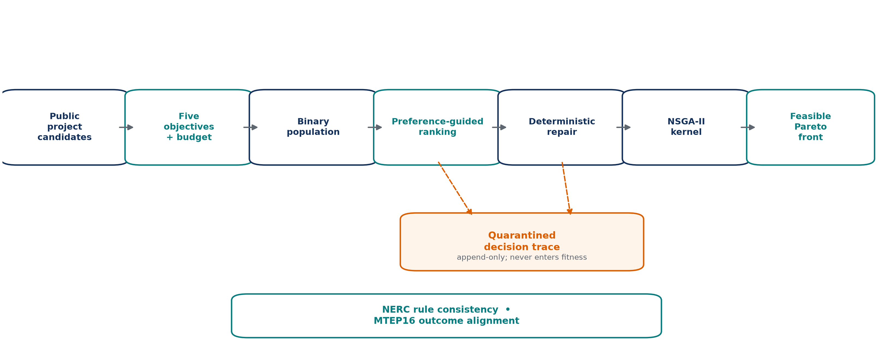
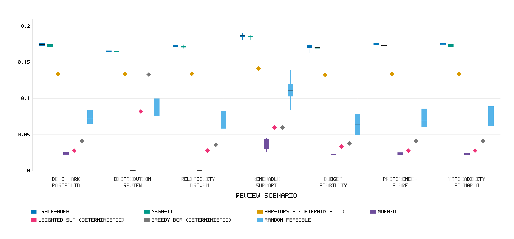
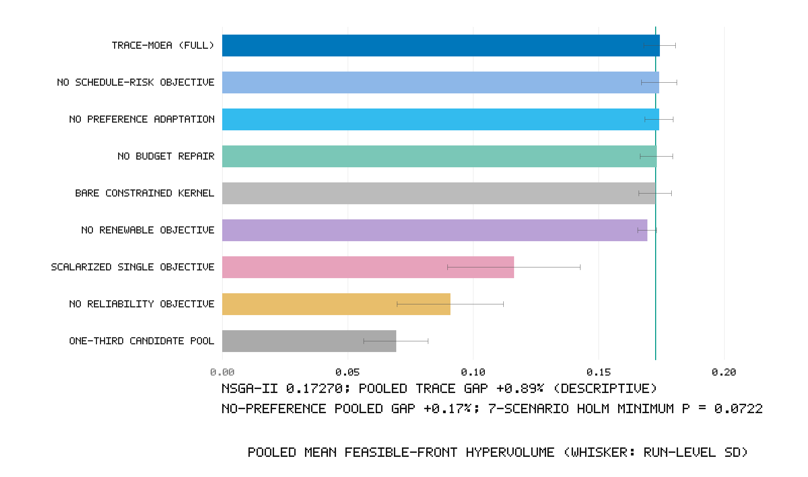
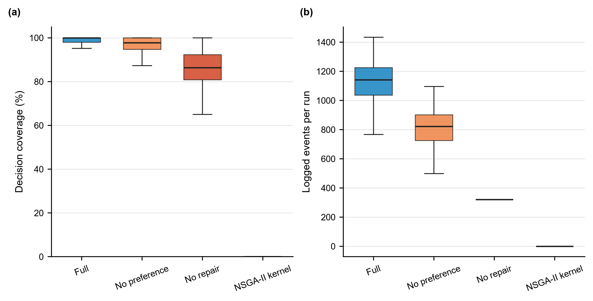
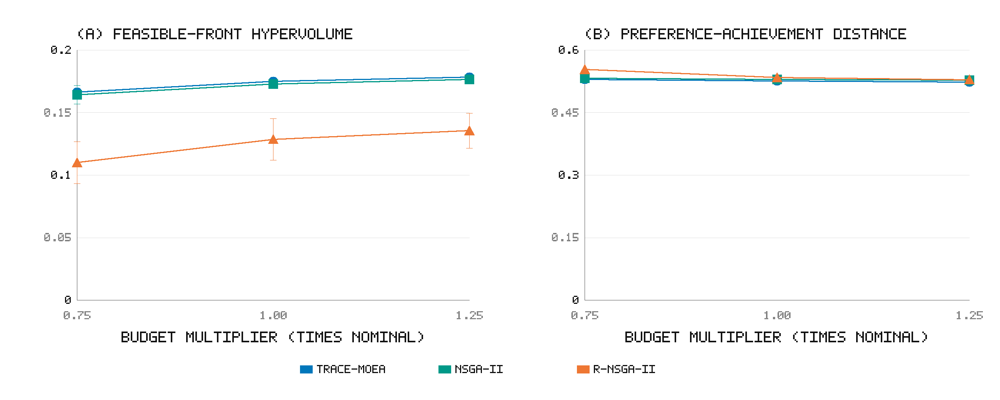
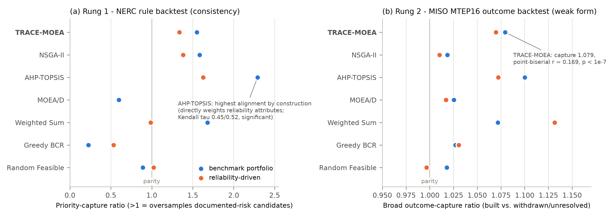
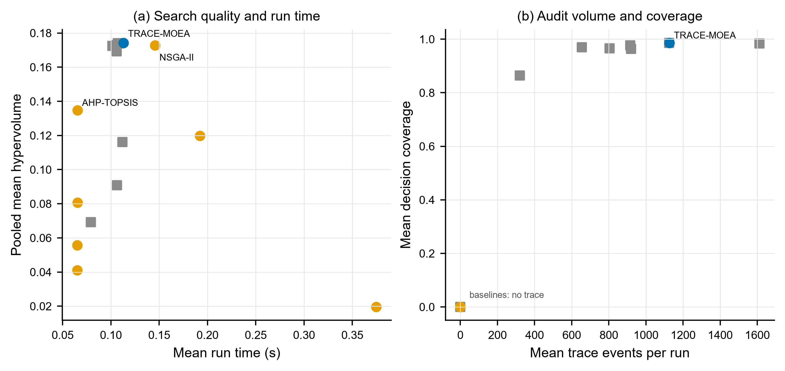
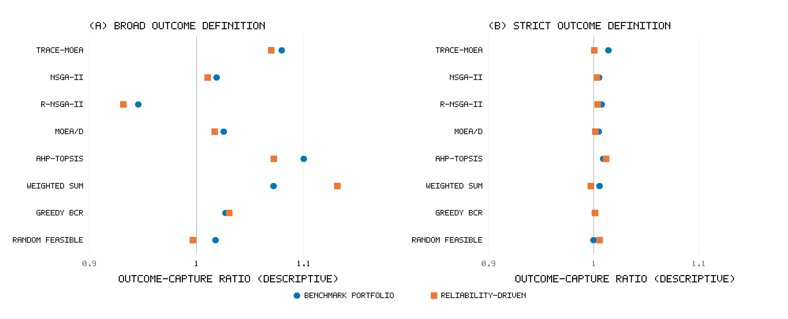

<!-- MDPI Energies submission manuscript.
     Paper ID: mintou_p5 (TRACE-MOEA)
     Section: Electrical Power and Energy Systems
     All quantitative claims verified on 2026-07-16 against evidence files at:
       papers/mintou/mintou_p5_trace_moea_feasibility_review/evidence/tables/real_project_review_leaderboard.csv
       papers/mintou/mintou_p5_trace_moea_feasibility_review/evidence/tables/real_project_review_significance.csv
       papers/mintou/mintou_p5_trace_moea_feasibility_review/evidence/tables/real_nerc_rule_backtest.csv
       papers/mintou/mintou_p5_trace_moea_feasibility_review/evidence/tables/real_mtep_backtest.csv
       papers/mintou/mintou_p5_trace_moea_feasibility_review/evidence/tables/real_budget_sensitivity_075x.csv
       papers/mintou/mintou_p5_trace_moea_feasibility_review/evidence/tables/real_budget_sensitivity_075x_significance.csv
       papers/mintou/mintou_p5_trace_moea_feasibility_review/src/configs/real_project_review_config.json
       experiments/p5_s3_matched_sensitivity/runs/primary_v4/
     Figures: ./figures/ (print-resolution PNG plus PDF/SVG evidence figures;
     regenerate Figures 1--3 and 5 with figures/make_figures.py and Figure 4 with
     scripts/mintou/generate_evidence_gap_figures.py)
     Naming policy: the mechanism is described as "adaptive preference elitism",
     consistent with the measured operation and ROUND2_REVIEW.md finding CL2.
     All AUTHOR INPUT REQUIRED markers below must be completed before submission. -->

# TRACE-MOEA: Constrained Power-Grid Portfolio Search with Adaptive Preference Elitism, Budget Repair, and Run-Level Event Co-Occurrence Summaries

**Authors:** Yubin Lin (林宇彬), Jiyu Li (李继宇), Xiaofei Ruan (阮筱菲), Xiaoyu Huang (黄晓予), Dishan Yang (杨迪珊)
**Affiliations:** Economic and Technological Research Institute of State Grid Fujian Electric Power Co., Ltd., Fuzhou 350000, Fujian, China
**Correspondence:** 18606932711@163.com (Y. Lin)

## Abstract

Utilities reviewing large grid-project queues need constrained portfolio search and inspectable summaries of the search events generated in each run. TRACE-MOEA combines adaptive preference elitism with deterministic budget repair. Released rows retain only event count and pool-local candidate co-occurrence for generated repair and preference records; payloads, replacement flags, stable identifiers, and event order are absent. No event statistic enters evaluation. On a reproducible five-objective, 120-project benchmark, TRACE-MOEA reaches pooled mean hypervolume 0.17425 across seven scenarios and 30 seeds, 0.89% above NSGA-II (0.17270). It has 27 positive mean differences in 28 stochastic-baseline comparisons and 24 Holm-significant wins, with no significant loss. The 21 deterministic-rule gaps favor TRACE-MOEA only under the reported clipped full-front metric. A matched one-output analysis instead exposes objective trade-offs without a universal ordering. Among 16,216 rerun front points, the reported empirical bounds clip 9.79%, 25%-expanded bounds clip 0.95%, and conservative analytic bounds clip none. TRACE-MOEA remains slightly above NoPreferenceRanking under the tested bound/reference schemes, but deterministic ordering changes with normalization. A prespecified formulation/preference scan includes adverse and near-null cells. Removing preference adaptation changes reported pooled hypervolume by 0.17%, with its direct effect unresolved. Main TRACE-MOEA runs show 98.6% event--front position co-occurrence; this is not replay or human-review evidence.

**Keywords:** power grid investment review; constrained portfolio search; multi-objective evolutionary algorithm; adaptive preference elitism; budget repair; event co-occurrence summary; hypervolume

---

## 1. Introduction

Grid operators face more candidate investments than available capital can support. The queue includes line reinforcement, protection and automation retrofits, storage, and renewable-support installations. Expansion-planning research offers mature tools for sizing and routing assets under uncertainty [1,2]. A review board faces a different task: select from predefined projects under a budget, balance reliability, renewable accommodation, and schedule risk, and justify each inclusion to regulators and stakeholders.

The instruments that boards actually use come from multi-criteria decision analysis (MCDA). The AHP and TOPSIS families dominate energy investment appraisal [3,4] and continue to be refined for grid asset prioritization at this journal [5]. Their strength is procedural transparency: weights, pairwise judgments, and closeness scores can all be minuted. Their structural weakness is independent project scoring, which overlooks budget crowding-out and portfolio-level trade-offs. Exact portfolio methods such as Robust Portfolio Modeling address this issue for small pools [6,7], but richer dependencies and larger combinatorial pools can make them computationally difficult. MOEAs offer scalable approximate search [8,9], although a converged front alone does not explain why a project appears in a recommendation.

TRACE-MOEA is designed to search for budget-constrained portfolios while instrumenting two review-specific operations. An adaptive preference-elitism layer maintains objective-weight vectors and can restore their best-response portfolios after environmental selection; every five generations, the vectors are perturbed and greedily reselected according to the dispersion of their induced responses. Deterministic repair removes low-benefit selections until the budget is met. During a run, the implementation generates repair-drop and preference-best-response payloads using pool-local integer positions. The released evidence reduces those payloads to per-run event counts and final-front candidate co-occurrence coverage, and no event statistic enters an objective, constraint, or selection decision.

Because genuine utility review records with feasibility labels are confidential, evaluation is conducted on a reproducible proxy benchmark. The pool of 120 projects is generated by published deterministic rules from RTS-GMLC zones, SimBench networks, and metadata from 40 cached public NERC reliability reports. Seven scenarios cover portfolio optimization, distribution-only review, reliability and renewable preferences, budget tightening, preference-aware support, and traceability. A five-objective formulation encodes the investment-effectiveness lens. A two-rung external-consistency ladder then checks the selected portfolios against a NERC-derived rule and against historical MISO MTEP16 project outcomes.

The paper makes three evidence-bounded contributions:

1. **A constrained portfolio-search architecture.** TRACE-MOEA combines a constrained non-dominated sorting kernel with adaptive preference elitism and deterministic budget repair. The title names these implemented mechanisms; it does not imply that the preference layer has a resolved independent effect.

2. **Run-level event co-occurrence summaries separated from optimization.** Each main-run row reports total event count and final-front candidate co-occurrence coverage for in-memory repair-drop and preference-best-response payloads. These fields are quarantined from objectives and selection. They measure event production and set overlap only; the current evidence package retains neither payload order nor stable project identifiers, replacement flags, or evicted portfolios.

3. **A reproducible, comparison-bounded evaluation.** Seven review scenarios, 30 seeded runs per stochastic method, component controls, a matched three-budget scan, a one-output comparison, and prespecified bound/reference and formulation/preference sensitivity checks separate global front quality from compromise selection. The complete method improves pooled proxy hypervolume over NSGA-II and the implemented R-NSGA-II control under the reported metric, whereas the direct preference-ablation effect is unresolved and deterministic-rule ordering is normalization-dependent. NERC and MTEP16 diagnostics remain descriptive external-consistency checks rather than expert-validated review performance.

The contribution is the measured integration of constrained portfolio search, adaptive preference elitism, deterministic budget repair, and run-level event co-occurrence summaries. These properties are reported separately: the 0.17% preference-ablation difference does not establish an optimization benefit from adaptation, and event co-occurrence coverage does not measure value in contested human decisions.

Section 2 situates the work in three literatures. Section 3 defines the problem and the public benchmark. Section 4 details the algorithm. Section 5 describes the experimental protocol, Section 6 the results, Section 7 the discussion, Section 8 the limitations, and Section 9 concludes.

---

## 2. Related Work

Three research threads intersect in this work: investment portfolio decision methods for power grids, preference-guided evolutionary multi-objective optimization, and the traceability of algorithmic decisions.

### 2.1. Grid Investment Decisions: Optimization and Review Scoring

Transmission expansion planning treats the network topology itself as the decision variable and has been surveyed comprehensively from both the modeling [1] and the practice side [2]; stochastic engineering-economic formulations bring market and regulatory uncertainty into the objective [10]. The present work addresses a different sub-problem: selecting from a pre-specified list of candidate projects under a hard budget, which is the institutional form of most utility investment cycles.

For this sub-problem, the energy-domain literature relies heavily on MCDA. The surveys of Wang et al. [3] and Kumar et al. [4] document the use of AHP and TOPSIS across energy investment appraisal tasks, and this tradition remains active: recent studies combine fuzzy-AHP with distribution-transformer maintenance priorities [5] and explainable multi-criteria scoring with strategic energy-investment ranking [33]. Portfolio-explicit alternatives exist in operational research. Robust Portfolio Modeling (RPM) computes non-dominated project portfolios under incomplete preference information [6] and has been applied to infrastructure maintenance programming [7].

Recent power-system planning studies have strengthened the application layer through coordinated transmission-storage planning [29], interruption-cost estimation for reliability investment [30], grid-side storage investment-return analysis [31], and hybrid exact-heuristic treatment of non-analytical investment costs [32]. These studies provide increasingly detailed engineering or economic validation, but they optimize system expansion or asset configuration rather than a reviewable selection process for a large, pre-specified project queue. Hybrid grid-investment models also couple risk and benefit dimensions using MCDA fronts [11]. The present study addresses a narrower combination: portfolio-level search over more than one hundred candidates, adaptive preference elitism, active budget repair, and run-level event co-occurrence summaries reported independently of the optimization metric.

### 2.2. Preference-Guided Evolutionary Multi-Objective Optimization

Dominance-based MOEAs [8] and decomposition-based ones [9,12] treat all trade-off directions as equally interesting, which motivated two decades of research on preference injection into evolutionary multi-objective optimization. Representative approaches include reference-point guidance [13], achievement-scalarizing function methods [14], preference-modified dominance relations [15], and comprehensive taxonomies of a priori, interactive, and a posteriori preference articulation [16,17].

Two developments in this thread are particularly relevant to the present design. RVEA demonstrated that reference vectors can be adapted during the run to the geometry of the objective space [18], establishing run-time preference adaptation as a legitimate mechanism--though on continuous benchmarks with no constraint repair and no decision recording. The second is the field's empirical evaluation of preference guidance. Li et al. [19] showed that measuring preference-based EMO fairly is itself a hard problem, and a subsequent holistic study found that reference-point guidance can degrade search performance on some problem classes [20]. The present results extend that caution to a constrained binary portfolio problem: the adaptive preference-elitism layer contributes only weakly on top of a well-repaired constrained kernel. The study evaluates that mechanism together with deterministic budget repair and separately reported run-level event summaries; it does not claim that any one component is new in isolation.

### 2.3. Traceability and Explainability of Algorithmic Decisions

The explainable AI (XAI) literature has matured a vocabulary of transparency and post-hoc explanation [21] and an account of what human decision-makers accept as explanations [22], but the object of study is typically the learned predictor rather than the optimization pipeline. The energy-domain XAI survey of Machlev et al. [23] finds applications concentrated in forecasting and security assessment, not in optimization. For metaheuristics specifically, explainability has been identified as an open research direction rather than an available toolbox [24].

Provenance research supplies taxonomies of why, how, and where records are generated [25], while the W3C PROV recommendation standardizes derivation records [26]. The algorithmic-accountability literature further distinguishes process artifacts generated during computation from post-hoc reconstructions [27]. TRACE-MOEA generates repair-drop and preference-best-response payloads during each run and quarantines their aggregate reporting fields from the evaluation objective. The current release preserves counts and pool-local set-overlap coverage rather than a PROV-compliant, ordered, or replayable project-level record.

### 2.4. Differentiation from the Companion Study

The companion project `mintou_p6_bilonsga_project_review` (BiLo-NSGA [28]) uses the same public candidate generator and common benchmark, evaluation, and public-record backtest infrastructure but poses a different mechanism question. It modifies variation through insertion, substitution, and dependency-aware local moves under a hard budget. TRACE-MOEA studies selection-stage adaptive preference elitism, deterministic repair, and run-level event co-occurrence summaries in a five-objective review formulation. The projects share infrastructure and source records; their configurations, executions, run outputs, selected portfolios, statistical comparisons, and claims remain paper-specific.

The independent TRACE-MOEA question concerns four measured elements: constrained search over more than 100 grid candidates, adaptive preference elitism, explicit budget repair, and run-level event co-occurrence summaries quarantined from evaluation. It also tests whether selected portfolios align with public project outcomes rather than only with the benchmark objectives. Its empirical scope is the public proxy and two descriptive external-consistency checks; expert validation of real utility review remains future work.

---

## 3. Problem Formulation and Public Benchmark

### 3.1. Investment-Effectiveness Review as Constrained Five-Objective Selection

Let there be $n$ candidate projects. Candidate $i$ carries a cost $k_i$, a reliability benefit $r_i$, a renewable-accommodation benefit $g_i$, a compliance score $c_i$ (reflecting alignment with regulatory standards), and an evidence score $e_i$ (quantifying how well the project is supported by documented reliability records). Its aggregate schedule-and-implementation risk and review quality are

$$
\rho_i=0.58\rho_i^{\mathrm{sched}}+0.42\rho_i^{\mathrm{impl}},
$$

and

$$
q_i=0.5c_i+0.5e_i,
$$

respectively. A review decision is a binary vector $x\in\{0,1\}^{n}$, with selected-set cardinality $N(x)=\sum_i x_i$.

The selected-project mean risk and mean quality use the implementation's explicit empty-portfolio conventions:

$$
\bar\rho(x)=
\begin{cases}
\dfrac{\sum_{i=1}^{n}\rho_i x_i}{N(x)},&N(x)>0,\\
1,&N(x)=0,
\end{cases}
$$

and

$$
\bar q(x)=
\begin{cases}
\dfrac{\sum_{i=1}^{n}q_i x_i}{N(x)},&N(x)>0,\\
0,&N(x)=0.
\end{cases}
$$

The investment-effectiveness review problem is formalized as minimization of

$$
F(x)=\left(\sum_i k_i x_i,-\sum_i r_i x_i,-\sum_i g_i x_i,\bar\rho(x),-\bar q(x)\right),
$$

subject to

$$
\sum_{i=1}^{n}k_i x_i\leq B.
$$

The normalized budget violation used by constraint domination is

$$
v_B(x)=\max\!\left\{0,\frac{\sum_i k_i x_i-B}{B}\right\}.
$$

The minus signs convert maximization objectives to minimization for the hypervolume computation. Cost and budget are expressed in the same synthetic cost units; $v_B$ is a dimensionless budget-overrun fraction. Reliability, renewable accommodation, risk, compliance, and evidence are proxy indices, not physical or monetary units.

The fifth objective — mean quality — distinguishes investment-effectiveness review from a generic knapsack. It rewards portfolios containing well-evidenced, compliance-strong projects, a property that review boards must assess. Two standard notions are used throughout. A portfolio is non-dominated if no other portfolio is at least as good on all five objectives and strictly better on one. Hypervolume is the normalized objective-space volume dominated by a front relative to a fixed reference point and is the sole optimization-performance metric used here.

### 3.2. Candidate Pool from Public Data

Real review dossiers are not published, so the pool is generated by deterministic, released rules from three public sources. Table 1 summarizes the derivation; the full source profile is available at `evidence/source/real_project_review_source_profile.csv`.

RTS-GMLC zone aggregates (load, branch ratings and outage rates, generator capacities and renewable shares) produce three archetypes per zone — transmission reinforcement, reliability automation, and renewable support — with costs and benefits as analytic functions of the aggregates. The sixteen highest-stress SimBench subnets each yield a feeder-reinforcement, a storage-flexibility, and a protection-automation candidate driven by subnet load, line statistics, and the distributed-resource gap. The metadata of 40 cached public NERC reliability documents (28 event reports) then adjusts attributes at the archetype level: event-report counts raise reliability values uniformly, inverter-based-resource and storage mentions raise the renewable attribute for the two renewable-facing archetypes, and document counts feed the evidence score. The result is 120 candidates in six archetypes with zone- and feeder-level dependency-group structure.

**Table 1.** Candidate pool derivation (source: `evidence/source/real_project_review_source_profile.csv`).

| Public Source | Used Artifact | Candidates | Archetypes |
|---|---|---|---|
| RTS-GMLC | Zone aggregates of bus, branch, and generator source data | 72 | Transmission reinforcement; reliability automation; renewable support |
| SimBench | Complete mixed network, 16 highest-stress subnets | 48 | Feeder reinforcement; storage flexibility; protection automation |
| NERC / C2GES cache | Metadata of 40 public reliability documents | Attribute adjustment | — |
| **Total** | | **120** | 6 archetypes |

The epistemic status of this pool must be stated explicitly: it is an engineering-plausible, fully reproducible proxy whose every attribute traces to public data through published rules. It contains no expert-labeled review outcomes, and its cost coefficients are synthetic units calibrated to grid-case branch and generation statistics rather than to actual utility expenditure records (see Section 8).

### 3.3. Review Scenarios

Seven experiments vary the candidate pool composition and the assumed stakeholder weighting while the evaluation rule remains fixed (Table 2). Bounds are frozen separately for each scenario from its method-independent reference set, and every scenario uses the normalized reference point $(1.1,\ldots,1.1)$. The nominal budget is $B=1160$ synthetic cost units across all scenarios except the budget-stability scenario, where it is tightened to $0.88B$.

**Table 2.** The seven review scenarios (source: `real_project_review_config.json`, lines 7–15). Stakeholder weights parameterize scalarizing baselines and seed one preference vector of TRACE-MOEA; they never enter the evaluation metric.

| Experiment ID | Pool | Budget | Weight Emphasis |
|---|---|---|---|
| benchmark_portfolio_optimization | Full (120) | 1.00 x B | Balanced |
| distribution_project_review | SimBench candidates only | 1.00 x B | Balanced |
| reliability_driven_review | Reliability-related archetypes | 1.00 x B | Reliability +0.22 |
| renewable_accommodation_review | Renewable/storage archetypes | 1.00 x B | Renewable +0.24 |
| budget_ranking_stability | Full | 0.88 x B | Balanced |
| preference_aware_support | Full | 1.00 x B | Compliance +0.16 |
| traceability_evaluation | Full | 1.00 x B | Evidence +0.28, compliance +0.12 |

### 3.4. Shared-Pipeline Declaration

The candidate-generation code of Section 3.2 is a shared artifact used by this paper and by the companion project `mintou_p6_bilonsga_project_review` (BiLo-NSGA [28]). The projects also share source corpora, common execution and evaluation utilities, and public-record backtest infrastructure. The five-objective p5 formulation, p5 scenario and method configurations, executions, run outputs, selected portfolios, statistical comparisons, and claims are paper-specific. The Data Availability statement records this boundary.

---

## 4. TRACE-MOEA

Figure 1 separates optimization state from event-reporting state. Adaptive preference elitism and deterministic budget repair operate around a constrained NSGA-II kernel, while their event payloads are appended to an in-memory per-run list. The event channel has no return edge: no event count, coverage statistic, or event attribute enters an objective, constraint, fitness, or selection rule.



**Figure 1.** TRACE-MOEA architecture and quarantine invariant. Dashed one-way arrows write preference-best-response and repair-drop payloads to the in-memory event list; released run rows retain only count and pool-position co-occurrence summaries. The external checks assess returned portfolios but do not train or tune the optimizer.

The algorithm augments a constrained non-dominated sorting kernel with two switchable search components, adaptive preference elitism and deterministic budget repair, and instruments both with a quarantined per-run event stream. Component ablations and the bare-kernel control separate their optimization and event-summary behavior in Section 6.2.

**Implementation-contract notation.** A portfolio is \(x\in\{0,1\}^{n}\), with minimized five-objective vector, total cost, and dimensionless normalized violation

$$
F(x)=[f_1(x),\ldots,f_5(x)]^\top,\qquad
C(x)=\sum_{j=1}^{n}k_jx_j,\qquad
v_B(x)=\max\!\left\{0,\frac{C(x)-B}{B}\right\}.
$$

Thus $k_j$, $C(x)$, and $B$ share synthetic cost units; $v_B$ has no units. Constraint dominance is

$$
x\prec_c y\iff
[v_B(x)=0<v_B(y)]\lor
[v_B(x)=v_B(y)=0\land x\prec_Py]\lor
[v_B(x),v_B(y)>0\land v_B(x)<v_B(y)].
$$

Preference scoring uses a *generation-local* normalization distinct from the fixed evaluation normalization in Section 5.2. For combined parent--offspring pool $R_t$,

$$
\hat f_{tq}(x)=
\frac{f_q(x)-\min_{y\in R_t}f_q(y)}
{\max\{\max_{y\in R_t}f_q(y)-\min_{y\in R_t}f_q(y),10^{-9}\}},
$$

and, for simplex weight $w_k$,

$$
\psi_{tk}(x)=\sum_{q=1}^{5}w_{kq}\hat f_{tq}(x)
+\lambda_{\mathrm{pref}}v_B(x),\qquad
\lambda_{\mathrm{pref}}=10,
\qquad x_{tk}^\star=\operatorname{firstargmin}_{x\in R_t}\psi_{tk}(x).
$$

The penalty is dimensionless because both terms are dimensionless. In the full method, initialization and offspring are repaired before $R_t$ is formed, so $v_B=0$ and this penalty does not alter its best-response ordering; it remains active in repair-disabled configurations. For scenario weights $\alpha$, the first preference vector is

$$
w_1=\frac{(\alpha_{\mathrm{cost}},\alpha_{\mathrm{rel}},
\alpha_{\mathrm{ren}},\alpha_{\mathrm{risk}},
\alpha_{\mathrm{comp}}+\alpha_{\mathrm{evid}})}
{\alpha_{\mathrm{cost}}+\alpha_{\mathrm{rel}}+\alpha_{\mathrm{ren}}+
\alpha_{\mathrm{risk}}+\alpha_{\mathrm{comp}}+\alpha_{\mathrm{evid}}}.
$$

The scenario's separate load-support weight is not a p5 objective and is not mapped into $w_1$. Seven other weights are sampled independently from Dirichlet$(1,\ldots,1)$. Every fifth generation, each current weight is perturbed by

$$
w'_k=\frac{|w_k+\varepsilon_k|}{\|w_k+\varepsilon_k\|_1},\qquad
\varepsilon_k\sim\mathcal N(0,0.1^2I),
$$

where the absolute value is componentwise; this is the executed absolute-value-plus-renormalization rule, not Euclidean projection. From the $2K$ original and perturbed candidates, one weight is seeded uniformly at random and the remaining weights are added greedily by maximum distance from the already retained response set. This is a randomized greedy max--min heuristic, not a global dispersion optimum.

Budget repair uses the code-level load-support attribute $\ell_j$ and the quality index $q_j$:

$$
s_j=\frac{r_j+g_j+\ell_j+q_j}{\max\{k_j,1\}},
\qquad
j^-=\operatorname{firstargmin}_{j:x_j=1}s_j,
$$

and repeats $x_{j^-}\leftarrow0$ until $v_B(x)=0$. Event append is one-way: if $A_h$ is the in-memory event list and $e_h$ a generated payload, then $A_{h+1}=A_h\mathbin{\|}e_h$, while no $A_h$ field is passed to objective, violation, preference-score, repair-score, or environmental-selection functions. This is a data-flow invariant, not a probabilistic independence claim.

Finally, to avoid overloading $\lambda_{\mathrm{pref}}$, five-dimensional Lebesgue measure is denoted by $\mu_5$. Standard hypervolume is

$$
HV(\mathcal P;r)=\mu_5\!\left(
\bigcup_{x\in\mathcal P}\prod_{q=1}^{5}[\tilde f_q(x),r_q]\right),
$$

with method-independent evaluation bounds and reference point fixed before comparisons.

### 4.1. Constrained Non-Dominated Sorting Kernel

The custom kernel keeps exactly 40 population rows for 40 update generations. For each initial row, a density $p_i\sim U(0.03,0.15)$ is drawn and each candidate bit is Bernoulli$(p_i)$. Each child draws two parent-row indices independently with replacement; a Bernoulli$(0.5)$ mask chooses the parent at every coordinate, and bit-flip mutation is then applied independently at rate $1/n$. There is no separate 0.9 crossover gate in the custom implementation.

Parents and repaired children form an 80-row union. Constraint-dominated non-dominated sorting admits complete fronts, and descending crowding distance truncates the last admitted front. No authored secondary criterion resolves exact crowding ties; the executed NumPy ordering is therefore part of the implementation rather than a scientific preference. Environmental selection produces 40 distinct *union row indices*. Preference replacement preserves the 40-row invariant. Binary genotypes are not deduplicated during search, so equal portfolios may occupy different rows. Only the returned feasible population is deduplicated lexicographically before its non-dominated front, hypervolume, and coverage are computed.

### 4.2. Adaptive Preference Elitism

The layer maintains $K=8$ objective-weight vectors $w_1,\ldots,w_K$ on the five-dimensional simplex, initialized and normalized as specified above. It acts twice per generation cycle:

- **Preference elitism.** For each $w_k$, `firstargmin` selects a best-response row from the parent--offspring union. If that row index is absent after environmental selection, a seeded uniformly random selected slot is replaced by it. Later weights can evict a row restored for an earlier weight. No crowding-, worst-score-, or age-based eviction rule is used, and the payload does not record whether replacement occurred or which row was evicted. Independently of replacement, the implementation appends a `preference_elite` payload with generation, weight-vector index, and the pool-local integer positions selected in the best response. The resulting $8\times40=320$ records per full run are best-response records, not injection or eviction counts.

- **Adaptive re-selection.** Every five generations, the $K$ current and $K$ absolute-value-perturbed weights are evaluated on the same generation-local normalized union. A seeded uniformly random candidate starts the retained set; greedy max--min response dispersion then adds weights until $K$ remain. Exact dispersion ties use the first candidate returned by `argmax`. The procedure is stochastic and greedy, and neither the initial candidate nor the retained-vector indices are exported.

The layer is designed for review settings in which a decision maker cannot specify exact reference points in advance, an assumption common in preference-guided EMO (Section 2.2). It identifies weighting directions that yield distinct feasible portfolios and can preserve representatives from those directions. Whether this mechanism improves hypervolume is evaluated separately; Section 6.2 shows that its isolated pooled effect is small and unresolved after cross-scenario correction.

### 4.3. Budget Repair

Any initial or offspring portfolio that exceeds the budget is repaired by iteratively dropping the selected candidate with the smallest $s_j$: raw reliability, renewable, load-support, and quality proxies are summed and divided by `max(cost, 1)`. These inputs are not normalized, so the rule is an explicitly disclosed proxy heuristic rather than a unit-invariant benefit--cost estimator. Selected indices are enumerated in ascending pool order and `argmin` takes the first minimum; exact score ties therefore drop the smallest pool-local index. Each executed drop appends an in-memory event with the generation and that local index. Conditional on a portfolio and pool ordering, the drop sequence is deterministic.

The purpose of explicit repair is to keep the population inside the fundable region where the review question is actually posed, rather than leaving constraint pressure to selection alone. The ablation `Ablation-NoFeasibilityRepair` disables this operator and relies entirely on constraint-dominated sorting for budget feasibility.

### 4.4. Run-Level Event Schema and Co-Occurrence Counters

Within each run, the implementation appends two payload types to an in-memory list: `repair_drop` contains (`gen`, `event`, `item`), and `preference_elite` contains (`gen`, `event`, `pref`, `items`). The `item` and `items` values are zero-based positions in the current experiment pool. Although the candidate object has a stable `cid` field, that field is not written to these payloads or the released run table. Consequently, the current evidence cannot link an event position across differently filtered pools without replaying the exact pool construction.

- **Defined scope.** Every executed repair drop produces one event, and every weight vector produces one preference-best-response record per generation. Crossover, mutation, actual replacement, eviction, parentage, and retained-weight updates are not logged. A `preference_elite` record therefore identifies a scored best response but does not establish a population change.
- **Quarantine.** No event statistic (count, coverage, or payload attribute) appears in any objective function, constraint inequality, or selection criterion. The event fields are descriptive and are reported separately in Section 6.3.
- **Counters.** Let $D$ be the number of executed repair drops, $U_A$ the set of pool-local positions appearing in any generated payload, and $U_{\mathcal P}$ the set of positions selected in at least one deduplicated final feasible non-dominated portfolio. The released fields are

$$
\texttt{trace\_event\_count}=|A|=D+K T=D+320,
\qquad
\texttt{decision\_coverage}=\frac{|U_A\cap U_{\mathcal P}|}{\max\{1,|U_{\mathcal P}|\}},
$$

for the full method with $K=8$ and $T=40$. The run field `local_move_count` equals $D$ for p5; there is no released per-type event counter or replacement counter. Across 210 proposed-method runs, the means are 1126.25 total records, 806.25 repair drops, and 0.985688 coverage. Coverage is candidate-position co-occurrence after aggregating over the whole run, not same-portfolio causation, chronology, lineage, replay completeness, or human utility.

- **Released summary only.** The evidence package does not persist the ordered payload list. It retains only the two run-level fields above, so readers cannot reconstruct event order, map events to stable project identifiers, identify an evicted portfolio, or replay the population history from the release.

### 4.5. Algorithm Outline

The complete algorithm is summarized as:

```
TRACE-MOEA(pool, B, seed):
  for each of 40 rows: draw p ~ U(0.03, 0.15), sample Bernoulli(p) bits
  repair each row to B; append one repair_drop(gen=0, item=local_index) per drop
  preferences = mapped scenario vector + 7 Dirichlet(1) vectors
  for gen = 1 .. 40:
    draw two parent rows with replacement for each child
    choose each bit by a Bernoulli(0.5) parent mask; flip each bit with prob. 1/n
    repair every child to B; append repair_drop records
    R = parents followed by children
    selected = constraint-dominated NDS; crowding-truncate to 40 row indices
    normalize objectives by current R minima and ranges
    for k = 0 .. 7:
      best = first row minimizing w[k] * normalized_objectives + 10 * violation
      if best row index is absent from selected:
        replace one seeded-uniformly-random selected slot with best
      append preference_elite(gen, pref=k, items=best's pool-local positions)
    if gen mod 5 == 0:
      form absolute-value Gaussian perturbations and L1-renormalize
      seed one candidate weight at random; greedily retain 8 by response dispersion
    population = R[selected]                                      // always 40 rows
  deduplicate feasible returned rows; retain their non-dominated front
  write only total event count and final-front position co-occurrence coverage
```

### 4.6. Configuration and Reproducibility Boundary

The generated main-run JSON configuration records the seven experiment names, method names, 30 seeds, population size 40, generation limit 40, and the fixed hypervolume protocol. It does not serialize $K=8$, $\lambda_{\mathrm{pref}}=10$, the $U(0.03,0.15)$ initialization density, mutation rate $1/n$, five-generation update cadence, perturbation scale 0.1, random eviction, tie behavior, or trace schema. Those executed values are constants in the archived implementation and are disclosed above; the JSON alone is not a complete replay contract. Its legacy method description says "preference coevolution" and "decision trace archive": here the former denotes only weight perturbation/reselection plus elitism, and the latter denotes the ephemeral in-memory event list, not a released archive. The released run rows also omit objective-evaluation counts and actual preference-replacement counts. The new matched-output and sensitivity stage has its own frozen machine-readable configuration, failed/superseded run history, final `primary_v4` directory, and independent exact `reproduction_v1` directory; it does not repair missing state in the original runs.

---

## 5. Experimental Setup

### 5.1. Methods

Table 3 lists the sixteen methods: the proposed algorithm, seven baselines covering evolutionary, preference-based, and MCDM families relevant to grid review, and eight ablations designed to isolate individual components and objective-visibility effects.

Evolutionary baselines are pymoo implementations on the same binary objective problem and use the same row-wise $U(0.03,0.15)$ initialization-density sampler. NSGA-II and R-NSGA-II are explicitly configured with population 40 and `n_gen=40`; they use Boolean two-point crossover and bit-flip mutation, but their operator probabilities are not overridden. The available run configuration does not pin the pymoo version, so those library-default probabilities cannot be certified as archival constants. MOEA/D instead uses the 35 Das--Dennis directions generated for five objectives and three partitions, 10 neighbors, neighbor-mating probability 0.7, and a $10^4v_B$ objective penalty because this call exposes no inequality constraint. The archive retains no `n_eval` field, so equal generation labels do not establish identical objective-call budgets.

R-NSGA-II receives one scenario-derived raw objective-space reference point. With

$$
a=(\alpha_{\mathrm{cost}},\alpha_{\mathrm{rel}},\alpha_{\mathrm{ren}},
\alpha_{\mathrm{risk}},\tfrac12(\alpha_{\mathrm{comp}}+\alpha_{\mathrm{evid}})),
\quad \eta=\frac{a}{\max_q a_q},
$$

the mapping is $z^{\mathrm{pref}}=0.75\mathbf1-0.55\eta$ in the fixed normalized coordinates of Section 5.2 and $p^{\mathrm{ref}}=l+z^{\mathrm{pref}}\odot(u-l)$ in raw objective units. The code passes $p^{\mathrm{ref}}$, `epsilon=0.01`, and population 40 to R-NSGA-II. It does not pass fixed ideal/nadir arrays or override the library's normalization and distance weights. Per-generation internal ideal/nadir values and the executed pymoo version are not serialized, so the available evidence cannot reconstruct them; the fixed $(l,u)$ bounds govern reference-point construction, the reported distance, and hypervolume, but should not be described as R-NSGA-II's internal survival bounds. Scalarizing baselines consume the scenario stakeholder weights of Table 2. No baseline receives a pool restriction or cardinality cap.

**Table 3.** Method matrix (source: `real_project_review_config.json`, lines 33–49).

| Method | Role | One-line Description |
|---|---|---|
| TRACE-MOEA | Proposed | Constrained kernel + adaptive preference elitism + budget repair + run-level event co-occurrence summaries |
| NSGA-II | Baseline | pymoo, constrained, binary encoding |
| R-NSGA-II | Baseline | reference-point NSGA-II using the declared scenario preference point |
| MOEA/D | Baseline | pymoo, Tchebycheff decomposition, budget violation as penalty |
| AHP-TOPSIS | Baseline | Consistent AHP matrix, TOPSIS closeness ranking, greedy budget fill |
| Weighted Sum | Baseline | Weighted-score ranking, greedy budget fill |
| Greedy BCR | Baseline | Benefit-cost ratio greedy fill under budget |
| Random Feasible | Baseline | Random-permutation greedy fill |
| Ablation-NoFeasibilityRepair | Ablation | Repair disabled; constraint domination only |
| Ablation-NoPreferenceRanking | Ablation | Preference-adaptive layer disabled |
| Ablation-NoReliabilityFeatures | Ablation | Reliability objective hidden from search (evaluation unchanged) |
| Ablation-NoRenewableFeatures | Ablation | Renewable objective hidden from search |
| Ablation-NoScheduleRisk | Ablation | Risk objective hidden from search |
| Ablation-SingleObjective | Ablation | Search on scalarized weighted sum |
| Ablation-NSGA2Only | Ablation | Bare kernel: no repair, no preference layer, no trace |
| Ablation-SmallProjectPool | Ablation | Candidate pool reduced to one third (~40 candidates) |

Three ablations (NoReliabilityFeatures, NoRenewableFeatures, NoScheduleRisk) hide one objective from the search while the evaluation remains the full five-objective hypervolume; they measure how critical each review dimension is for the optimizer. Three ablations remove algorithmic components (NoFeasibilityRepair, NoPreferenceRanking, NSGA2Only), and two stress the problem structure (SingleObjective, SmallProjectPool).

### 5.2. Protocol, Metric, and Statistics

The archive contains 16 methods x 7 scenarios x 30 invocations, or 3360 rows. Twelve opponents are stochastic: four baselines (NSGA-II, R-NSGA-II, MOEA/D, and Random Feasible) and eight ablations. AHP-TOPSIS, Weighted Sum, and Greedy BCR are deterministic rules. Their 30 identical invocations are retained for a rectangular provenance table but provide an effective sample size of one per scenario. The candidate pool, budget, and scenario weights are fixed within each scenario.

The metric is the standard hypervolume of the feasible non-dominated front. Objective values are normalized by fixed per-scenario bounds computed once from a seeded, method-independent reference set consisting of the empty portfolio, all singleton portfolios, and 2048 random feasible portfolios. Singleton rows are not feasibility-filtered, so a singleton whose synthetic cost exceeds the budget can widen the empirical bounds even though it cannot enter a feasible returned front. If $m_j$ and $M_j$ are the reference-set minimum and maximum, the executed bounds are padded by 5%: $l_j=m_j-0.05(M_j-m_j)$ and $u_j=M_j+0.05(M_j-m_j)$. These are empirical reference bounds, not theoretical ideal and nadir values. The reference point is 1.1 in each normalized dimension. An experiment that returns no feasible portfolio scores zero. The three deterministic ranking rules produce one portfolio per scenario and appear as single markers in Figure 2. Random Feasible is stochastic and is analyzed by seed.

Seed-level inference uses two-sided Mann--Whitney U tests comparing TRACE-MOEA with each of the twelve stochastic opponents per scenario ($n=30$ per group). P-values are Holm-corrected within that stochastic family, with significance at $\alpha=0.05$. We report rank-biserial effect sizes and 5000-resample bootstrap confidence intervals for mean differences. Comparisons with the three deterministic rules are descriptive point gaps and are not assigned inferential p-values. The corrected table is available at `evidence/tables/real_project_review_inference_v2.csv`; the original rectangular significance table is retained only as computational provenance.

To remove implementation ambiguity, objective $j$ is normalized with method-independent bounds $(l_j,u_j)$ as

$$
\tilde f_j(x)=\min\!\left\{1,\max\!\left[0,\frac{f_j(x)-l_j}{u_j-l_j}\right]\right\}.
$$

For a feasible non-dominated front $\mathcal{P}$ and reference point $z^{\mathrm{ref}}=(1.1,\ldots,1.1)$, the reported quality score is

$$
HV(\mathcal{P})=\mu_5\!\left(\bigcup_{x\in\mathcal{P}}[\tilde F(x),z^{\mathrm{ref}}]\right).
$$

For two seed samples with ranks $R_i$, the first-sample statistic is

$$
U_1=n_1n_2+\frac{n_1(n_1+1)}{2}-\sum_{i=1}^{n_1}R_i,
$$

and ordered raw p-values are adjusted monotonically by

$$
p^{\mathrm{Holm}}_{(i)}=\max_{k\leq i}\min\!\left\{1,(M-k+1)p_{(k)}\right\}.
$$

The evaluation depends only on candidate attributes and fixed normalization bounds; preference vectors, trace variables, and method-owned parameters do not enter the hypervolume metric. This separation is necessary because the trace is an output to be inspected, not a reward to be optimized.

The matched-output extension consumes the compromise already selected in every preserved main-run row by the shared minimum-normalized-objective-sum rule. It retains 30 seeded rows for each of TRACE-MOEA, NSGA-II, R-NSGA-II, and MOEA/D, but collapses each deterministic rule to one unique method--scenario output, yielding 861 analysis rows. Because the quality coordinate of the selected compromise was not serialized, the matched analysis reports the available cost index, reliability, renewable support, risk, and portfolio size rather than reconstructing a single-point hypervolume. Full-front hypervolume is retained only as context.

The bound/reference rerun covers TRACE-MOEA, NoPreferenceRanking, and the three deterministic rules: $2\times7\times30+3\times7=441$ unique runs. Besides the reported clipped score, it computes the same empirical normalization without clipping, bounds expanded by 25% of their padded span on both sides, conservative definition-derived bounds, and reference points 1.1 and 1.2. For cost $c$, additive reliability $r$, additive renewable support $g$, portfolio risk $\rho$, quality $q$, and budget $B$, the conservative bounds are

$$
l^A=(0,-\textstyle\sum_i r_i,-\textstyle\sum_i g_i,\min\{1,\min_i\rho_i\},-\max_i q_i),\qquad
u^A=(B,0,0,\max\{1,\max_i\rho_i\},0).
$$

Clipping incidence uses a $10^{-12}$ numerical tolerance; the worst strict analytic-bound underflow before applying that tolerance was $-3.36\times10^{-17}$. All 441 reported-HV cells reproduce the preserved values at eight decimals, and a second output directory matches all 17 path-independent artifacts byte-for-byte.

Finally, a one-factor-at-a-time sensitivity scan uses 30 common seeds per cell. It varies risk aggregation (portfolio mean versus maximum), the compliance share in the quality objective (0.25, 0.50, 0.75), preference-vector count ($K=4,8,16$), and the seeded preference profile (balanced, reliability, renewable, traceability). All nine TRACE cells are reported; NoPreferenceRanking is rerun for the registered and three formulation cells, yielding 390 runs. The primary sensitivity readout is analytic-bound full-front hypervolume at reference point 1.2, with a matched single-point readout secondary. No p-values are computed. The public-record backtests are not rerun and retain their descriptive scope because no portfolio-level randomization family is introduced. New pymoo 0.6.2 front reruns could not be executed under one compatible `moocore`/CFFI host ABI, so the stage does not substitute another pymoo version or extend bound sensitivity to those preserved comparator fronts.

---

## 6. Results

### 6.1. Main Comparison

Table 4 reports the pooled leaderboard across all seven scenarios. TRACE-MOEA leads the table with mean hypervolume 0.17425 (standard deviation 0.00635), +0.89% over NSGA-II (0.17270) and +29.4% over AHP-TOPSIS (0.13468). Across four stochastic baselines and seven scenarios, TRACE-MOEA has 27 positive mean differences in 28 comparisons; 24 are Holm-significant wins and none is a significant loss. All 21 descriptive gaps against the three deterministic ranking rules favor TRACE-MOEA under the reported clipped full-front metric. R-NSGA-II provides the direct preference-based control and is retained despite its lower pooled hypervolume.

**Table 4.** Pooled leaderboard over seven scenarios. Stochastic methods have 210 runs; deterministic-rule rows summarize seven unique outputs retained as 210 repeated provenance rows. Event-count and decision-coverage columns are run-level descriptive summaries only.

| Method | Role | Mean HV | Std HV | Mean Runtime (s) | Event Records/Run | Position Co-occurrence |
|---|---|---|---|---|---|---|
| **TRACE-MOEA** | **Proposed** | **0.17425** | **0.00635** | **0.113** | **1126** | **0.986** |
| Ablation-NoScheduleRisk | Ablation | 0.17403 | 0.00702 | 0.107 | 1125 | 0.986 |
| Ablation-NoPreferenceRanking | Ablation | 0.17396 | 0.00564 | 0.109 | 803 | 0.966 |
| Ablation-NoFeasibilityRepair | Ablation | 0.17300 | 0.00652 | 0.106 | 320 | 0.865 |
| NSGA-II | Baseline | 0.17270 | 0.00642 | 0.146 | — | — |
| Ablation-NSGA2Only | Ablation | 0.17249 | 0.00652 | 0.102 | — | — |
| Ablation-NoRenewableFeatures | Ablation | 0.16930 | 0.00375 | 0.106 | 919 | 0.964 |
| AHP-TOPSIS | Baseline | 0.13468 | 0.00269 | 0.065 | — | — |
| R-NSGA-II | Baseline | 0.11980 | 0.02671 | 0.192 | — | — |
| Ablation-SingleObjective | Ablation | 0.11617 | 0.02637 | 0.112 | 1611 | 0.984 |
| Ablation-NoReliabilityFeatures | Ablation | 0.09081 | 0.02124 | 0.106 | 915 | 0.977 |
| Random Feasible | Baseline | 0.08064 | 0.02261 | 0.065 | — | — |
| Ablation-SmallProjectPool | Ablation | 0.06920 | 0.01280 | 0.079 | 654 | 0.970 |
| Greedy BCR | Baseline | 0.05576 | 0.03248 | 0.065 | — | — |
| Weighted Sum | Baseline | 0.04105 | 0.01991 | 0.065 | — | — |
| MOEA/D | Baseline | 0.01954 | 0.01379 | 0.375 | — | — |

The four non-significant baseline comparisons all involve NSGA-II: benchmark_portfolio_optimization (Holm p = 0.064), budget_ranking_stability (p = 0.053), distribution_project_review (p = 1.0, with a nominally negative difference of -0.13%), and reliability_driven_review (p = 0.242). Every comparison with R-NSGA-II is significant. Figure 2 shows the original distribution view; the direct preference control is isolated in Figure 5 so that its lower scale does not compress the close TRACE-MOEA--NSGA-II differences.



**Figure 2.** Hypervolume across the seven review scenarios (30 seeds per box for stochastic methods). AHP-TOPSIS, Weighted Sum, and Greedy BCR produce one portfolio per scenario and appear as diamonds. Random Feasible is stochastic. TRACE-MOEA and NSGA-II contend at the top of every scenario; the remaining baselines operate in a different performance regime.

Table 5 breaks down the TRACE-MOEA vs. NSGA-II comparison by scenario. The three Holm-significant wins occur exactly in the scenarios whose stakeholder weighting departs most from uniform (preference_aware_support, renewable_accommodation_review, traceability_evaluation). In the balanced full-pool scenarios (benchmark, budget stability) the margins remain positive (+1.1–1.3%) but do not survive Holm correction at n = 30, and on the SimBench-only pool (distribution) the two methods are statistically identical.

**Table 5.** TRACE-MOEA versus NSGA-II per scenario (30 seeds). Confidence intervals are pointwise, multiplicity-unadjusted 5000-resample bootstrap intervals for the mean difference; $r_{rb}$ is the rank-biserial effect. Holm-adjusted rank-test p-values determine significance across twelve stochastic opponents within each scenario (`real_project_review_inference_v2.csv`).

| Scenario | TRACE-MOEA | NSGA-II | Mean difference (95% CI) | $r_{rb}$ | Holm p |
|---|---:|---:|---:|---:|---:|
| benchmark_portfolio_optimization | 0.17441 | 0.17224 | 0.00218 [0.00047, 0.00425] | 0.376 | 0.0637 |
| budget_ranking_stability (0.88 x B) | 0.17139 | 0.16955 | 0.00184 [0.00026, 0.00353] | 0.358 | 0.0529 |
| distribution_project_review | 0.16490 | 0.16512 | -0.00022 [-0.00115, 0.00066] | -0.020 | 1.000 |
| preference_aware_support | 0.17512 | 0.17229 | 0.00283 [0.00138, 0.00477] | 0.593 | 0.000407 |
| reliability_driven_review | 0.17223 | 0.17144 | 0.00080 [0.00010, 0.00153] | 0.298 | 0.242 |
| renewable_accommodation_review | 0.18646 | 0.18505 | 0.00141 [0.00051, 0.00229] | 0.504 | 0.00325 |
| traceability_evaluation | 0.17521 | 0.17325 | 0.00196 [0.00102, 0.00292] | 0.560 | 0.00100 |

The pattern is consistent with, but does not prove, the design hypothesis. Gains appear in scenarios with explicit preference emphasis; in balanced scenarios, differences are smaller and do not separate statistically.

### 6.2. Ablations: Where the Gain Does and Does Not Come From



**Figure 3.** Pooled mean hypervolume of the full method and the eight ablations (error bars = one standard deviation). Two annotations identify the results that most constrain architectural interpretation.

Figure 3 orders the attribution. The dominant effects are related to objective visibility: hiding the reliability objective from search costs 47.9% of the pooled hypervolume (0.09081 vs. 0.17425); scalarizing all objectives into a single weighted sum costs 33.3% (0.11617); hiding the renewable objective costs 2.8% (0.16930); and cutting the candidate pool to one third costs 60.3% (0.06920). The five-dimensional review structure itself — not any single algorithmic trick — carries most of the task difficulty.

Among the component-level ablations, disabling budget repair (NoFeasibilityRepair) costs 0.72% of pooled hypervolume and reduces event--final-front candidate-position co-occurrence coverage from 0.986 to 0.865. This identifies the contribution of repair-drop positions to the set-overlap statistic; it does not validate human usefulness. Disabling all review-specific components at once (NSGA2Only, the bare kernel) costs 1.01% (0.17249 vs. 0.17425).

The component results constrain the algorithmic claim. Removing preference adaptation (NoPreferenceRanking) changes pooled hypervolume by only 0.17%. The full method wins the renewable scenario under the within-scenario family ($p_{Holm}=0.0206$), but no preference-ablation contrast remains significant after a second Holm correction across the seven scenarios ($p=0.0722$ for that cell). Removing schedule risk changes pooled hypervolume by 0.13%. The risk-blind variant is higher in traceability_evaluation ($p_{Holm}=0.0219$ within scenario), but that contrast also falls just outside the cross-scenario threshold ($p=0.0510$). These are exploratory mechanism patterns rather than resolved component effects.

Two readings follow. The schedule-risk objective enters as a portfolio mean, producing a weak search gradient and, in one scenario, an adverse difference. Preference-selected best responses also overlap substantially with portfolios already preserved by constraint-dominated crowding, consistent with evidence that preference guidance is not automatically beneficial [20]. The complete TRACE-MOEA has the highest pooled hypervolume among the tested external baselines and no significant per-scenario loss, but its margin over its leanest viable variant is small. A hypervolume-only user could disable preference adaptation with little measured loss. The observed trade-off is a reduction in candidate-position co-occurrence coverage (0.966 versus 0.986). Because actual replacement and eviction are not counted, the release cannot show which weighting directions changed the population.

### 6.3. Run-Level Event Production and Candidate Co-Occurrence

Because no event statistic enters any ranking, event production is reported descriptively. Across the 210 proposed-method runs, each released row reports event count and final-front candidate-position co-occurrence. TRACE-MOEA averages 1126.25 records per run (sample standard deviation 134.86): a mean 806.25 repair-drop records plus exactly 320 preference-best-response records ($8$ vectors $\times40$ generations). The fixed 320 records are emitted whether or not population replacement is required; they are not an injection count. Mean coverage is 98.6%, meaning that 98.6% of pool-local positions selected in at least one returned-front portfolio also appear somewhere in the run's generated event-position set.

The two event-bearing ablations bracket the sources. Without adaptive preference elitism (NoPreferenceRanking), the run records summarize only repair-drop positions and achieve mean coverage of 96.6%. Without the repair operator (NoFeasibilityRepair), each run retains the fixed 320 preference-best-response records and achieves coverage of 86.5%. The complete method's 98.6% is the joint descriptive set overlap of both event types. Because this is a combined ablation contrast, it supports only the joint event-type interpretation; it does not isolate the value of ordered history, which is absent from the release.

We do not claim that the event summaries improve review outcomes or that 98.6% is a desirable target. Validating whether records help review boards make faster or more consistent decisions would require a separately approved human study. Stable candidate identifiers, ordered payloads, replacement and eviction flags, and sufficient state snapshots would have to be serialized and tested before replay or project-level chronology could be claimed. Event variables are quarantined from evaluation; this does not imply zero computational or human-review cost.

Figure 4 makes event production measurable without turning it into an optimization objective. Removing preference elitism reduces both recorded event count and position coverage. Removing repair eliminates repair-drop events and leaves the fixed preference-best-response records. The bare kernel has neither event channel. These are diagnostic differences in event production and set overlap; they do not imply that a larger record improves portfolio quality or human review.



**Figure 4.** Run-level event diagnostics pooled across seven scenarios and 30 seeds (210 runs per configuration). (a) Fraction of pool-local positions represented in the final feasible front that also occur in at least one generated event; (b) number of generated records summarized in each run row. Boxes are descriptive. Event statistics are quarantined from all objectives, constraints, and selection decisions.

### 6.4. Matched-Budget Preference Controls

The direct-control scan freezes the 120-candidate pool and balanced scenario weights, varies the budget multiplier over $\{0.75,1.00,1.25\}$, and runs TRACE-MOEA, R-NSGA-II, and NSGA-II for 30 independent seeds at each level. The normalized aspiration is fixed by those weights, while its raw objective-space point is recomputed from each budget's frozen bounds. The scan therefore adds 270 runs without reusing the heterogeneous scenario rows of the main experiment. Alongside hypervolume, it reports the positive-part Euclidean achievement distance from the entire feasible front to the declared normalized aspiration,

$$
d_{\mathrm{pref}}(\mathcal P)=
\min_{x\in\mathcal P}\left\|\max\{\tilde F(x)-z^{\mathrm{pref}},0\}\right\|_2,
$$

where the maximum is componentwise and zero means that one front point meets every aspiration coordinate. Lower values indicate closer preference achievement. This second metric is descriptive and prevents a preference method from being judged only by global front coverage.

**Table 6.** Budget and direct preference-control scan (30 seeds per cell; lower preference distance is better).

| Budget | Method | Mean HV | Mean preference distance | HV verdict versus TRACE |
|---|---|---:|---:|---|
| 0.75 x B | TRACE-MOEA | 0.16650 | 0.52985 | -- |
| 0.75 x B | NSGA-II | 0.16439 | 0.53252 | TRACE win, Holm $p=0.0327$ |
| 0.75 x B | R-NSGA-II | 0.11007 | 0.55375 | TRACE win, Holm $p<10^{-9}$ |
| 1.00 x B | TRACE-MOEA | 0.17509 | 0.52597 | -- |
| 1.00 x B | NSGA-II | 0.17304 | 0.53007 | TRACE win, Holm $p=0.00177$ |
| 1.00 x B | R-NSGA-II | 0.12862 | 0.53431 | TRACE win, Holm $p<10^{-9}$ |
| 1.25 x B | TRACE-MOEA | 0.17849 | 0.52323 | -- |
| 1.25 x B | NSGA-II | 0.17675 | 0.52764 | TRACE win, Holm $p=0.00144$ |
| 1.25 x B | R-NSGA-II | 0.13563 | 0.52898 | TRACE win, Holm $p<10^{-9}$ |

Hypervolume rises with budget for all three methods. TRACE-MOEA significantly exceeds both controls at every budget level, and its mean preference distance is also lowest at every level. The inferential tests in Table 6 apply to hypervolume; the distance ordering is descriptive because a second multiplicity family was not preregistered. R-NSGA-II's adverse result is retained as an implementation-specific direct control, not generalized to all reference-point algorithms.



**Figure 5.** Hypervolume and preference-achievement distance for TRACE-MOEA, NSGA-II, and R-NSGA-II at 0.75, 1.00, and 1.25 times the nominal budget. Error bars show one standard deviation over 30 seeds. The two panels keep global front coverage and distance to the declared preference point conceptually separate.

### 6.5. Matched Output, Hypervolume Bounds, and Prespecified Sensitivity

The preserved matched-output analysis applies the same compromise rule already executed in the main pipeline and retains one selected portfolio per run. It therefore avoids comparing a many-point evolutionary front directly with a one-point deterministic output. Table 7 reports scenario-balanced means of the available compromise attributes. No row dominates the others: AHP-TOPSIS has the largest reliability total, Greedy BCR the largest renewable total, and MOEA/D the lowest risk and cost index largely because its compromise contains fewer than one project on average across scenarios. TRACE-MOEA occupies a different trade-off, not a universal optimum. The full-front hypervolume gaps against deterministic rules remain valid for their reported metric but do not establish matched-output superiority.

**Table 7.** Matched one-output comparison using the preserved shared compromise rule. Stochastic rows average 30 seeds within each scenario and then seven scenario means; deterministic rows contain seven unique outputs. Objectives retain their native proxy scales.

| Method | Type | Cost index | Reliability | Renewable | Risk | Portfolio size |
|---|---|---:|---:|---:|---:|---:|
| TRACE-MOEA | stochastic MOEA | 0.9136 | 25.5790 | 33.1729 | 0.2778 | 14.07 |
| NSGA-II | stochastic MOEA | 0.9341 | 24.7311 | 19.2924 | 0.2718 | 13.54 |
| R-NSGA-II | stochastic MOEA | 0.9779 | 14.8568 | 69.4005 | 0.2295 | 13.30 |
| MOEA/D | stochastic MOEA | 0.0581 | 0.3028 | 12.0026 | 0.1318 | 0.83 |
| AHP-TOPSIS | deterministic | 0.9866 | 35.1204 | 0.4155 | 0.3203 | 14.29 |
| Weighted Sum | deterministic | 0.9756 | 4.3834 | 41.7845 | 0.3664 | 5.43 |
| Greedy BCR | deterministic | 0.9715 | 7.6598 | 156.3509 | 0.2157 | 13.29 |

The bound audit identifies a load-bearing normalization choice. In the full-pool benchmark scenario, the padded empirical cost interval is $[-36881.68,774515.23]$ even though the feasible budget is 1160, because the reference set includes unfiltered singletons. Table 8 reports the complete five-coordinate vectors for that scenario; all seven scenario vectors are released in `normalization/bounds.csv`.

**Table 8.** Hypervolume bounds in the benchmark scenario. Coordinate order is cost, negative reliability, negative renewable support, risk, and negative quality.

| Scheme | Lower-bound vector | Upper-bound vector |
|---|---|---|
| Reported empirical | $(-36881.678,-22.6339,-9308.767,0.08041,-0.945)$ | $(774515.233,1.0778,443.275,1.04379,0.045)$ |
| 25%-expanded empirical | $(-239730.906,-28.5618,-11746.777,-0.16044,-1.1925)$ | $(977364.461,7.0057,2881.285,1.28464,0.2925)$ |
| Conservative analytic | $(0,-124.4391,-11002.521,0.1242,-0.900)$ | $(1160,0,0,1,0)$ |

Across the 16,216 non-dominated points returned by the 441 reruns, 1587 (9.79%) fall outside at least one reported empirical $[0,1]$ coordinate and are clipped. The 25%-expanded bounds reduce this count to 154 (0.95%), while the analytic bounds have zero excursions beyond the $10^{-12}$ tolerance. Removing clipping changes values materially: Table 9 shows that AHP-TOPSIS exceeds TRACE-MOEA under the unclipped and expanded empirical schemes, whereas TRACE-MOEA exceeds it under analytic bounds. Thus the reported 29.4% full-front gap over AHP-TOPSIS is not normalization-invariant. TRACE-MOEA remains above NoPreferenceRanking under every tested scheme, but the difference ranges from 0.000291 under the reported clipped score to 0.000431 under analytic bounds at reference 1.1 and 0.001040 at reference 1.2. These are descriptive sensitivity differences; the existing corrected component test remains unresolved.

**Table 9.** Scenario-balanced mean hypervolume under bound, clipping, and reference-point sensitivity. The deterministic methods return one point per scenario.

| Method | Reported clipped, ref 1.1 | Reported unclipped, ref 1.1 | Expanded unclipped, ref 1.1 | Analytic, ref 1.1 | Analytic, ref 1.2 |
|---|---:|---:|---:|---:|---:|
| TRACE-MOEA | 0.174247 | 0.198818 | 0.213194 | 0.032181 | 0.118820 |
| NoPreferenceRanking | 0.173956 | 0.196180 | 0.211522 | 0.031750 | 0.117779 |
| AHP-TOPSIS | 0.134678 | 0.208164 | 0.226665 | 0.005168 | 0.028036 |
| Weighted Sum | 0.041048 | 0.041048 | 0.069712 | 0.001781 | 0.012253 |
| Greedy BCR | 0.055756 | 0.061968 | 0.091315 | 0.002664 | 0.016538 |

The one-factor-at-a-time scan further limits mechanism attribution. Relative to the registered TRACE cell (mean analytic-bound HV 0.105439 at reference 1.2), maximum rather than mean portfolio risk lowers mean HV by 6.88%, a 0.75 compliance share lowers it by 2.30%, $K=16$ lowers it by 0.12%, and the reliability profile lowers it by 0.43%. The 0.25 compliance share, $K=4$, renewable profile, and traceability profile increase the mean by 1.35%, 0.25%, 0.98%, and 0.41%, respectively. In the 0.75-compliance formulation, TRACE is 0.000795 below its formulation-matched NoPreferenceRanking control. The secondary one-output metric can move oppositely to full-front HV (for example, the renewable profile raises full-front HV but lowers matched single-point HV by 0.000727). Table 10 reports every prespecified cell; none was filtered by direction.

**Table 10.** Prespecified TRACE sensitivity relative to the registered cell; the last column compares TRACE with the matching NoPreferenceRanking formulation (or the registered control for preference-only changes). No p-values are computed.

| Cell | Factor | Mean-HV change | Percent change | TRACE minus no-preference MOEA |
|---|---|---:|---:|---:|
| Maximum risk aggregation | formulation | -0.007257 | -6.88% | 0.003155 |
| Compliance share 0.25 | formulation | 0.001423 | 1.35% | 0.000394 |
| Compliance share 0.75 | formulation | -0.002426 | -2.30% | -0.000795 |
| $K=4$ | preference | 0.000262 | 0.25% | 0.001475 |
| $K=16$ | preference | -0.000128 | -0.12% | 0.001084 |
| Reliability profile | preference | -0.000457 | -0.43% | 0.000755 |
| Renewable profile | preference | 0.001035 | 0.98% | 0.002248 |
| Traceability profile | preference | 0.000433 | 0.41% | 0.001646 |

The new runs do not change the external-consistency evidentiary level. Neither NERC nor MTEP16 is rerun, and no portfolio-preserving randomization family is added; their associations therefore remain descriptive.

### 6.6. Public-Record Consistency Checks

Hypervolume measures optimization quality on the proxy objectives; it does not establish that selected portfolios identify real grid risk or predict project outcomes. We therefore add two external-consistency checks. Both are descriptive because the NERC rule overlaps the construction corpus and the MTEP project-level tests do not preserve portfolio dependence or a confirmatory comparison family.



**Figure 6.** External-consistency ladder. (a) NERC rule backtest: priority-capture ratio against a rule combining NERC-topic archetype weights with NERC-independent physical stress percentiles (10 seeded compromise portfolios per method). (b) MISO MTEP16 outcome backtest: broad outcome-capture ratio against real built/withdrawn/unresolved project statuses. The vertical line marks parity with uniform random selection.

**Rung 1 — NERC rule consistency.** Each candidate receives a priority score equal to a NERC-report-topic weight for its archetype multiplied by a stress percentile from raw RTS-GMLC and SimBench statistics. The score is computed before the pool's NERC-based attribute adjustment, preventing a direct mirror of that adjustment. Alignment is the mean priority of selected projects divided by the mean priority of the full pool; values above 1.0 indicate oversampling of documented-risk candidates.

TRACE-MOEA achieves priority capture of 1.55 in the benchmark scenario and 1.34 in the reliability-driven scenario (evidence: `real_nerc_rule_backtest.csv`). Its Kendall tau values are 0.01 and 0.15. AHP-TOPSIS posts the highest alignment (capture 2.29 and 1.63; tau 0.45 and 0.52). These are raw, unadjusted associations in a descriptive check. AHP-TOPSIS directly weights reliability-type attributes adjacent to the rule, so its high alignment partly reflects construct overlap. Greedy BCR provides an adverse descriptive control, with capture 0.23--0.53 and negative raw tau values.

**Rung 2 — MISO MTEP16 outcomes.** The second rung replaces a constructed rule with observable real-world outcomes. From the MTEP16 Appendix A and B project table (1218 projects), those with positive 2016 cost estimates form backtest pools of 1097 and 1062 projects for the two review scenarios. Features use only 2016-vintage fields (cost estimate, project type, voltage, mileage, appendix status, record date). Labels come from quarterly status snapshots (2016-12 through 2018-01) and the 2026 MISO in-service and active-project lists, yielding 924 built, 19 explicitly withdrawn, 39 deferred, and 236 unresolved projects across the full table. No outcome field enters any feature, and no constant was fitted to outcomes.

TRACE-MOEA's broad capture is 1.079 in the benchmark scenario and 1.070 in the reliability-driven scenario. Raw project-level diagnostics are point-biserial $r=0.169$ ($p<10^{-7}$) and $r=0.151$ ($p=10^{-6}$), respectively; the corresponding unadjusted Mann--Whitney readouts point in the same direction (evidence: `real_mtep_backtest.csv`). These p-values are descriptive diagnostics, not confirmatory tests: projects co-occur within selected portfolios, and no portfolio-preserving permutation family was preregistered. The capture ratios exceed those of the tested evolutionary baselines, but AHP-TOPSIS reaches 1.100 in the benchmark scenario and Weighted Sum reaches 1.132 in the reliability-driven scenario. Strict-label results use only 19 explicit withdrawals and are underpowered.

Five boundary conditions restrict the interpretation of Rung 2. First, the MTEP16 approved pool is approximately 98% built within the strictly labeled subset, so the backtest measures alignment within an already board-approved plan. Second, the `unresolved` class may contain projects re-scoped under new identifiers. Third, the pool contains almost no renewable or storage projects, so this rung provides no evidence for renewable-related objectives. Fourth, appendix status is decision-time information correlated with broad outcomes. Fifth, the raw project-level association tests do not preserve dependence induced by portfolio selection. Within these limits, the backtest shows descriptive contact with real outcomes; it does not establish above-chance portfolio performance, best alignment, or engineering-economic effectiveness.

### 6.7. Search-Effort and Outcome-Sensitivity Diagnostics

Figure 7 relates optimization quality to computation and event production. TRACE-MOEA averages 0.17425 hypervolume, 0.1130 s, 806 repair-drop records, 1126 total generated records, and 0.986 position co-occurrence per run. Removing preference elitism leaves 0.17396 hypervolume and about 803 repair-drop records; disabling repair leaves 320 preference-best-response records and lowers co-occurrence to 0.865. NSGA-II attains 0.17270 at 0.1456 s without an instrumented event list. Event count remains descriptive and is not an optimization objective.



**Figure 7.** Pooled search-and-event profile over seven scenarios and 30 seeds per method. Hypervolume, runtime, repair-drop count, total event count, and position co-occurrence retain their native units; the panels should not be read as a scalar composite score.

The diagnostic clarifies the practical trade-off. TRACE-MOEA is faster than the tested NSGA-II implementation at this small problem size, but deterministic baselines remain orders of magnitude cheaper. Its additional released fields are a run-level record count and candidate-position set overlap. The 98.6% value means that almost every pool-local position represented in the returned fronts also occurs somewhere in the generated event-position set. It is not a released chronology, a stable-ID trace, or evidence that human reviewers find the summaries sufficient.

Figure 8 re-expresses the MTEP16 result without collapsing broad and strict labels. Broad capture is 1.079 and 1.070 in the benchmark and reliability-driven scenarios, respectively, whereas strict capture is 1.014 and 1.000. The broad view supplies statistical power by treating unresolved projects as non-built; the strict view avoids that uncertain label but contains only 19 withdrawals in the full inventory. Their divergence is not a robustness success: it quantifies the outcome-definition sensitivity that bounds the external-validity claim.



**Figure 8.** MTEP16 outcome-capture ratios for the two review scenarios. The dashed line denotes parity with uniform selection. Broad labels include unresolved projects among negatives; strict labels compare built projects only with explicit withdrawals. Proposed-method highlighting is visual identification and does not override the reported significance tests.

The two diagnostics answer different questions. Figure 7 shows the computation and run-level event volume associated with the proxy-objective result, whereas Figure 8 shows how the external-consistency result depends on the definition of the negative class. Their aggregate tables are retained under `manuscript/derived_tables/` for independent recomputation.

---

## 7. Discussion

**Preference guidance and the constrained kernel.** The three significant comparisons with NSGA-II occur in preference-emphasized scenarios (Table 5), but the direct NoPreferenceRanking ablation is unresolved after correction across its seven scenarios. Preference-selected best responses appear to overlap portfolios already preserved by crowding, which may explain the small marginal effect of the adaptive layer. The prespecified scan reinforces this conditional reading: $K=4$ is slightly positive in mean full-front HV, $K=16$ slightly negative, and reliability, renewable, and traceability seed profiles do not move in one direction. The traceability scenario also favors the risk-blind variant within its scenario family, but the contrast falls just outside the second cross-scenario correction. Update cadence remains untested, and none of these descriptive cells resolves an isolated preference-layer effect.

**Normalization and output matching.** The reported clipped empirical metric mixes feasible random portfolios with unfiltered singleton bounds. Clipping affects 9.79% of rerun front points, and the deterministic-rule ordering changes under expanded versus analytic bounds. The proposed method remains slightly above NoPreferenceRanking in the tested schemes, but that stability does not transfer to a general claim against point-valued MCDA rules. The matched one-output comparison also shows distinct reliability, renewable, risk, cost, and cardinality trade-offs rather than a dominating recommendation. Hypervolume is appropriate for front coverage; it should not be read as a matched decision-output utility score.

**Public-record consistency.** AHP-TOPSIS is favored on the NERC view partly because its reliability attributes overlap the priority rule. The MTEP view measures capture within an already-approved plan and is constrained by its high build rate. The two diagnostics show that optimized portfolios retain some alignment with public records, but they do not establish review accuracy.

**Relation to the companion study.** The companion project `mintou_p6_bilonsga_project_review` (BiLo-NSGA [28]) asks how variation-stage, project-vocabulary local moves behave under hard budgets. TRACE-MOEA studies selection-stage adaptive preference elitism, deterministic repair, and run-level event summaries. The projects share candidate generation, source corpora, common benchmark and evaluation utilities, and public-record backtest infrastructure. Their formulations, configurations, executions, run outputs, selected portfolios, comparisons, and claims remain paper-specific, so shared infrastructure does not make the algorithmic evidence interchangeable.

**Use in a planning workflow.** Against NSGA-II, the pooled hypervolume gain is below 1%. TRACE-MOEA additionally supplies run-level event-count and final-front position-co-occurrence fields unavailable from the baselines in Table 3. The current release preserves neither payloads nor stable IDs, replacement flags, evictions, or state snapshots, so it cannot support inspection or replay of a project-level intervention sequence. Whether an extended release improves review time, consistency, or contestability requires human evaluation.

The direct R-NSGA-II comparison changes what can be claimed about preference guidance. TRACE-MOEA performs better on this benchmark in both front coverage and mean preference distance, including across the three frozen budgets, but the result is not evidence that adaptive weights are universally better than reference points. R-NSGA-II uses one declared point and one matched configuration; different points, normalization, or niching parameters could change its behavior. The defensible advance is that a direct preference-family control now exists and the proposed method survives it under the disclosed setup.

Against AHP-TOPSIS, the reported clipped full-front hypervolume gap is 29.4%, and both backtests show that the optimized portfolios do not lose all alignment with documented risk. The gap reverses under the expanded unclipped empirical bounds and favors TRACE-MOEA again under conservative analytic bounds, so it is not a normalization-invariant ranking. The matched one-output attributes likewise do not establish a universal winner. Mean runtime is 0.113 s per original main run, so seed ensembles and budget what-if analyses were inexpensive at the tested scale. Deterministic repair also ensures that each returned portfolio satisfies the benchmark budget.

---

## 8. Limitations

Nine limitations constrain the scope of the claims in this paper.

1. **Proxy task without expert ground truth.** All main-benchmark claims address algorithmic performance on a reproducible public proxy whose objectives are engineering proxies. No expert-labeled review outcomes exist. An annotated subset with inter-rater agreement and rank correlation against the proxy objectives remains undone. The NERC and MTEP checks assess descriptive alignment but do not validate review correctness.

2. **External consistency is assessed descriptively only.** Neither rung establishes external validity because portfolio-preserving confirmatory inference and expert ground truth are absent. AHP-TOPSIS and Weighted Sum also attain the highest capture on individual views. The MTEP check operates within an already-approved plan, with an approximately 98% strict-label build rate and only 19 explicit negatives.

3. **Uncalibrated economics.** Candidate costs are synthetic units derived from network aggregates (branch ratings, generator capacities, line lengths); benefits are engineering proxies derived from the same aggregates. No engineering-economic conclusion — in currencies, rates of return, tariffs, or cost-effectiveness thresholds — can be drawn from this paper, and none is offered.

4. **Run-level event co-occurrence is measured, not validated.** Mean position co-occurrence is 98.6%, and quarantine prevents event statistics from entering objectives, selection, or the reported metric. Payloads use pool-local integer positions and the released table retains only count and set overlap; stable IDs, order, replacement/eviction flags, and population snapshots are absent. The release is therefore neither a project-level audit trail nor replay evidence. Whether fuller records improve board decisions, review speed, stakeholder contestability, or regulatory compliance requires a human-subjects study that has not been performed.

5. **Single benchmark family with no electrical verification.** All seven scenarios instantiate one 120-candidate pool derived from one combination of public sources. Portfolio feasibility is budgetary (the repair operator enforces the cost constraint) but not electrical: no candidate portfolio has been checked for AC power-flow feasibility using the cached SimBench or RTS-GMLC network models. A second, independently constructed pool and an OPF-based feasibility check of recommended portfolios are natural extensions.

6. **Preference sensitivity is descriptive and incomplete.** The new scan varies $K\in\{4,8,16\}$ and four seed profiles, and reports both favorable and adverse cells. It does not vary the five-generation update cadence, perturbation scale, eviction rule, penalty, or pool size, and it uses one benchmark scenario with common seeds. These results do not identify a causal preference-layer contribution; the corrected direct ablation remains unresolved.

7. **Hypervolume normalization is load-bearing.** The empirical reference set includes unfiltered singleton portfolios, its full-pool cost upper bound is far above the feasible budget, and 9.79% of rerun front points require clipping. Expanded and analytic recomputations preserve only the small TRACE--NoPreference ordering, not the deterministic-rule ordering. The headline score remains the preregistered reported metric, but cross-family superiority is not claimed to be normalization-invariant.

8. **Library-default baseline state is incompletely archived.** R-NSGA-II is passed the disclosed raw reference point, `epsilon=0.01`, population 40, and `n_gen=40`, but the pymoo version, Boolean-operator probabilities, internal normalization mode, and per-generation ideal/nadir values were not serialized in the original JSON. The host used for the new stage could not rerun pymoo 0.6.2 fronts under one compatible `moocore`/CFFI ABI, so only preserved comparator rows enter the matched-output analysis and no alternative library version is substituted. Exact survival-state replay cannot be certified.

9. **One direct preference-based comparator is not a family survey.** R-NSGA-II closes the absence of a reference-point control and is evaluated under the same nominal population, generations, constraints, and three budget levels. However, the study does not include RVEA, NSGA-III with preference articulation, or interactive decision-maker feedback. The result supports TRACE-MOEA against the implemented R-NSGA-II configuration, not superiority over the broader preference-based EMO family.

---

## 9. Conclusions

TRACE-MOEA combines constrained portfolio search, adaptive preference elitism, deterministic budget repair, and quarantined run-level event co-occurrence summaries. Repair maintains the proxy cost budget, while event count and final-front position overlap remain outside the objectives and selection rule.

On the five-objective, 120-project proxy benchmark, TRACE-MOEA attains reported pooled mean hypervolume 0.17425, 0.89% above NSGA-II (0.17270). Across four stochastic baselines and seven scenarios, it has 27 positive mean differences in 28 comparisons, 24 Holm-significant wins, and no significant loss. Twenty-one deterministic-rule full-front gaps are descriptive and favor TRACE-MOEA under the reported clipped metric; matched one-output attributes instead show competing trade-offs. In the separate 270-run scan, TRACE-MOEA significantly exceeds R-NSGA-II and NSGA-II at all three budgets while retaining the lowest descriptive preference distance. Its 210 main run rows average 1126 generated records and 98.6% final-front candidate-position co-occurrence; these are run summaries, not stable-ID or ordered replay evidence.

The NERC consistency backtest yields priority-capture ratios of 1.34–1.55. The MISO MTEP16 backtest yields broad capture of 1.070–1.079 and a raw point-biserial correlation up to 0.169. Because the public-record tests do not preserve portfolio dependence or a comparison family, these values support descriptive external consistency rather than confirmatory above-chance alignment.

Adaptive preference elitism changes reported pooled hypervolume by 0.17%, but its direct effect is unresolved after cross-scenario correction. TRACE-MOEA remains slightly above NoPreferenceRanking under the tested empirical, expanded, analytic, and alternative-reference schemes, while formulation and preference sensitivity includes adverse and near-null cells. The deterministic-rule order changes with normalization, and 9.79% of rerun front points are clipped by the reported empirical bounds. Its measured record-level effect is the addition of preference-best-response records and a change in event--front position co-occurrence; actual replacement is not counted. The schedule-risk contrast is likewise unresolved, and the external checks remain descriptive. The evidence therefore supports a budget-constrained proxy-search framework with run-level event co-occurrence summaries, not normalization-invariant decision superiority. Stable-ID replay evidence, expert labels, electrical checks, and human evaluation remain necessary before claims about chronology, review effectiveness, or deployment.

---

## Author Contributions

[AUTHOR INPUT REQUIRED: assign the CRediT roles to Yubin Lin, Jiyu Li, Xiaofei Ruan, Xiaoyu Huang, and Dishan Yang, and obtain approval from every author.] All authors have read and agreed to the published version of the manuscript.

## Funding

[AUTHOR INPUT REQUIRED: insert the verified funder, grant number, and APC funder, or state "This research received no external funding."]

## Institutional Review Board Statement

Not applicable.

## Informed Consent Statement

Not applicable.

## Data Availability Statement

All data sources used in this study are publicly accessible. RTS-GMLC source data is available at https://github.com/GridMod/RTS-GMLC. The SimBench complete mixed dataset is available at https://simbench.de. NERC reliability reports are available at https://www.nerc.com; only report metadata is used in this study, and a manifest with official URLs and SHA-256 checksums is released in place of redistributed PDF files. MISO MTEP16 Appendix A and B project records, subsequent quarterly status snapshots, and the 2026 MISO in-service and active-project portal lists are available at https://www.misoenergy.org.

The candidate-derivation pipeline, TRACE-MOEA implementation, baseline and ablation configurations, 3360 main per-run records, the 270-run three-budget control scan, inference tables, backtest analyses, figure scripts, and the stage-local matched-output/normalization/sensitivity package are included in the supplementary package and are available from the corresponding author. The new package contains 861 preserved matched-output analysis rows, 441 front-level bound/reference reruns, 390 sensitivity runs, failed/superseded run history, and an independent exact reproduction directory. The original JSON records population, generations, methods, and evaluation but is not a complete hyperparameter manifest. Main run rows contain only event count and final-front pool-position co-occurrence, not payloads, stable IDs, replacement flags, or state history. A persistent public archive can be supplied before publication, subject to third-party redistribution terms. The companion project `mintou_p6_bilonsga_project_review` (BiLo-NSGA [28]) shares candidate generation, source corpora, common benchmark and evaluation utilities, and public-record backtest infrastructure. Paper-specific configurations, executions, run outputs, selected portfolios, comparisons, and claims are not shared evidence.

## Acknowledgments

During the preparation of this manuscript, the authors used generative AI tools (Claude, Anthropic) for language refinement, literature summary, and formatting assistance, under the authors' full intellectual oversight. The authors have reviewed and edited all AI-assisted content and take full responsibility for the final manuscript.

## Conflicts of Interest

The authors declare no conflicts of interest.

---

## References

<!-- MDPI numbered reference style. DOI metadata re-audited against Crossref on 2026-08-09. -->

1. Hemmati, R.; Hooshmand, R.-A.; Khodabakhshian, A. State-of-the-art of transmission expansion planning: Comprehensive review. *Renewable and Sustainable Energy Reviews* **2013**, *23*, 312–319. https://doi.org/10.1016/j.rser.2013.03.015

2. Lumbreras, S.; Ramos, A. The new challenges to transmission expansion planning. Survey of recent practice and literature review. *Electric Power Systems Research* **2016**, *134*, 19–29. https://doi.org/10.1016/j.epsr.2015.10.013

3. Wang, J.-J.; Jing, Y.-Y.; Zhang, C.-F.; Zhao, J.-H. Review on multi-criteria decision analysis aid in sustainable energy decision-making. *Renewable and Sustainable Energy Reviews* **2009**, *13*(9), 2263–2278. https://doi.org/10.1016/j.rser.2009.06.021

4. Kumar, A.; Sah, B.; Singh, A.R.; Deng, Y.; He, X.; Kumar, P.; Bansal, R.C. A review of multi criteria decision making (MCDM) towards sustainable renewable energy development. *Renewable and Sustainable Energy Reviews* **2017**, *69*, 596–609. https://doi.org/10.1016/j.rser.2016.11.191

5. Rodkumnerd, P.; Pothinun, T.; Phumpho, S.; Watson, N.; Siritaratiwat, A.; Srirattanawichaikul, W.; Khunkitti, S. Fuzzy Analytical Hierarchy Process-Based Multi-Criteria Decision Framework for Risk-Informed Maintenance Prioritization of Distribution Transformers. *Energies* **2026**, *19*(2), 460. https://doi.org/10.3390/en19020460

6. Liesio, J.; Mild, P.; Salo, A. Preference programming for robust portfolio modeling and project selection. *European Journal of Operational Research* **2007**, *181*(3), 1488–1505. https://doi.org/10.1016/j.ejor.2005.12.041

7. Mild, P.; Liesio, J.; Salo, A. Selecting infrastructure maintenance projects with Robust Portfolio Modeling. *Decision Support Systems* **2015**, *77*, 21–30. https://doi.org/10.1016/j.dss.2015.05.001

8. Deb, K.; Pratap, A.; Agarwal, S.; Meyarivan, T. A fast and elitist multiobjective genetic algorithm: NSGA-II. *IEEE Transactions on Evolutionary Computation* **2002**, *6*(2), 182–197. https://doi.org/10.1109/4235.996017

9. Zhang, Q.; Li, H. MOEA/D: A Multiobjective Evolutionary Algorithm Based on Decomposition. *IEEE Transactions on Evolutionary Computation* **2007**, *11*(6), 712–731. https://doi.org/10.1109/TEVC.2007.892759

10. Munoz, F.D.; Hobbs, B.F.; Ho, J.L.; Kasina, S. An Engineering-Economic Approach to Transmission Planning Under Market and Regulatory Uncertainties: WECC Case Study. *IEEE Transactions on Power Systems* **2014**, *29*(1), 307–317. https://doi.org/10.1109/TPWRS.2013.2279654

11. Gao, C.; Wang, X.; Li, D.; Han, C.; You, W.; Zhao, Y. A Novel Hybrid Power-Grid Investment Optimization Model with Collaborative Consideration of Risk and Benefit. *Energies* **2023**, *16*(20), 7215. https://doi.org/10.3390/en16207215

12. Deb, K.; Jain, H. An Evolutionary Many-Objective Optimization Algorithm Using Reference-Point-Based Nondominated Sorting Approach, Part I: Solving Problems With Box Constraints. *IEEE Transactions on Evolutionary Computation* **2014**, *18*(4), 577–601. https://doi.org/10.1109/TEVC.2013.2281535

13. Deb, K.; Sundar, J. Reference point based multi-objective optimization using evolutionary algorithms. In *Proceedings of the 8th Annual Conference on Genetic and Evolutionary Computation (GECCO '06)*, Seattle, WA, USA, 8–12 July 2006; pp. 635–642. https://doi.org/10.1145/1143997.1144112

14. Thiele, L.; Miettinen, K.; Korhonen, P.J.; Molina, J. A Preference-Based Evolutionary Algorithm for Multi-Objective Optimization. *Evolutionary Computation* **2009**, *17*(3), 411–436. https://doi.org/10.1162/evco.2009.17.3.411

15. Ben Said, L.; Bechikh, S.; Ghedira, K. The r-Dominance: A New Dominance Relation for Interactive Evolutionary Multicriteria Decision Making. *IEEE Transactions on Evolutionary Computation* **2010**, *14*(5), 801–818. https://doi.org/10.1109/TEVC.2010.2041060

16. Bechikh, S.; Kessentini, M.; Ben Said, L.; Ghedira, K. Preference Incorporation in Evolutionary Multiobjective Optimization: A Survey of the State-of-the-Art. *Advances in Computers* **2015**, *98*, 141–207. https://doi.org/10.1016/bs.adcom.2015.03.001

17. Wang, H.; Olhofer, M.; Jin, Y. A mini-review on preference modeling and articulation in multi-objective optimization: current status and challenges. *Complex & Intelligent Systems* **2017**, *3*(4), 233–245. https://doi.org/10.1007/s40747-017-0053-9

18. Cheng, R.; Jin, Y.; Olhofer, M.; Sendhoff, B. A Reference Vector Guided Evolutionary Algorithm for Many-Objective Optimization. *IEEE Transactions on Evolutionary Computation* **2016**, *20*(5), 773–791. https://doi.org/10.1109/TEVC.2016.2519378

19. Li, K.; Deb, K.; Yao, X. R-Metric: Evaluating the Performance of Preference-Based Evolutionary Multiobjective Optimization Using Reference Points. *IEEE Transactions on Evolutionary Computation* **2018**, *22*(6), 821–835. https://doi.org/10.1109/TEVC.2017.2737781

20. Li, K.; Liao, M.; Deb, K.; Min, G.; Yao, X. Does Preference Always Help? A Holistic Study on Preference-Based Evolutionary Multiobjective Optimization Using Reference Points. *IEEE Transactions on Evolutionary Computation* **2020**, *24*(6), 1078–1096. https://doi.org/10.1109/TEVC.2020.2987559

21. Barredo Arrieta, A.; Diaz-Rodriguez, N.; Del Ser, J.; Bennetot, A.; Tabik, S.; Barbado, A.; Garcia, S.; Gil-Lopez, S.; Molina, D.; Benjamins, R.; Chatila, R.; Herrera, F. Explainable Artificial Intelligence (XAI): Concepts, taxonomies, opportunities and challenges toward responsible AI. *Information Fusion* **2020**, *58*, 82–115. https://doi.org/10.1016/j.inffus.2019.12.012

22. Miller, T. Explanation in artificial intelligence: Insights from the social sciences. *Artificial Intelligence* **2019**, *267*, 1–38. https://doi.org/10.1016/j.artint.2018.07.007

23. Machlev, R.; Heistrene, L.; Perl, M.; Levy, K.Y.; Belikov, J.; Mannor, S.; Levron, Y. Explainable Artificial Intelligence (XAI) techniques for energy and power systems: Review, challenges and opportunities. *Energy and AI* **2022**, *9*, 100169. https://doi.org/10.1016/j.egyai.2022.100169

24. Bacardit, J.; Brownlee, A.E.I.; Cagnoni, S.; Iacca, G.; McCall, J.; Walker, D. The intersection of evolutionary computation and explainable AI. In *Proceedings of the Genetic and Evolutionary Computation Conference Companion (GECCO '22 Companion)*, Boston, MA, USA, 9–13 July 2022; pp. 1757–1762. https://doi.org/10.1145/3520304.3533974

25. Herschel, M.; Diestelkamper, R.; Ben Lahmar, H. A survey on provenance: What for? What form? What from? *The VLDB Journal* **2017**, *26*(6), 881–906. https://doi.org/10.1007/s00778-017-0486-1

26. Moreau, L.; Groth, P.; Cheney, J.; Lebo, T.; Miles, S. The rationale of PROV. *Journal of Web Semantics* **2015**, *35*, 235–257. https://doi.org/10.1016/j.websem.2015.04.001

27. Raji, I.D.; Smart, A.; White, R.N.; Mitchell, M.; Gebru, T.; Hutchinson, B.; Smith-Loud, J.; Theron, D.; Barnes, P. Closing the AI accountability gap: defining an end-to-end framework for internal algorithmic auditing. In *Proceedings of the 2020 Conference on Fairness, Accountability, and Transparency (FAT* '20)*, Barcelona, Spain, 27–30 January 2020; pp. 33–44. https://doi.org/10.1145/3351095.3372873

28. Lin, Y.; Zhang, J.; Huang, X.; Yang, D.; Li, J. BiLo-NSGA: Project-Level Local Search for Budget-Constrained Power-Grid Portfolio Optimization. Unpublished manuscript, 2026; available to editors and reviewers on request.

29. Liang, Y.; Liu, H.; Zhou, H.; Meng, Z.; Liu, J.; Zhou, M. Multi-Stage Coordinated Planning for Transmission and Energy Storage Considering Large-Scale Renewable Energy Integration. *Applied Sciences* **2024**, *14*(15), 6486. https://doi.org/10.3390/app14156486

30. Bhattarai, S.; Karki, R. Interruption Cost Estimation for Value-Based Reliability Investment in Emerging Smart Grid Resources. *Applied Sciences* **2024**, *14*(19), 8651. https://doi.org/10.3390/app14198651

31. Zhang, T.; Wu, J.; Hong, J.; Zhou, H.; Zheng, J.; Zheng, Z.; Niu, C.; Gao, Z.; Peng, L.; Lin, Z. Optimal Planning and Investment Return Analysis of Grid-Side Energy Storage System Addressing Multi-Dimensional Grid Security Requirements. *Applied Sciences* **2025**, *15*(22), 11944. https://doi.org/10.3390/app152211944

32. Xiong, H.; Feng, B.; Yan, F.; Kang, Y.; Hu, Y.; Li, Q.; Tan, Q. A Hybrid Heuristic--Benders Method for Wind--Hydrogen Investment Planning with Non-Analytical Cost Functions. *Energies* **2026**, *19*(9), 2172. https://doi.org/10.3390/en19092172

33. Mizrak, F.; Yasar, O. A Secondary-Data-Driven Decision Support Framework for Strategic Energy Investment Prioritization: An Explainable Multi-Criteria Application Across Countries. *Energies* **2026**, *19*(14), 3243. https://doi.org/10.3390/en19143243
