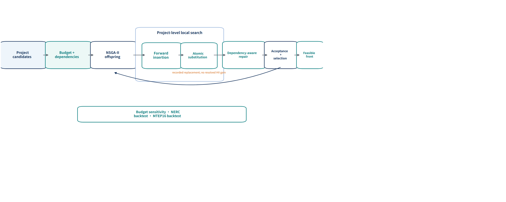
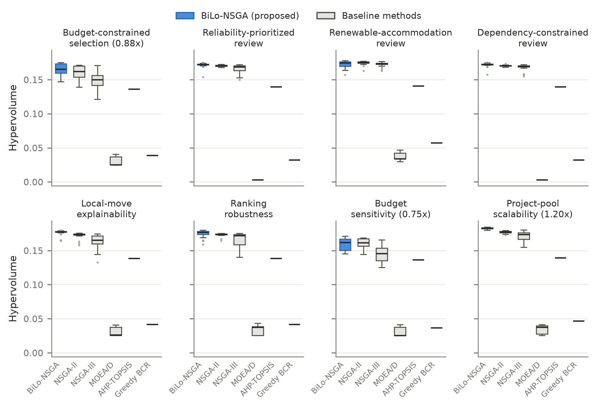
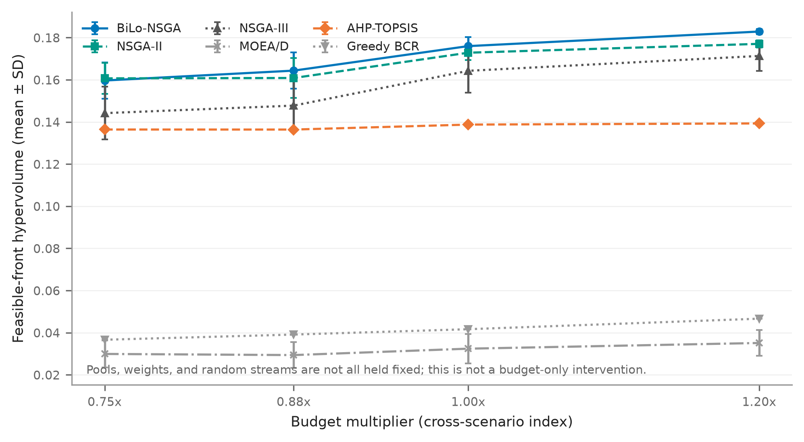
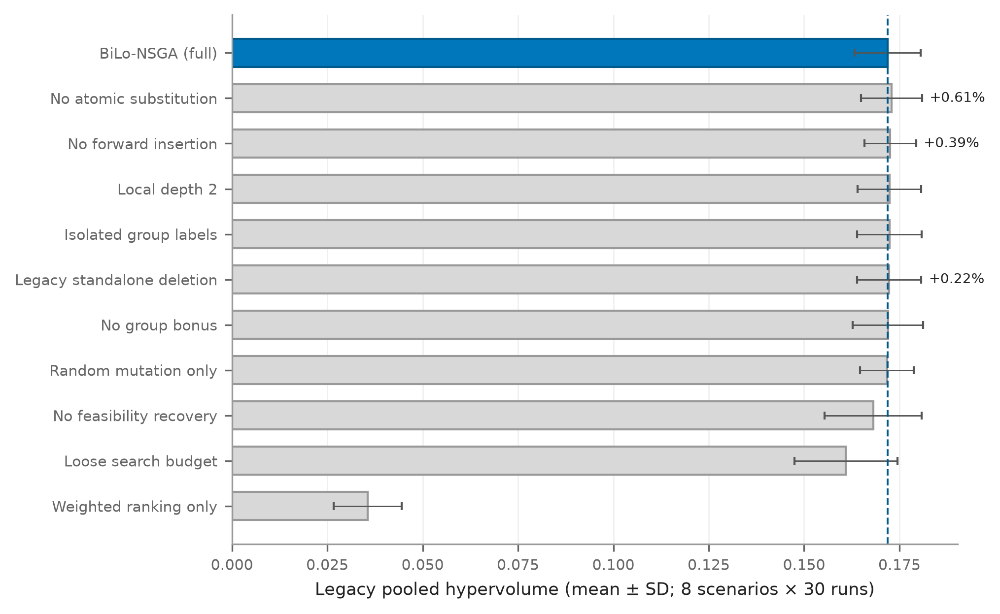
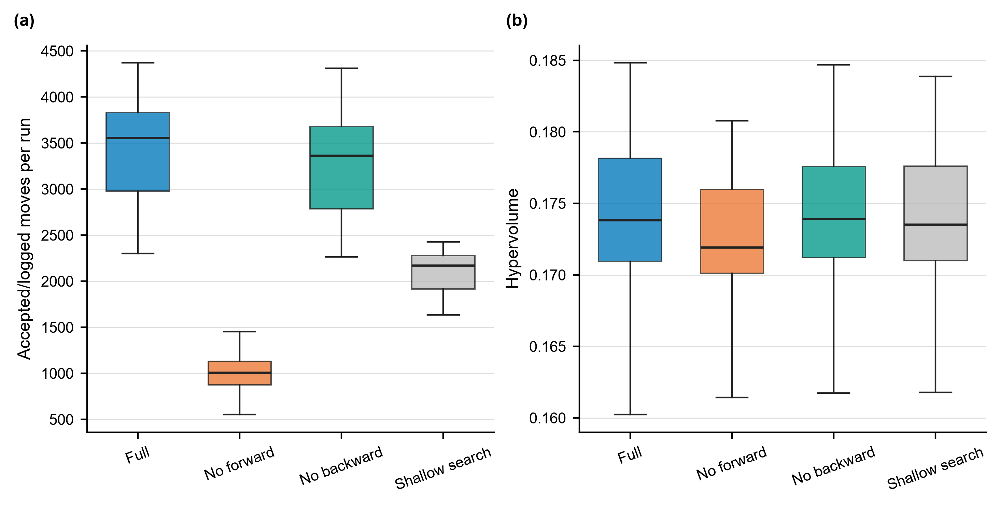
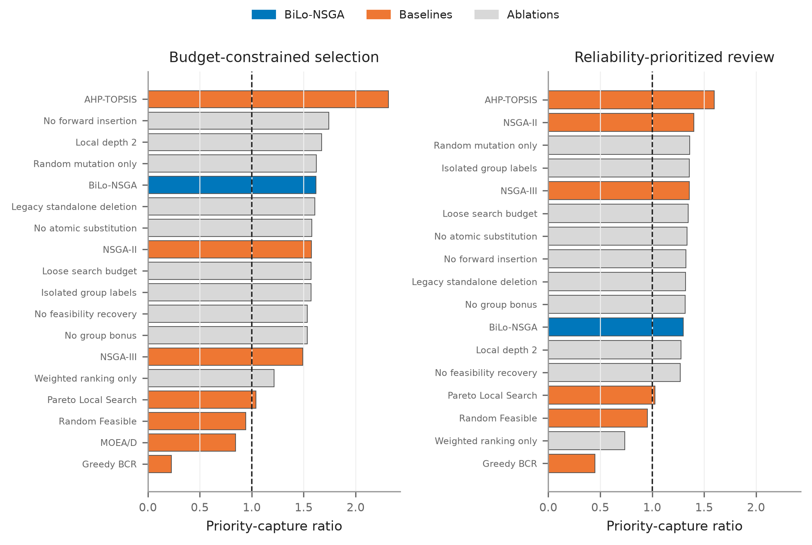
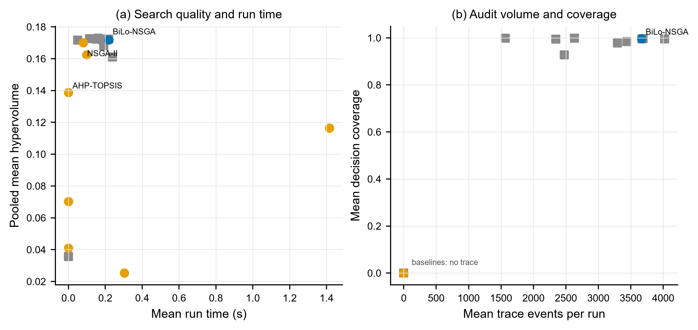
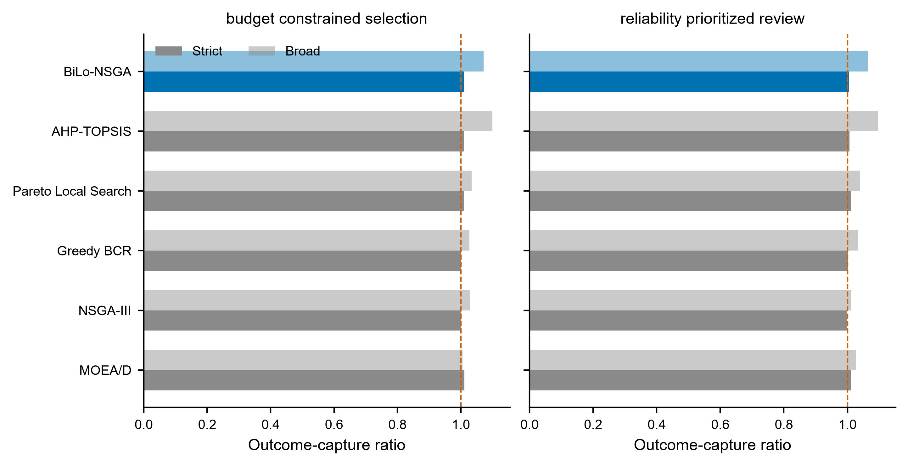
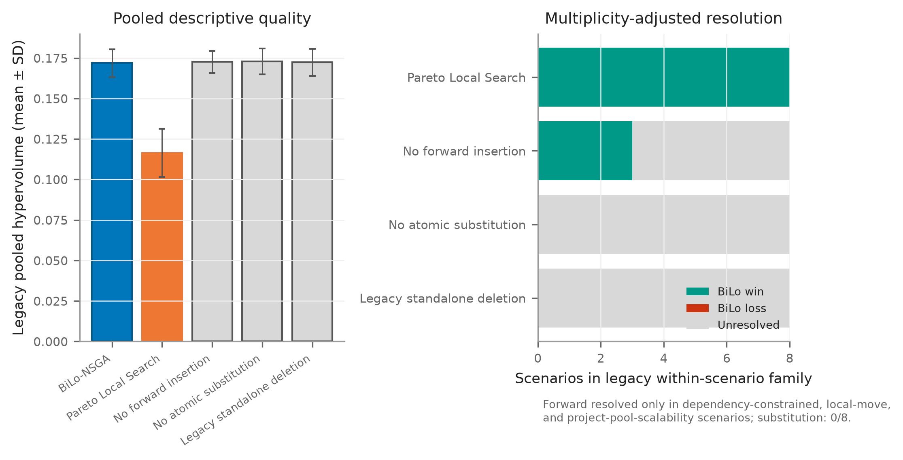

<!-- MDPI Applied Sciences submission draft (Markdown master).
     Paper: mintou_p6 / BiLo-NSGA.
     Section: Energy (alt: Electrical, Electronics and Communications Engineering).
     All numbers verified against the evidence tables in the public repository.
     Version incorporating Round-5 review findings (2026-07-17, Wave 1):
     references converted to MDPI numbered style ([1]..[32], order of first
     appearance) with all DOIs re-verified via Crossref; abstract compressed
     to <=200 words; forward/backward asymmetry stated explicitly in Abstract
     and Introduction; TRACE-MOEA companion description recalibrated;
     Limitations and Future Work subsection added (7.1). See WAVE1_CHANGELOG.md. -->

# BiLo-NSGA: Budget-Aware Project-Level Local Moves with Accepted-Move Logging for Power-Grid Portfolio Optimization

**Authors:** Yubin Lin (林宇彬), Jingbo Zhang (张劲波), Xiaoyu Huang (黄晓予), Dishan Yang (杨迪珊), Jiyu Li (李继宇)
**Affiliations:** Economic and Technological Research Institute of State Grid Fujian Electric Power Co., Ltd., Fuzhou 350000, Fujian, China
**Correspondence:** 18606932711@163.com (Y. Lin)

## Abstract

Utility review boards must select grid investment portfolios under hard annual budgets, yet independent project scores ignore portfolio interactions and generic evolutionary operators do not express changes in review terms. BiLo-NSGA embeds budget-aware forward insertion, atomic delete--insert substitution, a heuristic dependency-group bonus, and feasibility recovery within a non-dominated-sorting framework; during each run it counts accepted local moves and deterministic repair drops. On a reproducible benchmark with 120 candidates, eight scenarios, and 30 seeds per stochastic method, BiLo-NSGA attains pooled mean hypervolume 0.17190, 1.12% above NSGA-II. Across five stochastic baselines, it has 37 positive mean differences in 40 comparisons, 36 Holm-significant wins, and no significant loss; 16 gaps against two deterministic scoring rules are descriptive and favor BiLo-NSGA. A 1600-neighbor Pareto-local-search control is significantly lower in all eight scenarios. Component evidence is asymmetric: removing forward insertion is harmful in three scenarios under the primary family, although the ablation has the higher pooled mean, whereas atomic substitution and standalone deletion are unresolved. Public reliability and MTEP16 backtests provide descriptive external consistency. The evidence supports budget-aware project-level local moves with scenario-dependent forward-side effects; the released event fields are not a recommendation lineage or replay record, and neither atomic substitution nor the group bonus has a demonstrated accuracy gain.

**Keywords:** power grid investment planning; project portfolio selection; budget constraint; multi-objective evolutionary optimization; NSGA-II; local search; accepted-move logging

---

## 1. Introduction

Power systems face substantial capital requirements from renewable integration, storage deployment, feeder automation, and reinforcement backlogs. NERC reliability reports document the consequences associated with delayed investment in specific asset classes. Utilities must choose among reinforcements, automation retrofits, storage, and renewable-support projects spanning many zones and feeders, while annual budgets fund only a subset. Project review therefore becomes a recurring selection problem with a hard budget and conflicting objectives (cost, reliability benefit, renewable accommodation, and execution risk). The benchmark also assigns projects a common zone- or feeder-group label, but does not model joint dependency benefits or dependency constraints.

Current review practice balances inspectable scoring against portfolio interaction. AHP/TOPSIS-style scoring exposes each ranking step but evaluates projects independently, omitting budget crowding-out and conditional marginal value. Multi-objective evolutionary algorithms (MOEAs) search portfolios directly, but generic bit-level variation does not express changes in project-review terms. BiLo-NSGA therefore tests whether budget-aware project-level moves can improve the benchmark objective while producing run-level counts and pool-local co-occurrence summaries of accepted search events.

BiLo-NSGA uses a custom non-dominated-sorting kernel with NSGA-II-style constrained environmental selection and changes the variation stage through project-level local search. The forward pass inserts an affordable project while budget slack remains. The backward-side operation is an atomic substitution: it tentatively removes a weak selected project, inserts the strongest affordable replacement, and accepts or rejects the pair as one move. A fixed 1.06 heuristic bonus favors an insertion whose group label is already present, and deterministic recovery repairs budget violations. Accepted insertions, accepted substitutions, and repair drops are appended to a transient run-level list. The released run rows retain only event count and final-front pool-position co-occurrence; they do not retain parent--child lineage, states sufficient for replay, or a recommendation path.

The local-operator evidence is asymmetric. Removing forward insertion is harmful in three scenarios under the primary family, but the ablation has the higher pooled mean because other settings move nominally in its favor. Removing atomic substitution raises the pooled mean by 0.61%, but the contrast remains unresolved under the declared family; replacing it with legacy standalone deletion raises the pooled mean by 0.22%, and that contrast also remains unresolved. Substitution is retained as a paired remove--insert event, not claimed as an accuracy mechanism or a validated reviewer aid. A budget-indexed cross-scenario diagnostic ranges from a -0.64% NSGA-II margin at 0.75x to +3.30% in the 1.20x large-pool-labeled setting. Because scalar weights also vary, this is a boundary description rather than a causal budget effect.

A second obstacle is the scarcity of public grid investment-review records. We therefore construct a reproducible benchmark of 120 candidate projects in six archetypes. The candidates are derived deterministically from RTS-GMLC production-cost data, SimBench distribution-network data, and cached public NERC report metadata. Eight scenarios vary the budget (0.75x--1.20x nominal), candidate-pool composition, and group-label structure. The candidate-derivation pipeline is shared with the methodologically distinct TRACE-MOEA companion project, `mintou_p5_trace_moea_feasibility_review` [33]; Section 2.4 and the Data Availability statement disclose this relationship.

The contributions of this paper are:

1. **Budget-aware project-level local moves with accepted-move logging.** BiLo-NSGA defines forward insertion, atomic delete--insert substitution, a heuristic group-label bonus, and feasibility recovery within non-dominated sorting. The implementation records accepted insertions and substitutions plus repair drops in memory and reduces them to run-level count and set-overlap fields. The retained summary reports 3668 events per run and 99.6% final-front pool-position co-occurrence on average (Section 4; Table 7); these values do not constitute an audit trail, lineage, replay record, or explanation-quality measure.
2. **A shared public benchmark used to isolate the local-search question.** The 120-candidate generator and public source corpora are shared with `mintou_p5_trace_moea_feasibility_review`; this paper's hard-budget formulation, BiLo-NSGA implementation, scenarios, run records, selected portfolios, and comparisons are reported as paper-specific (Sections 2.4 and 3.4).
3. **A statistically grounded evaluation against seven baselines and ten ablations.** The archive contains 4320 method--scenario invocations. In the inferential family, BiLo-NSGA is 1.12% above NSGA-II and records 36 significant wins among 40 stochastic-baseline comparisons, with no significant loss. Sixteen deterministic-rule gaps are descriptive. A direct Pareto local-search control is significantly lower in all eight scenarios (Sections 6.1 and 6.7).
4. **Bounded operator attribution and external-consistency checks.** Forward insertion produces the only resolved local-operator gains; contrasts involving atomic substitution and legacy deletion remain unresolved under the declared comparison family, and neither beats the no-backward ablation. NERC and MTEP16 checks provide descriptive alignment rather than confirmatory review validity (Sections 6.3--6.5).

The remainder of the paper is organized as follows. Section 2 reviews related work. Section 3 formalizes the problem and describes the public benchmark. Section 4 presents BiLo-NSGA. Section 5 details the experimental protocol. Section 6 reports results. Section 7 discusses the findings, Section 8 states limitations, and Section 9 concludes.

---

## 2. Related Work

Our work sits at the intersection of three research threads: budget-constrained combinatorial optimization and project portfolio selection, investment planning and project review practice in power grids, and local-search-enhanced multi-objective evolutionary algorithms (MOEAs). We review each thread in turn and then position BiLo-NSGA against them and against its companion method TRACE-MOEA.

### 2.1. Budget-Constrained Combinatorial Optimization and Project Portfolio Selection

Selecting items under a budget is the multi-objective knapsack setting used by Zitzler and Thiele [1] to compare Pareto-based schemes. Problem-aware search is important in this landscape. Jaszkiewicz [2] shows that local search over scalarizing functions can improve on purely recombinative MOEAs, a result reviewed by Lust and Teghem [3] and later knapsack taxonomies [4]. Many-objective knapsack problems further challenge standard MOEAs [5].

Portfolio studies respond with tailored search. Doerner et al. [6] apply Pareto ant colony optimization, while Carazo et al. [7] model dependencies, schedules, and resource limits with explicit feasibility handling. Energy applications include coupled risk–benefit portfolios [8] and hybrid exact–heuristic investment planning [9]. These methods usually enforce budgets after variation through penalties or repair. They do not define the neighborhood itself as insertion under slack, deletion under violation, and substitution near budget parity.

### 2.2. Power Grid Investment Planning and Project Review Decision Methods

Grid investment research divides between expansion optimization and multi-criteria review. Optimization studies coordinate transmission and storage [10], value reliability through interruption cost [11], assess grid-side storage returns [12], and balance battery investment against operating benefit [13]. These formulations usually size a specific asset class from a small set of alternatives rather than select from more than one hundred heterogeneous projects.

Review practice commonly uses AHP [14] and TOPSIS [15]. Recent extensions add objective weighting and explainability [16], while site-selection reviews show growing use of multi-objective optimization [17]. MCDM exposes scoring steps but scores projects largely independently, so it misses budget crowding-out and dependencies. Simulation-based assessments of substations and commissioning delays [18] add network context but do not solve the portfolio search. The open gap examined here is therefore a portfolio-aware method whose committed project-level search events are recorded [19].

### 2.3. Local-Search-Enhanced Multi-Objective Evolutionary Algorithms

Hybridizing evolutionary search with local refinement is a long-standing multi-objective strategy. Ishibuchi and Murata [20] apply weighted-sum local moves after genetic variation, while Knowles and Corne [21] show that a $(1+1)$ local search with a Pareto archive can approximate nondominated fronts competitively. NSGA-II [22], MOEA/D [23], and NSGA-III [24] rely primarily on selection and recombination; Neri and Cotta [25] survey the many memetic extensions built around them.

Power-system studies apply improved NSGA-II variants to distribution-network co-optimization [26], offshore-wind storage configuration [27], and resilient backbone-grid planning [28]. Enhanced swarm methods address storage planning [29] and transmission expansion [30]. These methods modify initialization, operators, or stages, but their local moves, when present, remain numeric perturbations inherited from continuous benchmarks.

Portfolio-scheduling studies also combine NSGA-II with Pareto local search [31]. More recent methods tailor local refinement to cardinality and pre-assignment constraints [32]. However, these hybrids do not express moves as adding, removing, or substituting a named project. BiLo-NSGA records accepted move types and pool-local positions during a run, then releases only aggregate count and set-overlap fields; it does not reconstruct a final-portfolio lineage.

### 2.4. Relation to TRACE-MOEA and Gap Statement

The companion project `mintou_p5_trace_moea_feasibility_review` (TRACE-MOEA) [33] addresses power-grid project review through preference-adaptive elitism, deterministic repair, and run-level event co-occurrence summaries. Its contribution acts at selection and ranking. BiLo-NSGA instead changes variation through forward insertion, atomic substitution, a heuristic group-label bonus, and feasibility recovery. The two studies share the versioned candidate generator and the public NERC and MTEP16 source corpora. Their problem objectives, algorithm implementations, scenario definitions, run archives, selected portfolios, and reported comparisons are paper-specific.

The resulting gap is specific. Existing knapsack MOEAs generally handle budgets through penalties or post-variation repair. Grid MCDM exposes scoring steps but is portfolio-blind, and memetic MOEAs express refinement numerically rather than as named project edits. BiLo-NSGA combines non-dominated sorting with forward insertion, atomic replacement, feasibility recovery, and accepted-move/repair counters. The claim concerns this intersection rather than universal superiority over memetic optimization or validated recommendation provenance.

---

## 3. Problem Formulation and Public Benchmark

### 3.1. Budget-Constrained Portfolio Review as Multi-Objective Selection

Let $\mathcal{C} = \{p_1, \dots, p_n\}$ be the candidate pool. Each project has cost $c_i$, reliability benefit $r_i$, renewable-accommodation benefit $g_i$, load-support value $\ell_i$, compliance score $a_i$, evidence score $e_i$, and schedule and implementation risks combined as $\rho_i$. A categorical group label $d_i$ identifies a shared zone or feeder. The label is used only by the heuristic move score in Section 4.4: the formulation contains no group-level benefit term and no requirement that group members be selected together. A review decision is a binary vector $x \in \{0,1\}^n$, where $x_i = 1$ means project $p_i$ is funded. The review board's problem is:

$$
\min_{x \in \{0,1\}^n} \; F(x) = \Big( \textstyle\sum_i c_i x_i, \;\; -\sum_i r_i x_i, \;\; -\sum_i g_i x_i, \;\; \frac{\sum_i \rho_i x_i}{\max(1, \sum_i x_i)} \Big)
$$

subject to the **hard budget constraint**

$$
\textstyle\sum_i c_i x_i \le B,
$$

with normalized constraint violation

$$
v_B(x)=\max\!\left\{0,\frac{\sum_i c_i x_i-B}{B}\right\}.
$$

The four minimization objectives are thus total cost, negated reliability benefit, negated renewable benefit, and mean per-project risk. The budget is not a soft preference: portfolios exceeding $B$ are not fundable, which is why the benchmark evaluates only the feasible non-dominated front (Section 5.3) and why the method design treats budget slack and violation as first-class quantities that shape the search neighborhood (Section 4).

A portfolio $x$ dominates $x'$ when it is at least as good in all four objectives and better in at least one. The non-dominated front contains mutually non-dominating portfolios returned by a method. Hypervolume measures the objective-space volume dominated by that front relative to a fixed reference point, rewarding both convergence and diversity.

### 3.2. Benchmark Construction from Public Data

Because real utility investment-review records are institution-internal and unavailable for publication, we derive a candidate pool deterministically from three public sources (Table 1). The full derivation code is released; every rule below is inspectable.

**Table 1.** Candidate pool composition.

| Source | Public artifact used | Candidates | Archetypes (kind) |
|---|---|---|---|
| RTS-GMLC | bus/branch/generator source data, zone-level aggregates | 72 | transmission reinforcement; reliability automation; renewable support |
| SimBench | complete mixed network (`1-complete_data-mixed-all-0-sw`), 16 highest-stress subnets | 48 | distribution (feeder) reinforcement; storage flexibility; protection automation |
| NERC / C2GES report cache | metadata of 40 cached public reliability documents (28 event reports) | attribute adjustment only | --- |
| **Total** | | **120** | 6 kinds |

RTS-GMLC zone-level aggregates of load, branch ratings, permanent-outage rates, generator capacity, and renewable share generate three candidate archetypes per zone. Analytic functions map these aggregates to costs and benefits; for example, reinforcement benefit scales with outage pressure, while renewable-support benefit scales with the gap between load and installed renewable capacity. From SimBench, the sixteen subnets with the highest combined load and line-length stress each yield feeder-reinforcement, storage-flexibility, and protection-automation candidates. Their attributes depend on subnet load, line count, and the distributed-energy-resource gap. NERC report metadata then adjusts attributes at the project-kind level. Candidates in the same zone or feeder receive a common group label, producing 120 candidates in six kinds with a block structure; the label does not create an evaluated joint benefit.

We emphasize what this construction is and is not. It is a *reproducible, public, engineering-plausible proxy* for the review problem -- every attribute traces to public grid statistics or public reliability-report metadata through published rules. It is not a set of expert-labeled review outcomes, and its cost coefficients are in synthetic cost units, not calibrated currency (Section 8).

### 3.3. Review Scenarios

Eight experiments exercise the pool along three axes -- budget envelope, pool composition, and group-label structure -- while the evaluation itself (objectives, violation, and hypervolume computation) is identical across experiments (Table 2). The nominal budget is $B = 1020$ cost units.

**Table 2.** The eight review scenarios. Pool filters restrict candidate kinds; the evaluation never changes.

| Experiment | Budget multiplier | Candidate pool |
|---|---|---|
| budget_constrained_selection | 0.88x | full pool (120) |
| reliability_prioritized_review | 1.00x | reliability-related kinds only |
| renewable_accommodation_review | 1.00x | renewable/storage kinds only |
| dependency_constrained_review | 1.00x | filter retaining candidates whose group label occurs at least twice; no co-selection constraint |
| local_move_explainability | 1.00x | full pool |
| ranking_robustness | 1.00x | full pool |
| budget_sensitivity | 0.75x | full pool |
| project_pool_scalability | 1.20x | full pool |

Five experiments use the full candidate pool at budget multipliers 0.75x, 0.88x, 1.00x, 1.00x, and 1.20x. Their random streams are independent. The scenario-weight vector, ordered as reliability, renewable, load support, compliance, evidence, risk, and cost, is $(0.26,0.18,0.20,0.14,0.12,0.26,0.38)$ by default. `budget_constrained_selection` and `budget_sensitivity` change the cost entry to 0.50; `dependency_constrained_review` changes reliability to 0.40 and risk to 0.36; `local_move_explainability` changes cost to 0.44 and risk to 0.32; and `renewable_accommodation_review` changes renewable to 0.42. The other scenarios retain the default vector, including `reliability_prioritized_review`. These unnormalized weights enter Greedy BCR, AHP-TOPSIS, and WeightedRankingOnly, but do not enter BiLo-NSGA's local acceptance rule, the four objectives, or hypervolume. Because budgets, pools, weights, and random streams are not all held fixed, Section 6.2 treats the budget-indexed results as a cross-scenario diagnostic rather than a controlled budget-only experiment.

### 3.4. Shared Public Benchmark Statement

The Section 3.2 candidate pipeline is shared with the companion project `mintou_p5_trace_moea_feasibility_review` (TRACE-MOEA) [33]. Both studies also use the same public NERC corpus and MTEP16 source records for separately executed consistency checks. Problem objectives, method implementations, scenarios, run records, selected portfolios, and reported comparisons are specific to each paper.

---

## 4. BiLo-NSGA

Figure 1 places two project-vocabulary moves between global offspring generation and deterministic feasibility recovery. Forward insertion spends useful slack. Atomic substitution removes one weak selection and evaluates one affordable replacement before either change can be committed. A heuristic group-label bonus changes only the proposal order. The candidates then compete under constrained non-dominated sorting. Forward insertion produces the only significant local-operator gains; substitution emits a paired remove--insert event without a demonstrated hypervolume gain.



**Figure 1.** BiLo-NSGA architecture. The feedback arrow denotes the next generation. “Dependency-aware” in the diagram denotes only the 1.06 group-label proposal bonus, not a dependency objective or constraint. The lower strip identifies sensitivity and external-consistency analyses rather than optimization inputs.

BiLo-NSGA is a memetic multi-objective algorithm: a custom non-dominated-sorting kernel provides global search and Pareto pressure, and project-vocabulary local moves provide budget-aware intensification. Accepted local moves and repair drops are counted separately from the optimization objectives. Each component below is individually switchable, enabling the one-switch and legacy-rule comparisons in Section 6.3.

**Formal definitions.** Let \(x\in\{0,1\}^{n}\) and define remaining budget and the same dimensionless violation used by evaluation and constraint dominance as

$$
s_B(x)=B-\sum_{j=1}^{n}c_jx_j,\qquad
v_B(x)=\max\!\left(0,\frac{-s_B(x)}{B}\right).
$$

At generation $t$, let $P_t$ be the 40 parents and $Y_t$ the 40 post-mutation children *before* repair or local search. The implementation freezes generation-local bounds

$$
L_q^{(t)}=\min_{z\in P_t\cup Y_t} f_q(z),\qquad
H_q^{(t)}=\max_{z\in P_t\cup Y_t} f_q(z),
$$

and uses

$$
\hat f_q^{(t)}(x)=
\frac{f_q(x)-L_q^{(t)}}{\max\!\left(H_q^{(t)}-L_q^{(t)},10^{-9}\right)}.
$$

The value is not clipped after a local move. The acceptance scalar used *inside local search only* is therefore

$$
\Phi_t(x)=\sum_{q=1}^{Q}\hat f_q^{(t)}(x)+10v_B(x).
$$

Thus the local penalty coefficient is $\lambda=10$, every normalized objective has coefficient one, and the scenario weights of Section 3.3 do not enter $\Phi_t$. These generation-local bounds are distinct from the fixed method-independent bounds used for hypervolume in Section 5.3.

The move-ranking numerator is a raw mixed-scale heuristic. Define

$$
h_j=r_j+g_j+\ell_j+\tfrac12(a_j+e_j),\qquad
R_j^{+}(x)=\frac{h_j}{\max(c_j,1)}
\left[1+0.06\,\mathbb I\!\left(\exists k:x_k=1,\ d_k=d_j\right)\right].
$$

The four terms in $h_j$ are not normalized across attributes and are not multiplied by scenario weights. The bracketed factor is only a proposal-ranking bonus. The forward proposal and acceptance rule are

$$
j^+=\operatorname*{arg\,max}_{j:x_j=0,\ c_j\leq s_B(x)}R_j^+(x),
\qquad x^+=x+e_{j^+},
$$

$$
x\leftarrow x^+\quad\text{iff}\quad \Phi_t(x^+)<\Phi_t(x);
\quad\text{otherwise the forward pass stops.}
$$

For atomic substitution, first select a removal candidate

$$
j^-=\operatorname*{arg\,min}_{j:x_j=1}
\frac{h_j}{\max(c_j,1)},\qquad x^-=x-e_{j^-}.
$$

The affordable replacement set excludes that project,

$$
\mathcal A(x^-)=\{j:x^-_j=0,\ j\neq j^-,\ c_j\leq s_B(x^-)\},
$$

and $j^+=\operatorname*{arg\,max}_{j\in\mathcal A(x^-)}R_j^+(x^-)$. The pair is atomic:

$$
x\leftarrow x-e_{j^-}+e_{j^+}
\quad\text{iff}\quad
\mathcal A(x^-)\neq\varnothing\ \land\ |x^-|\geq2\ \land\
\Phi_t(x-e_{j^-}+e_{j^+})<\Phi_t(x).
$$

Otherwise both tentative edits are rolled back and the pass stops. Thus the proposed method never accepts a standalone backward deletion; that legacy rule is retained only as a named ablation.

Eligible-index arrays are generated in ascending pool-local order. NumPy `argmin`/`argmax` therefore resolves exact ties in repair and local proposal scores to the smallest eligible pool-local index. Environmental crowding and the scalar-ranking baselines use `argsort` without an explicit stable secondary key, so equal values follow the implementation's returned order rather than a declared scientific tie rule. Exact cross-version tie replay is not claimed.

Feasibility recovery applies the same deletion ranking without the improvement test until \(v_B(x)=0\). For local depths \(D_+\) and \(D_-\), a direct scan implementation costs

$$
T_{\mathrm{local}}=O\!\left((D_++D_-)nQ\right)
$$

per selected offspring, in addition to objective evaluation. The current implementation uses \(D_+=8\), \(D_-=4\); this complexity expression does not imply that both directions produce equal empirical benefit.

### 4.1. Non-Dominated Sorting Kernel

The custom kernel initializes 40 portfolios independently. For portfolio $i$, it draws $\delta_i\sim\mathrm{Uniform}(0.03,0.15)$ and then draws each bit as $x_{ij}\sim\mathrm{Bernoulli}(\delta_i)$; deterministic budget repair is applied immediately. In each of 40 generations, two parent indices for each child are sampled independently and uniformly with replacement from the 40 current rows. A per-bit Bernoulli(0.5) mask performs uniform crossover, followed by bit-flip mutation at rate $1/n$. All 40 children are repaired, and the first 20 rows in generated array order undergo local search. This is a fixed positional convention, not fitness-based or random offspring selection.

Parents and children are then pooled. Constraint dominance ranks feasible solutions above infeasible ones, compares infeasible solutions by the normalized $v_B$, and applies Pareto dominance among feasible solutions. Non-dominated fronts enter in order, and crowding distance truncates the final front to a population of 40. The procedure is NSGA-II-style environmental selection, but parent choice is uniform rather than binary tournament selection; it is therefore described as a custom non-dominated-sorting kernel rather than a canonical NSGA-II implementation.

### 4.2. Forward Insertion

After mutation and repair, the first 20 offspring undergo a forward pass of depth at most eight. While slack remains, the affordable unselected project with the highest raw $h_j/\max(c_j,1)$ score after the optional 1.06 group bonus is tentatively inserted. The insertion is retained only if it improves $\Phi_t$, which uses the frozen generation-local bounds and $\lambda=10$. The pass stops at the first rejection. This move converts budget slack left by recombination into a candidate improvement.

### 4.3. Atomic Backward--Forward Substitution

The substitution pass has depth at most four. It removes the selected project with the lowest benefit-to-cost ratio only provisionally, uses the released budget to choose the highest-scoring affordable replacement, and evaluates the resulting portfolio once. Acceptance commits both edits; rejection restores both. The pass stops at the first rejection and never proposes from a portfolio with fewer than two retained projects. This construction records replacement as one paired event rather than as unrelated insert and delete events. Section 6.3 shows that the paired representation does not yield a significant hypervolume change, and its usefulness to reviewers is not evaluated.

### 4.4. Heuristic Dependency-Group Bonus

When ranking insertion or replacement candidates, the raw benefit-to-cost score is multiplied by 1.06 if another selected project has the same group label. The multiplier is a heuristic proposal preference only: it does not add a joint benefit to $F(x)$, impose a co-selection or precedence constraint, change acceptance, or enter evaluation. The `dependency_constrained_review` label denotes a pool filter plus scenario weights, not an additional constraint, and the LowDependencyDensity stress variant changes group labels. The present design therefore provides no evidence of dependency synergy or benefit.

### 4.5. Feasibility Recovery

Every initial or offspring portfolio that violates the budget is repaired deterministically. The selected project with the lowest raw $h_j/\max(c_j,1)$ score is removed until the portfolio is affordable. The group bonus and scenario weights do not enter repair. Because each step removes one selected project and the empty portfolio is feasible, repair terminates after at most $\|x\|_0$ drops. Each drop increments the move counter and appends a `repair_drop` event, including generation 0 initialization repair.

### 4.6. Accepted-Move and Repair Counters

Every accepted `forward_insert` and `backward_substitute`, and every deterministic `repair_drop`, increments `local_move_count` and appends one in-memory event. Rejected proposals and attempted moves are neither counted nor logged. Events store a generation label and pool-local integer position; a substitution stores the removed and inserted positions. The list includes initialization repairs and events from offspring that may later be discarded. It has no child or parent identifier, before/after state, scalar value, acceptance delta, or final-portfolio link.

The run writer does not serialize that event list. It retains `trace_event_count = len(events)` and `decision_coverage`, defined as the fraction of pool-local positions occurring anywhere in the deduplicated final feasible front that also occur anywhere in the run's event-position set. Because tracing is enabled for BiLo-NSGA and each counted action creates one event, `local_move_count` and `trace_event_count` are identical in the retained rows. The derived table reports means of 3667.954 for both fields and 0.9964326 for position co-occurrence across 240 runs (Table 7). No counter enters an objective, constraint, local acceptance, or environmental selection. These fields measure event production and set co-occurrence, not attempted-move rate, causal attribution, chronology, audit completeness, explanation quality, lineage, or replay.

### 4.7. Algorithm Summary

```
BiLo-NSGA(pool, budget, seed):
  for i = 1 .. 40:                                                             # 4.1
    draw density delta_i ~ Uniform(0.03, 0.15)
    draw each bit Bernoulli(delta_i); repair to budget and count/log each drop  # 4.5
  for gen = 1 .. 40:
    sample two parent indices per child uniformly with replacement
    offspring[1:40] <- uniform crossover (bit mask 0.5) + bit flip (rate 1/n)
    freeze objective min/max from parents + pre-repair offspring                # Phi_t
    for i = 1 .. 40:
      repair offspring[i] to budget (count/log repair_drop)                     # 4.5
      if i <= 20:                                                               # fixed array positions
        forward pass (depth <= 8): rank by raw BCR x heuristic group bonus,     # 4.2/4.4
                     accept only strict Phi_t improvement; stop at rejection
        substitution pass (depth <= 4): tentatively remove lowest raw BCR,      # 4.3
                     insert best affordable replacement, accept pair only on
                     strict Phi_t improvement; stop at rejection
        count/log accepted forward_insert or backward_substitute only           # 4.6
    environmental selection: constraint-dominated NDS + crowding (top 40)       # 4.1
  return population; retain event count and final-front position co-occurrence  # 4.6
```

---

## 5. Experimental Setup

### 5.1. Methods Compared

Table 3 lists the eighteen methods: BiLo-NSGA, seven baselines spanning evolutionary, Pareto-local-search, and MCDM families, and ten ablations. The evolutionary baselines are pymoo implementations on the same binary problem, but their constraint paths differ as disclosed below. Pareto Local Search uses add, delete, and swap neighborhoods with a fixed budget of 1600 evaluated neighbors per run.

**Table 3.** Methods.

| Method | Role | Description |
|---|---|---|
| BiLo-NSGA | proposed | custom constrained NDS + forward insertion + atomic substitution + heuristic group bonus + deterministic repair |
| NSGA-II | baseline | pymoo NSGA-II; normalized $v_B$ passed as one inequality constraint |
| NSGA-III | baseline | pymoo NSGA-III with 35 Das--Dennis directions and population 40; normalized $v_B$ constraint |
| MOEA/D | baseline | pymoo MOEA/D with 35 directions; no constraint interface, so $10^4v_B$ is added to every objective |
| Greedy BCR | baseline | scenario-weighted benefit-cost order; add a project only while affordable |
| AHP-TOPSIS | baseline | scenario-weighted TOPSIS order; greedy affordable fill |
| Random Feasible | baseline | seeded random order; greedy affordable fill |
| Pareto Local Search | baseline | 40 repaired random starts and feasible add/delete/swap moves; 1600-neighbor budget |
| Ablation-NoForwardSearch | ablation | forward insertion disabled |
| Ablation-NoBackwardSearch | ablation | atomic substitution disabled |
| Ablation-LegacyDeletion | ablation | atomic substitution replaced by standalone greedy deletion |
| Ablation-RandomMutationOnly | ablation | local search replaced by high-rate (3/n) random mutation |
| Ablation-NoDependencyMoves | ablation | heuristic group-label bonus disabled |
| Ablation-NoFeasibilityRecovery | ablation | deterministic repair disabled; custom constraint dominance retained |
| Ablation-WeightedRankingOnly | ablation | weighted ranking without evolution |
| Ablation-ShallowLocalSearch | ablation | local-search depth reduced to 2 |
| Ablation-LowDependencyDensity | ablation | every third candidate receives an isolated group label |
| Ablation-LooseBudget | ablation | search at 1.2x budget, evaluated at the true budget |

Each operator ablation flips one switch relative to the full method. The last two are stress variants that perturb group labels and the search budget rather than removing an operator, and we read them as robustness probes.

### 5.2. Protocol

The rectangular archive contains **18 methods x 8 experiments x 30 invocations = 4320 rows**. Fourteen opponents are stochastic. AHP-TOPSIS, Greedy BCR, and Ablation-WeightedRankingOnly are deterministic; their repeated identical invocations are retained for provenance but have effective sample size one per experiment. BiLo-NSGA, its evolutionary ablations, NSGA-II, and NSGA-III use population 40 for 40 generation labels. MOEA/D uses its 35 four-objective Das--Dennis directions as the effective population, despite the JSON's nominal population-size field of 40. The run archive does not retain function-evaluation counts, so identical evolutionary evaluation budgets are not claimed. Pareto Local Search receives a numerical ceiling of 1600 evaluated neighbors, matching the nominal $40\times40$ offspring ceiling of the population-40 methods but not their computational work; wall-clock runtime is reported separately.

Constraint handling is method-specific. The custom kernel uses normalized violation in constraint dominance and, for the full method, deterministic pre-search repair. Pymoo NSGA-II and NSGA-III receive $v_B$ as an inequality constraint. Because the pymoo MOEA/D path has no constraint interface, it adds $10^4v_B$ to every objective; this coefficient is unrelated to the local-search coefficient $\lambda=10$. Greedy BCR, AHP-TOPSIS, and Random Feasible construct a feasible portfolio by skipping unaffordable projects, while Pareto Local Search repairs its starts, proposes only affordable additions or swaps, and filters its archive to feasible rows. Final hypervolume is computed from feasible non-dominated rows for every method.

The generated JSON records the method list, scenarios, 30 seeds, nominal population 40, 40 generations, and evaluation description. It does not serialize local-search depth, the fixed first-20 selection convention, $\lambda=10$, the 1.06 group bonus, raw move-score scaling, tie behavior, the effective MOEA/D population, pymoo/library versions, or operator-default probabilities. Those choices reside in source code, so the JSON is not a complete replay manifest. Scenario weights enter only the three scalarizing rules named in Section 3.3 and never enter BiLo-NSGA or the evaluation metric.

### 5.3. Evaluation Metric and Statistics

Portfolio quality is measured by the **standard hypervolume** of the feasible non-dominated front. Objective values are normalized with *fixed per-problem bounds* computed once per experiment from a seeded reference set (the empty portfolio, all single-project portfolios, and 2048 random feasible portfolios), and the reference point is $1.1$ in every normalized dimension. These bounds are distinct from the generation-local, pre-repair parent--offspring bounds used only by $\Phi_t$ in Section 4. An empty feasible front scores zero. The metric contains no method-aware ingredient, and event counts and position co-occurrence are reported descriptively rather than entering any ranking.

Statistical comparisons use two-sided **Mann--Whitney U tests** between BiLo-NSGA and each of the fourteen stochastic opponents per experiment ($n=30$ per group), with **Holm correction** within each stochastic family. We report rank-biserial effects and 5000-resample bootstrap confidence intervals for mean differences. The three deterministic rules are compared descriptively and receive no seed-level p-values. The corrected table is `real_project_review_inference_v2.csv`; the original rectangular significance output remains only as provenance.

The method-independent normalization for objective $j$ is

$$
\tilde f_j(x)=\min\!\left\{1,\max\!\left[0,\frac{f_j(x)-l_j}{u_j-l_j}\right]\right\},
$$

where $(l_j,u_j)$ comes from the frozen reference sample rather than any compared method. The scored set for method $m$, experiment $e$, and seed $r$ is

$$
\mathcal{P}_{mer}=\left\{x\in\mathcal{X}_{mer}:v_B(x)=0,\ \nexists y\in\mathcal{X}_{mer}\text{ with }\tilde F(y)\prec\tilde F(x)\right\}.
$$

Its standard four-objective hypervolume is

$$
HV(\mathcal{P}_{mer})=\lambda_4\!\left(\bigcup_{x\in\mathcal{P}_{mer}}[\tilde F(x),z^{\mathrm{ref}}]\right),\qquad z^{\mathrm{ref}}=(1.1,1.1,1.1,1.1).
$$

For two seed samples, the first-sample Mann--Whitney statistic is

$$
U_1=n_1n_2+\frac{n_1(n_1+1)}{2}-\sum_{i=1}^{n_1}R_i,
$$

and the familywise adjustment over $M$ opponents is

$$
p^{\mathrm{Holm}}_{(i)}=\max_{k\leq i}\min\!\left\{1,(M-k+1)p_{(k)}\right\}.
$$

For an experiment $e$, the relative effect reported against NSGA-II is

$$
\Delta_e=100\,\frac{\overline{HV}_{e,\mathrm{BiLo}}-\overline{HV}_{e,\mathrm{NSGA-II}}}{\overline{HV}_{e,\mathrm{NSGA-II}}}\ \%.
$$

---

## 6. Results

### 6.1. Main Comparison

Table 4 reports pooled summaries over eight experiments. Figure 2 shows the original distribution view, and Section 6.7 isolates the direct local-search control. Repeated deterministic-rule rows are summarized for provenance but are not treated as independent observations.

**Table 4.** Pooled leaderboard across eight experiments. Stochastic methods have 240 runs; deterministic-rule summaries derive from eight unique outputs retained as 240 repeated provenance rows. Final-front/event position co-occurrence is descriptive only.

| Method | Role | Mean HV | Std | Mean runtime (s) | Position co-occurrence |
|---|---|---|---|---|---|
| Ablation-NoBackwardSearch | ablation | 0.17294 | 0.00797 | 0.162 | 0.978 |
| Ablation-NoForwardSearch | ablation | 0.17257 | 0.00679 | 0.114 | 0.999 |
| Ablation-ShallowLocalSearch | ablation | 0.17236 | 0.00829 | 0.152 | 0.995 |
| Ablation-LowDependencyDensity | ablation | 0.17236 | 0.00849 | 0.218 | 0.996 |
| Ablation-LegacyDeletion | ablation | 0.17228 | 0.00844 | 0.193 | 0.984 |
| Ablation-NoDependencyMoves | ablation | 0.17198 | 0.00927 | 0.182 | 0.996 |
| **BiLo-NSGA** | **proposed** | **0.17190** | **0.00861** | **0.219** | **0.996** |
| Ablation-RandomMutationOnly | ablation | 0.17173 | 0.00701 | 0.050 | 0.999 |
| NSGA-II | baseline | 0.17000 | 0.00739 | 0.080 | --- |
| Ablation-NoFeasibilityRecovery | ablation | 0.16811 | 0.01272 | 0.192 | 0.928 |
| NSGA-III | baseline | 0.16236 | 0.01331 | 0.100 | --- |
| Ablation-LooseBudget | ablation | 0.16098 | 0.01351 | 0.240 | 0.996 |
| AHP-TOPSIS | baseline | 0.13875 | 0.00152 | 0.0004 | --- |
| Pareto Local Search | baseline | 0.11636 | 0.01488 | 1.416 | --- |
| Random Feasible | baseline | 0.07026 | 0.02089 | 0.0003 | --- |
| Greedy BCR | baseline | 0.04098 | 0.00767 | 0.0003 | --- |
| Ablation-WeightedRankingOnly | ablation | 0.03559 | 0.00892 | 0.0003 | --- |
| MOEA/D | baseline | 0.02529 | 0.01404 | 0.308 | --- |

BiLo-NSGA attains pooled mean hypervolume 0.17190 (standard deviation 0.00861), **1.12% above NSGA-II** (0.17000), 5.87% above NSGA-III, and 23.9% above AHP-TOPSIS. Across five stochastic baselines and eight scenarios, the method has 37 positive mean differences in 40 comparisons; 36 are Holm-significant wins and none is a significant loss. All eight comparisons with Pareto Local Search are significant. Sixteen additional gaps against AHP-TOPSIS and Greedy BCR are descriptive and favor BiLo-NSGA. The three adverse stochastic-baseline means remain non-significant, so the evidence supports a broad but not universal baseline advantage.



**Figure 2.** Hypervolume distributions across eight review scenarios (30 seeds per box for stochastic methods). Deterministic rules are point estimates rather than inferential samples. Pareto Local Search is reported in Table 4 and Figure 9.

Table 5 breaks out the comparison against NSGA-II, the only competitive baseline.

**Table 5.** BiLo-NSGA versus NSGA-II per experiment (30 seeds). Confidence intervals are pointwise, multiplicity-unadjusted 5000-resample bootstrap intervals for the mean difference; $r_{rb}$ is rank-biserial. Holm-adjusted rank-test p-values determine significance across fourteen stochastic opponents within each experiment.

| Experiment | BiLo-NSGA | NSGA-II | Mean difference (95% CI) | $r_{rb}$ | Holm p |
|---|---:|---:|---:|---:|---:|
| budget_constrained_selection (0.88x) | 0.16434 | 0.16084 | 0.00349 [-0.00098, 0.00801] | 0.209 | 1.000 |
| budget_sensitivity (0.75x) | 0.15965 | 0.16067 | -0.00102 [-0.00506, 0.00291] | -0.022 | 1.000 |
| dependency_constrained_review | 0.17208 | 0.17043 | 0.00166 [0.00038, 0.00264] | 0.751 | 5.44e-6 |
| local_move_explainability | 0.17669 | 0.17239 | 0.00429 [0.00243, 0.00626] | 0.844 | 1.81e-7 |
| project_pool_scalability (1.20x) | 0.18288 | 0.17703 | 0.00584 [0.00514, 0.00657] | 1.000 | 3.94e-10 |
| ranking_robustness | 0.17525 | 0.17328 | 0.00197 [-0.00008, 0.00378] | 0.518 | 0.00529 |
| reliability_prioritized_review | 0.17169 | 0.17047 | 0.00122 [-0.00032, 0.00234] | 0.607 | 0.000505 |
| renewable_accommodation_review | 0.17262 | 0.17490 | -0.00228 [-0.00439, -0.00032] | -0.191 | 1.000 |

We state the trade-offs plainly. At the 0.75x budget and on the renewable-filtered pool, BiLo-NSGA is unresolved against NSGA-II, with nominal losses of 0.64% and 1.31%; the 0.88x mean gain also fails multiplicity correction. The intensification is not free: mean runtime is 0.219 s versus 0.080 s for NSGA-II (2.74x), while Pareto Local Search uses 1.416 s. BiLo-NSGA's feasible fronts remain slightly smaller than NSGA-II's (38.6 versus 40.0 portfolios on average), and its compromise portfolio spends more of the envelope. The method buys a modest average front-quality gain with additional local evaluation and reduced residual slack.

### 6.2. Budget-Indexed Cross-Scenario Behavior

Five experiments share the full 120-candidate pool and span budget multipliers 0.75x, 0.88x, 1.00x, and 1.20x of the nominal 1020 cost units. Some labels also change scalar weights and all use independent random streams. Figure 3 is therefore a budget-indexed cross-scenario comparison, not a controlled budget-only scan.



**Figure 3.** Mean hypervolume (+- std across seeds) as a function of the budget multiplier for the six main methods; the two nominal-budget experiments are pooled at 1.00x.

Mean hypervolume rises with the budget index for the principal methods. BiLo-NSGA's margin over NSGA-II ranges from -0.64% at 0.75x and +2.17% at 0.88x to +3.30% in the 1.20x large-pool-labeled scenario. Because weights and seed streams are not held constant, this pattern cannot be attributed to budget headroom or forward insertion alone. The Ablation-LooseBudget stress rule, which searches at 1.2x and evaluates at the true constraint, is 6.35% below the full method when pooled on this benchmark. This supports enforcing the declared budget during search in the tested setup, not a general monotone budget-regime claim.

### 6.3. Ablation Study: Scenario-Dependent Forward Effects and Unresolved Substitution

Figure 4 compares the full method with all ten ablations (pooled over 8 experiments x 30 seeds).



**Figure 4.** Mean hypervolume (+- std) of BiLo-NSGA and ten ablations or stress controls, pooled over all experiments and seeds. Formal decisions remain scenario-specific and Holm-adjusted.

Removing evolution entirely reduces pooled hypervolume by 79.3%. Disabling feasibility recovery costs 2.21%, increases the standard deviation from 0.00861 to 0.01272, and lowers final-front/event position co-occurrence from 0.996 to 0.928. By contrast, several local-operator ablations have pooled means above the full model. This prevents pooled ranking from being used as component attribution and makes the scenario-level tests essential.

**Forward insertion is the only local operator with resolved positive cells, but it is not universally beneficial.** Ablation-NoForwardSearch has pooled mean 0.17257, 0.39% above the full method. Under the primary within-scenario family, the full method exceeds it in the dependency-constrained, local-move-explainability, and large-pool scenarios. An exploratory operator-specific Holm family across the eight scenarios also resolves reliability_prioritized_review (4/8), whereas the other four comparisons remain unresolved. The evidence therefore identifies scenario-dependent forward-side gains, not a pooled or universal benefit from insertion.

**Atomic substitution has no demonstrated accuracy gain.** Ablation-NoBackwardSearch reaches 0.17294, 0.61% above the full method, and none of the eight differences is significant. The legacy standalone-deletion rule reaches 0.17228, 0.22% above the full method, and is likewise inseparable in all eight scenarios. Feasibility recovery already removes weak projects after violations, leaving few replacements that improve the scalar acceptance score. The atomic rule encodes removal and insertion as one committed event; the experiment does not demonstrate accuracy gain or reviewer utility.

The substitution operator records a single remove--insert pair and cannot leave a deletion-only intermediate portfolio. Because the no-forward control has the higher pooled mean while the full method wins in three scenarios, the evidence does not select a preferred configuration. Alternative acceptance based on dominance or bounded look-ahead is a redesign target, not part of the present claim.

Figure 5 separates event production from optimization quality. The full atomic-substitution configuration has higher final-front/event position co-occurrence than the no-backward variant but does not improve hypervolume at the available statistical resolution. Disabling forward search changes both event composition and scenario-level quality. These diagnostics do not imply that a larger event count or greater set overlap is intrinsically better.



**Figure 5.** Local-search diagnostics pooled over eight experiments and 30 seeds (240 runs per configuration). (a) Accepted-local-move and repair-event counts per run; (b) seed-level mean-front hypervolume. Boxes are descriptive aggregates. Formal component decisions use per-experiment Holm-adjusted tests.

The two stress variants bound other claims. Reassigning every third candidate to an isolated group label changes the pooled mean by less than 0.3%, so no group-density or dependency benefit is claimed. The LooseBudget variant's 6.35% deficit was discussed in Section 6.2.

### 6.4. External Consistency: NERC Rule-Based Backtest

Hypervolume measures optimization quality on the benchmark objectives; it cannot show whether selected portfolios point at real risk. We therefore backtest selections against cached NERC reliability reports using a rule designed to reduce construct circularity. Each candidate receives a NERC-topic kind weight multiplied by a stress percentile computed from raw RTS/SimBench attributes before the NERC-based adjustment of Section 3.2. The priority-capture ratio measures oversampling of high-priority candidates relative to a uniform draw, with 1.0 denoting parity. Kendall's $\tau$ measures rank alignment between selection frequency and priority. Figure 6 shows both review scenarios.



**Figure 6.** Priority-capture ratios in the NERC rule backtest (dashed line = parity with random selection). MOEA/D is absent from the reliability panel because it returned no feasible portfolio.

BiLo-NSGA oversamples documented-risk candidates, with capture ratios of 1.617 in budget-constrained selection and 1.301 in reliability-prioritized review. These values are above NSGA-II in the first setting (1.575) and below it in the second (1.403). Kendall $\tau$ values of 0.109 and 0.073 are not significant. AHP-TOPSIS has the highest nominal alignment because its reliability-type attributes overlap the rule. The backtest therefore indicates **descriptive external consistency only, not method superiority or ground-truth validity**. The stress-percentile component is independently derived, but kind-level weights retain construct overlap with pool generation.

### 6.5. Historical Outcome Consistency: MISO MTEP16 Backtest

The NERC backtest of Section 6.4 checks consistency against documented risk patterns from the same public corpus used in benchmark construction. A more independent check compares selections with **observed transmission-project outcomes** from the MISO MTEP16 Appendix A/B inventory. Outcome snapshots were not used in fitting. However, decision-time appendix status is a prognostic feature, creating construct overlap with the broad outcome definition.

#### 6.5.1. Data and Protocol

The MTEP16 dataset comprises 1218 projects with their 2016 cost estimates, project types, voltage levels, mileage, appendix status, and record dates. Quarterly Appendix A status snapshots from 2016-12 through 2018-01, together with the 2026 MISO portal in-service and active-project lists, produce three outcome classes:

- **Built** (n = 924): project ID appears in the 2026 in-service list or shows 'In Service' in a snapshot.
- **Withdrawn** (n = 19): explicitly withdrawn, never in service.
- **Deferred** (n = 39): still active in the 2026 Appendix A, excluded from capture metrics.
- **Unresolved** (n = 236): no trace in any 2026 list and never withdrawn; used only in the *broad* negative definition.

For portability, each method selects compromise portfolios from 10 seeded runs, preserving 2016 cost estimates after one global scaling factor sets the flagship budget to 5% of total pool cost. Point-biserial correlation and Mann--Whitney U compare selection frequency with broad or strict outcome labels; capture ratios relative to uniform selection are effect-size readouts. These are nominal project-level diagnostics. They do not preserve dependence among projects selected in the same portfolio, and no constrained-permutation or multiple-comparison family was preregistered. Two variants are shown: budget-constrained selection (1097 positive-cost projects) and reliability-prioritized review (1062 projects).

#### 6.5.2. Results

Table 6 summarizes the key comparisons.

**Table 6.** MTEP16 historical backtest in the budget-constrained experiment. P-values are nominal project-level diagnostics, not confirmatory portfolio-level tests.

| Method | Role | Capture (broad) | r_pb (broad) | p (broad) | MW p (broad) | Portfolio size |
|---|---|---|---|---|---|---|
| AHP-TOPSIS | baseline | 1.0995 | 0.128 | 0.00003 | 0.00003 | 320.0 |
| Ablation-NoFeasibilityRecovery | ablation | 1.0877 | 0.091 | 0.0031 | 0.0084 | 200.8 |
| Ablation-LowDependencyDensity | ablation | 1.0716 | 0.089 | 0.0037 | 0.0173 | 247.0 |
| **BiLo-NSGA** | **proposed** | **1.0715** | **0.088** | **0.0042** | **0.0147** | **243.0** |
| Pareto Local Search | baseline | 1.0343 | 0.049 | 0.109 | 0.067 | 166.2 |
| NSGA-III | baseline | 1.0283 | 0.050 | 0.101 | 0.090 | 110.1 |
| Greedy BCR | baseline | 1.0267 | 0.057 | 0.062 | 0.062 | 585.0 |
| NSGA-II | baseline | 1.0118 | 0.025 | 0.425 | 0.264 | 124.7 |
| Random Feasible | baseline | 0.9893 | -0.019 | 0.534 | 0.686 | 93.0 |

BiLo-NSGA's broad capture is 1.071, or 7.1% above the numerical uniform-draw reference. The raw diagnostics are point-biserial $r=0.088$ ($p=0.0042$) and Mann--Whitney $p=0.0147$. It exceeds the tested evolutionary and local-search baselines on broad capture, including Pareto Local Search at 1.034 and NSGA-II at 1.012, but AHP-TOPSIS is higher at 1.100. NoFeasibilityRecovery reaches 1.088 and LowDependencyDensity 1.072. The reliability-prioritized variant is directionally similar (capture 1.064, $r=0.078$, raw $p=0.0128$). These descriptive results do not identify a local operator or establish portfolio-level significance.

**AHP-TOPSIS achieves the highest nominal broad capture (1.100)** because it directly optimizes evidence/compliance features that overlap Appendix-status information. Within the strict built-versus-withdrawn subset, BiLo-NSGA's capture is 1.009; MOEA/D and NSGA-II are nominally higher at 1.011 and 1.010. We therefore present the rerun as a **descriptive external-consistency result**. Strict labels remain underpowered, alternative ablations can align more strongly, and no superiority claim is made.

#### 6.5.3. Outcome-Definition and Dependence Limits

We state the caveats that limit the strength of this backtest.

- **Base-rate ceiling.** MTEP16 Appendix A projects were overwhelmingly built (~98% within the strict subset). MTEP board approval itself is a strong filter; this backtest measures alignment *within* an already-approved plan, not the value of the review filter itself.
- **Low strict power.** With only 19 explicit withdrawals, the strict-label Mann-Whitney and point-biserial tests are low-powered, and a null result is expected even for a well-aligned method. The broad view has more negative instances (withdrawn + unresolved) but the `unresolved` class may include projects rebuilt under new MTEP IDs.
- **Type-distribution shift.** The real MTEP16 pool is dominated by reliability, asset-condition, and distribution projects; renewable and storage projects are nearly absent. The pipeline's renewable objective is therefore close to inert in this backtest, and renewable-related claims receive no support from this rung.
- **Appendix status as feature.** The `appendix_status` attribute (A / B-to-A / B) is used as an evidence feature. This is decision-time information (2016 board approval state), not an outcome, but it correlates with broad outcomes. Broad capture partly rewards methods that weight evidence/compliance features, which is why AHP-TOPSIS excels; strict capture (within board-approved Appendix A projects) is the cleaner discriminator.
- **Protocol differences.** Unlike the main experiments (30 seeds, hypervolume evaluation), the MTEP backtest uses 10 seeded runs and compromise-portfolio selection to align with real portfolio sizes. Point-biserial and Mann-Whitney are the primary readouts; capture ratios are effect-size indicators given the ceiling constraints.

### 6.6. Search-Effort and Outcome-Definition Diagnostics

The method's pooled gain over NSGA-II is modest, so computation and event-summary production are shown beside hypervolume. BiLo-NSGA averages 0.17190 hypervolume, 0.2188 s, 3668 accepted-move/repair events counted in memory, and 0.996 final-front/event position co-occurrence. NSGA-II averages 0.17000 at 0.0798 s and has no instrumented event list. Thus, the 1.12% pooled hypervolume margin costs a 2.74-fold runtime factor in the tested implementation; the released count and overlap fields are additional outputs, not evidence that a final recommendation can be reconstructed.



**Figure 7.** Pooled search-and-event diagnostics over eight experiments and 30 seeds. The figure's historical "trace" label denotes run-level count and position co-occurrence only. Each panel retains its native unit; no composite score is formed from optimization quality and event volume.

**Table 7.** Selected pooled quality--effort readouts.

| Method | Mean HV | Runtime (s) | Accepted-move/repair event count | Position co-occurrence | Evidence implication |
|---|---:|---:|---:|---:|---|
| BiLo-NSGA | 0.17190 | 0.2188 | 3668.0 | 0.996 | forward insertion plus atomic substitution |
| NoBackwardSearch | 0.17294 | 0.1616 | 3295.2 | 0.978 | nominally higher HV; no significant difference |
| LegacyDeletion | 0.17228 | 0.1933 | 3438.6 | 0.984 | atomic and legacy rules are inseparable |
| NoForwardSearch | 0.17257 | 0.1139 | 1563.6 | 0.999 | higher pooled HV; full wins significantly in 3/8 scenarios |
| NSGA-II | 0.17000 | 0.0798 | 0 | --- | strongest external evolutionary baseline |
| AHP-TOPSIS | 0.13875 | 0.0004 | 0 | --- | very low cost, lower proxy-objective hypervolume |

Table 7 makes the operator evidence operational. Removing atomic substitution reduces runtime by about 26% and nominally raises hypervolume by 0.61%, with the contrast unresolved under the declared comparison family. The contrast with standalone deletion also remains unresolved. Removing forward search lowers runtime and raises the pooled mean, but the full method wins significantly in three named scenarios. These results describe a quality--runtime--event-production trade-off; the count and overlap fields do not establish which configuration a review process should use.

Figure 8 exposes outcome-definition sensitivity. BiLo-NSGA's broad capture is 1.0715 and 1.0642 across the two scenarios, whereas strict capture is 1.0093 and 1.0042. Raw broad correlations are nonzero under conventional project-level tests, but broad negatives include unresolved projects and portfolio dependence is unmodeled. The strict comparison is less ambiguous, yet contains only 19 withdrawals and has little power.



**Figure 8.** MTEP16 outcome-capture ratios for the proposed method and baselines. The dashed line denotes parity with uniform selection. Broad and strict labels are shown separately so that the high built-project base rate and unresolved-project assumption remain visible.

These diagnostics assemble two decision-relevant views: optimization gain per unit of search and event production, and outcome consistency under competing label definitions. BiLo-NSGA improves the tested front modestly and produces dense run-level event counts, but the retained outputs are not move histories, atomic substitution is not supported as an accuracy mechanism, and the historical backtest remains descriptive.

### 6.7. Direct Local-Search and Substitution Controls

Pareto Local Search supplies a direct non-evolutionary neighborhood-search baseline with add, delete, and swap moves under 1600 evaluated neighbors per run. Its pooled hypervolume is 0.11636, compared with 0.17190 for BiLo-NSGA, and the proposed method is significantly higher in all eight scenarios after Holm correction. The numerical evaluation ceilings are matched, but computational work is not identical; PLS is slower in this implementation (1.416 s per run). The finding therefore applies to the disclosed PLS configuration rather than to Pareto local search as a family.

Figure 9 places that baseline beside the three operator controls. NoBackwardSearch (0.17294) and LegacyDeletion (0.17228) both have higher pooled means than the atomic full method, although no scenario-level comparison is significant. NoForwardSearch (0.17257) also has a higher pooled mean, while the full method has three significant scenario wins. The figure therefore closes a comparator gap without creating a bidirectional-gain claim.



**Figure 9.** Pooled hypervolume and scenario-level significance counts for BiLo-NSGA, Pareto Local Search, NoForwardSearch, NoBackwardSearch, and LegacyDeletion. The direct PLS control is separated in all eight scenarios; the three operator controls delimit the mechanism claim.

---

## 7. Discussion

**Why the resolved operator effects are forward-side.** Under deterministic repair, populations remain near the budget boundary. Forward insertion can exploit residual slack directly. Atomic substitution must find a removal, an affordable replacement, and a joint scalar improvement in one step, while repair has already removed many weak projects. This makes substitution opportunities rarer, but the explanation remains an inference from the observed event and ablation patterns rather than a proved mechanism.

The operator effects depend on the scenario. The no-forward ablation has a higher pooled mean, yet the full method wins significantly in three scenarios; no corresponding significant gain exists for atomic substitution. The full substitution rule is retained because it emits one paired replacement event, not because the study demonstrates reviewer utility. A look-ahead or dominance-based acceptance rule is the appropriate redesign target.

**What the external-consistency checks add.** The NERC rule check (Section 6.4) shows concentration on documented risk patterns but retains construct overlap with pool generation. The MTEP16 backtest (Section 6.5) uses independent historical outcomes and 2016-vintage features, but its project-level diagnostics ignore portfolio dependence and face a severe outcome base rate. Together, they test whether optimized portfolios immediately contradict two public-record views; they do not replace expert-labeled feasibility outcomes or calibrated costs.

**Positioning against TRACE-MOEA.** The companion project `mintou_p5_trace_moea_feasibility_review` [33] uses preference-adaptive elitism, deterministic repair, and run-level event co-occurrence summaries over the same public candidate pipeline. BiLo-NSGA instead studies project-vocabulary variation under a hard budget. Its central questions concern forward insertion, atomic substitution, and budget-indexed cross-scenario behavior. The methods share candidate generation and public-record infrastructure but not their core operators, configurations, executions, or analyses.

**Practical implications.** The method's NSGA-II margin ranges from -0.64% at 0.75x to +3.30% at 1.20x, with a 2.74x runtime factor; all evolutionary runs remain sub-second. The no-forward control is faster and has a higher pooled mean, while the full method has three significant scenario wins and additionally counts accepted atomic replacement events. This study does not validate the event summaries with reviewers and therefore does not support a configuration recommendation. Pareto Local Search is a useful direct comparator but is substantially weaker and slower under the matched neighbor budget.

The 99.6% statistic is the set overlap between pool-local positions appearing anywhere in the returned fronts and anywhere in the run's event-position set. It is not per-portfolio coverage or explanation sufficiency. If single-criterion regulatory alignment is dominant, AHP-TOPSIS remains competitive. The MTEP16 backtest supplies only weak-form evidence that BiLo-NSGA selections correlate with real outcomes.

### 7.1. Evidence-Driven Extensions

The results identify five empirical extensions that would test the framework beyond its current proxy setting.

1. *Proxy review task without expert labels* (Limitation 1). Next step: recruit a small panel of utility planning engineers to independently rank a stratified subset of the 120 candidates, and report the rank correlation between expert priorities and the benchmark's derived attributes; this converts the proxy claim into a measurable calibration statement.
2. *Costs not monetarily calibrated* (Limitation 2). Next step: fit the synthetic cost units against published per-category investment figures -- the MISO MTEP cost estimates already cached for the Section 6.5 backtest are a natural anchor -- and re-run the flagship budget-constrained scenario with calibrated coefficients to test whether the method ordering is preserved.
3. *External validity below the expert-label rung* (Limitation 3). Next step: extend the MTEP backtest to later plan cohorts (MTEP17--MTEP19), which multiplies the number of explicitly withdrawn projects beyond the current n = 19 and gives the strict-label tests the statistical power they presently lack.
4. *Single benchmark family* (Limitation 4). Next step: instantiate a second candidate pool from an independent public system (NREL-118 or a TAMU synthetic case) through the released derivation pipeline; two scenarios with the main baseline comparison suffice to test whether the forward/substitution asymmetry and the budget-margin pattern generalize.
5. *No load-flow verification* (Limitation 5). Next step: run a pandapower AC load-flow check on the compromise portfolios of the two reliability-oriented scenarios and report electrical-violation rates, upgrading portfolio feasibility from budgetary to physical.

The ablation evidence motivates a method redesign. Future atomic substitution should test bounded look-ahead or dominance-based acceptance (Section 6.3). A sensitivity analysis of the local acceptance rule and heuristic group bonus would also characterize two remaining fixed design choices.

---

## 8. Limitations

We state the boundaries of this study explicitly.

1. **Proxy review task without expert labels.** The 120 candidates and their attributes are derived from public grid statistics and reliability-report metadata through published rules; no expert-labeled review outcomes exist in the benchmark. All claims are therefore claims about *algorithmic performance on a reproducible public proxy*, not about validated real-world review quality. Expert-labeled subsets (with rank-correlation analysis against the proxy) are the direct remedy.

2. **Costs are not monetarily calibrated.** Candidate costs are synthetic cost units generated from network aggregates. Calibrating coefficients against published utility investment figures is required before any engineering-economic claim.

3. **External checks do not reach the expert-label rung.** The NERC rule backtest retains kind-level construct overlap with pool generation. MTEP16 outcome snapshots were not used in fitting, but decision-time appendix status is prognostic and the project-level tests do not preserve portfolio dependence or a multiplicity family. The approved-plan pool also has an approximately 98% strict-label build rate and almost no renewable projects. These checks are descriptive consistency evidence.

4. **Single benchmark family.** All eight scenarios instantiate one 120-candidate pool from one RTS-GMLC + SimBench + NERC derivation. A second pool from independent public systems would test whether the forward/substitution asymmetry and the budget-margin pattern generalize.

5. **No load-flow verification.** Portfolio feasibility is budgetary, not electrical; a pandapower-based load-flow check of selected portfolios is a natural robustness addition.

6. **The direct local-search comparison is still bounded.** Pareto Local Search adds a matched-budget add/delete/swap neighborhood baseline, and BiLo-NSGA significantly exceeds it in all eight scenarios. However, this is one implementation and does not cover the full family of memetic, large-neighborhood, or exact knapsack algorithms. No universal local-search superiority claim is made.

7. **The dependency label is only a heuristic search feature.** The 1.06 multiplier changes insertion and replacement proposal order when a group label is already open. No joint benefit, precedence relation, or co-selection constraint is operationalized, and the LowDependencyDensity result is unresolved. The study therefore provides no evidence of dependency synergy or a benefit from modeling dependencies.

8. **The generated configuration is not a complete replay manifest.** The JSON omits the local penalty, generation-local normalization, group bonus, positional offspring-selection rule, effective MOEA/D population, tie behavior, library versions, and pymoo operator defaults. The run rows serialize only event count and pool-position co-occurrence, not event payloads or population states. Source inspection can recover the executed rules, but exact environment-independent replay is not certified by the released configuration and run rows alone.

---

## 9. Conclusions

BiLo-NSGA defines budget-aware local moves in project-review terms: insertion under slack, atomic delete--insert substitution, a heuristic group-label bonus, deterministic feasibility recovery, and run-level counting of accepted moves and repair drops. On the 120-candidate public proxy benchmark, it improves pooled hypervolume over NSGA-II by 1.12%. Across five stochastic baselines, it records 36 significant wins among 40 comparisons and no significant loss; 16 deterministic-rule gaps are descriptive and favor BiLo-NSGA. Pareto Local Search is significantly lower in all eight scenarios. The NSGA-II margin ranges from -1.31% to +3.30% across settings.

The component result is asymmetric. Under the primary within-scenario family, removing forward insertion is significantly harmful in three scenarios but raises the pooled mean. Removing atomic substitution raises the pooled mean by 0.61%, and the contrasts involving atomic substitution and legacy deletion remain unresolved under the declared comparison family. Forward insertion therefore produces the only resolved local-operator gains. Atomic substitution supplies one paired accepted-event type, but its acceptance rule requires redesign before it can be presented as a performance mechanism; event count and position co-occurrence never enter optimization ranking.

The NERC and MTEP16 backtests provide descriptive external consistency. MTEP16 broad capture is 1.071 and the raw point-biserial association is 0.088; strict-label ordering is unresolved. The study consequently supports BiLo-NSGA as a budget-aware project-level local-search framework on the public proxy benchmark. It does not establish forward dominance, dependency synergy, audit completeness, lineage, replay, a recommendation path, or a preferred deployment configuration. Expert labels, calibrated costs, a second benchmark family, broader local-search comparisons, and load-flow verification remain necessary to evaluate practical review effectiveness.

---

## Author Contributions

[AUTHOR INPUT REQUIRED: assign the CRediT roles to Yubin Lin, Jingbo Zhang, Xiaoyu Huang, Dishan Yang, and Jiyu Li, and obtain approval from every author.] All authors have read and agreed to the published version of the manuscript.

## Funding

[AUTHOR INPUT REQUIRED: insert the verified funder, grant number, and APC funder, or state "This research received no external funding."]

## Institutional Review Board Statement

Not applicable.

## Informed Consent Statement

Not applicable.

## Data Availability Statement

All data used in this study are public. Candidate projects are derived from RTS-GMLC (https://github.com/GridMod/RTS-GMLC), SimBench (https://simbench.de), and metadata from public NERC reliability reports (https://www.nerc.com). MISO MTEP16 records are available through the MISO transmission-planning archive (https://www.misoenergy.org/planning/transmission-planning). The candidate pipeline, BiLo-NSGA implementation, generated configuration, 4320 per-run records, corrected inference tables, backtest data, and figure scripts are included in the supplementary review package and are available from the corresponding author. The JSON is not a complete hyperparameter or environment manifest, and the run rows retain event count and final-front/event position co-occurrence rather than event payloads or replay state. Pre-atomic-substitution backtests remain explicitly suffixed and excluded. A persistent public archive can be supplied before publication, subject to third-party redistribution terms. The companion project `mintou_p5_trace_moea_feasibility_review` (TRACE-MOEA) shares the versioned candidate generator, source corpora, common benchmark/evaluation utilities, and public-record backtest infrastructure. Problem objectives, method configurations, executions, run outputs, selected portfolios, and reported comparisons are paper-specific.

## Acknowledgments

During the preparation of this manuscript, the authors used Claude (Anthropic) for language refinement, literature summary, and formatting assistance under the authors' full intellectual oversight. The authors reviewed and revised all assisted content and take full responsibility for the publication.

## Conflicts of Interest

The authors declare no conflicts of interest.

---

## References

<!-- MDPI numbered style, ordered by first appearance in the text (converted from
     author--year on 2026-07-17). All DOIs re-verified against Crossref on 2026-07-17.
     Corrections made during conversion: [4] (was "Li et al., 2026" with a non-resolving
     DOI; real bibliographic record is Feng, Hu, Chen, Wang, Neurocomputing 666:132135),
     [19] (author list corrected to Wu, Zhou, Yan, Sang, Wang), [31] (author list and
     pages corrected to Zhang, Ma, Qin; 1464--1490), [32] (was "Chen et al., 2025" with a
     non-resolving DOI; real record is Regaigui, Bezoui, Moulai, Qaisar, ASOC 175:113058). -->

1. Zitzler, E.; Thiele, L. Multiobjective evolutionary algorithms: a comparative case study and the strength Pareto approach. *IEEE Transactions on Evolutionary Computation* 1999, 3(4), 257--271. https://doi.org/10.1109/4235.797969
2. Jaszkiewicz, A. Genetic local search for multi-objective combinatorial optimization. *European Journal of Operational Research* 2002, 137(1), 50--71. https://doi.org/10.1016/S0377-2217(01)00104-7
3. Lust, T.; Teghem, J. The multiobjective multidimensional knapsack problem: a survey and a new approach. *International Transactions in Operational Research* 2012, 19(4), 495--520. https://doi.org/10.1111/j.1475-3995.2011.00840.x
4. Feng, Y.; Hu, T.; Chen, X.-A.; Wang, G.-G. Recent Advances in Knapsack Problem: A Comprehensive Review of Models, Algorithms, and Applications. *Neurocomputing* 2026, 666, 132135. https://doi.org/10.1016/j.neucom.2025.132135
5. Ishibuchi, H.; Akedo, N.; Nojima, Y. Behavior of Multiobjective Evolutionary Algorithms on Many-Objective Knapsack Problems. *IEEE Transactions on Evolutionary Computation* 2015, 19(2), 264--283. https://doi.org/10.1109/TEVC.2014.2315442
6. Doerner, K.; Gutjahr, W.J.; Hartl, R.F.; Strauss, C.; Stummer, C. Pareto Ant Colony Optimization: A Metaheuristic Approach to Multiobjective Portfolio Selection. *Annals of Operations Research* 2004, 131(1--4), 79--99. https://doi.org/10.1023/B:ANOR.0000039513.99038.c6
7. Carazo, A.F.; Gomez, T.; Molina, J.; Hernandez-Diaz, A.G.; Guerrero, F.M.; Caballero, R. Solving a comprehensive model for multiobjective project portfolio selection. *Computers & Operations Research* 2010, 37(4), 630--639. https://doi.org/10.1016/j.cor.2009.06.012
8. Gao, C.; Wang, X.; Li, D.; Han, C.; You, W.; Zhao, Y. A Novel Hybrid Power-Grid Investment Optimization Model with Collaborative Consideration of Risk and Benefit. *Energies* 2023, 16(20), 7215. https://doi.org/10.3390/en16207215
9. Xiong, H.; Feng, B.; Yan, F.; Kang, Y.; Hu, Y.; Li, Q.; Tan, Q. A Hybrid Heuristic-Benders Method for Wind-Hydrogen Investment Planning with Non-Analytical Cost Functions. *Energies* 2026, 19(9), 2172. https://doi.org/10.3390/en19092172
10. Liang, Y.; Liu, H.; Zhou, H.; Meng, Z.; Liu, J.; Zhou, M. Multi-Stage Coordinated Planning for Transmission and Energy Storage Considering Large-Scale Renewable Energy Integration. *Applied Sciences* 2024, 14(15), 6486. https://doi.org/10.3390/app14156486
11. Bhattarai, S.; Karki, R. Interruption Cost Estimation for Value-Based Reliability Investment in Emerging Smart Grid Resources. *Applied Sciences* 2024, 14(19), 8651. https://doi.org/10.3390/app14198651
12. Zhang, T.; Wu, J.; Hong, J.; Zhou, H.; Zheng, J.; Zheng, Z.; Niu, C.; Gao, Z.; Peng, L.; Lin, Z. Optimal Planning and Investment Return Analysis of Grid-Side Energy Storage System Addressing Multi-Dimensional Grid Security Requirements. *Applied Sciences* 2025, 15(22), 11944. https://doi.org/10.3390/app152211944
13. Shen, F.; Luo, Q. A Multi-Objective Optimization Framework for Optimal Configuration of Battery Energy Storage System in Peak Shaving and Valley Filling Scenarios. *Applied Sciences* 2026, 16(5), 2357. https://doi.org/10.3390/app16052357
14. Saaty, T.L. *The Analytic Hierarchy Process: Planning, Priority Setting, Resource Allocation*; McGraw-Hill: New York, NY, USA, 1980.
15. Hwang, C.-L.; Yoon, K. *Multiple Attribute Decision Making: Methods and Applications*. Lecture Notes in Economics and Mathematical Systems, Vol. 186; Springer: Berlin/Heidelberg, Germany, 1981.
16. Mizrak, F.; Yasar, O. A Secondary-Data-Driven Decision Support Framework for Strategic Energy Investment Prioritization: An Explainable Multi-Criteria Application Across Countries. *Energies* 2026, 19(14), 3243. https://doi.org/10.3390/en19143243
17. Yang, L.; Zhao, S.; Gao, P.; Feng, X.; Guo, C. A Review of Multi-Objective Optimization-Based Site Selection for Power Plants: Principles and Methods. *Applied Sciences* 2026, 16(13), 6727. https://doi.org/10.3390/app16136727
18. Lu, X.; Li, F.; Liu, J.; Yang, C.; Lin, L. Quantitative Evaluation of Crucial Substations and Simulation-Driven Impact Assessment of Commissioning Delays in Multi-Voltage Grid Planning. *Electronics* 2025, 14(13), 2633. https://doi.org/10.3390/electronics14132633
19. Wu, Q.; Zhou, M.; Yan, J.; Sang, Z.; Wang, S. A survey on investment efficiency-oriented power grid infrastructure planning. *Frontiers in Energy Research* 2025, 13, 1561763. https://doi.org/10.3389/fenrg.2025.1561763
20. Ishibuchi, H.; Murata, T. A multi-objective genetic local search algorithm and its application to flowshop scheduling. *IEEE Transactions on Systems, Man, and Cybernetics, Part C* 1998, 28(3), 392--403. https://doi.org/10.1109/5326.704576
21. Knowles, J.D.; Corne, D.W. Approximating the Nondominated Front Using the Pareto Archived Evolution Strategy. *Evolutionary Computation* 2000, 8(2), 149--172. https://doi.org/10.1162/106365600568167
22. Deb, K.; Pratap, A.; Agarwal, S.; Meyarivan, T. A fast and elitist multiobjective genetic algorithm: NSGA-II. *IEEE Transactions on Evolutionary Computation* 2002, 6(2), 182--197. https://doi.org/10.1109/4235.996017
23. Zhang, Q.; Li, H. MOEA/D: A Multiobjective Evolutionary Algorithm Based on Decomposition. *IEEE Transactions on Evolutionary Computation* 2007, 11(6), 712--731. https://doi.org/10.1109/TEVC.2007.892759
24. Deb, K.; Jain, H. An Evolutionary Many-Objective Optimization Algorithm Using Reference-Point-Based Nondominated Sorting Approach, Part I: Solving Problems With Box Constraints. *IEEE Transactions on Evolutionary Computation* 2014, 18(4), 577--601. https://doi.org/10.1109/TEVC.2013.2281535
25. Neri, F.; Cotta, C. Memetic algorithms and memetic computing optimization: A literature review. *Swarm and Evolutionary Computation* 2012, 2, 1--14. https://doi.org/10.1016/j.swevo.2011.11.003
26. He, R.; Hao, J.; Zhou, H.; Chen, F. Multi-Objective Collaborative Optimization of Distribution Networks with Energy Storage and Electric Vehicles Using an Improved NSGA-II Algorithm. *Energies* 2025, 18(19), 5232. https://doi.org/10.3390/en18195232
27. Lin, X.; Meng, W.; Yu, M.; Yang, Z.; Luo, Q.; Rao, Z.; Peng, J.; Chen, Y. Multi-Objective Optimization of Offshore Wind Farm Configuration for Energy Storage Based on NSGA-II. *Energies* 2025, 18(12), 3061. https://doi.org/10.3390/en18123061
28. Ding, J.; Liao, Q.; Tang, F.; Li, B.; Yu, Y.; Zhou, T. Bi-Objective Resilient Backbone-Grid Planning via a Three-Stage TER-NSGA-II Approach Considering Pumped-Storage Hub Effects. *Energies* 2026, 19(12), 2798. https://doi.org/10.3390/en19122798
29. Qi, H.; Zhao, C.; Yan, X.; Zhang, W.; Guo, F.; Zhang, L.; Yang, B.; Lu, H. Vulnerability-Driven Multi-Objective Energy Storage Planning Using Enhanced Beluga Whale Optimization for Resilient Distribution Networks. *Energies* 2026, 19(1), 210. https://doi.org/10.3390/en19010210
30. Demirbas, M.; Kenan Dosoglu, M.; Duman, S. Enhanced Coati Optimization Algorithm for Static and Dynamic Transmission Network Expansion Planning Problems. *IEEE Access* 2025, 13, 35068--35100. https://doi.org/10.1109/ACCESS.2025.3544523
31. Zhang, H.; Ma, Y.; Qin, Y. Multi-objective project portfolio scheduling with multi-skilled and inter-project dependency based on NSGA-II: Case study. *Journal of Industrial and Management Optimization* 2026, 22(3), 1464--1490. https://doi.org/10.3934/jimo.2026054
32. Regaigui, S.; Bezoui, M.; Moulai, M.; Qaisar, S.M. A memetic method for solving portfolio optimization problem under cardinality, quantity, and pre-assignment constraints. *Applied Soft Computing* 2025, 175, 113058. https://doi.org/10.1016/j.asoc.2025.113058

33. Lin, Y.; Li, J.; Ruan, X.; Huang, X.; Yang, D. TRACE-MOEA: Constrained Power-Grid Portfolio Search with Adaptive Preference Elitism, Budget Repair, and Run-Level Event Co-Occurrence Summaries. Unpublished manuscript, 2026; available to editors and reviewers on request.
