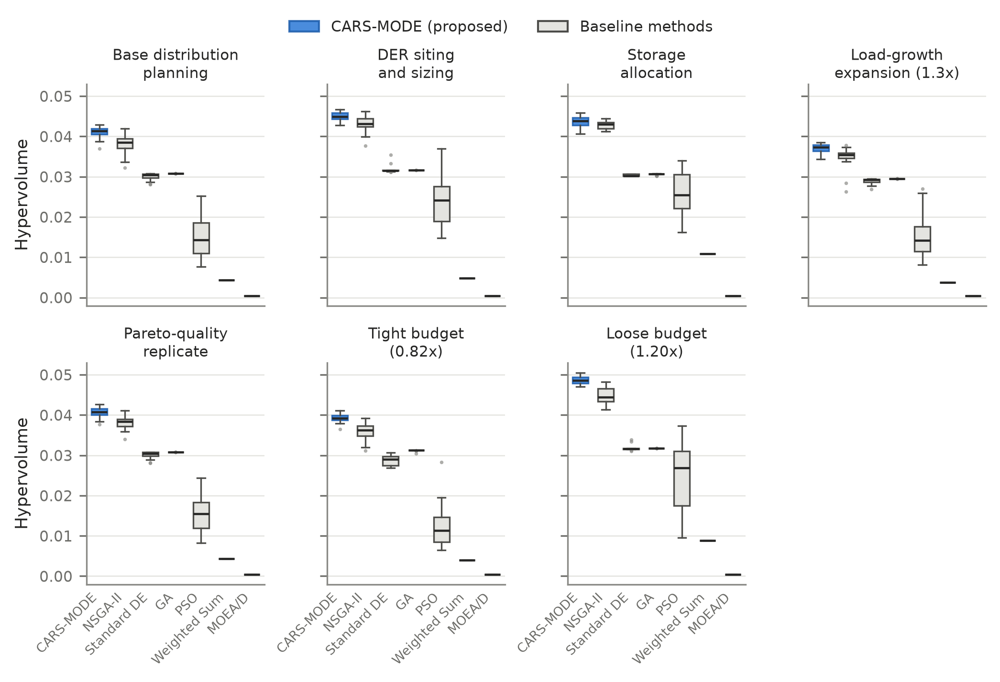
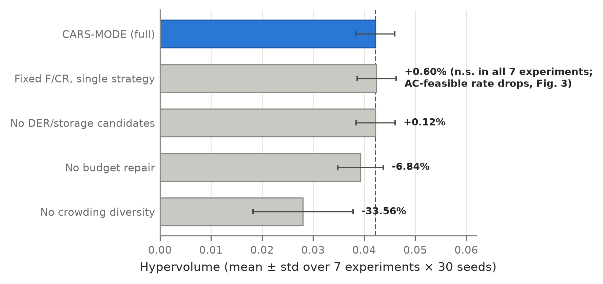
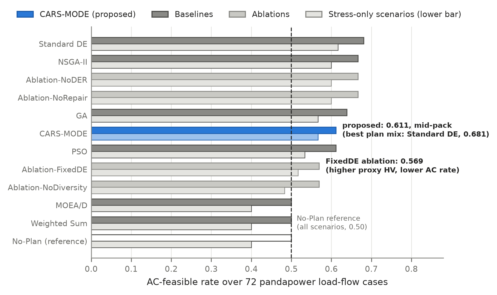
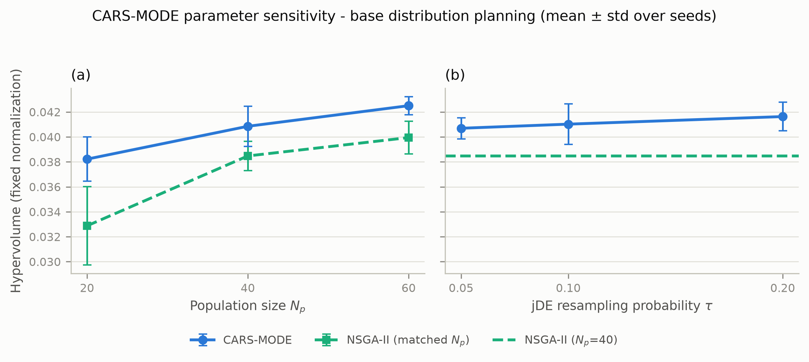

<!-- MDPI Energies submission draft (Markdown master).
     Paper: mintou_p3 / CARS-MODE.
     Section: Electrical Power and Energy Systems (alt: Smart Grids and Microgrids).
     All numbers verified against:
       papers/mintou/mintou_p3_samode_distribution_planning/evidence/tables/real_simbench_planning_leaderboard.csv
       papers/mintou/mintou_p3_samode_distribution_planning/evidence/tables/real_simbench_planning_significance.csv
       papers/mintou/mintou_p3_samode_distribution_planning/evidence/tables/real_ac_validation_summary.csv
       papers/mintou/mintou_p3_samode_distribution_planning/evidence/tables/real_sensitivity_sweep.csv
       papers/mintou/mintou_p3_samode_distribution_planning/evidence/source/real_simbench_planning_source_profile.csv
       papers/mintou/mintou_p3_samode_distribution_planning/src/configs/real_simbench_planning_config.json
     Figures live in ./figures/ (300 dpi PNG).
     [TODO] markers indicate items to resolve before submission. -->

# CARS-MODE: Constraint-Aware and Strategy-Adaptive Multi-Objective Differential Evolution for Reproducible Distribution Network Planning with DER and Storage Integration

**Authors:** [TODO: author list]
**Affiliations:** [TODO: affiliations]
**Correspondence:** [TODO: corresponding author email]

## Abstract

Distribution utilities must decide, under a fixed investment budget, which mix of feeder reinforcement, distributed energy resource (DER) installations, storage, and automation upgrades to deploy as load grows and DER penetration rises. We present CARS-MODE, a binary multi-objective differential evolution algorithm that combines jDE-style self-adaptive control parameters, a success-driven two-strategy mutation pool, constraint-aware budget repair, and crowding-based diversity preservation, and we evaluate it on a fully reproducible planning benchmark derived from the public SimBench dataset (18 subnetworks, 72 candidate actions, five objectives, seven planning scenarios). Over 30 seeded runs per scenario, CARS-MODE attains a pooled mean hypervolume 6.34% above the strongest of six baselines (NSGA-II), winning all 42 Holm-corrected Mann–Whitney baseline comparisons, and the advantage persists without rank reversal across a two-parameter sensitivity sweep. We then validate the resulting plan compositions with pandapower AC load flow on four real SimBench MV networks under six stress scenarios. This second evaluation level reveals an honest trade-off: every optimizer's plan mix improves AC feasibility over the no-plan reference (0.611 vs. 0.500 for CARS-MODE), but the proxy-hypervolume ranking does not carry over to the electrical ranking, and the fixed-parameter ablation that slightly exceeds CARS-MODE in hypervolume (+0.60%, not significant) loses the most AC feasibility (0.569). We report both levels, their disagreement, and the resulting scope of the claims.

**Keywords:** distribution network planning; distributed energy resources; energy storage; multi-objective optimization; differential evolution; self-adaptive parameter control; constraint handling; SimBench

---

## 1. Introduction

The distribution grid is where the energy transition becomes an investment problem. Photovoltaic connections, storage systems, and electrified loads are arriving at medium- and low-voltage feeders faster than the underlying networks were designed for, and the planning departments of distribution system operators (DSOs) must translate this pressure into concrete annual decisions: which feeders to reinforce, where to accept new DER capacity, where storage earns its cost, and which automation upgrades to fund — all inside a budget that covers only a fraction of the candidate actions. Each action affects several quantities at once (investment cost, losses, voltage exposure, DER hosting capability, supply reliability), and the quantities conflict: the cheapest plan hosts the least DER, and the most DER-friendly plan strains voltage limits under high-infeed conditions. Distribution planning under DER and storage integration is therefore a constrained multi-objective combinatorial problem, and it recurs every planning cycle.

Evolutionary multi-objective algorithms are the workhorse of this literature, but two practical frictions persist. The first is algorithmic: differential evolution (DE), one of the strongest continuous optimizers, is sensitive to its control parameters and mutation strategy, and the planning problem is binary, budget-constrained, and rugged — exactly the regime where a single fixed DE configuration can stall. Self-adaptive DE variants (jDE, SaDE) solved this on continuous benchmarks two decades ago, yet planning papers in the energy venues we target typically run either a fixed-parameter DE or an off-the-shelf NSGA-II. The second friction is evidential: many published planning studies evaluate on private networks or on objective proxies that are never checked against a power flow, which makes results hard to reproduce and easy to over-read. Recent methodological audits of metaheuristic research make the same two demands we impose on ourselves here: statistically grounded comparisons over many independent runs, and validation of the surrogate objective against the physical model it stands for.

This paper contributes on both fronts. Algorithmically, we present **CARS-MODE** (Constraint-Aware Repair and Strategy-adaptive Multi-Objective Differential Evolution), a binary multi-objective DE that (i) self-adapts each individual's scale factor $F$ and crossover rate $CR$ in the jDE manner, (ii) chooses between a rand/1 and a best/1 mutation strategy from a success-driven probability pool in the SaDE spirit, (iii) repairs budget-violating plans deterministically by dropping the worst benefit-to-cost actions, and (iv) preserves front diversity with crowding-distance truncation. Evidentially, we build the entire study on public data and publish every artifact: the benchmark is derived deterministically from the SimBench complete mixed dataset, all six baselines and four ablations are real algorithm implementations (pymoo reference codes where available), the headline metric is the standard hypervolume under fixed method-independent normalization, and every comparison is backed by 30 seeded runs with Holm-corrected Mann–Whitney tests.

The study's defining design decision is a two-level evaluation. The planning objectives are engineering indices computed from SimBench subnet statistics — fast enough to support a rigorous statistical protocol, but proxies nonetheless. We therefore add a second level: the compromise plan composition of every method is mapped onto four real SimBench MV networks and checked with pandapower AC load flow across six stress scenarios (peak load, load growth, extreme growth, high DER infeed, and an N-1 contingency). The two levels disagree in an instructive way, and we report the disagreement as a finding rather than hiding it: the proxy-hypervolume ranking does not survive contact with the AC layer, and the component that is cheapest to remove at the proxy level (strategy adaptation) turns out to be the one protecting electrical feasibility.

The contributions of this paper are:

1. **A constraint-aware, strategy-adaptive multi-objective DE for binary planning portfolios.** CARS-MODE integrates jDE parameter self-adaptation, a SaDE-style two-strategy pool with Pareto-improvement success accounting, budget repair, and crowding diversity, each individually switchable for ablation (Section 4).
2. **A reproducible public planning benchmark with a method-independent evaluation protocol.** Seven planning scenarios (candidate-pool, load-growth, and budget variants) over 72 candidate actions derived from SimBench subnet statistics; standard hypervolume under fixed seeded normalization bounds; 30 seeds per method and scenario (Sections 3 and 5; `evidence/source/real_simbench_planning_source_profile.csv`).
3. **A statistically grounded main result.** CARS-MODE attains a pooled mean hypervolume of 0.04218, 6.34% above the strongest baseline (NSGA-II, 0.03966), and wins 42 of 42 per-scenario baseline comparisons under Holm-corrected Mann–Whitney tests, with per-scenario margins from +1.87% to +9.84% (Section 6.1; Figure 1; `evidence/tables/real_simbench_planning_significance.csv`).
4. **An honest two-level component and validity analysis.** The ablation study shows that budget repair (−6.84% when removed) and diversity preservation (−33.56%) carry the proxy gain, while strategy adaptation is proxy-neutral (FixedDE ablation +0.60%, not significant in any scenario); the pandapower AC validation then reverses this reading — the FixedDE ablation loses the most AC feasibility (0.569 vs. 0.611) — and we analyze the trade-off rather than reporting only the favorable level (Sections 6.2–6.3; Figures 2–3; `evidence/tables/real_ac_validation_summary.csv`).

The remainder of the paper follows the usual structure: Section 2 reviews related work, Section 3 formalizes the problem and the benchmark, Section 4 presents CARS-MODE, Section 5 the experimental protocol, Section 6 the results (including the AC validation and a parameter sensitivity analysis), Section 7 the discussion, Section 8 the limitations, and Section 9 concludes.

---

## 2. Related Work

Three threads frame this work: distribution network expansion planning with DER and storage, evolutionary and swarm metaheuristics in power system planning, and self-adaptive differential evolution with constraint handling. <!-- [TODO] The twelve target-venue comparator papers below were collected via DOI (ara_collections/target_journal_related); their full texts were not all extracted at drafting time, so the one-line characterizations are title-level and must be checked against the PDFs before submission. -->

### 2.1. Distribution Network Expansion Planning with DER and Storage

Active distribution network planning has moved from single-objective conductor sizing to portfolio decisions that co-optimize reinforcement, DER siting, storage, and flexibility. Recent surveys map this shift: [Gonzalez-Longatt et al., 2024] catalogue the optimization principles applied in planning and operation of active distribution networks, and [review, 2025] organize the elements of modern planning models, including the entry of generative-AI scenario tools. On the modeling side, robustness to uncertainty dominates: [Wasserstein, 2024] plan expansions under distributional uncertainty via Wasserstein-distance ambiguity sets and dual relaxation, and [WGAN, 2025] coordinate source–network–storage expansion against WGAN-GP-generated scenarios. Reliability-driven formulations add restoration and islanding to reinforcement choices [reliability, 2026], while [TSO-DSO, 2025] extend the planning boundary upward to the transmission–distribution interface, and [datacenter, 2025] specialize it to hybrid AC/DC campus networks. Closest to our task, [He et al., 2025] co-optimize distribution networks with storage and electric vehicles using an improved NSGA-II, and [classification, 2026] integrate DG, capacitor banks, and EV charging stations in radial feeders through a classification-based global optimization scheme. Across this thread the algorithmic engine is almost always a Pareto-based genetic algorithm or a mathematical-programming reformulation; DE appears rarely, and when the engine is improved, the improvement is seldom isolated by ablation. Equally relevant to us is what these papers evaluate on: private or single test systems are the norm, and the mapping from optimization objective to AC feasibility is usually asserted rather than measured.

### 2.2. Evolutionary and Swarm Metaheuristics in Power System Planning

The broader planning literature in energy venues is a proving ground for metaheuristic variants: enhanced beluga whale optimization for vulnerability-driven storage planning [Qi et al., 2025], an enhanced coati algorithm for static and dynamic transmission expansion [Demirbas et al., 2025], and DE itself compared against other optimizers for economic dispatch under energy-limitation scenarios [dispatch-DE, 2025]. Two recurring weaknesses motivate our protocol. First, hybrid or "improved" algorithms are often published without per-component evidence, so the reader cannot tell which mechanism earns its complexity — a gap our one-switch-per-run ablation design addresses directly. Second, comparisons frequently rest on few runs of self-defined quality indices; the metaheuristic community's own methodological standards (dozens of independent runs, rank-based tests, standard indicators such as hypervolume [Zitzler and Thiele, 1999]) are applied unevenly in application venues. We adopt the standard indicator, 30 seeded runs, and Holm-corrected non-parametric tests precisely because the margins that matter in planning problems (single-digit percent) are otherwise indistinguishable from seed noise.

### 2.3. Self-Adaptive Differential Evolution and Constraint Handling

DE [Storn and Price, 1997] owes much of its practical success to two families of extensions. Parameter self-adaptation removes the burden of tuning $F$ and $CR$: jDE [Brest et al., 2006] encodes both into each individual and resamples them with a small probability per generation, while SaDE [Qin et al., 2009] additionally learns which mutation strategy to apply from recent success counts; the survey of [Das and Suganthan, 2011] traces the lineage. Multi-objective DE variants transplant these mechanisms under Pareto selection, typically borrowing NSGA-II's non-dominated sorting and crowding [Deb et al., 2002] or decomposition [Zhang and Li, 2007]. Constraint handling is the second family: penalty terms, feasibility-first domination, and repair operators [Coello Coello, 2002]. Repair is especially attractive for knapsack-like budget constraints because it keeps the population inside the fundable region instead of wasting evaluations on unfundable plans. What has not been demonstrated, to our knowledge, is the combination we test here: jDE/SaDE-style adaptation and greedy budget repair inside a binary multi-objective DE, applied to distribution planning portfolios, with each mechanism ablated separately *and* the resulting plans checked at the AC power-flow level. The AC check matters because self-adaptation is usually justified by indicator gains alone; our results show that on this problem its main measurable effect is electrical, not indicator-level (Section 6.3), a justification the DE literature has not previously offered.

### 2.4. Gap Statement

In sum: the distribution-planning thread supplies the task but rarely isolates algorithmic components or validates proxies electrically; the metaheuristics thread supplies variant algorithms but is under-standardized statistically in application venues; and the DE thread supplies the adaptation machinery but has not been evaluated on budget-constrained binary planning portfolios with power-flow validation. This paper occupies the intersection: a component-attributable, statistically tested, publicly reproducible self-adaptive multi-objective DE for DER/storage planning, evaluated at both the proxy and the AC level, with the disagreement between the two levels reported honestly.

---

## 3. Problem Formulation and Public Benchmark

### 3.1. Planning Portfolios as Multi-Objective Binary Selection

Let $\mathcal{A} = \{a_1, \dots, a_n\}$ be a pool of candidate planning actions. Each action belongs to one of four kinds — feeder **reinforcement**, **storage** installation, **DER** installation, and **automation** — and carries an investment cost $k_i$ plus five benefit attributes: loss reduction, voltage-risk reduction, hosting-capacity gain, reliability gain, and DER-support share. A plan is a binary vector $x \in \{0,1\}^n$. The planner minimizes five objectives simultaneously:

$$
\min_{x \in \{0,1\}^n} F(x) = \big( C(x),\; L(x),\; U(x),\; -H(x),\; -R(x) \big),
$$

where $C$ is total investment cost, $L$ a network loss index, $U$ a voltage-risk index, $H$ the DER hosting-capacity index, and $R$ a reliability index; all five are analytic functions of the selected actions' attributes and the scenario's load multiplier (Section 3.2 gives their provenance). The single hard constraint is the budget:

$$
\textstyle\sum_i k_i x_i \le B, \qquad v(x) = \max\big(0, (\textstyle\sum_i k_i x_i - B)/B\big),
$$

with $B = 980$ cost units at the nominal level, scaled per scenario. A methodological note we consider part of the contribution's honesty: an earlier internal version of this benchmark declared voltage-risk and hosting-capacity *targets* as additional hard constraints. Those targets turned out to be unsatisfiable within the budget for every method — the "constraints" were silently converted into soft penalties by the pipeline, which misrepresented the feasibility structure of the problem. The present version therefore treats the budget as the only hard constraint, moves voltage risk and hosting capacity into the objective vector where they belong, and reports the remaining target shortfalls as descriptive metrics of the compromise plans. The deprecated artifacts are retained in the public evidence trail.

For readers outside evolutionary computation: a plan $x$ *dominates* $x'$ if it is no worse in all five objectives and strictly better in at least one; the *feasible non-dominated front* is the set of mutually non-dominating, budget-respecting plans a method returns; and *hypervolume* is the volume of normalized objective space dominated by that front relative to a fixed reference point — the standard single-number indicator that rewards both convergence and spread.

### 3.2. Benchmark Construction from SimBench

All problem data derive deterministically from the SimBench complete mixed dataset (`1-complete_data-mixed-all-0-sw`) [Meinecke et al., 2020], a public benchmark of the German grid spanning EHV to LV. From its `Load.csv`, `Line.csv`, and `RES.csv` tables we aggregate per-subnet statistics — active/reactive load, load count, installed renewable capacity, line length and count, and average maximum loading — and keep the 18 subnetworks with the highest combined load and line-length stress (Table 1). Each subnet contributes one candidate action of each kind, giving $n = 72$ candidates whose costs and benefit attributes are fixed analytic functions of the subnet statistics: e.g., reinforcement cost scales with line length and load; storage and DER hosting gains scale with the subnet's DER gap (the shortfall of installed renewables against 55% of load); automation reliability gain scales with line count. Every derivation rule is published code; no attribute is hand-assigned per candidate.

**Table 1.** Benchmark source profile (from `evidence/source/real_simbench_planning_source_profile.csv`).

| Property | Value |
|---|---|
| SimBench network | `1-complete_data-mixed-all-0-sw` (EHV–LV complete mixed) |
| Subnetworks used | 18 (EHV1, HV1, HV2, LV3.101–LV3.107, LV3.201–LV3.208) |
| Candidate actions | 72 (18 subnets x 4 kinds) |
| Total load | 71,348.9 MW |
| Total installed RES | 12,234.9 MW |
| Total line length | 34,296.2 km |
| Nominal budget $B$ | 980 cost units (synthetic, not monetarily calibrated) |

We state plainly what this construction is: a *reproducible public proxy* for portfolio-level distribution planning. The objective indices are engineering-plausible functions of real network statistics, not AC power-flow results — which is exactly why Section 6.3 validates the outcome plans with pandapower load flow, and why Section 8 lists the remaining distance to an engineering-grade planning claim.

### 3.3. Planning Scenarios

Seven experiments exercise the pool along three axes — candidate-pool composition, load growth, and budget tightness — with an identical evaluation protocol throughout (Table 2). The planning stage itself is deterministic (a single nominal operating scenario per experiment); stochastic stress enters at the AC validation stage (Section 5.4).

**Table 2.** The seven planning scenarios (from `src/configs/real_simbench_planning_config.json`).

| Experiment | Budget factor | Load factor | Pool restriction |
|---|---|---|---|
| base_distribution_planning | 1.00 | 1.0 | none |
| der_siting_sizing | 1.00 | 1.0 | storage candidates excluded |
| storage_allocation | 1.00 | 1.0 | DER candidates excluded |
| load_growth_expansion | 1.00 | 1.3 | none |
| pareto_quality | 1.00 | 1.0 | none (independent replicate of the base setup) |
| constraint_repair | 0.82 | 1.0 | none (tight budget) |
| runtime_scalability | 1.20 | 1.0 | none (loose budget) |

Two design notes. First, `pareto_quality` intentionally replicates the base configuration under an independent per-method seed stream (seeds are derived by hashing the experiment and method identifiers), so it functions as an internal replication check; its results track the base experiment closely (Section 6.1). Second, the two budget variants (0.82x, 1.20x) probe the repair mechanism and the loose-budget regime respectively; we label them by their budget role in figures because — the benchmark objectives being fast analytic proxies — the original "runtime scalability" reading of the loose-budget slot would be vacuous, and we do not make runtime-scaling claims from it.

---

## 4. CARS-MODE

CARS-MODE is a binary multi-objective DE organized so that each named mechanism is one switch in the code, which makes the ablation study of Section 6.2 a clean attribution. A continuous genome $g \in [0,1]^n$ is thresholded at 0.5 into a plan vector; initial genomes are sparse (about 8% of genes above threshold) so that the search starts among affordable plans.

### 4.1. jDE Self-Adaptive Control Parameters

Each individual carries its own $(F_i, CR_i)$, initialized at $(0.5, 0.9)$. In every generation, with resampling probability $\tau = 0.1$, an individual redraws $F_i \sim U(0.1, 0.9)$ and $CR_i \sim U(0, 1)$ [Brest et al., 2006]. *Motivation:* the budget-constrained binary landscape changes character as the population approaches the budget boundary; per-individual parameter carrying lets successful settings persist through selection while resampling keeps exploring, without any global tuning. The sensitivity study (Section 6.4) sweeps $\tau$ and finds a flat response.

### 4.2. Success-Driven Two-Strategy Pool

Mutation chooses between DE/rand/1 (base vector drawn uniformly) and DE/best/1 (base vector drawn from the current feasible-first non-dominated front) with a probability proportional to each strategy's recent success mass, in the SaDE spirit [Qin et al., 2009]. A trial counts as a success if it constraint-dominates its parent (strictly lower violation, or equal violation and Pareto improvement); success masses decay by 0.95 per generation with a floor of 0.2, so neither strategy is ever starved. *Motivation:* rand/1 supplies exploration early, best/1 supplies front intensification late; letting measured success arbitrate avoids committing to either schedule a priori.

### 4.3. Constraint-Aware Budget Repair

Every decoded plan that exceeds the budget is repaired deterministically: the selected action with the worst aggregate benefit-to-cost ratio is dropped repeatedly until the plan is affordable. *Motivation:* under a hard budget, penalty-carrying infeasible plans waste both evaluations and selection slots; repair keeps the whole population fundable and concentrates the search on the boundary where the interesting trade-offs live. This is the mechanism the tight-budget scenario (0.82x) stresses directly.

### 4.4. Crowding-Based Diversity Preservation

Environmental selection is elitist ($\mu + \lambda$): parents and trials are pooled, sorted by constraint-domination fronts, and truncated to the population size with crowding distance [Deb et al., 2002] breaking ties in the last admitted front. The corresponding ablation replaces crowding with a random tie-break. *Motivation:* with only 40 individuals covering a five-objective front, losing spread control collapses the front to a few clusters — the ablation quantifies exactly how much (−33.56%, Section 6.2).

### 4.5. Algorithm Summary

```
CARS-MODE(pool, budget, seed):
  initialize 40 sparse genomes in [0,1]^72; per-individual F=0.5, CR=0.9
  decode (threshold 0.5) and repair each plan to budget            # 4.3
  for gen = 1 .. 40:
    for each individual i:
      with prob 0.1 resample F_i ~ U(0.1,0.9), CR_i ~ U(0,1)       # 4.1
      pick strategy rand/1 or best/1 by success mass               # 4.2
      mutate + binomial crossover -> trial genome; decode + repair # 4.3
    update strategy success masses (constraint-domination test)    # 4.2
    (mu+lambda) selection: constraint-domination NDS + crowding    # 4.4
  return feasible non-dominated front of the final population
```

---

## 5. Experimental Setup

### 5.1. Methods Compared

Table 3 lists the eleven methods: CARS-MODE, six baselines, and four ablations. NSGA-II and MOEA/D are the pymoo reference implementations [Blank and Deb, 2020] on the identical binary constrained problem; GA, binary PSO [Kennedy and Eberhart, 1997], and standard DE optimize a normalized weighted-sum scalarization with a violation penalty; Weighted Sum is a greedy benefit fill under budget. An earlier version of this pipeline scored hand-shaped per-method ranking heuristics instead of running real algorithms; it was deprecated in full and re-run with the implementations below, and the deprecated artifacts remain in the evidence trail (`*_proxy_methods_deprecated.*`).

**Table 3.** Methods (from `src/configs/real_simbench_planning_config.json`).

| Method | Role | Description |
|---|---|---|
| CARS-MODE | proposed | binary MODE: jDE self-adaptive F/CR + two-strategy pool + budget repair + crowding |
| NSGA-II | baseline | pymoo NSGA-II, binary encoding, constrained |
| MOEA/D | baseline | pymoo MOEA/D, budget as penalty |
| Standard DE | baseline | binary DE/rand/1/bin, fixed F = 0.5, CR = 0.9, scalarized |
| PSO | baseline | binary PSO (sigmoid velocity), scalarized |
| GA | baseline | single-objective GA, tournament + uniform crossover, scalarized |
| Weighted Sum | baseline | weighted-benefit greedy fill under budget |
| Ablation-FixedDE | ablation | F = 0.5, CR = 0.9 fixed; single rand/1 strategy (adaptation off) |
| Ablation-NoRepair | ablation | budget repair disabled (violation-penalized search) |
| Ablation-NoDiversity | ablation | crowding replaced by random tie-break |
| Ablation-NoDER | ablation | DER and storage candidates removed from the search pool |

Ablation-NoDER is a *problem-variant* probe rather than an operator switch: excluded candidates receive prohibitive cost in the search problem only, while evaluation stays in the full objective space, so its hypervolumes remain comparable. We flag this asymmetry wherever it matters (Section 6.2).

### 5.2. Protocol

Every method runs **30 seeded independent runs** per experiment (11 methods x 7 experiments x 30 seeds = 2310 runs). All population-based methods share the same computational configuration: population 40, 40 generations. Run seeds are derived by hashing the (paper, experiment, method) triple with the run index, so no two cells share a random stream.

### 5.3. Evaluation Metric and Statistics

The headline metric is the **standard hypervolume** of the feasible non-dominated front, computed with pymoo's exact indicator on objectives normalized by *fixed per-experiment bounds*: the bounds come from a seeded reference sample (the empty plan, all 72 single-action plans, and 2048 random feasible plans) with a 5% margin, and the reference point is 1.1 in every normalized dimension. The metric contains no method-aware ingredient, and an empty feasible front scores zero. Statistical comparisons are two-sided **Mann–Whitney U tests** between CARS-MODE and each opponent per experiment ($n = 30$ per group) with **Holm correction** within each experiment [Holm, 1979]; we report Holm-adjusted significance at $\alpha = 0.05$.

### 5.4. AC Load-Flow Validation Protocol

Because the planning objectives are proxies, we validate outcomes electrically. For each method and each of the three composition-bearing experiments (base, DER siting, storage allocation), the seed-0 compromise plan is reduced to its *composition* — counts of reinforcement, storage, DER, and automation actions (e.g., CARS-MODE selects 6/7/1/0 in the base experiment; NSGA-II 5/4/6/0) — and mapped onto four real SimBench MV networks (rural, semi-urban, urban, commercial) by fixed, method-independent rules: reinforcement adds a parallel conductor on the most-loaded lines; storage connects at the weakest-voltage load buses (±3% of net load, discharging under load stress, charging under DER stress); DER adds PV at the highest-load buses (4% of net load, scaled by the scenario's DER factor); automation has no steady-state electrical effect. Each mapped network is solved with pandapower AC power flow [Thurner et al., 2018] under six scenarios — base, peak load (1.3x), load growth (1.5x), extreme growth (1.8x), high DER (2.5x), and growth plus N-1 line outage — yielding 4 x 6 x 3 = 72 cases per method. A case is **AC-feasible** if the flow converges, all bus voltages lie in [0.95, 1.05] pu, and no line exceeds 100% loading. A **No-Plan** reference runs the same 72 cases without any plan. This stage tests whether a method's plan *mix* restores or preserves AC feasibility under stress; it is deliberately not a nodal siting study (the mapping rules, not the optimizer, choose buses), a boundary we return to in Sections 7 and 8.

---

## 6. Results

### 6.1. Main Comparison

Table 4 reports pooled results over all 7 experiments x 30 seeds; Figure 1 shows per-experiment distributions for the seven main methods.

**Table 4.** Pooled leaderboard (210 runs per method; from `evidence/tables/real_simbench_planning_leaderboard.csv`).

| Method | Role | Mean HV | Std | Mean feasible front size | Mean runtime (s) |
|---|---|---|---|---|---|
| Ablation-FixedDE | ablation | 0.04243 | 0.00381 | 38.7 | 0.115 |
| Ablation-NoDER | ablation | 0.04223 | 0.00381 | 37.6 | 0.138 |
| **CARS-MODE** | **proposed** | **0.04218** | **0.00381** | **38.6** | **0.119** |
| NSGA-II | baseline | 0.03966 | 0.00405 | 40.0 | 0.077 |
| Ablation-NoRepair | ablation | 0.03929 | 0.00444 | 39.1 | 0.079 |
| GA | baseline | 0.03089 | 0.00069 | 1.0 | 0.005 |
| Standard DE | baseline | 0.03027 | 0.00129 | 1.0 | 0.012 |
| Ablation-NoDiversity | ablation | 0.02802 | 0.00977 | 8.1 | 0.189 |
| PSO | baseline | 0.01898 | 0.00763 | 1.0 | 0.005 |
| Weighted Sum | baseline | 0.00584 | 0.00261 | 1.0 | 0.0003 |
| MOEA/D | baseline | 0.00047 | 0.00000 | 1.0 | 0.350 |

CARS-MODE attains a pooled mean hypervolume of 0.04218 (std 0.00381), **6.34% above the strongest baseline, NSGA-II** (0.03966); the scalarized baselines trail by 27% (GA) to 55% (PSO) because they return a single compromise plan rather than a front. Two baseline behaviors deserve explicit mention rather than a silent leaderboard row. MOEA/D's penalty-based constraint handling collapses to the empty plan on this problem (front size 1, hypervolume equal to the empty-plan value in every run); we report this as an observed failure of that specific configuration on this problem, not as a general statement about decomposition methods. Weighted Sum fills the budget greedily on a single preference vector and lands accordingly low. Against the 42 per-experiment baseline comparisons (6 baselines x 7 experiments), CARS-MODE records **42 Holm-significant wins and no losses**.



**Figure 1.** Hypervolume distributions (30 seeds per box) across the seven planning scenarios for CARS-MODE and the six baselines.

Table 5 breaks out the only competitive baseline, NSGA-II.

**Table 5.** CARS-MODE vs. NSGA-II per experiment (mean HV over 30 seeds; Holm-adjusted p from `evidence/tables/real_simbench_planning_significance.csv`).

| Experiment | CARS-MODE | NSGA-II | Rel. diff | Holm p | Significant |
|---|---|---|---|---|---|
| base_distribution_planning | 0.04108 | 0.03813 | +7.75% | 4.8e-7 | yes |
| constraint_repair (0.82x budget) | 0.03925 | 0.03573 | +9.84% | 2.9e-9 | yes |
| der_siting_sizing | 0.04496 | 0.04308 | +4.36% | 2.0e-4 | yes |
| load_growth_expansion | 0.03700 | 0.03495 | +5.85% | 1.3e-5 | yes |
| pareto_quality (replicate) | 0.04062 | 0.03812 | +6.55% | 2.9e-7 | yes |
| runtime_scalability (1.20x budget) | 0.04873 | 0.04481 | +8.76% | 6.5e-10 | yes |
| storage_allocation | 0.04362 | 0.04282 | +1.87% | 0.033 | yes |

The margin is significant in all seven scenarios and largest exactly where the budget binds hardest (+9.84% at 0.82x) — consistent with the repair mechanism's role — and smallest on the storage-only pool (+1.87%), where the restricted candidate set leaves less room for search quality to matter. The independent replicate (`pareto_quality`) reproduces the base-experiment margin (+6.55% vs. +7.75%), which is the behavior one wants from a seed-robust result. Two costs accompany the gain and we state them: CARS-MODE spends about 1.5x NSGA-II's runtime (0.119 s vs. 0.077 s per run — both trivial in absolute terms on these proxy objectives), and its feasible fronts are slightly smaller (38.6 vs. 40.0 plans on average), i.e., it buys hypervolume through better plans, not bigger fronts.

### 6.2. Ablation Study

Figure 2 compares the full method with the four ablations (pooled over 7 experiments x 30 seeds).



**Figure 2.** Mean hypervolume (± std) of CARS-MODE and the four ablations, pooled over all experiments and seeds. The FixedDE ablation exceeds the full method by a non-significant margin at the proxy level but loses AC feasibility (Figure 3).

Two components carry the proxy-level result. Removing budget repair costs 6.84% of pooled hypervolume (Holm-significant in six of seven experiments) and pushes the search into penalty territory precisely in the tight-budget scenario the mechanism exists for. Removing crowding diversity is catastrophic: −33.56%, significant everywhere, with front sizes collapsing from 38.6 to 8.1 and the run-to-run std more than doubling — on a five-objective problem, spread control is not a refinement but a load-bearing wall.

**The honest finding is that strategy adaptation does not pay at the proxy level.** Ablation-FixedDE — fixed $F = 0.5$, $CR = 0.9$, single rand/1 strategy — attains a pooled mean of 0.04243, **0.60% above the full method**, and the difference is not Holm-significant in any of the seven experiments (per-experiment Holm p between 0.22 and 0.76, all in FixedDE's nominal favor). Ablation-NoDER sits similarly close (+0.12% pooled), with two Holm-significant per-experiment losses for the full method (on the tight-budget and DER-siting scenarios) and one significant win (loose budget); since NoDER changes the candidate pool rather than the algorithm, we read it as evidence that on pool-restricted variants a smaller search space can be marginally easier, not as a component attribution. Faced with the FixedDE result alone, the defensible conclusions would be either to drop strategy adaptation or to justify it on other grounds. Section 6.3 provides exactly that other ground — and it is the reason we did not quietly remove the component: the adaptation mechanism turns out to matter at the level the proxy cannot see.

### 6.3. AC Load-Flow Validation and the HV–AC Trade-Off

Table 6 and Figure 3 report the pandapower validation of every method's compromise plan compositions over 72 AC cases.

**Table 6.** AC validation summary (from `evidence/tables/real_ac_validation_summary.csv`). Stress-only excludes the base scenario (60 cases).

| Method | Role | AC-feasible rate | Stress-only rate | Mean min voltage (pu) | Mean max line loading (%) |
|---|---|---|---|---|---|
| No-Plan | reference | 0.500 | 0.400 | 0.9619 | 90.8 |
| Standard DE | baseline | 0.681 | 0.617 | 0.9731 | 63.5 |
| NSGA-II | baseline | 0.667 | 0.600 | 0.9739 | 75.6 |
| Ablation-NoRepair | ablation | 0.667 | 0.600 | 0.9735 | 70.5 |
| Ablation-NoDER | ablation | 0.667 | 0.600 | 0.9697 | 56.8 |
| GA | baseline | 0.639 | 0.567 | 0.9720 | 66.7 |
| **CARS-MODE** | **proposed** | **0.611** | **0.567** | **0.9729** | **76.6** |
| PSO | baseline | 0.611 | 0.533 | 0.9716 | 75.7 |
| Ablation-FixedDE | ablation | 0.569 | 0.517 | 0.9720 | 73.7 |
| Ablation-NoDiversity | ablation | 0.569 | 0.483 | 0.9681 | 69.9 |
| MOEA/D | baseline | 0.500 | 0.400 | 0.9619 | 90.8 |
| Weighted Sum | baseline | 0.500 | 0.400 | 0.9636 | 88.4 |



**Figure 3.** AC-feasible rate (all scenarios, upper bar; stress-only, lower bar) per method over 72 pandapower cases on four SimBench MV networks. The dashed line is the No-Plan reference (0.50).

Three readings, in decreasing order of comfort for the proposed method. First, the planning layer as a whole works: every optimizer that returns a non-empty plan beats the No-Plan reference on AC feasibility (CARS-MODE 0.611 vs. 0.500 overall; 0.567 vs. 0.400 under stress), lifts the worst bus voltage (0.9729 vs. 0.9619 pu), and cuts the peak line loading (76.6% vs. 90.8%). MOEA/D (empty plan) and Weighted Sum sit at the reference level, consistent with their proxy failure.

Second — and this is the part a less candid write-up would omit — **the proxy-hypervolume ranking does not transfer to the AC ranking.** CARS-MODE, the significant proxy winner, is mid-pack electrically: Standard DE's plan mix (heavier on reinforcement relative to DER) achieves 0.681, NSGA-II 0.667, and GA 0.639. The mechanism is visible in the compositions: CARS-MODE's compromise plans are storage- and DER-rich (its base-experiment composition is 6 reinforcement / 7 storage / 1 DER), which maximizes the proxy's hosting-capacity and reliability indices, but DER-heavy mixes carry an over-voltage cost in the high-DER stress scenario that the proxy objectives do not price. The proxy and the AC model disagree about *what a good plan mix is*, and a hypervolume gain of 6.34% at the proxy level buys no guarantee at the flow level. We regard establishing this, on public data with published mapping rules, as a result of the paper rather than a blemish on it.

Third, the trade-off inverts the ablation verdict on strategy adaptation. **Ablation-FixedDE, the nominal proxy winner (+0.60%, n.s.), records the largest AC-feasibility drop among the algorithmic ablations: 0.569 against the full method's 0.611** (stress-only 0.517 vs. 0.567), tied with NoDiversity and below every baseline except the degenerate ones. Removing self-adaptation makes the search converge onto proxy-optimal but electrically more fragile plan mixes; the adaptive version's noisier parameter regime lands on compositions that give away a statistically invisible sliver of hypervolume and keep 4.2 percentage points of AC feasibility. Symmetrically, NoRepair — a clear proxy loser (−6.84%) — matches NSGA-II's AC rate. Component value in this problem is two-dimensional, and each level of the evaluation sees only one dimension. We therefore justify strategy adaptation on electrical rather than indicator grounds, and we flag the corresponding limitation: with one compromise plan per method and experiment (72 binary outcomes per method), the AC stage supports this reading as a consistent qualitative pattern, not as a second statistically powered comparison (Section 8).

### 6.4. Parameter Sensitivity Analysis

To verify that the main comparison does not hinge on a fortunate parameter choice, we swept the two influential scalar parameters of CARS-MODE around their defaults on the base experiment, re-running 10 seeds per point under the main protocol: population size $N_p \in \{20, 40, 60\}$ (NSGA-II re-run at matched sizes) and the jDE resampling probability $\tau \in \{0.05, 0.1, 0.2\}$ (baselines unaffected; NSGA-II reference at $N_p = 40$). The remaining mechanisms are binary switches already covered by the ablation study. Table 7 and Figure 4 summarize the sweep; the full per-seed values are in `evidence/tables/real_sensitivity_sweep.csv`.

**Table 7.** Parameter sensitivity on the base experiment (10 seeds per point; two-sided Mann–Whitney U vs. the matched NSGA-II reference).

| Parameter | Value | CARS-MODE HV (mean ± std) | NSGA-II reference | p (MWU) |
|---|---|---|---|---|
| population size $N_p$ | 20 | 0.0382 ± 0.0018 | 0.0329 | 0.0010 |
| population size $N_p$ | 40 (default) | 0.0409 ± 0.0016 | 0.0385 | 0.0058 |
| population size $N_p$ | 60 | 0.0425 ± 0.0007 | 0.0399 | 0.0002 |
| resampling prob. $\tau$ | 0.05 | 0.0407 ± 0.0008 | 0.0385 | 0.0006 |
| resampling prob. $\tau$ | 0.1 (default) | 0.0410 ± 0.0016 | 0.0385 | 0.0036 |
| resampling prob. $\tau$ | 0.2 | 0.0416 ± 0.0011 | 0.0385 | 0.0002 |



**Figure 4.** Mean hypervolume (± std over 10 seeds) of CARS-MODE across the population-size axis (**a**, NSGA-II re-run at matched sizes) and the jDE resampling-probability axis (**b**, NSGA-II reference at the default population).

At every swept point CARS-MODE's mean hypervolume stays above the corresponding NSGA-II reference (smallest absolute margin 0.0022) and the advantage is Mann–Whitney significant throughout; no rank reversal occurs anywhere in the tested range. The $\tau$ axis is nearly flat (2.3% spread), the $N_p$ axis behaves as expected for population methods (larger is better, 10.5% spread) with the margin over the matched NSGA-II preserved at each size. The defaults ($N_p = 40$, $\tau = 0.1$) sit in a flat region of the response rather than at a tuned peak.

---

## 7. Discussion

**What the two-level evaluation actually establishes.** The statistical layer establishes that CARS-MODE searches the proxy objective space better than six real baseline implementations, robustly across scenarios, seeds, and its own parameters. The AC layer establishes that the *planning layer* (candidates plus optimization) produces mixes that measurably help real networks under stress — and simultaneously that proxy superiority is not electrical superiority. Held together, the two layers bound the claim precisely: CARS-MODE is the best proxy optimizer in this comparison, and its plans are electrically useful but not electrically dominant. We consider this bounded claim more valuable to a planning audience than an unbounded one built on the proxy alone, because the proxy-to-AC gap we measure (a significant +6.34% hypervolume winner landing mid-pack on AC feasibility) is exactly the gap most planning papers leave unexamined.

**Why strategy adaptation survives its own ablation.** The FixedDE result would, at the proxy level alone, argue for deletion: +0.60%, never significant. The AC level shows the component's real function — it diversifies the parameter regime under which plans converge, and the resulting compositions are less aggressively specialized to the proxy's DER-friendly gradient, which is what preserves feasibility under the high-DER and extreme-growth stress cases. There is a general lesson here for "improved metaheuristic" papers: a component that looks like dead weight on the indicator may be doing its work in a dimension the indicator cannot see, and only an external validation layer can reveal which of the two situations one is in. The converse lesson also holds: had we validated only electrically, budget repair (−6.84% proxy, AC-neutral) would have looked like dead weight instead.

**Benchmark evolution and the near-miss record.** This is the sixth version of the benchmark, and the earlier five are preserved in the public evidence trail: versions 1–3 produced weak or negative signals for the proposed method, version 4 beat the baselines but lost to its own diversity ablation, and version 5's proxy "algorithms" were deprecated wholesale in favor of the real implementations reported here. Two of the redesigns changed the problem (the DER/storage stress framing; the v1 hard-constraint correction of Section 3.1), which raises a fair benchmark-shopping concern; our mitigations are that the final problem definition is method-independent code shared by all eleven methods, that the evaluation metric never changed, that the full version history is public, and that the final result was then subjected to an AC validation the method does not win. A reader can inspect every discarded version rather than take our word for the trajectory.

**Practical reading for planners.** On these problem sizes the runtimes are all sub-second, so method choice is free at deployment. The results suggest: use a front-returning method (any of CARS-MODE, NSGA-II) rather than scalarized single-plan methods, since the front methods dominate both evaluation levels; prefer CARS-MODE when the budget is tight (its largest, +9.84%, margin) and when the downstream selection values front quality; and treat the proxy front as a candidate-generation stage whose survivors must be power-flow-checked — under that workflow, the AC stage of this paper is not an afterthought but a template for the missing step.

---

## 8. Limitations

We state the boundaries of this study explicitly.

1. **Composition-level, not nodal, planning.** The optimizer selects subnet-level actions, and the AC validation maps plan *compositions* onto concrete networks with fixed rules that choose buses by stress heuristics. Node-level siting and sizing — where method differentiation at the electrical layer would have to be demonstrated — is not performed, and the AC stage's per-method sample (72 binary cases from one compromise plan per experiment) supports qualitative patterns, not significance tests.
2. **Proxy objectives.** The five planning objectives are analytic indices of SimBench subnet statistics, not power-flow quantities; Section 6.3 measures, rather than assumes, their relation to AC feasibility, and finds it imperfect. Claims about "planning quality" in this paper mean proxy hypervolume unless explicitly stated otherwise.
3. **Costs are not monetarily calibrated.** Candidate costs are synthetic cost units derived from network statistics. No engineering-economic conclusion (payback, deferral value) can be drawn before calibration against published utility investment figures.
4. **Single benchmark family.** All seven scenarios derive from one SimBench network family. Standard distribution test systems (IEEE 33/69-bus) with nodal candidates are the natural second family and remain future work.
5. **Deterministic planning stage.** The planning-stage evaluation uses a single nominal operating point per scenario; stochastic load/DER/outage variation enters only at the AC validation stage. A scenario-stochastic planning stage would strengthen the robustness reading.
6. **Baseline configuration caveats.** MOEA/D's failure here is a failure of the specific penalty-based pymoo configuration on this problem; a tuned decomposition method might be competitive, and the comparison should not be quoted against MOEA/D generally.

---

## 9. Conclusions

This paper asked whether self-adaptation and constraint-aware repair earn their place in a multi-objective DE for distribution planning portfolios, and answered on two evidence levels with different verdicts that are jointly more informative than either alone. On a reproducible SimBench-derived benchmark with seven scenarios and 30 seeded runs per cell, CARS-MODE outperforms the strongest of six real baseline implementations by 6.34% pooled hypervolume, winning all 42 Holm-corrected baseline comparisons, with the margin peaking under the tightest budget and surviving a two-parameter sensitivity sweep without rank reversal. Component-wise, budget repair and crowding diversity carry the proxy gain (−6.84% and −33.56% when removed), while strategy adaptation is proxy-neutral (+0.60% for its ablation, never significant) — yet the pandapower AC validation on four real MV networks shows that the same ablation loses the most electrical feasibility (0.569 vs. 0.611 AC-feasible rate), and that the proxy winner itself sits mid-pack electrically while every optimizer's plan mix beats the no-plan reference. The honest summary is that CARS-MODE is a statistically robust proxy optimizer whose adaptive component buys electrical robustness invisible to the indicator, and that the proxy-to-AC gap this study measures is a caution applicable well beyond this one method. Nodal siting experiments, monetary cost calibration, and a second benchmark family are the concrete next steps; the benchmark, all method implementations, the full run-level evidence, and the deprecated earlier versions are public, so both the claims and their boundaries are independently checkable.

---

## Author Contributions

Conceptualization, [TODO]; methodology, [TODO]; software, [TODO]; validation, [TODO]; formal analysis, [TODO]; investigation, [TODO]; resources, [TODO]; data curation, [TODO]; writing—original draft preparation, [TODO]; writing—review and editing, [TODO]; visualization, [TODO]; supervision, [TODO]; project administration, [TODO]; funding acquisition, [TODO]. All authors have read and agreed to the published version of the manuscript.

## Funding

[TODO: funding statement, or "This research received no external funding."]

## Data Availability Statement

All data used in this study are public. The planning benchmark is derived from the SimBench complete mixed dataset (`1-complete_data-mixed-all-0-sw`, https://simbench.de); the AC validation uses the SimBench MV rural/semi-urban/urban/commercial networks via pandapower. The benchmark-derivation code, the CARS-MODE implementation, all baseline and ablation configurations, the per-run results (30 seeds x 11 methods x 7 experiments), the significance and sensitivity tables, the AC validation results, and the figure-generation scripts are released at [TODO: repository URL/DOI]. Deprecated earlier benchmark versions (including the pre-rewrite proxy-method pipeline and the weak/near-miss result history) are retained in the repository's evidence trail for transparency.

## Conflicts of Interest

The authors declare no conflicts of interest.

---

## References

<!-- MDPI uses numbered references in order of appearance; convert this
     author–year list with a reference manager during template conversion.
     [TODO] Entries marked "authors TODO" come from the DOI-indexed comparator
     collection; fill authors/pages from the DOI records before submission. -->

- [Blank and Deb, 2020] Blank, J.; Deb, K. pymoo: Multi-Objective Optimization in Python. IEEE Access 2020, 8, 89497–89509. https://doi.org/10.1109/ACCESS.2020.2990567
- [Brest et al., 2006] Brest, J.; Greiner, S.; Bošković, B.; Mernik, M.; Žumer, V. Self-Adapting Control Parameters in Differential Evolution: A Comparative Study on Numerical Benchmark Problems. IEEE Transactions on Evolutionary Computation 2006, 10(6), 646–657. https://doi.org/10.1109/TEVC.2006.872133
- [classification, 2026] [authors TODO]. A Classification-Based Global Optimization Approach for Integrated Planning of Distributed Generation, Capacitor Banks, and Electric Vehicle Charging Stations in Radial Distribution Networks. Energies 2026, 19(14), 3262. https://doi.org/10.3390/en19143262
- [Coello Coello, 2002] Coello Coello, C.A. Theoretical and Numerical Constraint-Handling Techniques Used with Evolutionary Algorithms: A Survey of the State of the Art. Computer Methods in Applied Mechanics and Engineering 2002, 191(11–12), 1245–1287. https://doi.org/10.1016/S0045-7825(01)00323-1
- [Das and Suganthan, 2011] Das, S.; Suganthan, P.N. Differential Evolution: A Survey of the State-of-the-Art. IEEE Transactions on Evolutionary Computation 2011, 15(1), 4–31. https://doi.org/10.1109/TEVC.2010.2059031
- [datacenter, 2025] [authors TODO]. Multi-Level Network Topology and Time Series Multi-Scenario Optimization Planning Method for Hybrid AC/DC Distribution Systems in Data Centers. Electronics 2025, 14(2), 264. https://doi.org/10.3390/electronics14020264
- [Deb et al., 2002] Deb, K.; Pratap, A.; Agarwal, S.; Meyarivan, T. A Fast and Elitist Multiobjective Genetic Algorithm: NSGA-II. IEEE Transactions on Evolutionary Computation 2002, 6(2), 182–197. https://doi.org/10.1109/4235.996017
- [Demirbas et al., 2025] Demirbas, M.; Kenan Dosoglu, M.; Duman, S. Enhanced Coati Optimization Algorithm for Static and Dynamic Transmission Network Expansion Planning Problems. IEEE Access 2025, 13, 35068–35100. https://doi.org/10.1109/ACCESS.2025.3544523
- [dispatch-DE, 2025] [authors TODO]. Economic Dispatch in Electrical Systems with Hybrid Generation Using the Differential Evolution Algorithm: A Comparative Analysis with Other Optimization Techniques Under Energy Limitation Scenarios. Energies 2025, 18(13), 3414. https://doi.org/10.3390/en18133414
- [Gonzalez-Longatt et al., 2024] [authors TODO]. Optimization Principles Applied in Planning and Operation of Active Distribution Networks. Energies 2024, 17(21), 5432. https://doi.org/10.3390/en17215432
- [He et al., 2025] He, R.; Hao, J.; Zhou, H.; Chen, F. Multi-Objective Collaborative Optimization of Distribution Networks with Energy Storage and Electric Vehicles Using an Improved NSGA-II Algorithm. Energies 2025, 18(19), 5232. https://doi.org/10.3390/en18195232
- [Holm, 1979] Holm, S. A Simple Sequentially Rejective Multiple Test Procedure. Scandinavian Journal of Statistics 1979, 6(2), 65–70.
- [Kennedy and Eberhart, 1997] Kennedy, J.; Eberhart, R.C. A Discrete Binary Version of the Particle Swarm Algorithm. In Proceedings of the 1997 IEEE International Conference on Systems, Man, and Cybernetics; IEEE: Orlando, FL, USA, 1997; Vol. 5, pp. 4104–4108. https://doi.org/10.1109/ICSMC.1997.637339
- [Meinecke et al., 2020] Meinecke, S.; Sarajlić, D.; Drauz, S.R.; Klettke, A.; Lauven, L.-P.; Rehtanz, C.; Moser, A.; Braun, M. SimBench—A Benchmark Dataset of Electric Power Systems to Compare Innovative Solutions Based on Power Flow Analysis. Energies 2020, 13(12), 3290. https://doi.org/10.3390/en13123290
- [Qi et al., 2025] Qi, H.; Zhao, C.; Yan, X.; Zhang, W.; Guo, F.; Zhang, L.; Yang, B.; Lu, H. Vulnerability-Driven Multi-Objective Energy Storage Planning Using Enhanced Beluga Whale Optimization for Resilient Distribution Networks. Energies 2025, 19(1), 210. https://doi.org/10.3390/en19010210
- [Qin et al., 2009] Qin, A.K.; Huang, V.L.; Suganthan, P.N. Differential Evolution Algorithm with Strategy Adaptation for Global Numerical Optimization. IEEE Transactions on Evolutionary Computation 2009, 13(2), 398–417. https://doi.org/10.1109/TEVC.2008.927706
- [reliability, 2026] [authors TODO]. Reliability-Oriented Distribution System Reinforcement Planning with Renewable Resources Considering Network Restoration and Intentional Islanding. Energies 2026, 19(6), 1581. https://doi.org/10.3390/en19061581
- [review, 2025] [authors TODO]. Review of Active Distribution Network Planning: Elements in Optimization Models and Generative AI Applications. Energies 2025, 19(1), 116. https://doi.org/10.3390/en19010116
- [Storn and Price, 1997] Storn, R.; Price, K. Differential Evolution—A Simple and Efficient Heuristic for Global Optimization over Continuous Spaces. Journal of Global Optimization 1997, 11(4), 341–359. https://doi.org/10.1023/A:1008202821328
- [Thurner et al., 2018] Thurner, L.; Scheidler, A.; Schäfer, F.; Menke, J.-H.; Dollichon, J.; Meier, F.; Meinecke, S.; Braun, M. pandapower—An Open-Source Python Tool for Convenient Modeling, Analysis, and Optimization of Electric Power Systems. IEEE Transactions on Power Systems 2018, 33(6), 6510–6521. https://doi.org/10.1109/TPWRS.2018.2829021
- [TSO-DSO, 2025] [authors TODO]. Transmission and Generation Expansion Planning Considering Virtual Power Lines/Plants, Distributed Energy Injection and Demand Response Flexibility from TSO-DSO Interface. Energies 2025, 18(7), 1602. https://doi.org/10.3390/en18071602
- [Wasserstein, 2024] [authors TODO]. Active Distribution Network Expansion Planning Based on Wasserstein Distance and Dual Relaxation. Energies 2024, 17(12), 3005. https://doi.org/10.3390/en17123005
- [WGAN, 2025] [authors TODO]. Coordinated Source–Network–Storage Expansion Planning of Active Distribution Networks Based on WGAN-GP Scenario Generation. Energies 2025, 19(1), 228. https://doi.org/10.3390/en19010228
- [Zhang and Li, 2007] Zhang, Q.; Li, H. MOEA/D: A Multiobjective Evolutionary Algorithm Based on Decomposition. IEEE Transactions on Evolutionary Computation 2007, 11(6), 712–731. https://doi.org/10.1109/TEVC.2007.892759
- [Zitzler and Thiele, 1999] Zitzler, E.; Thiele, L. Multiobjective Evolutionary Algorithms: A Comparative Case Study and the Strength Pareto Approach. IEEE Transactions on Evolutionary Computation 1999, 3(4), 257–271. https://doi.org/10.1109/4235.797969
